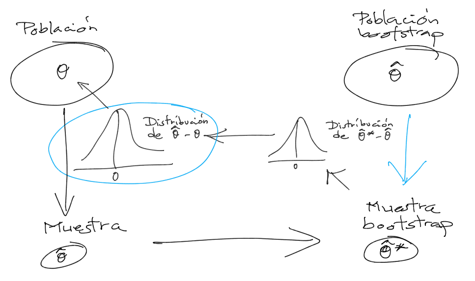

# Aplicaciones en Inferencia Estadística {#cap8}

```{r , child = '_global_options.Rmd'}
```

Como ya se comentó en la introducción muchas de las aplicaciones de la simulación serían de utilidad en Estadística: 

-   Muestreo, aproximación de distribuciones,
    remuestreo,...

-   Optimización: Algoritmos genéticos, ...

-   Análisis numérico: Evaluación de expresiones, ...

-   ...

En este capítulo nos centraremos en 
algunas de las aplicaciones en inferencia estadística:

-   Distribución de estimadores puntuales/estadísticos:

    -   Aproximación de la distribución.

        -   Aproximación de características de la distribución.

        -   Valided de la distribución asintótica.

    -   Comparación de estimadores.

-   Estimación por intervalo de confianza:

    -   Obtención de intervalos/bandas de confianza (probabilidad).

    -   Análisis de un estimador por intervalo de confianza.

-   Contrastes de hipótesis:

    -   Aproximación del $p$-valor.

    -   Análisis de un contraste de hipótesis.

    -   Validación teoría.

-   Métodos de remuestro bootstrap.

-   Inferencia Bayesiana

-   ...


En el siguiente capítulo trararemos la Integración y Optimización Monte Carlo.

Observación: 
En este capítulo se obtendrán simulaciones de estadísticos a partir de muestras (podemos pensar que se parte de generaciones de una variable multivariante).
En la mayoría de los ejemplos se generan todas las muestras de una vez, se guardan y se procesan vectorialmente (normalmente empleando la función `apply`).
Como ya se comentó en la el Capítulo \@ref(cap2), en problemas mas complejos, en los que no es necesario almacenar todas las muestras, puede ser preferible emplear un bucle para generar y procesar las muestras iterativamente. 


Distribución en el muestreo
---------------------------

```{exercise, label="distr-media", name="Distribución de la media muestral"}
```

Si $X_{1},\ldots,X_{n}$ es una muestra aleatoria simple de una
variable aleatoria $X \sim N\left( \mu, \sigma \right)$, la
distribución en el muestreo de:
$$\hat{\mu}=\overline{X}=\dfrac{1}{n}\sum_{i=1}^{n}X_{i}$$
es:
$$\overline{X} \sim N\left(  \mu,\dfrac{\sigma}{\sqrt{n}}\right)$$ 
Confirmar este resultado mediante simulación, para ello:

a)  Crear un conjunto de datos `muestras` con 500 muestras de tamaño
    $n=10$ de una $N(1,2)$. Añadir al conjunto de datos las
    estimaciones de la media y desviación típica obtenidas con cada
    una de las muestras.
    
    Valores iniciales:
    
    ```{r muestreo}
    set.seed(54321) # Fijar semilla para reproductibilidad
    nsim <- 500
    nx <- 10
    ```
    
    Valores teóricos:
    
    ```{r }
    mux <- 1
    sdx <- 2
    ```
    
    Simulación de las muestras (al estilo `Rcmdr`):
    
    ```{r }
    muestras <- as.data.frame(matrix(rnorm(nsim*nx, mean=mux, sd=sdx), ncol=nx))
    rownames(muestras) <- paste("muestra", 1:nsim, sep="")
    colnames(muestras) <- paste("obs", 1:nx, sep="")
    str(muestras)
    ```
    
    Estimaciones:
    
    ```{r }
    muestras$mean <- rowMeans(muestras[,1:nx])
    muestras$sd <- apply(muestras[,1:nx], 1, sd)
    ```
    
    
    ```{remark}
    La fila `muestras[i,]` contiene las observaciones de la i-ésima muestra y 
    la correspondiente media y desviación típica.
    ```
    
    ```{r }
    muestras[1,]
    ```
    
Normalmente emplearemos sin embargo una ordenación por columnas (cada fila se corresponderá con una generación).

<!--- Los siguientes comandos añaden una línea en html, word y un salto vertical en pdf -->
<br> \vspace{0.5cm}

b)  Generar el histograma (en escala de densidades) de las medias
    muestrales y compararlo con la densidad teórica.
    
    Distribución de la media muestral:
    
    ```{r mednorm, fig.cap='Distribución de la media muestral de una distribución normal.'}
    hist(muestras$mean, freq = FALSE, breaks = "FD", 
         xlab = "Medias", ylab = "Densidad")
    # Densidad observada (estimación)
    lines(density(muestras$mean)) 
    # Densidad teórica (bajo normalidad)
    curve(dnorm(x, mux, sdx/sqrt(nx)), lwd = 2, col = "blue", add = TRUE) 
    # Aproximación del valor esperado de la media muestral mediante simulación
    abline(v = mean(muestras$mean), lty = 2)  
    # Valor esperado de la media muestral (teórico)
    abline(v = mux, col = "blue")
    ```

<!--- Los siguientes comandos añaden una línea en html, word y un salto vertical en pdf -->
<br> \vspace{0.5cm}

```{exercise, label="distr-mediab", name="Distribución de la media muestral, continuación"}
```

Si $X_{1},\ldots,X_{n}$ es una m.a.s. de una variable aleatoria
$X$ (cualquiera) con $E\left( X \right) = \mu$ y
$Var\left( X \right) = \sigma^{2}$, por el Teorema Central del Límite, 
la distribución en el muestreo de $\hat{\mu}=\overline{X}$ se aproxima a la
normalidad:
$$\overline{X}\underset{n\rightarrow\infty}{\longrightarrow}
N\left( \mu, \dfrac{\sigma}{\sqrt{n}}\right)$$ 
Típicamente se suele considerar que esta aproximación es buena
para tamaños muestrales $n>30$,
aunque dependerá de las características de la distribución de $X$.

a)  Repetir el Ejercicio \@ref(exr:distr-media) anterior considerando muestras de una $Exp(1)$ (tener en cuenta que $X\sim Exp(\lambda)\Rightarrow\mu_{X}=\sigma_{X}=1/\lambda$).
    ¿Qué ocurre con la distribución de la media muestral?
    
    ```{r }
    set.seed(54321) # Fijar semilla para reproductibilidad
    nsim <- 500
    nx <- 10    
    # nx <- 50
    ```
    
    Valores teóricos:
    
    ```{r }
    lambda <- 1
    muexp <- 1/lambda
    sdexp <- muexp
    ```
    
    Simulación de las muestras:
    
    ```{r }
    muestras2 <- as.data.frame(matrix(rexp(nsim*nx, rate=lambda), ncol=nx))
    rownames(muestras2) <- paste("muestra", 1:nsim, sep="")
    colnames(muestras2) <- paste("obs", 1:nx, sep="")
    ```
    
    Estimaciones:
    
    ```{r }
    muestras2$mean <- rowMeans(muestras2[,1:nx])
    muestras2$sd <- apply(muestras2[,1:nx], 1, sd)
    ```
    
    Distribución de la media muestral:
    
    ```{r medexp, fig.cap='Distribución de la media muestral de una distribución exponencial y distribución asintótica.'}
    hist(muestras2$mean, xlim = c(-0.1, 2.5), freq = FALSE, breaks = "FD", 
         xlab = "Medias", ylab = "Densidad")
    # Densidad observada (estimación)
    lines(density(muestras2$mean)) 
    # Distribución asintótica (TCL)
    curve(dnorm(x,muexp,sdexp/sqrt(nx)), lwd=2, col="blue", add=TRUE) 
    # Aproximación del valor esperado de la media muestral mediante simulación
    abline(v=mean(muestras2$mean),lty=2)  
    # Valor esperado de la media muestral (teórico)
    abline(v=muexp, col="blue")
    ```

<!--- Los siguientes comandos añaden una línea en html, word y un salto vertical en pdf -->
<br> \vspace{0.5cm}

b)  Aumentar el tamaño muestral a 50. ¿Se aproxima más la
    distribución de las medias muestrales a la teórica bajo
    normalidad?
        
    Ejecutar el código del apartado anterior fijando `nx <- 50`.
       

Intervalos de confianza
---------------------------


```{exercise, label="ic-media", name="Intervalo de confianza para la media"}
```

A partir del enunciado del Ejercicio \@ref(exr:distr-media), se deduce que el intervalo de confianza (de nivel $1-\alpha$) para la media $\mu$ de una población normal con varianza conocida es:
$$IC_{1-\alpha}\left(  \mu\right)  = 
\left(  \overline{X}-z_{1-\alpha/2}\dfrac{\sigma}{\sqrt{n}},\ \overline{X} 
+ z_{1-\alpha/2}\dfrac{\sigma}{\sqrt{n}} \right).$$
La idea es que el $100(1-\alpha)\%$ de los intervalos así construidos contentrán el verdadero valor del parámetro.

a)  Utilizando el conjunto de datos `muestras` del ejercicio 1 (500
    muestras de tamaño $n=10$ de una $N(1,2)$), añadir en dos nuevas
    variables los extremos del intervalo de confianza para la media
    con varianza conocida al conjunto de datos. Analizar la
    cobertura de estas estimaciones por IC.
        
    IC para la media con varianza conocida (bajo normalidad):
    
    ```{r intervalos}
    alfa <- 0.05
    z <- qnorm(1 - alfa/2)
    muestras$ici <- muestras$mean - z*sdx/sqrt(nx)
    muestras$ics <- muestras$mean + z*sdx/sqrt(nx)
    ```
    
    Cobertura de las estimaciones por IC:
    
    ```{r }
    muestras$cob <- (muestras$ici < mux) & (mux < muestras$ics) 
    ncob <- sum(muestras$cob) # Nº de intervalos que contienen la verdadera media
    ncob
    100*ncob/nsim     # Proporción de intervalos
    100*(1 - alfa)    # Proporción teórica bajo normalidad
    ```
    
    Como ejemplo ilustrativo, generamos el gráfico de los primeros 50 intervalos:
    
    ```{r cobicnorm, fig.cap='Cobertura de las estimaciones por IC.'}
    m <- 50
    tmp <- muestras[1:m,]
    attach(tmp)
    color <- ifelse(cob,"blue","red")
    plot(1:m, mean, col = color, ylim = c(min(ici),max(ics)), 
         xlab = "Muestra", ylab = "IC")
    arrows(1:m, ici, 1:m, ics, angle = 90, length = 0.05, code = 3, col = color)
    abline(h = mux, lty = 3)
    detach(tmp)
    ```

<!--- Los siguientes comandos añaden una línea en html, word y un salto vertical en pdf -->
<br> \vspace{0.5cm}

b)  Repetir el apartado anterior considerando muestras de una
    $Exp(1)$. ¿Qué ocurre con la cobertura del intervalo de
    confianza obtenido bajo normalidad?

    Ejecutar el código del apartado a) del ejercicio 2.
    
    IC para la media con varianza conocida (bajo normalidad)
    
    ```{r }
    alfa <- 0.05
    z <- qnorm(1 - alfa/2)
    muestras2$ici <- muestras2$mean - z*sdexp/sqrt(nx)
    muestras2$ics <- muestras2$mean + z*sdexp/sqrt(nx)
    ```
    
    Cobertura de las estimaciones por IC:
    
    ```{r }
    muestras2$cob <- (muestras2$ici < muexp) & (muexp < muestras2$ics) 
    ncob <- sum(muestras2$cob) # Nº de intervalos que contienen la verdadera media
    ncob
    100*ncob/nsim     # Proporción de intervalos
    100*(1 - alfa)    # Proporción teórica bajo normalidad
    ```
    
    Como ejemplo ilustrativo, generamos el gráfico de los primeros 100 intervalos:
    
    ```{r cobicexp, fig.cap='Cobertura de las estimaciones por IC (bajo normalidad).'}
    m <- 100
    tmp <- muestras2[1:m,]
    attach(tmp)
    color <- ifelse(cob,"blue","red")
    plot(1:m, mean, col = color, ylim = c(min(ici),max(ics)), 
         xlab = "Muestra", ylab = "IC")
    arrows(1:m, ici, 1:m, ics, angle = 90, length = 0.05, code = 3, col = color)
    abline(h = muexp, lty = 3)
    detach(tmp)
    ```

c)  ¿Qué ocurre si aumentamos el tamaño muestral a 50?
    
    Ejecutar el código del ejercicio anterior fijando `nx <- 50` 
    y el del apartado anterior.

En los apartados b) y c) podíamos considerar bootstrap descrito al final de este capítulo.

Podemos aproximar por simulación los intervalos de probabilidad de la media muestral (tendríamos una idea del valor esperado de lo que obtendríamos
con el bootstrap percentil; en este caso el estimador es insesgado...):

```{r }
# Distribución de la media muestral
hist(muestras2$mean, freq=FALSE, breaks="FD", 
     main="Distribución de la media muestral", xlab="Medias", ylab="Densidad")
# Densidad observada (estimación)
lines(density(muestras2$mean), lwd=2, col='red') 
# Densidad teórica (bajo normalidad)
curve(dnorm(x,muexp,sdexp/sqrt(nx)), col="blue", add=TRUE) 
# Aproximación por simulación del valor esperado de la media muestral
abline(v=mean(muestras2$mean), lty=2)
# Valor esperado de la media muestral (teórico)
abline(v=muexp, col="blue") 
# IP bajo normalidad
ic.aprox <- apply(muestras2[ ,c('ici','ics')], 2, mean)
## ic.aprox 
##       ici       ics 
## 0.3865199 1.6261099
# Intervalo de probabilidad para la media muestral aproximado bajo normalidad
abline(v = ic.aprox, col='blue')

# Intervalo de probabilidad para la media muestral (aproximado por simulación)
ic.sim <- quantile(muestras2$mean, c(alfa/2, 1 - alfa/2))
## ic.sim
##      2.5%     97.5% 
## 0.4714233 1.8059094
# IP (aprox.) 
abline(v=ic.sim, lty=2, col='red') 
```


```{remark}
Estimaciones puntuales, por intervalo de confianza y contrastes de hipótesis
para la media con varianza desconocida bajo normalidad
se pueden obtener con la función `t.test`.
```

<!--- Los siguientes comandos añaden una línea en html, word y un salto vertical en pdf -->
<br> \vspace{0.5cm}

```{exercise, label="ic-agresti-coull", name="Intervalo de confianza Agresti-Coull para una proporción"}
```

El Intervalo de confianza para una proporción construido usando la
aproximación normal tiene un mal comportamiento cuando el tamaño de
la muestra es pequeño. Una simple y efectiva mejora consiste en
añadir a la muestra $2a$ elementos, $a$ exitos y $a$ fracasos. Así
el intervalo de confianza al $\left(  1-\alpha\right)  100\%$ para
una proporción mejorado es:
$$\begin{aligned}
IC_{1-\alpha}^{a}\left(  p\right)   
& =\left(  \tilde{p}-z_{1-\alpha/2}\sqrt{\frac{\tilde{p}(1-\tilde{p})}{\tilde{n}}} \text{ , }
\tilde{p}+z_{1-\alpha/2}\sqrt{\frac{\tilde{p}(1-\tilde{p})}{\tilde{n}}}\right)  ,\\
\text{siendo }\tilde{n} & = n+2a \text{, } \tilde{p} = \frac{np+a}{\tilde{n}}.
\end{aligned}$$
En el caso de $a=2$ se denomina IC Agresti-Coull.

a)  Teniendo en cuenta que la v.a. $X=n\hat{p}\sim\mathcal{B}(n,p)$,
    obtener y representar gráficamente la cobertura teórica del
    intervalo de confianza estándar ($a=0$) de una proporción para
    una muestra de tamaño $n=30$, $\alpha=0.05$ y distintos valores
    de $p$ (`p.teor <- seq(1/n, 1 - 1/n, length = 1000)`).
        
    Parámetros:
    
    ```{r }
    n <- 30
    alpha <- 0.05
    adj <- 0  # (adj <- 2 para Agresti-Coull)
    ```
    
    Probabilidades teóricas:
    
    ```{r }
    m <- 1000
    p.teor <- seq(1/n, 1 - 1/n, length = m) 
    ```
    
    Posibles resultados:
    
    ```{r }
    x <- 0:n
    p.est <- (x + adj)/(n + 2 * adj) 
    ic.err <- qnorm(1 - alpha/2) * sqrt(p.est * (1 - p.est)/(n + 2 * adj))  
    lcl <- p.est - ic.err 
    ucl <- p.est + ic.err 
    ```
    
    Recorrer prob. teóricas:
    
    ```{r }
    p.cov <- numeric(m)
    for (i in 1:m) {
      # cobertura de los posibles intervalos
      cover <- (p.teor[i] >= lcl) & (p.teor[i] <= ucl)  
      # prob. de los posibles intervalos
      p.rel <- dbinom(x[cover], n, p.teor[i])           
      # prob. total de cobertura
      p.cov[i] <- sum(p.rel)                            
    }
    ```
    
    Gráfico coberturas:
    
    ```{r }
    plot(p.teor, p.cov, type = "l", ylim = c(1 - 4 * alpha, 1))
    abline(h = 1 - alpha, lty = 2) 
    ```
    
    Fuente [Suess y Trumbo (2010)](http://www.springer.com/gp/book/9780387402734).

b)  Repetir el apartado anterior considerando intervalos de
    confianza Agresti-Coull ($a=2$).
        
    Parámetros:
    
    ```{r }
    n <- 30
    alpha <- 0.05
    adj <- 2  # Agresti-Coull
    
    # Probabilidades teóricas:
    m <- 1000
    p.teor <- seq(1/n, 1 - 1/n, length = m) 
    # Posibles resultados:
    x <- 0:n
    p.est <- (x + adj)/(n + 2 * adj) 
    ic.err <- qnorm(1 - alpha/2) * sqrt(p.est * (1 - p.est)/(n + 2 * adj))  
    lcl <- p.est - ic.err 
    ucl <- p.est + ic.err 
    # Recorrer prob. teóricas:
    p.cov <- numeric(m)
    for (i in 1:m) {
      # cobertura de los posibles intervalos
      cover <- (p.teor[i] >= lcl) & (p.teor[i] <= ucl)  
      # prob. de los posibles intervalos
      p.rel <- dbinom(x[cover], n, p.teor[i])           
      # prob. total de cobertura
      p.cov[i] <- sum(p.rel)                            
    }
    # Gráfico coberturas:
    plot(p.teor, p.cov, type = "l", ylim = c(1 - 4 * alpha, 1))
    abline(h = 1 - alpha, lty = 2) 
    ```

c)  Repetir el apartado anterior empleando simulación para aproximar
    la cobertura.
        
    Parámetros:
    
    ```{r }
    n <- 30
    alpha <- 0.05
    adj <- 2  #' (2 para Agresti-Coull)
    
    set.seed(54321)
    nsim <- 500 
    # Probabilidades teóricas:
    m <- 1000
    p.teor <- seq(1/n, 1 - 1/n, length = m) 
    ```
    
    Recorrer prob. teóricas:
    
    ```{r }
    # m <- length(p.teor)
    p.cov <- numeric(m)
    for (i in 1:m) {
      # Equivalente a simular nsim muestras de tamaño n
      # ry <- matrix(rbinom(n*nsim, 1, p.teor[i]), ncol=n)
      # rx <- apply(ry, 1, sum)
      rx <- rbinom(nsim, n, p.teor[i])
      p.est <- (rx + adj)/(n + 2 * adj)  
      ic.err <- qnorm(1 - alpha/2) * sqrt(p.est * (1 - p.est)/(n + 2 * adj))
      p.cov[i] <- mean( abs(p.est - p.teor[i]) < ic.err )
    }
    ```
    
    Representar:
    
    ```{r }
    plot(p.teor, p.cov, type = "l", ylim = c(1 - 4 * alpha, 1))
    abline(h = 1 - alpha, lty = 2) 
    ```
    
Como ya se comentó, el caso de ajustar un modelo a los datos y realizar simulaciones a partir de ese modelo ajustado para aproximar las características de interés de un estadístico, se denomina también bootstrap paramétrico (Ver [Sección 4.1](https://rubenfcasal.github.io/book_remuestreo/cap4-boot-par.html) de Cao y Fernández-Casal, 2019).

En este libro en las secciones [5.6](https://rubenfcasal.github.io/book_remuestreo/cap5-ejem.html) y [E.3.2](https://rubenfcasal.github.io/book_remuestreo/ejemplos-1.html#estudio-de-simulaci%C3%B3n), se incluyen ejemplos adicionales de estudios de simulación.

Contrastes de hipótesis {#contrastes}
-----------------------

Ver [Apéncide A](https://rubenfcasal.github.io/book_remuestreo/practica2.html) de Cao y Fernández-Casal (2019).

```{exercise, label="ks-test-sim", name="Test de Kolmogorov-Smirnov"}
```

En la Sección \@ref(calgen) del Tema \@ref(cap3) se propuso el análisis de la bondad de ajuste de un generador de números pseudo-aleatorios mediante el test de Kolmogorov-Smirnov (ver Sección \@ref(ks-test)). 
Sin embargo, si $H_{0}$ es compuesta (los parámetros desconocidos se estiman por máxima verosimilitud y se trabaja con $\hat{F}_{0}$) los cuantiles de la distribución (asintótica) de $D_{n}$ pueden ser demasiado conservativos y sería preferible utilizar la distribución exacta.

a)  Analizar el comportamiento del contraste de Kolmogorov-Smirnov
    para contrastar normalidad empleando repetidamente este test,
    considerando 1000 pruebas con muestras de tamaño 30 de 
    una $\mathcal{N}(0,1)$. Comparar gráficamente el ajuste 
    de la distribución del $p$-valor a la de referencia 
    (estudiar el tamaño del contraste).
        
    Valores iniciales:
    
    ```{r contrastes}
    set.seed(54321)
    nx <- 30
    mx <- 0
    sx <- 1
    nsim <- 1000
    estadistico <- numeric(nsim)
    pvalor <- numeric(nsim)
    ```
    
    Realizar contrastes
    
    ```{r }
    for(isim in 1:nsim) {
      rx <- rnorm(nx, mx, sx)
      tmp <- ks.test(rx, "pnorm", mean(rx), sd(rx))
      estadistico[isim] <- tmp$statistic
      pvalor[isim] <- tmp$p.value
    }
    ```
    
    Proporción de rechazos:
    
    ```{r }
    {
      cat("\nProporción de rechazos al 1% =", mean(pvalor < 0.01), "\n")
      cat("Proporción de rechazos al 5% =", mean(pvalor < 0.05), "\n")
      cat("Proporción de rechazos al 10% =", mean(pvalor < 0.1), "\n")
    }
    ```
    
    Análisis de los p-valores:
    
    ```{r }
    hist(pvalor, freq=FALSE)
    abline(h=1, lty=2)   # curve(dunif(x,0,1), add=TRUE)
    # Distribución empírica
    curve(ecdf(pvalor)(x), type = "s", lwd = 2, 
          main = 'Tamaño del contraste', ylab = 'Proporción de rechazos', 
          xlab = 'Nivel de significación')
    abline(a=0, b=1, lty=2)   # curve(punif(x, 0, 1), add = TRUE)
    ```

b)  Repetir el apartado anterior considerando el test de Lilliefors
    (rutina `lillie.test` del paquete `nortest`).

    
    ```{r }
    library(nortest, quietly = TRUE)
    ```
    
    Valores iniciales:
    
    ```{r }
    set.seed(54321)
    nx <- 30
    mx <- 0
    sx <- 1
    nsim <- 1000
    estadistico <- numeric(nsim)
    pvalor <- numeric(nsim)
    ```
    
    Realizar contrastes
    
    ```{r }
    for(isim in 1:nsim) {
      rx <- rnorm(nx, mx, sx)
      # tmp <- ks.test(rx, "pnorm", mean(rx), sd(rx))
      tmp <- lillie.test(rx)
      estadistico[isim] <- tmp$statistic
      pvalor[isim] <- tmp$p.value
    }
    ```
    
    Proporción de rechazos:
    
    ```{r }
    {
      cat("\nProporción de rechazos al 1% =", mean(pvalor < 0.01), "\n")
      cat("Proporción de rechazos al 5% =", mean(pvalor < 0.05), "\n")
      cat("Proporción de rechazos al 10% =", mean(pvalor < 0.1), "\n")
    }
    ```
    
    Análisis de los p-valores:
    
    ```{r }
    hist(pvalor, freq=FALSE)
    abline(h=1, lty=2)   # curve(dunif(x,0,1), add=TRUE)
    
    # Distribución empírica
    curve(ecdf(pvalor)(x), type = "s", lwd = 2, main = 'Tamaño del contraste', 
          ylab = 'Proporción de rechazos', xlab = 'Nivel de significación')
    abline(a=0, b=1, lty=2)   # curve(punif(x, 0, 1), add = TRUE)
    ```

c)  Repetir el apartado a) contrastando una distribución exponencial
    y considerando 500 pruebas con muestras de tamaño 30 de una $Exp(1)$.

    Valores iniciales:
    
    ```{r }
    set.seed(54321)
    nx <- 30
    ratex <- 1
    nsim <- 500
    estadistico <- numeric(nsim)
    pvalor <- numeric(nsim)
    ```
    
    Realizar contrastes
    
    ```{r }
    for(isim in 1:nsim) {
      rx <- rexp(nx, ratex)
      tmp <- ks.test(rx, "pexp", 1/mean(rx))
      estadistico[isim] <- tmp$statistic
      pvalor[isim] <- tmp$p.value
    }
    ```
    
    Proporción de rechazos:
    
    ```{r }
    {
      cat("\nProporción de rechazos al 1% =", mean(pvalor < 0.01), "\n")
      cat("Proporción de rechazos al 5% =", mean(pvalor < 0.05), "\n")
      cat("Proporción de rechazos al 10% =", mean(pvalor < 0.1), "\n")
    }
    ```
    
    Análisis de los p-valores:
    
    ```{r }
    hist(pvalor, freq=FALSE)
    abline(h=1, lty=2)   # curve(dunif(x,0,1), add=TRUE)
    
    # Distribución empírica
    curve(ecdf(pvalor)(x), type = "s", lwd = 2, 
          main = 'Tamaño del contraste', ylab = 'Proporción de rechazos', 
          xlab = 'Nivel de significación')
    abline(a=0, b=1, lty=2)   # curve(punif(x, 0, 1), add = TRUE) 
    ```

d)  Diseñar una rutina que permita realizar el contraste KS de
    bondad de ajuste de una variable exponencial aproximando el
    $p$-valor por simulación y repetir el apartado anterior
    empleando esta rutina.


    ```{r }
    ks.exp.sim <- function(x, nsim = 10^3) {
      DNAME <- deparse(substitute(x))
      METHOD <- "Kolmogorov-Smirnov Test of pexp by simulation" 
      n <- length(x)
      RATE <- 1/mean(x)
      ks.exp.stat <- function(x, rate=1/mean(x)) {
        DMinus <- pexp(sort(x), rate=rate) - (0:(n - 1))/n
        DPlus <- 1/n - DMinus
        Dn = max(c(DMinus, DPlus))
      }  
      STATISTIC <- ks.exp.stat(x, rate = RATE) 
      names(STATISTIC) <- "Dn"
      # PVAL <- 0
      # for(i in 1:nsim) {
      #   rx <- rexp(n, rate = RATE)
      #   if (STATISTIC <= ks.exp.stat(rx)) PVAL <- PVAL+1
      # }
      # PVAL <- PVAL/nsim
      # PVAL <- PVAL/(nsim + 1)
      # PVAL <- (PVAL + 1)/(nsim + 2)
      rx <- matrix(rexp(n*nsim, rate = RATE), ncol=n)
      PVAL <- mean(STATISTIC <= apply(rx, 1, ks.exp.stat))
      return(structure(list(statistic = STATISTIC, alternative = "two.sided", 
                       p.value = PVAL, method = METHOD, data.name = DNAME), 
                       class = "htest"))
    }
    ```
    
    Simulación:
    
    ```{r }
    set.seed(54321)
    nx <- 30
    ratex <- 1
    nsim <- 500
    estadistico <- numeric(nsim)
    pvalor <- numeric(nsim)
    ```
    
    Realizar contrastes
    
    ```{r ks.exp.sim}
    for(isim in 1:nsim) {
      rx <- rexp(nx, ratex)
      # tmp <- ks.test(rx, "pexp", 1/mean(rx))
      tmp <- ks.exp.sim(rx, nsim = 200)
      estadistico[isim] <- tmp$statistic
      pvalor[isim] <- tmp$p.value
    }
    ```
    
    Proporción de rechazos:
    
    ```{r }
    {
      cat("\nProporción de rechazos al 1% =", mean(pvalor < 0.01), "\n")
      cat("Proporción de rechazos al 5% =", mean(pvalor < 0.05), "\n")
      cat("Proporción de rechazos al 10% =", mean(pvalor < 0.1), "\n")
    }
    ```
    
    Análisis de los p-valores:
    
    ```{r }
    hist(pvalor, freq=FALSE)
    abline(h=1, lty=2)   # curve(dunif(x,0,1), add=TRUE)
    
    # Distribución empírica
    curve(ecdf(pvalor)(x), type = "s", lwd = 2, 
          main = 'Tamaño del contraste', ylab = 'Proporción de rechazos', 
          xlab = 'Nivel de significación')
    abline(a=0, b=1, lty=2)   # curve(punif(x, 0, 1), add = TRUE) 
    ```

e)  Estudiar la potencia de los contrastes de los apartados c) y d),
    considerando como alternativa una distribución Weibull.

    La distribución exponencial es un caso particular de la Weibull:
    `dexp(x, ratex) == dweibull(x, 1, 1/ratex)`.
    Estudiamos lo que ocurre al desplazar  `dweibull(x, shape, 1/ratex)` con `0 < shape < 2`.
    
    CUIDADO: las simulaciones pueden requerir de mucho tiempo de computación
    (consideramos valores pequeños de `nx` y `nsim` en datos y en `ks.exp.sim`).
    
    ```{r potencia}
    set.seed(54321)
    nx <- 20
    ratex <- 1    # Puede ser interesante representarlo variando rate
    nsim <- 200
    alfa <- 0.1   # Puede ser interesante representarlo variando alfa
    
    
    shapex <- seq(0.25, 1.75, len=21)
    preject <- numeric(length(shapex)) # Porporciones de rechazos con ks.test
    ks.test.p <- function(x) ks.test(x, "pexp", 1/mean(x))$p.value
    preject2 <- preject # Porporciones de rechazos con ks.exp.sim
    ks.exp.sim.p <- function(x) ks.exp.sim(x, 200)$p.value
    
    for (i in seq_along(shapex)) { 
      rx <- matrix(rweibull(nx*nsim, shape = shapex[i], scale = 1/ratex), ncol=nx)
      preject[i] <- mean( apply(rx, 1, ks.test.p) <= alfa )
      preject2[i] <- mean( apply(rx, 1, ks.exp.sim.p) <= alfa )
    }
    
    plot(shapex, preject, type="l", main = paste("Potencia del contraste ( alfa =", alfa, ")"), 
         xlab = "shape", ylab = "Proporción de rechazos")
    lines(shapex, preject2, lty = 2)
    abline(h = alfa, v = 1, lty = 3)
    ```


El estadístico de Kolmogorov-Smirnov `Dn = max(c(DMinus, DPlus))` tiene ventajas desde el
punto de vista teórico, pero puede no ser muy potente para detectar diferencias entre la
distribución bajo la hipótesis nula y la distribución de los datos. 
La ventaja de la aproximación por simulación es que no estamos atados a resultados teóricos
y podemos emplear el estadístico que se considere oportuno 
(la principal desventaja es el tiempo de computación). 
Por ejemplo, podríamos pensar en utilizar como estadístico la suma de los errores en
valor absoluto del correspondiente gráfico PP, y solo habría que cambiar el estadístico 
`Dn` en la función `ks.exp.sim` por `Dn = sum(abs( (1:n - 0.5)/n -  pexp(sort(x), rate=rate) ))`.


Comparación de estimadores
--------------------------

```{exercise, label="media-median", name="Comparación de la eficiencia de la media muestral y de la mediana bajo contaminación"}
```

Supongamos que estamos interesados en estudiar el efecto de datos
atípicos en la estimación de la media teórica mediante la media y la mediana muestrales. 
Consideramos una v.a. con distribución normal contaminada, 
en la que una observación procede de una $N(0,1)$ con probabilidad 0.95 
y de una $N(3,3^2)$ con probabilidad 0.05 (mixtura). 
Se puede generar una muestra de esta
variable mediante los comandos:
```
p.sim <- rbinom(n, 1, 0.05)
dat.sim <- rnorm(n, 3*p.sim, 1+2*p.sim)
```
Función de densidad:

```{r contaminada}
curve(dnorm(x, 0, 1), -3, 12, ylab = 'densidad', lty = 3)
curve(0.95*dnorm(x, 0, 1) + 0.05*dnorm(x, 3, 3), add = TRUE)
```

```{remark}
También es habitual simular este tipo de datos generando un porcentaje alto de valores (en este caso un 95%) de la distribución base ($N(0,1)$) y el resto (5%) de la distibución "contaminadora" ($N(3,3^2)$), aunque se suele considerar un porcentaje de contaminación del 1% o inferior. En el tema 7 se describirá el método de composición para simular mixturas. 
```

<!--- Los siguientes comandos añaden una línea en html, word y un salto vertical en pdf -->
<br> \vspace{0.5cm}

a)  Aproximar mediante simulación (500 generaciones) el sesgo y
    error estándar de la media y la mediana en el caso de una
    muestra de tamaño $n=100$ (suponiendo que se pretende estimar la
    media no contaminada 0).

    ```{r }
    # media y mediana
    xsd <- 1
    xmed <- 0
    ndat <- 100
    nsim <- 500
    
    # for (isim in 1:nsim) # evitar matrix y apply
    set.seed(1)
    ntsim <- ndat*nsim
    p.sim <- rbinom(ntsim, 1, 0.05)
    dat.sim <- rnorm(ntsim, 3*p.sim, 1+2*p.sim)
    dat.sim <- matrix(dat.sim, ncol=nsim)
    ```
    
    Cada columna es una muestra
    
    ```{r }
    str(dat.sim[,1])
    hist(dat.sim[,1])
    ```
    
    Calculamos los estimadores:
    
    ```{r }
    mean.sim <- apply(dat.sim, 2, mean)
    median.sim <- apply(dat.sim, 2, median)
    ```
    
    Estimamos sus características:
    
    ```{r }
    mean(mean.sim) # Coincide con el sesgo (media teórica es 0)
    sd(mean.sim)
    mean(median.sim) # Coincide con el sesgo (media teórica es 0)
    sd(median.sim)
    ```
    
    Sesgo:
    
    ```{r }
    boxplot(mean.sim-xmed, median.sim-xmed, 
          names=c("Media","Mediana"), ylab="Sesgo")
    abline(h = 0, lty = 2)
    ```
    
    Error cuadrático:
    
    ```{r }
    boxplot((mean.sim-xmed)^2, (median.sim-xmed)^2, 
          names=c("Media","Mediana"), ylab="Error cuadrático")
    ```
    
    Estadísticos error cuadrático:
    
    ```{r }
    # SE media
    summary((mean.sim-xmed)^2) 
    # SE mediana
    summary((median.sim-xmed)^2) 
    ```


Remuestreo Bootstrap
--------------------

Ver [Cao y Fernández-Casal (2019)](https://rubenfcasal.github.io/book_remuestreo/).

### Idea:

Consideramos un conjunto de datos simulado:

```{r bootstrap}
set.seed(1)
data <- runif(50)
```

La idea es aproximar características poblacionales por las correspondientes de la distribución empírica de los datos observados:

```{r }
 # Distribución bootstrap
curve(ecdf(data)(x), ylab = "FD", type = "s", lwd = 2)
# Distribución teórica
abline(a = 0, b = 1, lty = 2) 
```

Las características de la distribución empírica se pueden aproximar mediante simulación. 
En el caso i.i.d. esto puede ser implementado mediante remuestreo,
realizando repetidamente muestreo aleatorio con reemplazamiento
del conjunto de datos original (manteniendo el tamaño muestral):

```{r }
 # Muestra bootstrap
xboot <- sample(data, replace=TRUE)
```

### Métodos de remuestreo Bootstrap

Método de remuestreo (Efron, 1979) utilizado para aproximar
características de la distribución en el muestreo de un estadístico:

-   Aproximación del sesgo y de la varianza.

-   Construcción de intervalos de confianza

-   Realizar contrastes de hipótesis.

De utilidad cuando no se dispone la distribución exacta, no es
adecuado emplear la distribución asintótica, etc. 
La idea es aproximar características poblacionales por las
correspondientes de la distribución empírica de los
datos observados. 
En el caso i.i.d. esto puede ser implementado mediante remuestreo,
realizando repetidamente **muestreo aleatorio con reemplazamiento
del conjunto de datos original** (manteniendo el tamaño muestral).


Si $\mathbf{x} = \left( x_{1},x_{2},\cdots ,x_{n}\right) ^{t}$ es una
muestra i.i.d. $F_{\theta }$ y 
$\hat{\theta} = T\left( \mathbf{x} \right)$ 
es un estimador de $\theta$.
Para $b = 1,\ldots ,B:$

-   $\mathbf{x}_{b}^{\ast } = \left( x_{b1}^{\ast },x_{b2}^{\ast },\cdots
    ,x_{bn}^{\ast }\right) ^{t}$ muestra bootstrap obtenida mediante
    muestreo con reemplazamiento de
    $\left\{ x_{1},x_{2},\cdots ,x_{n}\right\}$.

-   $\hat{\theta}_{b}^{\ast } = T\left( \mathbf{x}_{b}^{\ast }\right)$
    valor del estadístico en la muestra bootstrap.

La idea original (bootstrap natural, Efron) es que la variabilidad
de $\hat{\theta}_{b}^{\ast }$ en torno a $\hat{\theta}$ aproxima la
variabilidad de $\hat{\theta}$ en torno a $\theta$:

* **La distribución de** $\hat{\theta}_{b}^{\ast }-\hat{\theta}$
**aproxima la distribución de** $\hat{\theta}-\theta$.

En general podríamos decir que:

* **la muestra es a la población**
**lo que la muestra bootstrap es a la muestra**.

```{r, echo=FALSE, fig.align = 'center' }

# knitr::include_graphics("bootstrap.png")
```

Para información adicional sobre bootstrap ver p.e.:
Davison, A.C. and Hinkley, D.V. (1997). *Bootstrap Methods and Their Application*. Cambridge University Press


```{example, label="mean-median-boot", name="Aproximación del sesgo y del error estándar mediante bootstrap"}

```

Como ejemplo consideraremos una muestra de tamaño $n=100$ de una normal estándar para tratar de aproximar el sesgo y error estándar de la media y la mediana mediante bootstrap.

```{r ejemplo}
# dat <- dat.sim[, 1]
set.seed(54321)
ndat <- 100
datmed <- 0
datsd <- 1
dat <- rnorm(ndat, mean=datmed, sd=datsd)
```

Consideramos 1000 réplicas bootstrap:

```{r }
nboot <- 1000  
```

Es habitual tomar `nboot + 1` entero múltiplo de 100 e.g. `nboot = 999` ó `1999`
(facilita el cálculo de percentiles, orden `(nboot + 1)*p`)

El valor del estadístico en la muestra es: 

```{r }
stat.dat <- mean(dat)
```

Generamos las réplicas bootstrap: 

```{r }
set.seed(1)
stat.boot <- numeric(nboot)
for (i in 1:nboot) {
  dat.boot <- sample(dat, replace=TRUE)
  stat.boot[i] <- mean(dat.boot)
}
# Valor esperado bootstrap del estadístico
mean.boot <- mean(stat.boot)  
mean.boot
```

Bootstrap percentil:

```{r }
hist(stat.boot, freq=FALSE, ylim = c(0,4))
abline(v=mean.boot, lwd=2)
# abline(v=stat.dat)

# Distribución poblacional
curve(dnorm(x, datmed, datsd/sqrt(ndat)), lty=2, add=TRUE)
abline(v=datmed, lwd=2, lty=2)
```

Bootstrap natural/básico:

```{r }
hist(stat.boot-stat.dat, freq=FALSE, ylim = c(0,4))
abline(v=mean.boot-stat.dat, lwd=2)

# Distribución poblacional
# Distribución teórica de stat.dat - stat.teor
curve(dnorm(x, 0, datsd/sqrt(ndat)), lty=2, add=TRUE)   
abline(v=0, lwd=2, lty=2)
```

Sesgo y error estándar bootstrap:

```{r }
# sesgo (teor=0)
mean.boot - stat.dat 
# error estándar
sd(stat.boot) 
# error estándar teórico
datsd/sqrt(ndat) 
```

Versión "optimizada" para R:

```{r }
boot.strap <- function(dat, nboot=1000, statistic=mean)
{
  ndat <- length(dat)
  dat.boot <- sample(dat, ndat*nboot, replace=T)
  dat.boot <- matrix(dat.boot, ncol=nboot, nrow=ndat)
  stat.boot <- apply(dat.boot, 2, statistic)
}

fstatistic <- function(dat){
  #  mean(dat)
  mean(dat, trim=0.2)
  #  median(dat)
  #  max(dat)
}

set.seed(1)
stat.dat <- fstatistic(dat)
stat.boot <- boot.strap(dat, nboot, fstatistic)

res.boot <- c(stat.dat, mean(stat.boot)-stat.dat, sd(stat.boot))
names(res.boot) <- c("Estadístico", "Sesgo", "Err.Std")
res.boot
```

### Paquetes R: bootstrap, boot

Ver [Sección 1.4](https://rubenfcasal.github.io/book_remuestreo/cap1-paquetes.html) de Cao y Fernández-Casal (2019).

```{r boot}
library(boot)
# ?boot
```

Función estadístico:

```{r }
boot.f <- function(data, indices){
  # data[indices] será la muestra bootstrap
  mean(data[indices])
}
```

Generación de las muestras

```{r }
set.seed(1)
stat.boot <- boot(dat, boot.f, nboot)
stat.boot
names(stat.boot)
```

### Gráficos

```{r }
hist(stat.boot$t, freq=FALSE)
plot(stat.boot)
jack.after.boot(stat.boot)
```

### Intervalos de confianza bootstrap

```{r }
boot.ci(stat.boot, type=c("norm", "basic", "perc", "bca"))
```


```{exercise, label="mean-trim-boot" } 
```

Repetir el Ejemplo \@ref(exm:mean-median-boot) anterior considerando la media recortada al 10\%
(con parámetros adicionales).

```{r }
boot.f <- function(data, indices, trim = 0.1){
  mean(data[indices], trim)
}

set.seed(1)
boot(dat, boot.f, nboot, trim = 0.2)
```

<!--- Los siguientes comandos añaden una línea en html, word y un salto vertical en pdf -->
<br> \vspace{0.5cm}

```{exercise, label="rachas-sim", name="propuesto"} 
```

En el tema 2 se propuso el análisis de la aleatoriedad de un
generador de números pseudo-aleatorios mediante el test de rachas,
que se podría implementar repetidamente. Sin embargo, la
aproximación asintótica empleada por la rutina `runs.test` de la
librería `tseries` no es adecuada para tamaños muéstrales pequeños
($n<40$) y sería preferible utilizar la distribución exacta (o
por lo menos utilizar una corrección por continuidad).

a)  Analizar el comportamiento del contraste empleando repetidamente
    el test de rachas, considerando 500 pruebas con muestras de
    tamaño 10 de una $Bernoulli(0.5)$. ¿Se observa algo extraño?

b)  Realiza un programa que permita aproximar por simulación la
    función de masa de probabilidad del estadístico número de rachas
    (a partir de valores de una $Bernoulli(0.5)$). Representarla
    gráficamente y compararla con la densidad normal. Obtener los
    puntos críticos para contrastar la hipótesis nula de
    aleatoriedad para $\alpha=0.01,0.05$ y $0.1$. ¿Es esta
    dístribución adecuada para el contraste de aleatoriedad de
    variables continuas?¿Cual debería ser la probabilidad de obtener
    una única racha al aplicar el test a una variable continua?

c)  Diseñar una rutina que permita realizar el contraste de
    aleatoriedad de una variable continua aproximando el $p$-valor
    por simulación. Asumir que la distribución del estadístico puede
    ser asimétrica, en cuyo caso el $p$-valor
    $p=2\min\left\{  P\left(  R\leq\hat{R}\mid H_{0}\right)  ,
    P\left(  R\geq \hat{R}\mid H_{0}\right)  \right\}$.
    
d)  Diseñar una rutina que permita realizar el contraste de
    aleatoriedad de una variable continua aproximando el $p$-valor
    mediante bootstrap.        
    
