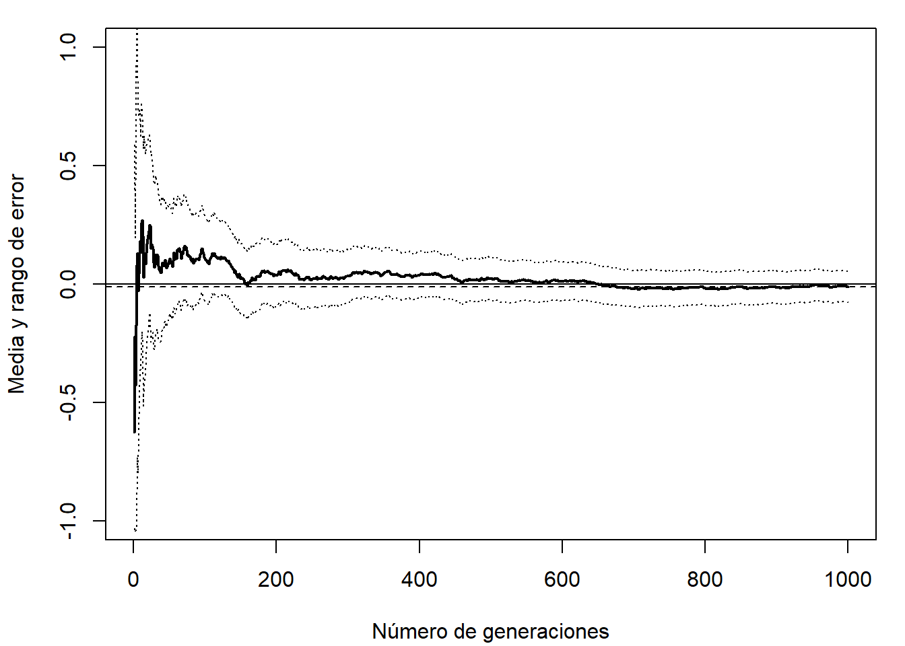
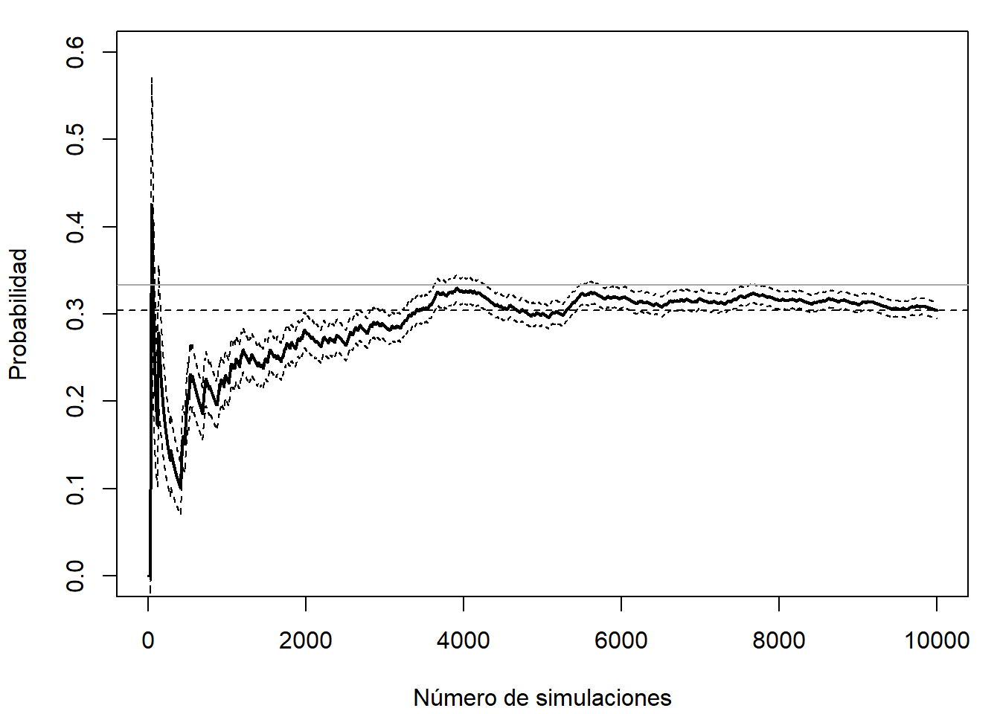
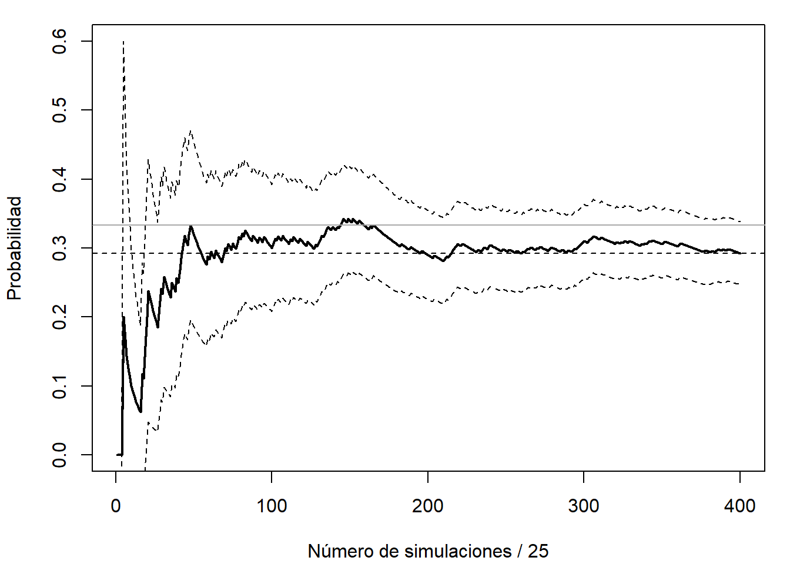
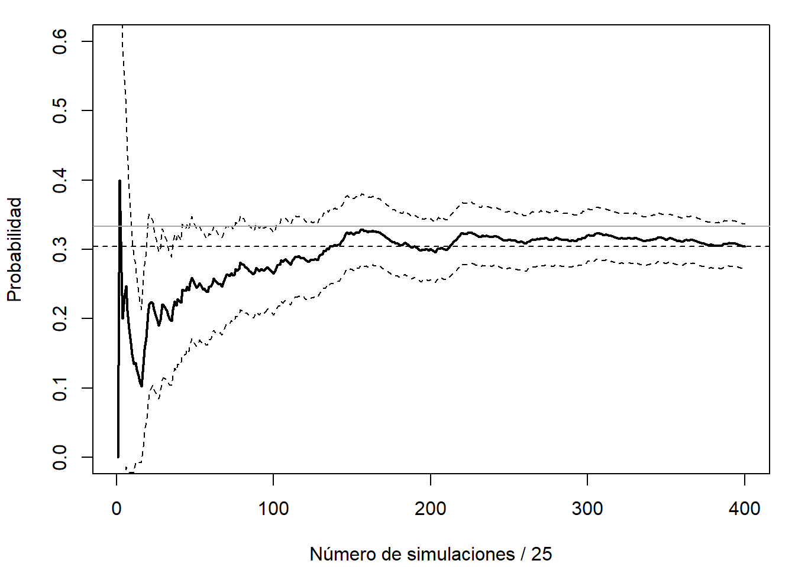
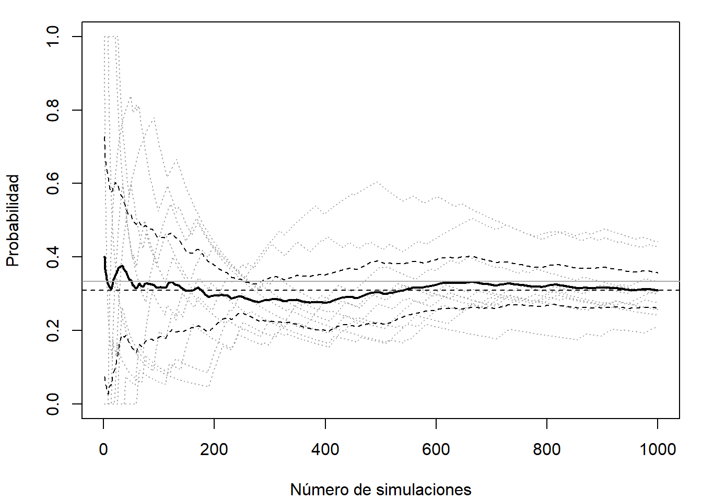

# Análisis de resultados de simulación {#resultados}

<!-- Capítulo \@ref(resultados) -->


<!-- 
---
title: "Análisis de resultados de simulación"
author: "Simulación Estadística (UDC)"
date: "Máster en Técnicas Estadísticas"
output: 
  bookdown::html_document2:
    pandoc_args: ["--number-offset", "2,0"]
    toc: yes 
    # mathjax: local            # copia local de MathJax, hay que establecer:
    # self_contained: false     # las dependencias se guardan en ficheros externos 
  bookdown::pdf_document2:
    keep_tex: yes
    toc: yes 
---

bookdown::preview_chapter("03-Analisis_resultados.Rmd") 
knitr::purl("03-Analisis_resultados.Rmd", documentation = 2)
knitr::spin("03-Analisis_resultados.R",knit = FALSE)
-->

En este capítulo nos centraremos en la aproximación mediante simulación de la media teórica de un estadístico a partir de la media muestral de una secuencia de simulaciones de dicho estadístico.
La aproximación de una probabilidad sería un caso particular considerando una variable de Bernoulli.

En primer lugar se tratará el análisis de la convergencia y la precisión de la aproximación por simulación. 
Al final del capítulo se incluye una breve introducción a los problemas de estabilización y dependencia (con los que nos solemos encontrar en simulación dinámica y MCMC).


## Convergencia {#convergencia}

Supongamos que estamos interesados en aproximar la media teórica $\mu = E\left( X\right)$ a partir de una secuencia i.i.d. $X_{1}$, $X_{2}$, $\ldots$, $X_{n}$ obtenida mediante simulación, utilizando para ello la media muestral $\bar{X}_{n}$.
Una justificación teórica de la validez de esta aproximación es *la ley (débil^[*La ley fuerte* establece la convergencia casi segura.]) de los grandes números*:

::: {.theorem #khinchine name="Ley débil de los grandes números; Khintchine, 1928"}
<br>
Si $X_{1}$, $X_{2}$, $\ldots$ es una secuencia de variables aleatorias independientes e idénticamente distribuidas con media finita $E\left( X_{i}\right) =\mu$ (i.e. $E\left( \left\vert X_{i} \right\vert \right) < \infty$) entonces $\overline{X}_{n}=\left( X_{1}+\ldots +X_{n}\right) /n$ 
converge en probabilidad a $\mu$: $$\overline{X}_{n}\ \overset{p}{ \longrightarrow }\ \mu$$
Es decir, para cualquier $\varepsilon >0$:
$$\lim\limits_{n\rightarrow \infty }P\left( \left\vert \overline{X}_{n}-\mu
\right\vert <\varepsilon \right) = 1.$$

:::


::: {.example name="Aproximación de una probabilidad"}
<br>

Simulamos una variable aleatoria $X$ con distribución de Bernoulli de parámetro $p=0.5$:
  

```r
p <- 0.5
set.seed(1)
nsim <- 10000 # nsim <- 100
rx <- runif(nsim) < p # rbinom(nsim, size = 1, prob = p)
```
La aproximación por simulación de $E(X) = p$ será:

```r
mean(rx) 
```

```
## [1] 0.5047
```
Podemos generar un gráfico con la evolución de la aproximación:

```r
plot(cumsum(rx)/1:nsim, type = "l", lwd = 2, xlab = "Número de generaciones", 
     ylab = "Proporción muestral", ylim = c(0, 1))
abline(h = mean(rx), lty = 2)
# valor teórico
abline(h = p, col = "blue") 
```

<div class="figure" style="text-align: center">

<p class="caption">(\#fig:proporcion)Aproximación de la proporción en función del número de generaciones.</p>
</div>

:::


### Detección de problemas de convergencia

En la ley débil se requiere como condición suficiente que $E\left( \left\vert X_{i} \right\vert \right) < \infty$, en caso contrario la media muestral puede no converger a una constante. 
Un ejemplo conocido es la distribución de Cauchy:


```r
set.seed(1)
nsim <- 10000
rx <- rcauchy(nsim) # rx <- rt(nsim, df = 2)
plot(cumsum(rx)/1:nsim, type = "l", lwd = 2, 
     xlab = "Número de generaciones", ylab = "Media muestral")
```

<div class="figure" style="text-align: center">

<p class="caption">(\#fig:cauchy)Evolución de la media muestral de una distribución de Cauchy en función del número de generaciones.</p>
</div>

Como conclusión, para detectar problemas de convergencia es especialmente recomendable representar la evolución de la aproximación de la característica de interés (sobre el número de generaciones), 
además de realizar otros análisis descriptivos de las simulaciones. 
Por ejemplo, en este caso podemos observar los valores que producen estos saltos mediante un gráfico de cajas: 


```r
boxplot(rx)
```

<div class="figure" style="text-align: center">

<p class="caption">(\#fig:cauchy-box)Gráfico de cajas de 10000 generaciones de una distribución de Cauchy.</p>
</div>


### Precisión

Una forma de medir la precisión de un estimador es utilizando su varianza, o también su desviación típica que recibe el nombre de error estándar.
En el caso de la media muestral $\overline{X}_{n}$, suponiendo además que $Var\left( X_{i}\right) = \sigma^{2}<\infty$, un estimador
insesgado de $Var\left( \overline{X}_{n}\right) =\sigma ^{2}/n$ es:
$$\widehat{Var}\left( \overline{X}_{n}\right) = \frac{\widehat{S}_n^{2}}{n}$$
donde:
$$\widehat{S}_{n}^{2}=\dfrac{1}{n-1}\sum\limits_{i=1}^{n}\left( X_{i}-
\overline{X}\right) ^{2}$$
es la cuasi-varianza muestral^[Esto sería también válido para el caso de una proporción, donde $E(X) = p$, $Var(X) = p(1-p)$ y $\hat{p}_{n} = \overline{X}_{n}$, obteniéndose que: $$\widehat{Var}\left( \hat{p}_{n}\right) = \frac{\widehat{S}_n^{2}}{n} = \frac{\hat{p}_{n}(1-\hat{p}_{n})}{n-1},$$ aunque lo más habitual es emplear: $$\frac{S_n^{2}}{n} = \frac{\hat{p}_{n}(1-\hat{p}_{n})}{n},$$
donde $S_n^{2}$ es la varianza muestral. Hay que tener en cuenta que en simulación el número de generaciones es normalmente grande y en la práctica no va a haber diferencias apreciables.].

Los valores obtenidos servirían como medidas básicas de la precisión de la aproximación, aunque su principal aplicación es la construcción de intervalos de confianza.
Si se endurecen las suposiciones de la ley débil de los grandes números (Teorema \@ref(thm:khinchine)), exigiendo la existencia de varianza finita ($E\left( X_{i}^2 \right) < \infty$), se dispone de un resultado más preciso sobre las variaciones de la aproximación por simulación en torno al límite teórico.

::: {.theorem #tcl name="central del límite CLT"}
<br>

Si $X_{1}$, $X_{2}$, $\ldots$ es una secuencia de variables aleatorias independientes e idénticamente distribuidas con $E\left( X_{i}\right) =\mu$ y
$Var\left( X_{i}\right) = \sigma ^{2}<\infty$, entonces la media muestral estandarizada converge en distribución a una normal estándar:
$$Z_{n}=\frac{\overline{X}_{n}-\mu }{\frac{\sigma }{\sqrt{n}}}
\overset{d}{ \longrightarrow } N(0,1).$$
Es decir, $\lim\limits_{n\rightarrow \infty }F_{Z_{n}}(z)=\Phi (z)$.
:::

Por tanto, un intervalo de confianza asintótico para $\mu$ es:
$$IC_{1-\alpha }(\mu ) = \left( \overline{X}_{n}
- z_{1-\alpha /2}\dfrac{\widehat{S}_{n}}{\sqrt{n}},\ 
\overline{X}_n+z_{1-\alpha /2}\dfrac{\widehat{S}_{n}}{\sqrt{n}} \right).$$

También podemos utilizar el error máximo (con nivel de confianza $1-\alpha$) de la estimación $z_{1-\alpha /2}\dfrac{\widehat{S}_{n}}{\sqrt{n}}$ como medida de su precisión.

El CLT es un resultado asintótico. En la práctica la convergencia es aleatoria, ya que depende de la muestra simulada (las generaciones pseudoaleatorias).
Además, la convergencia puede considerarse lenta, en el sentido de que, por ejemplo, para doblar la precisión (disminuir el error a la mitad), necesitaríamos un número de generaciones cuatro veces mayor (Ver Sección \@ref(num-gen)). 
Pero una ventaja es que este error no depende del número de dimensiones (en el caso multidimensional puede ser mucho más rápida que otras alternativas numéricas; ver Apéndice \@ref(int-num)).

::: {.example name="Aproximación de la media de una distribución normal"}
<br>

Como ejemplo simulamos valores de una normal estándar:

```r
xsd <- 1
xmed <- 0
set.seed(1)
nsim <- 1000
rx <- rnorm(nsim, xmed, xsd)
```
La aproximación por simulación de la media será:

```r
mean(rx)
```

```
## [1] -0.011648
```
Como medida de la precisión de la aproximación podemos utilizar el error máximo:

```r
2*sd(rx)/sqrt(nsim)
```

```
## [1] 0.065454
```
(es habitual emplear 2 en lugar de 1.96, 
lo que se correspondería con $1 - \alpha = 0.9545$ en el caso de normalidad).
Podemos añadir también los correspondientes intervalos de confianza al gráfico de convergencia:


```r
n <- 1:nsim
est <- cumsum(rx)/n
# (cumsum(rx^2) - n*est^2)/(n-1) # Cuasi-varianzas muestrales
esterr <- sqrt((cumsum(rx^2)/n - est^2)/(n-1)) # Errores estándar de la media
plot(est, type = "l", lwd = 2, xlab = "Número de generaciones", 
     ylab = "Media y rango de error", ylim = c(-1, 1))
abline(h = est[nsim], lty=2)
lines(est + 2*esterr, lty=3)
lines(est - 2*esterr, lty=3)
abline(h = xmed)
```

<div class="figure" style="text-align: center">

<p class="caption">(\#fig:conv-esterr)Gráfico de convergencia incluyendo el error de la aproximación.</p>
</div>

Podemos generar este gráfico empleando la función [`conv.plot()`](https://rubenfcasal.github.io/simres/reference/mc.plot.html) (o [`mc.plot()`](https://rubenfcasal.github.io/simres/reference/mc.plot.html)) del paquete [`simres`](https://rubenfcasal.github.io/simres) (fichero [*mc.plot.R*](R/mc.plot.R)).

:::


## Determinación del número de generaciones {#num-gen}


Lo más habitual es seleccionar un valor de $n$ del orden de varias centenas o millares. 
En los casos en los que la simulación se utiliza para aproximar una característica central de la distribución (como una media) puede bastar un número de generaciones del orden de $n = 100, 200, 500$. 
Sin embargo, en otros casos, por ejemplo para aproximar el p-valor de un contraste de hipótesis o construir intervalos de confianza, pueden ser necesarios valores del tipo $n = 1000, 2000, 5000, 10000$.

En muchas ocasiones puede interesar obtener una aproximación con un nivel de precisión fijado.
Para una precisión absoluta $\varepsilon$, se trata de determinar
$n$ de forma que:
$$z_{1-\alpha /2}\dfrac{\widehat{S}_{n}}{\sqrt{n}}<\varepsilon$$

Un algoritmo (para un lenguaje de programación vectorial como R) podría ser el siguiente:

1.  Hacer $j=0$
    y fijar un tamaño inicial $n_{0}$ (e.g. 60 ó 100, dependiendo del tiempo de computación requerido).

2.  Generar $\left\{ X_{i}\right\} _{i=1}^{n_{0}}$ 
    y calcular $\overline{X}_{n_0}$ y $\widehat{S}_{n_{0}}$.

3.  Mientras $\left. z_{1-\alpha /2}\widehat{S}_{n_j}\right/ \sqrt{n_{j}}>\varepsilon$ hacer:

    3.1. $j=j+1$.
    
    3.2. $n_{j}=\left\lceil \left( \left. z_{1-\alpha /2}\widehat{S}
         _{n_{j-1}}\right/ \varepsilon \right)^{2}\right\rceil$.
    
    3.3. Generar $\left\{ X_{i}\right\}_{i=n_{j-1}+1}^{n_j}$ 
         y calcular $\overline{X}_{n_j}$ y $\widehat{S}_{n_j}$.

3.  Devolver $\overline{X}_{n_j}$ y $\left. z_{1-\alpha /2}\widehat{S}_{n_j}\right/ \sqrt{n_{j}}$.

Para una precisión relativa $\varepsilon \left\vert \mu \right\vert$ se procede análogamente de forma que:
$$z_{1-\alpha /2}\dfrac{\widehat{S}_{n}}{\sqrt{n}}<\varepsilon \left\vert 
\overline{X}_{n}\right\vert .$$


<!-- 
Calcular $\overline{X}_{n_j}$ y $\widehat{S}_{n_j}$ como actualización?
-->

## El problema de la dependencia

En el caso de dependencia, bajo condiciones muy generales se verifica la ley débil de los grandes números. 
Sin embargo, la estimación de la precisión se complica:
$$Var\left( \overline{X}\right) =\frac{1}{n^{2}}\left( 
\sum_{i=1}^{n}Var\left( X_{i} \right) + 2\sum_{i<j}Cov\left( X_{i},X_{j}\right) \right).$$

<!-- PENDIENTE: Teorema convergencia -->

::: {.example #mmc name="aproximación de una proporción bajo dependencia cadena de Markov"}
<br>

Supongamos que en A Coruña llueve de media uno de cada tres días al año,
y que la probabilidad de que un día llueva solo depende de lo que ocurrió el día anterior, 
siendo 0.94 si el día anterior llovió y 0.03 si no.

Podemos generar valores de la variable indicadora de día lluvioso con el siguiente código:

```r
# Variable dicotómica 0/1 (FALSE/TRUE)  
set.seed(1)
nsim <- 10000
alpha <- 0.03 # prob de cambio si seco
beta <- 0.06  # prob de cambio si lluvia
rx <- logical(nsim) # x == "llueve"
rx[1] <- FALSE # El primer día no llueve
for (i in 2:nsim)
  rx[i] <- if (rx[i-1]) runif(1) > beta else runif(1) < alpha
```

Si generamos el gráfico de convergencia asumiendo independencia:

```r
n <- 1:nsim
est <- cumsum(rx)/n
esterr <- sqrt(est*(1-est)/(n-1)) # OJO! Supone independencia
plot(est, type="l", lwd=2, ylab="Probabilidad", 
     xlab="Número de simulaciones", ylim=c(0,0.6))
abline(h = est[nsim], lty=2)
lines(est + 2*esterr, lty=2) 
lines(est - 2*esterr, lty=2)
abline(h = 1/3, col="darkgray") # Probabilidad teórica
```

<div class="figure" style="text-align: center">

<p class="caption">(\#fig:conv-dep)Gráfico de convergencia incluyendo el error de la aproximación (calculado asumiendo independencia).</p>
</div>

La probabilidad teórica, obtenida empleando resultados de cadenas de Markov, es $p = 1/3$ y la aproximación de la proporción sería correcta (es consistente):

```r
est[nsim]
```

```
## [1] 0.3038
```

Sin embargo, al ser datos dependientes, la aproximación anterior del error estándar no es adecuada:

```r
esterr[nsim]
```

```
## [1] 0.0045992
```

En este caso al haber dependencia positiva se produce una subestimación del verdadero error estándar.
Podemos generar el gráfico de autocorrelaciones:


```r
acf(as.numeric(rx))
```

<div class="figure" style="text-align: center">

<p class="caption">(\#fig:acf-depsec)Correlograma de la secuencia indicadora de días de lluvia.</p>
</div>

El gráfico anterior sugiere que si solo tomamos 1 de cada 25 valores podría ser razonable asumir independencia.


```r
lag <- 24
xlag <- c(rep(FALSE, lag), TRUE)
rxi <- rx[xlag]
acf(as.numeric(rxi))
```

<div class="figure" style="text-align: center">

<p class="caption">(\#fig:acf-depsec2)Correlograma de la subsecuencia de días de lluvia obtenida seleccionando uno de cada 25 valores.</p>
</div>


```r
nrxi <- length(rxi)
n <- 1:nrxi
est <- cumsum(rxi)/n
esterr <- sqrt(est*(1-est)/(n-1))
plot(est, type="l", lwd=2, ylab="Probabilidad", 
     xlab=paste("Número de simulaciones /", lag + 1), ylim=c(0,0.6))
abline(h = est[length(rxi)], lty=2)
lines(est + 2*esterr, lty=2) # Supone independencia
lines(est - 2*esterr, lty=2)
abline(h = 1/3, col="darkgray")     # Prob. teor. cadenas Markov
```

<div class="figure" style="text-align: center">

<p class="caption">(\#fig:conv-dep2)Gráfico de convergencia de la aproximación de la probabilidad a partir de la subsecuencia de días de lluvia (calculando el error de aproximación asumiendo independencia).</p>
</div>


Esta forma de proceder podría ser adecuada para tratar de aproximar la precisión:

```r
esterr[nrxi]
```

```
## [1] 0.022774
```
pero no sería la más eficiente para aproximar la media. Siempre es preferible emplear todas las observaciones. 

Por ejemplo, se podría pensar en considerar las medias de grupos de 25 valores consecutivos y suponer que hay independencia entre ellas:


```r
rxm <- rowMeans(matrix(rx, ncol = lag + 1, byrow = TRUE))
nrxm <- length(rxm)
n <- 1:nrxm
est <- cumsum(rxm)/n
esterr <- sqrt((cumsum(rxm^2)/n - est^2)/(n-1)) # Errores estándar
plot(est, type="l", lwd=2, ylab="Probabilidad", 
     xlab=paste("Número de simulaciones /", lag + 1), ylim=c(0,0.6))
abline(h = est[length(rxm)], lty=2)
lines(est + 2*esterr, lty=2) # OJO! Supone independencia
lines(est - 2*esterr, lty=2)
abline(h = 1/3, col="darkgray")     # Prob. teor. cadenas Markov
```

<div class="figure" style="text-align: center">

<p class="caption">(\#fig:conv-dep-lotes)Gráfico de convergencia de las medias por lotes.</p>
</div>

Esta es la idea del método de medias por lotes (*batch means*; *macro-micro replicaciones*) para la estimación de la precisión.
Supongamos que la correlación entre $X_i$ y $X_{i+k}$ es aproximadamente nula, y consideramos las subsecuencias (lotes) $(X_{t+1},X_{t+2},\ldots,X_{t+k})$ con $t=(j-1)k$, $j=1,\ldots,m$ y $n = mk$. 
Entonces:

$$\begin{aligned}
Var \left(\bar X \right) &= Var \left(\frac{1}{n} \sum_{i=1}^n X_i\right) 
= Var \left( \frac{1}{m}\sum_{j=1}^m \left(\frac{1}{k} \sum_{t=(i-1)k + 1}^{ik} X_t\right) \right) \\
&\approx \frac{1}{m^2} \sum_{j=1}^m Var \left(\frac{1}{k} \sum_{t=(i-1)k + 1}^{ik} X_t\right)
= \frac{1}{m} Var \left(\bar{X}_k \right)
\end{aligned}$$
donde $\bar{X}_k$ es la media de una subsecuencia de longitud $k$.

<!-- Ecuaciones p.237 Gentle, Random numbers & MC methods -->

Alternativamente se podría recurrir a la generación de múltiples secuencias independientes entre sí: 

```r
# Variable dicotómica 0/1 (FALSE/TRUE)  
set.seed(1)
nsim <- 1000
nsec <- 10
alpha <- 0.03 # prob de cambio si seco
beta <- 0.06  # prob de cambio si lluvia
rxm <- matrix(FALSE, nrow = nsec, ncol= nsim)
for (i in 1:nsec) {
  # rxm[i, 1] <- FALSE # El primer día no llueve
  # rxm[i, 1] <- runif(1) < 1/2 # El primer día llueve con probabilidad 1/2
  rxm[i, 1] <- runif(1) < 1/3 # El primer día llueve con probabilidad 1/3 (ideal)
  for (j in 2:nsim)
    rxm[i, j] <- if (rxm[i, j-1]) runif(1) > beta else runif(1) < alpha
}
```

La idea sería considerar las medias de las series como una muestra independiente de una nueva variable y estimar su varianza de la forma habitual:

```r
# Media de cada secuencia
n <- 1:nsim
est <- apply(rxm, 1, function(x) cumsum(x)/n)
matplot(n, est, type = 'l', lty = 3, col = "lightgray",
     ylab="Probabilidad", xlab="Número de simulaciones")
# Aproximación
mest <- apply(est, 1, mean)
lines(mest, lwd = 2)
abline(h = mest[nsim], lty = 2)
# Precisión
mesterr <- apply(est, 1, sd)/sqrt(nsec)
lines(mest + 2*mesterr, lty = 2)
lines(mest - 2*mesterr, lty = 2)
# Prob. teor. cadenas Markov
abline(h = 1/3, col="darkgray")     
```

<div class="figure" style="text-align: center">

<p class="caption">(\#fig:conv-dep-nsec)Gráfico de convergencia de la media de 10 secuencias generadas de forma independiente.</p>
</div>

```r
# Aproximación final
mest[nsim] # mean(rxm)
```

```
## [1] 0.3089
```

```r
# Error estándar
mesterr[nsim]
```

```
## [1] 0.024035
```

:::

Trataremos este tipo de problemas en la diagnosis de algoritmos Monte Carlo de Cadenas de Markov (MCMC, Capítulo 10). 
Aparecen también en la simulación dinámica (por eventos o cuantos). 


### Periodo de calentamiento

En el caso de simulación de datos dependientes (simulación dinámica) 
pueden aparecer problemas de estabilización. Puede ocurrir que el sistema 
evolucione lentamente en el tiempo hasta alcanzar su distribución estacionaria,
siendo muy sensible a las condiciones iniciales con las que se comienzó la
simulación. En tal caso resulta conveniente ignorar los resultados obtenidos
durante un cierto período inicial de tiempo (denominado período de calentamiento 
o estabilización), cuyo único objeto es conseguir que se estabilice la distribución de
probabilidad.

Como ejemplo comparamos la simulación del Ejemplo \@ref(exm:mmc) con la obtenida considerando como punto de partida un día lluvioso (con una semilla distinta para evitar dependencia).


```r
set.seed(2)
nsim <- 10000
rx2 <- logical(nsim)
rx2[1] <- TRUE # El primer día llueve
for (i in 2:nsim)
  rx2[i] <- if (rx2[i-1]) runif(1) > beta else runif(1) < alpha
n <- 1:nsim
est <- cumsum(rx)/n
est2 <- cumsum(rx2)/n
plot(est, type="l", ylab="Probabilidad", 
     xlab="Número de simulaciones", ylim=c(0,0.6))
lines(est2, lty = 2)
# Ejemplo periodo calentamiento nburn = 2000
abline(v = 2000, lty = 3)
# Prob. teor. cadenas Markov
abline(h = 1/3, col="darkgray")     
```


En estos casos puede ser recomendable ignorar los primeros valores generados (por ejemplo los primeros 2000) y recalcular los 
estadísticos deseados.

También trataremos este tipo de problemas en la diagnosis de algoritmos MCMC. 

::: {.example name="simulación de un proceso autorregresivo serie de tiempo"}
<br>

$$X_t = \mu + \rho * (X_{t-1} - \mu) + \varepsilon_t$$
Podemos tener en cuenta que en este caso la varianza es:
$$\textrm{var}(X_t)=\operatorname{E}(X_t^2)-\mu^2=\frac{\sigma_\varepsilon^2}{1-\rho^2}.$$

Establecemos los parámetros:

```r
nsim <- 200   # Numero de simulaciones
xmed <- 0     # Media
rho <- 0.5    # Coeficiente AR
nburn <- 10   # Periodo de calentamiento (burn-in)
```
Se podría fijar la varianza del error:

```r
evar <- 1
# Varianza de la respuesta
xvar <- evar / (1 - rho^2)
```
pero la recomendación sería fijar la varianza de la respuesta:

```r
xvar <- 1     
# Varianza del error
evar <- xvar*(1 - rho^2)
```

Para simular la serie, al ser un $AR(1)$, normalmente simularíamos el primer valor

```r
x[1] <- rnorm(1, mean = xmed, sd = sqrt(xvar))
```
o lo fijamos a la media. 
Después generamos los siguientes valores de forma recursiva.

Como ejemplo nos alejamos un poco de la distribución estacionaria, para que el "periodo de calentamiento" sea mayor:

```r
set.seed(1)
x <- numeric(nsim + nburn)
# Establecer el primer valor 
x[1] <- -10
# Simular el resto de la secuencia
for (i in 2:length(x))
  x[i] <- xmed + rho*(x[i-1] - xmed) + rnorm(1, sd=sqrt(evar))
x <- as.ts(x)
plot(x)
abline(v = nburn, lty = 2)
```

<div class="figure" style="text-align: center">

<p class="caption">(\#fig:sim-ar1)Ejemplo de una simulación de una serie de tiempo autorregresiva.</p>
</div>
y eliminamos el periodo de calentamiento:

```r
rx <- x[-seq_len(nburn)]
```

:::


Para simular una serie de tiempo en R se puede emplear la función `arima.sim` del paquete base `stats`.
En este caso el periodo de calentamiento se establece mediante el parámetro `n.start` (que se fija automáticamente a un valor adecuado).

Por ejemplo, podemos generar este serie autoregresiva con:

```r
rx2 <- arima.sim(list(order = c(1,0,0), ar = rho), n = nsim, 
                 n.start = nburn, sd = sqrt(evar))
```
La recomendación es fijar la varianza de las series simuladas si se quieren comparar
resultados considerando distintos parámetros de dependencia.


## Observaciones

Como comentarios finales, podríamos añadir que:

-   En el caso de que la característica de interés de la distribución de $X$ no sea la media, los resultados anteriores no serían en principio aplicables.

-   Incluso en el caso de la media, con el CLT obtenemos intervalos de confianza puntuales, que no habría que confundir con *bandas de confianza* (es muy probable que no contengan el verdadero valor del parámetro en todo el rango).

-   En muchos casos (por ejemplo, cuando la generación de múltiples secuencias de simulación supone un coste computacional importante), puede ser preferible emplear un método de remuestreo para aproximar la precisión de la aproximación (ver Capítulo \@ref(bootstrap)).

