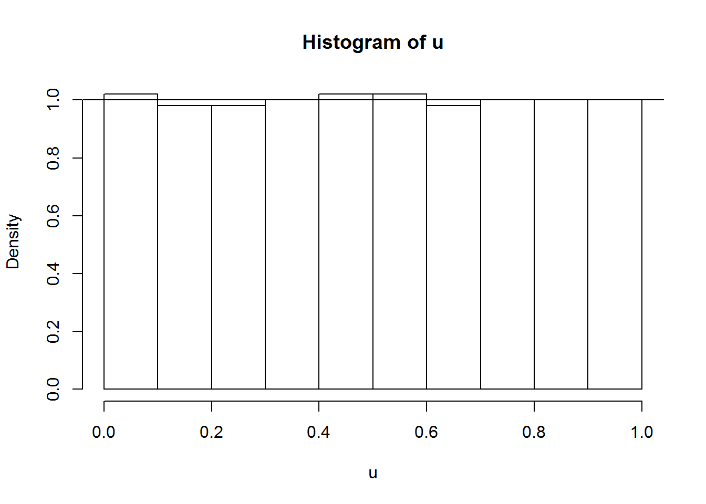
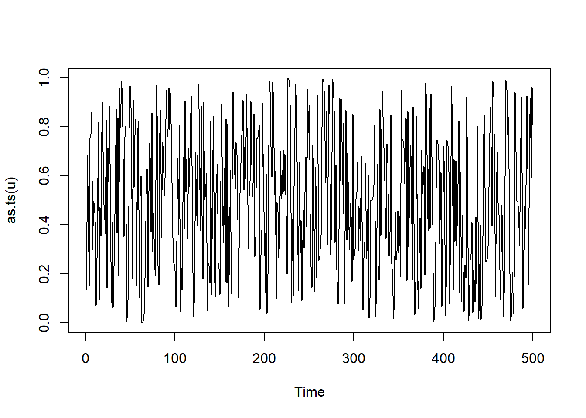
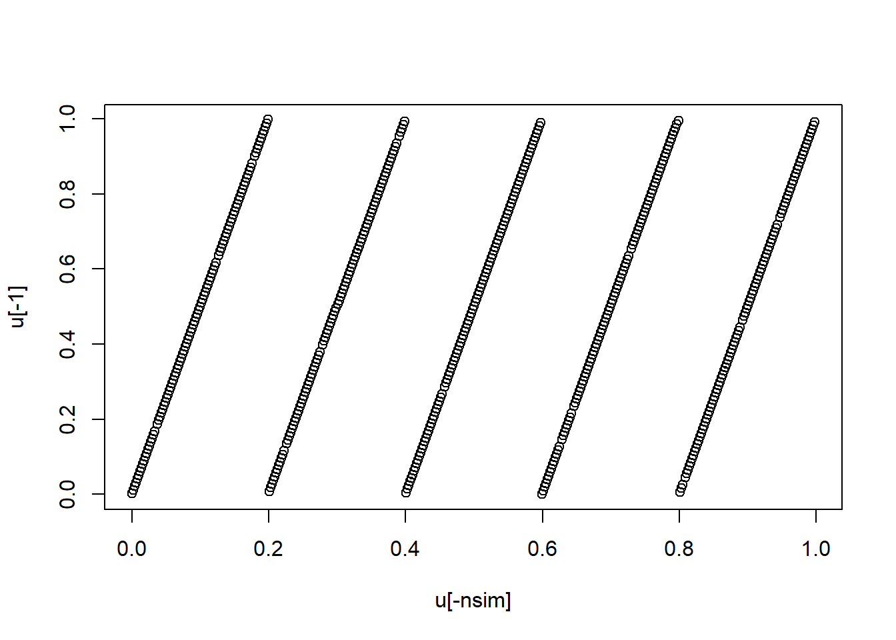
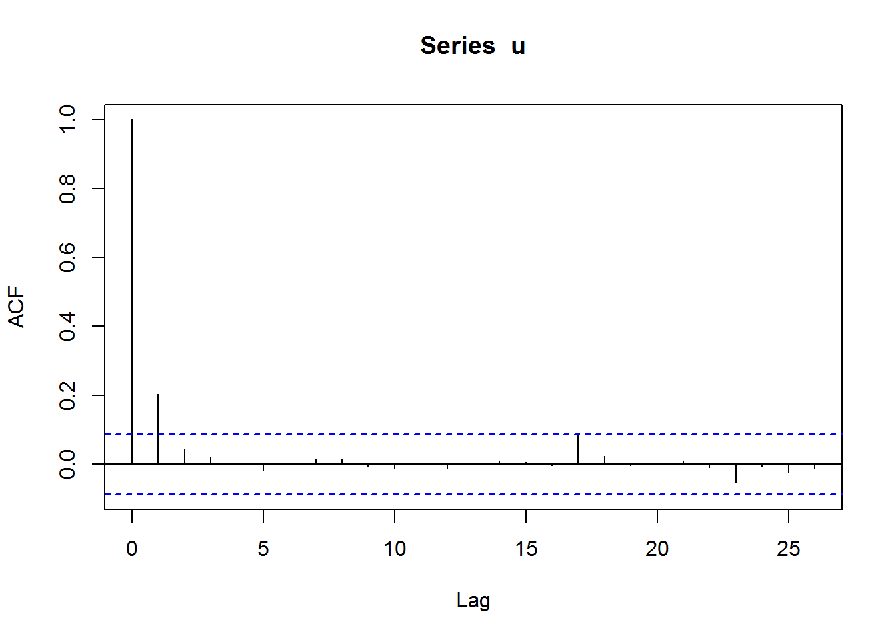
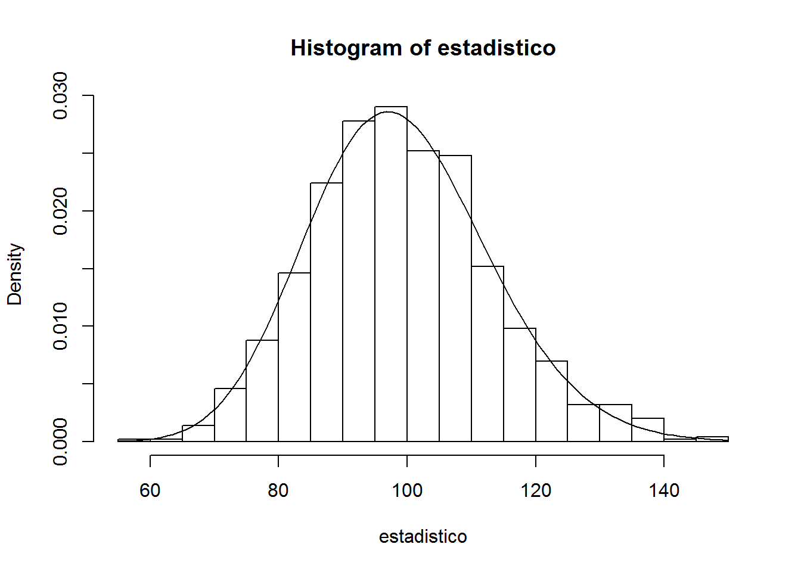

Generación de números pseudoaleatorios
======================================


Generadores congruenciales
--------------------------

### Generador congruencial lineal (simple)

Partiendo de una semilla inicial $x_{0}$:
$$\begin{aligned}
x_{i}  & =(ax_{i-1}+c)\operatorname{mod}m\\
u_{i}  & =\dfrac{x_{i}}{m}\\
i  & =1,2,\ldots
\end{aligned}$$ 
donde $a$ es el **multiplicador,**
$c$ el **incremento** y $m$ el **módulo** del generador (parámetros
enteros fijados de antemano).

-   Si $c=0$ se denomina congruencial **multiplicativo**

-   Si $c\neq0$ se denomina congruencial **mixto**

Implementado en el fichero *RANDC.R* (tratando de imitar el funcionamiento en R, aunque de forma no muy eficiente...):

```r
# Generador congruencial de números pseudoaleatorios
# ==================================================

# --------------------------------------------------
# initRANDC(semilla,a,c,m)
#   Selecciona el generador congruencial
#   Por defecto RANDU de IBM con semilla del reloj
#   OJO: No se hace ninguna verificación de los parámetros
initRANDC <- function(semilla=as.numeric(Sys.time()), a=2^16+3, c=0, m=2^31) {
  .semilla <<- as.double(semilla) %% m  #Cálculos en doble precisión
  .a <<- a
  .c <<- c
  .m <<- m
  return(invisible(list(semilla=.semilla,a=.a,c=.c,m=.m))) #print(initRANDC())
}

# --------------------------------------------------
# RANDC()
#   Genera un valor pseudoaleatorio con el generador congruencial
#   Actualiza la semilla (si no existe llama a initRANDC)
RANDC <- function() {
    if (!exists(".semilla", envir=globalenv())) initRANDC()
    .semilla <<- (.a * .semilla + .c) %% .m
    return(.semilla/.m)
}

# --------------------------------------------------
# RANDCN(n)
#   Genera un vector de valores pseudoaleatorios con el generador congruencial
#   (por defecto de dimensión 1000)
#   Actualiza la semilla (si no existe llama a initRANDC)
RANDCN <- function(n=1000) {
    x <- numeric(n)
    for(i in 1:n) x[i]<-RANDC()
    return(x)
    # return(replicate(n,RANDC()))  # Alternativa más rápida    
}

initRANDC(543210)       # Fijar semilla 543210 para reproductibilidad
```


    
\BeginKnitrBlock{remark}<div class="remark">\iffalse{} <span class="remark"><em>Nota: </em></span>  \fi{}Para evitar problemas computacionales, se recomienda emplear
un algoritmo como el descrito en L'Ecuyer (1988).</div>\EndKnitrBlock{remark}


Ejemplos:

-   $c=0$, $a=2^{16}+3=65539$ y $m=2^{31}$, generador `RANDU` de IBM
    (**no recomendable**).

-   $c=0$, $a=7^{5}=16807$ y $m=2^{31}-1,$ Park y Miller (1988)
    “minimal standar”,empleado por las librerías IMSL y NAG.

Los parámetros y la semilla determinan los valores generados:
$$x_{i}=\left(  a^{i}x_{0}+c\frac{a^{i}-1}{a-1}\right)  \operatorname{mod}m$$

A pesar de su simplicidad, una adecuada elección de los parámetros
permite obtener de manera eficiente secuencias de números
“aparentemente” i.i.d. $\mathcal{U}(0,1).$

### Periodo

\BeginKnitrBlock{theorem}<div class="theorem"><span class="theorem" id="thm:unnamed-chunk-3"><strong>(\#thm:unnamed-chunk-3) </strong></span>(Hull y Dobell, 1962)

Un generador congruencial tiene período máximo ($p=m$) si y solo si:

1.  $c$ y $m$ son primos relativos (i.e. $m.c.d.\left(  c,m\right)
    =1$).

2.  $a-1$ es múltiplo de todos los factores primos de $m$ (i.e.
    $a\equiv1\operatorname{mod}q$, para todo $q$ factor primo de
    $m$).

3.  Si $m$ es múltiplo de $4$, entonces $a-1$ también lo ha de
    ser (i.e. $m\equiv0\operatorname{mod}4\Rightarrow a\equiv
    1\operatorname{mod}4$).
    
.</div>\EndKnitrBlock{theorem}

Algunas consecuencias:

-   Si $m$ primo, $p=m\Leftrightarrow a=1$

-   Un generador multiplicativo no cumple la condición 1.


\BeginKnitrBlock{theorem}<div class="theorem"><span class="theorem" id="thm:unnamed-chunk-4"><strong>(\#thm:unnamed-chunk-4) </strong></span>
Un generador multiplicativo tiene período máximo ($p=m-1$) si:

1.  $m$ es primo.

2.  $a$ es una raiz primitiva de $m$(i.e. el menor entero $q$ tal
    que $a^{q}=1\operatorname{mod}m$ es $q=m-1$).

.    </div>\EndKnitrBlock{theorem}

Además de preocuparse de la longitud del ciclo, las secuencias
generadas deben aparentar muestras i.i.d. $\mathcal{U}(0,1)$. 
Por ejemplo, los valores generados pueden mostrar una estructura reticular.

-   Marsaglia (1968): $k$-uplas de generadores multiplicativos
    contenidas en a lo sumo $\left(k!m\right)^{1/k}$
    hiperplanos paralelos.

-   Generador RANDU de IBM (70’s):


```r
library(rgl)
system.time(u <- RANDCN(9999))  # Generar
xyz <- matrix(u, ncol = 3, byrow = TRUE)

plot3d(xyz) 
# rglwidget()
```


Se han propuesto diversas pruebas (ver sección siguiente) para
determinar si un generador tiene problemas de este tipo y se han
realizado numerosos estudios para determinadas familias (e.g. Park y
Miller, 1988, $m=2^{31}-1$).

-   En cualquier caso, se recomienda considerar un “periodo de
    seguridad” $\approx \sqrt{p}$ para evitar este tipo de problemas.

-   Aunque estos generadores tiene limitaciones en su capacidad para
    producir secuencias muy largas de números i.i.d. $\mathcal{U}(0,1)$,
    es un elemento básico en generadores más avanzados.

### Otros generadores

Generalizaciones del generador congruencial lineal simple:
$$x_{i}=f\left(  x_{i-1},x_{i-2},\cdots,x_{i-k}\right)  \operatorname{mod}m$$

-   no lineal: e.g.
    $\ x_{i}=a_{1}x_{i-1}+a_{2}x_{i-1}^{2}\operatorname{mod}m$

-   lineal múltiple: 
    $x_{i}=a_{1}x_{i-1}+a_{2}x_{i-2}+\cdots+a_{k}x_{i-k}\operatorname{mod}m$,
    con $p\leq m^{k}-1$)

-   matricial: $\boldsymbol{x}_{i} = A_{1}\boldsymbol{x}_{i-1} 
    + A_{2}\boldsymbol{x}_{i-2} + \cdots 
    + A_{k}\boldsymbol{x}_{i-k} \operatorname{mod}m$
    (por ejemplo el generador por defecto de `R`).

-   Generadores de registros desfasados: generadores de bits basados en
    el lineal múltiple $m=2$; $a_{i},x_{i}\in \left \{
    0,1\right \}$ (cálculos mediante operaciones lógicas).

-   Combinación de generadores:

    -   Combinación de salidas:
        $u_{i}=\sum u_{i}^{(l)}\operatorname{mod}1$

    -   Barajar salidas...
    
\BeginKnitrBlock{exercise}<div class="exercise"><span class="exercise" id="exr:unnamed-chunk-7"><strong>(\#exr:unnamed-chunk-7) </strong></span></div>\EndKnitrBlock{exercise}

Considera el generador congruencial definido por: $$\begin{aligned}
x_{n+1}  & =(5x_{n}+1)\ \operatorname{mod}\ 512,\nonumber\\
u_{n+1}  & =\frac{x_{n+1}}{512},\ n=0,1,\dots\nonumber\end{aligned}$$

(de ciclo máximo).

Algoritmo implementado en el fichero *RANDC.R*:


a)  Generar 500 valores de este generador, obtener el tiempo de CPU,
    representar su distribución mediante un histograma (en escala
    de densidades) y compararla con la densidad teórica.
   
    
    ```r
    initRANDC(321, 5, 1, 512)       # Fijar semilla para reproductibilidad
    nsim <- 500
    system.time(u <- RANDCN(nsim))  # Generar
    ```
    
    ```
    ##    user  system elapsed 
    ##       0       0       0
    ```
    
    ```r
    hist(u, freq = FALSE)
    abline(h = 1)                   # curve(dunif(x, 0, 1), add = TRUE)
    ```
    
    


b)  Calcular la media de las simulaciones (`mean`) y compararla con
    la teórica.
    
    La aproximación por simulación de la media teórica es:
    
    
    ```r
    mean(u)
    ```
    
    ```
    ## [1] 0.4999609
    ```
    
    La media teórica es 0.5. 
    Error absoluto $3.90625\times 10^{-5}$.

c)  Aproximar (mediante simulación) la probabilidad del intervalo
    $(0.4;0.8)$ y compararla con la teórica.

    La probabilidad teórica es 0.8 - 0.4 = 0.4
    
    La aproximación mediante simulación:
    
    
    ```r
    sum((0.4 < u) & (u < 0.8))/nsim
    ```
    
    ```
    ## [1] 0.402
    ```
    
    ```r
    mean((0.4 < u) & (u < 0.8))     # Alternativa
    ```
    
    ```
    ## [1] 0.402
    ```


Análisis de la calidad de un generador
--------------------------------------

Para verificar si un generador tiene las propiedades estadísticas
deseadas hay disponibles una gran cantidad de test de hipótesis
(baterías de contrastes) y métodos gráficos:

-   Contrastes genéricos de bondad de ajuste y aleatoriedad.

-   Contrastes específicos para generadores aleatorios.

Se trata principalmente de contrastar si las muestras generadas son
i.i.d. $\mathcal{U}\left(0,1\right)$ (análisis univariante).
Aunque los métodos más avanzados tratan normalmente de
contrastar si las $k$-uplas:

$$(U_{t+1},U_{t+2},...,U_{t+k-1}); \ t=(i-1)k, \ i=1,...,m$$

son i.i.d. $\mathcal{U}\left(0,1\right)^{k}$ (uniformes
independientes en el hipercubo; análisis multivariante).

**Nos centraremos en los métodos genéricos**.
Pueden usarse en:

-   Evaluación de generadores aleatorios

-   Evaluación de generadores de variables aleatorias

-   Modelado de entradas de modelos de simulación

Uno de los contrastes más conocidos es el test ji-cuadrado de bondad de ajuste
(`chisq.test` para el caso discreto). 
Aunque si la variable de interés es continua, habría que discretizarla 
(con la correspondiente perdida de información). 
Por ejemplo, se podría emplear la siguiente función 
(que imita a las incluídas en `R`):


```r
#-------------------------------------------------------------------------------
# chisq.test.cont(x, distribution, nclasses, output, nestpar,...)
#-------------------------------------------------------------------------------
# Realiza el test ji-cuadrado de bondad de ajuste para una distribución continua
# discretizando en intervalos equiprobables.
# Parámetros:
#   distribution = "norm","unif",etc
#   nclasses = floor(length(x)/5)
#   output = TRUE
#   nestpar = 0= nº de parámetros estimados
#   ... = parámetros distribución
# Ejemplo:
#   chisq.test.cont(x, distribution="norm", nestpar=2, mean=mean(x), sd=sqrt((nx-1)/nx)*sd(x))
#-------------------------------------------------------------------------------
chisq.test.cont <- function(x, distribution = "norm", nclasses = floor(length(x)/5), 
    output = TRUE, nestpar = 0, ...) {
    # Funciones distribución
    q.distrib <- eval(parse(text = paste("q", distribution, sep = "")))
    d.distrib <- eval(parse(text = paste("d", distribution, sep = "")))
    # Puntos de corte
    q <- q.distrib((1:(nclasses - 1))/nclasses, ...)
    tol <- sqrt(.Machine$double.eps)
    xbreaks <- c(min(x) - tol, q, max(x) + tol)
    # Gráficos y frecuencias
    if (output) {
        xhist <- hist(x, breaks = xbreaks, freq = FALSE, lty = 2, border = "grey50")
        curve(d.distrib(x, ...), add = TRUE)
    } else {
        xhist <- hist(x, breaks = xbreaks, plot = FALSE)
    }
    # Cálculo estadístico y p-valor
    O <- xhist$counts  # Equivalente a table(cut(x, xbreaks)) pero más eficiente
    E <- length(x)/nclasses
    DNAME <- deparse(substitute(x))
    METHOD <- "Pearson's Chi-squared test"
    STATISTIC <- sum((O - E)^2/E)
    names(STATISTIC) <- "X-squared"
    PARAMETER <- nclasses - nestpar - 1
    names(PARAMETER) <- "df"
    PVAL <- pchisq(STATISTIC, PARAMETER, lower.tail = FALSE)
    # Preparar resultados
    classes <- format(xbreaks)
    classes <- paste("(", classes[-(nclasses + 1)], ",", classes[-1], "]", 
        sep = "")
    RESULTS <- list(classes = classes, observed = O, expected = E, residuals = (O - 
        E)/sqrt(E))
    if (output) {
        cat("\nPearson's Chi-squared test table\n")
        print(as.data.frame(RESULTS))
    }
    if (any(E < 5)) 
        warning("Chi-squared approximation may be incorrect")
    structure(c(list(statistic = STATISTIC, parameter = PARAMETER, p.value = PVAL, 
        method = METHOD, data.name = DNAME), RESULTS), class = "htest")
}
```
Por ejemplo, continuando con el generador congruencial anterior, obtendríamos:


```r
chisq.test.cont(u, distribution = "unif", 
                nclasses = 10, nestpar = 0, min = 0, max = 1)
```


```
## 
## Pearson's Chi-squared test table
##                          classes observed expected  residuals
## 1  (-1.490116e-08, 1.000000e-01]       51       50  0.1414214
## 2  ( 1.000000e-01, 2.000000e-01]       49       50 -0.1414214
## 3  ( 2.000000e-01, 3.000000e-01]       49       50 -0.1414214
## 4  ( 3.000000e-01, 4.000000e-01]       50       50  0.0000000
## 5  ( 4.000000e-01, 5.000000e-01]       51       50  0.1414214
## 6  ( 5.000000e-01, 6.000000e-01]       51       50  0.1414214
## 7  ( 6.000000e-01, 7.000000e-01]       49       50 -0.1414214
## 8  ( 7.000000e-01, 8.000000e-01]       50       50  0.0000000
## 9  ( 8.000000e-01, 9.000000e-01]       50       50  0.0000000
## 10 ( 9.000000e-01, 9.980469e-01]       50       50  0.0000000
```

```
## 
## 	Pearson's Chi-squared test
## 
## data:  u
## X-squared = 0.12, df = 9, p-value = 1
```

**Importante**:
Empleando los métodos genéricos del modo habitual, desconfiamos del
generador si la muestra/secuencia no se ajusta a la distribución
teórica (*p*-valor $\leq \alpha$).
En este caso además, **también se sospecha si se ajusta demasiado
bien** a la distribución teórica (*p*-valor $\geq1-\alpha$).

Otro contraste de bondad de ajuste muy conocido 
es el test de Kolmogorov-Smirnov, implementado en `ks.test`.

\BeginKnitrBlock{exercise}<div class="exercise"><span class="exercise" id="exr:unnamed-chunk-14"><strong>(\#exr:unnamed-chunk-14) </strong></span></div>\EndKnitrBlock{exercise}

Continuando con el generador congruencial anterior: 


```r
initRANDC(321, 5, 1, 512)       # Fijar semilla para reproductibilidad
nsim <- 500
system.time(u <- RANDCN(nsim))  # Generar
```

    
a)  Realizar el contraste de Kolmogorov-Smirnov para estudiar el
    ajuste a una $\mathcal{U}(0,1)$.
    
    
    ```r
    # Distribución empírica
    curve(ecdf(u)(x), type = "s", lwd = 2)
    curve(punif(x, 0, 1), add = TRUE)
    ```
    
    
    
    ```r
    # Test de Kolmogorov-Smirnov
    ks.test(u, "punif", 0, 1)
    ```
    
    ```
    ## 
    ## 	One-sample Kolmogorov-Smirnov test
    ## 
    ## data:  u
    ## D = 0.0033281, p-value = 1
    ## alternative hypothesis: two-sided
    ```
    
b)  Obtener el gráfico secuencial y el de dispersión retardado, ¿se
    observa algún problema?

    Gráfico secuencial:
    
    
    ```r
    plot(as.ts(u))
    ```
    
    
    
    Gráfico de dispersión retardado:
    
    
    ```r
    plot(u[-nsim],u[-1])
    ```
    
    

c)  Estudiar las correlaciones del vector $(u_{i},u_{i+k})$, con
    $k=1,...,10$. Contrastar si son nulas.

    Correlaciones:
    
    
    ```r
    acf(u)
    ```
    
    
    
    Test de Ljung-Box:
    
    
    ```r
    Box.test(u, lag = 10, type = "Ljung")
    ```
    
    ```
    ## 
    ## 	Box-Ljung test
    ## 
    ## data:  u
    ## X-squared = 22.533, df = 10, p-value = 0.01261
    ```


### Repetición de contrastes

Los contrastes se plantean habitualmente desde el punto de vista de
la inferencia estadística en la práctica: se realiza una prueba
sobre la única muestra disponible. Si se realiza una única prueba, 
en las condiciones de $H_{0}$ hay
una probabilidad $\alpha$ de rechazarla.
En simulación tiene mucho más sentido realizar un gran número de
pruebas:

-   La proporción de rechazos debería aproximarse al valor de
    $\alpha$(se puede comprobar para distintos valores de $\alpha$).

-   La distribución del estadístico debería ajustarse a la teórica
    bajo $H_{0}$(se podría realizar un nuevo contraste de bondad
    de ajuste).

-   Los *p*-valores obtenidos deberían ajustarse a una
    $\mathcal{U}\left(0,1\right)$ (se podría realizar también un
    contraste de bondad de ajuste).

Este procedimiento es también el habitual para validar un método de
contraste de hipótesis por simulación.

\BeginKnitrBlock{example}<div class="example"><span class="example" id="exm:unnamed-chunk-21"><strong>(\#exm:unnamed-chunk-21) </strong></span></div>\EndKnitrBlock{example}

Consideramos el generador congruencial RANDU:


```r
# Valores iniciales
initRANDC(543210)   # Fijar semilla para reproductibilidad
# set.seed(543210)
n <- 500
nsim <- 1000
estadistico <- numeric(nsim)
pvalor <- numeric(nsim)

# Realizar contrastes
for(isim in 1:nsim) {
  u <- RANDCN(n)    # Generar
  # u <- runif(n)
  tmp <- chisq.test.cont(u, distribution="unif", 
                        nclasses=100, output=FALSE, nestpar=0, min=0, max=1)
  estadistico[isim] <- tmp$statistic
  pvalor[isim] <- tmp$p.value
}
```

Proporción de rechazos:


```r
# cat("\nProporción de rechazos al 1% =", sum(pvalor < 0.01)/nsim, "\n")
cat("\nProporción de rechazos al 1% =", mean(pvalor < 0.01), "\n")
```

```
## 
## Proporción de rechazos al 1% = 0.014
```

```r
# cat("Proporción de rechazos al 5% =", sum(pvalor < 0.05)/nsim, "\n")
cat("Proporción de rechazos al 5% =", mean(pvalor < 0.05), "\n")
```

```
## Proporción de rechazos al 5% = 0.051
```

```r
# cat("Proporción de rechazos al 10% =", sum(pvalor < 0.1)/nsim, "\n")
cat("Proporción de rechazos al 10% =", mean(pvalor < 0.1), "\n")
```

```
## Proporción de rechazos al 10% = 0.112
```

Análisis del estadístico contraste:


```r
# Histograma
hist(estadistico, breaks = "FD", freq=FALSE)
curve(dchisq(x,99), add=TRUE)
```



```r
# Test ji-cuadrado
# chisq.test.cont(estadistico, distribution="chisq", nclasses=20, nestpar=0, df=99)
# Test de Kolmogorov-Smirnov
ks.test(estadistico, "pchisq", df=99)
```

```
## Warning in ks.test(estadistico, "pchisq", df = 99): ties should not be
## present for the Kolmogorov-Smirnov test
```

```
## 
## 	One-sample Kolmogorov-Smirnov test
## 
## data:  estadistico
## D = 0.023499, p-value = 0.6388
## alternative hypothesis: two-sided
```

Análisis de los p-valores:


```r
# Histograma
hist(pvalor, freq=FALSE)
abline(h=1) # curve(dunif(x,0,1), add=TRUE)
```


```r
# Test ji-cuadrado
# chisq.test.cont(pvalor, distribution="unif", nclasses=20, nestpar=0, min=0, max=1)
# Test de Kolmogorov-Smirnov
ks.test(pvalor, "punif",  min=0, max=1)
```

```
## Warning in ks.test(pvalor, "punif", min = 0, max = 1): ties should not be
## present for the Kolmogorov-Smirnov test
```

```
## 
## 	One-sample Kolmogorov-Smirnov test
## 
## data:  pvalor
## D = 0.023499, p-value = 0.6388
## alternative hypothesis: two-sided
```


### Baterías de contrastes

Contrastes específicos para generadores aleatorios:

-   Diehard tests (The Marsaglia Random Number CDROM):
    [http://www.stat.fsu.edu/pub/diehard](http://www.stat.fsu.edu/pub/diehard).

-   TestU01: 
    [http://www.iro.umontreal.ca/simardr/testu01/tu01.html](http://www.iro.umontreal.ca/simardr/testu01/tu01.html).

-   NIST test suite: 
    [http://csrc.nist.gov/groups/ST/toolkit/rng](http://csrc.nist.gov/groups/ST/toolkit/rng).

-   Dieharder (paquete `RDieHarder`):
    [http://www.phy.duke.edu/rgb/General/dieharder.php](http://www.phy.duke.edu/rgb/General/dieharder.php)

-   Entidad Certificadora (gratuita):
    [CAcert](http://www.cacert.at/random).

Documentación adicional:

-   Randomness Tests: A Literature Survey
    [http://www.ciphersbyritter.com/RES/RANDTEST.HTM](http://www.ciphersbyritter.com/RES/RANDTEST.HTM)-

-   Marsaglia, Tsang (2002). Some Difficult-to-pass Tests of Randomness: 
    [http://www.jstatsoft.org/v07/i03](http://www.jstatsoft.org/v07/i03)   
    [http://www.csis.hku.hk/cisc/download/idetect](http://www.csis.hku.hk/cisc/download/idetect)
    

Ejercicios de fin de práctica
-----------------------------


\BeginKnitrBlock{exercise}<div class="exercise"><span class="exercise" id="exr:unnamed-chunk-26"><strong>(\#exr:unnamed-chunk-26) </strong></span></div>\EndKnitrBlock{exercise}
Uno de los primeros generadores fue el denominado método de los
cuadrados medios propuesto por Von Neumann (1946). Con este
procedimiento se generan números pseudoaleatorios de 4 dígitos de la
siguiente forma:

i.  Se escoge un número de cuatro dígitos $x_{0}$ (semilla).

ii.   Se eleva al cuadrado ($x_{0}^{2}$) y se toman los cuatro dígitos
    centrales ($x_{1}$).

iii.   Se genera el número pseudo-aleatorio
    como$$u_{1}=\frac{x_{1}}{10^{4}}.$$

iv.  Volver al paso ii y repetir el proceso.

Para obtener los $k$ (número par) dígitos centrales de $x_{i}^{2}$
se puede utilizar que:
$$x_{i+1}=\left\lfloor \left(  x_{i}^{2}-\left\lfloor \dfrac{x_{i}^{2}}{10^{(2k-\frac{k}{2})}}\right\rfloor 10^{(2k-\frac{k}{2})}\right)
/10^{\frac{k}{2}}\right\rfloor$$ 

El algoritmo está implementado en el fichero *RANDVN.R*:

```r
# Generador Von Neumann de números pseudoaleatorios
# =================================================

# -------------------------------------------------
# initRANDVN(semilla,n)
#   Inicia el generador 
#   n número de digitos centrales, 4 por defecto (debe ser un nº par)
#   Por defecto semilla del reloj
#   OJO: No se hace ninguna verificación de los parámetros
initRANDVN <- function(semilla = as.numeric(Sys.time()), n = 4) {
  .semilla <<- as.double(semilla) %% 10^n  # Cálculos en doble precisión
  .n <<- n
  .aux <<- 10^(2*n-n/2)
  .aux2 <<- 10^(n/2)
  return(invisible(list(semilla=.semilla,n=.n)))
}

# -------------------------------------------------
# RANDVN()
#   Genera un valor pseudoaleatorio con el generador de Von Neumann
#   Actualiza la semilla (si no existe llama a initRANDVN)
RANDVN <- function() {
    if (!exists(".semilla", envir=globalenv())) initRANDVN()
    z <- .semilla^2
    .semilla <<- trunc((z-trunc(z/.aux)*.aux)/.aux2)
    return(.semilla/10^.n)
}

# -------------------------------------------------
# RANDVNN(n)
#   Genera un vector de valores pseudoaleatorios con el generador congruencial
#   (por defecto de dimensión 1000)
#   Actualiza la semilla (si no existe llama a initRANDVN)
RANDVNN <- function(n = 1000) {
    x <- numeric(n)
    for(i in 1:n) x[i] <- RANDVN()
    return(x)
    # return(replicate(n,RANDVN()))  # Alternativa más rápida
}
```

Estudiar las características del
generador de cuadrados medios a partir de una secuencia de 500
valores. Emplear únicamente métodos gráficos.

\BeginKnitrBlock{exercise}<div class="exercise"><span class="exercise" id="exr:unnamed-chunk-28"><strong>(\#exr:unnamed-chunk-28) </strong></span></div>\EndKnitrBlock{exercise}
Considerando el generador congruencial multiplicativo de parámetros
$a=7^{5}=16807$, $c=0$ y $m=2^{31}-1$. ¿Se observan los mismos problemas 
que con el algoritmo RANDU al considerar las tripletas $(x_{k},x_{k+1},x_{k+2})$?

\BeginKnitrBlock{exercise}<div class="exercise"><span class="exercise" id="exr:unnamed-chunk-29"><strong>(\#exr:unnamed-chunk-29) </strong></span>**(para entregar)**</div>\EndKnitrBlock{exercise}
Considera el generador congruencial definido por: 
$$\begin{aligned}
x_{n+1}  & =(65x_{n}+1)\ \operatorname{mod}\ 2048,\nonumber\\
u_{n+1}  & =\frac{x_{n+1}}{2048},\ n=0,1,\dots\nonumber
\end{aligned}$$
    
a)  Indicar razonadamente si es de ciclo máximo.

b)  Generar 1000 valores tomando como semilla inicial el nº de grupo 
    multiplicado por 100 y obtener el tiempo de CPU. Representar
    gráficamente el ajuste a la densidad teórica y realizar el
    correspondiente contraste de Kolmogorov-Smirnov.

c)  Representar los pares de datos $\left( u_{i}, u_{i+1} \right)$, 
    ¿se observa algún problema?.

d)  Estudiar la aleatoriedad de este generador empleando
    repetidamente el test de Ljung-Box, considerando 500 pruebas con
    muestras de tamaño 50 y hasta el salto 10
    (`Box.test(u,lag=10, type=Ljung)`). Comparar el
    ajuste de las distribuciones del estadístico y $p$-valor a las
    de referencia.

