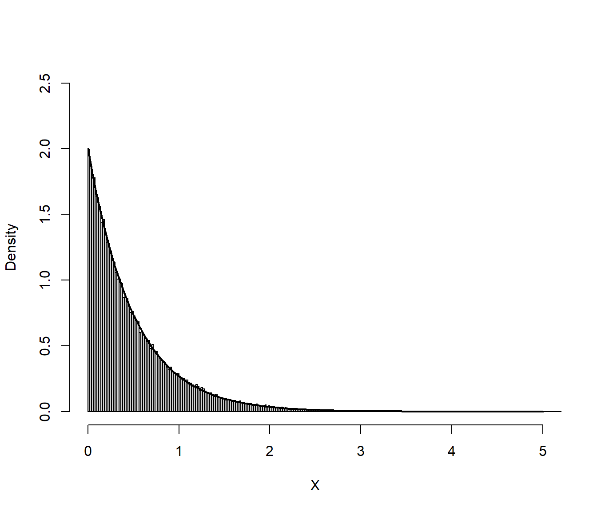
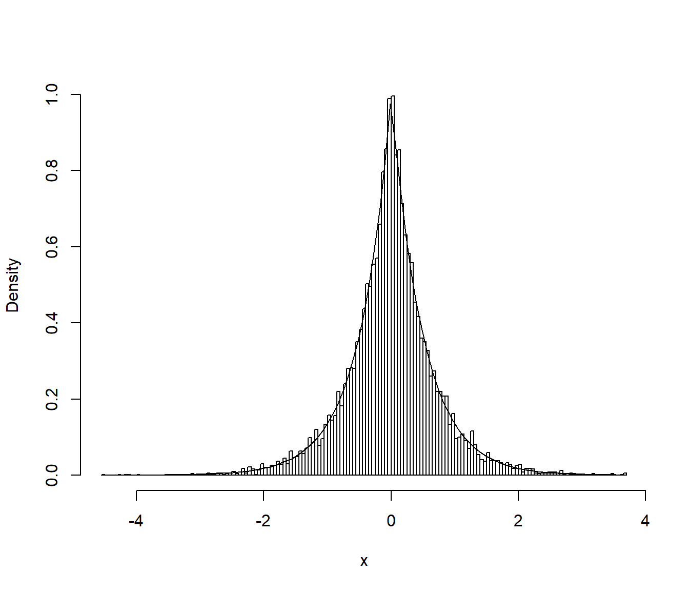
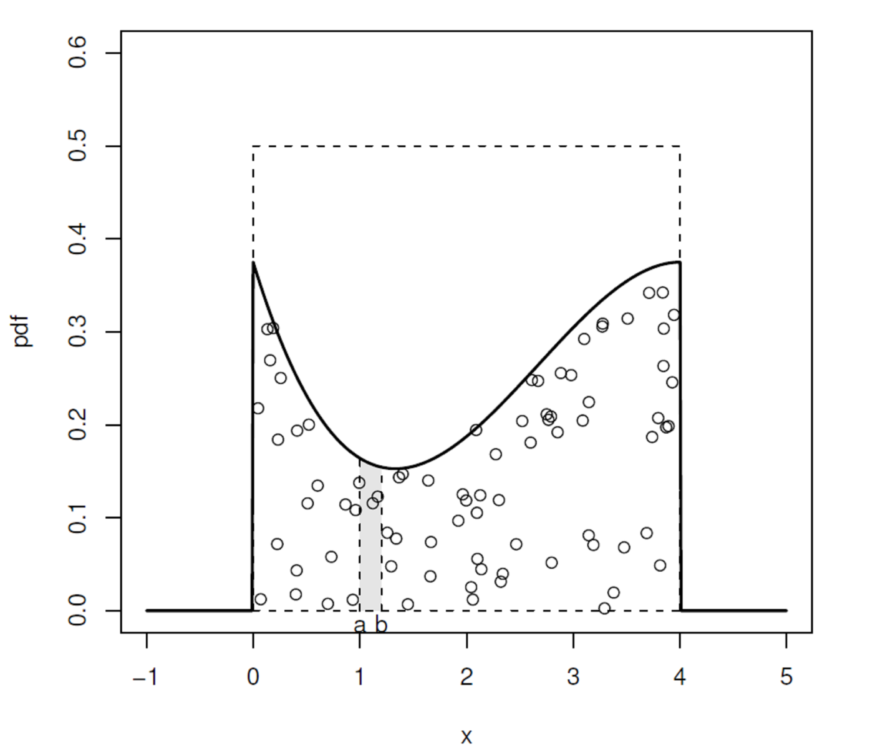
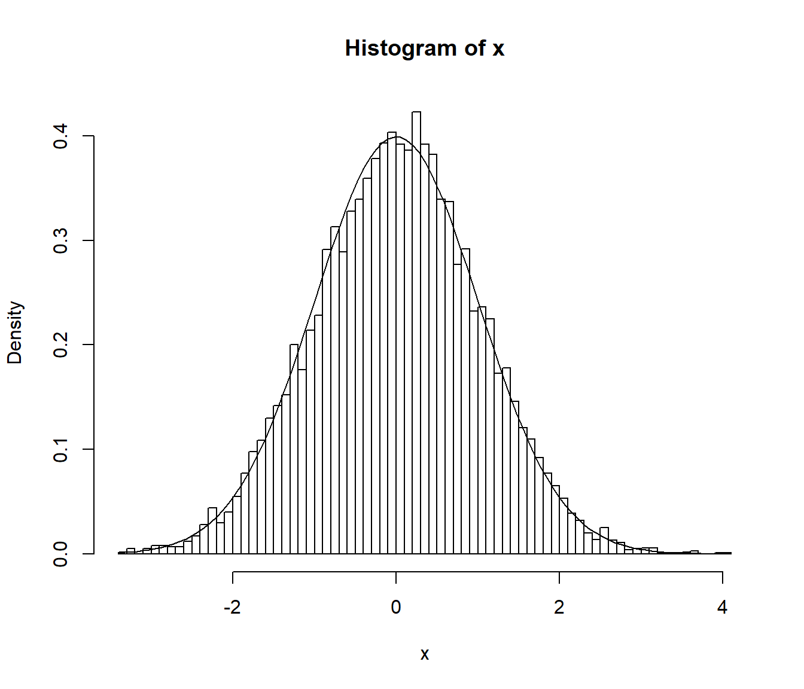
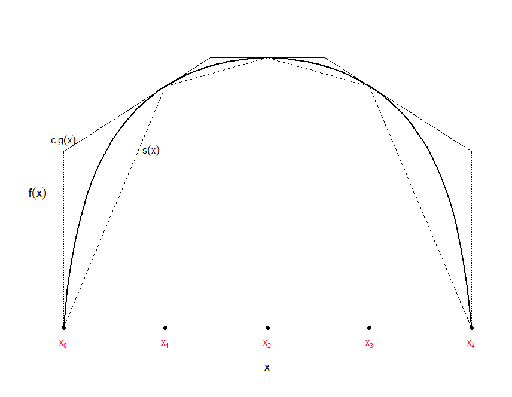

Simulación de variables continuas
=================================

<!-- PENDIENTE:
Emplear entorno algoritmo
Usar ejemplos en lugar de ejercicios
Emplearemos también $X\sim f$ para indicar que $X$ es una variable aleatoria con función de densidad $f$

Ejemplo cociente de uniformes
-->


En este capítulo se expondrán métodos generales para simular
distribuciones continuas: el método de inversión y los basados en
aceptación/rechazo. En todos los casos como punto de partida es necesario
disponer de un método de generación de números pseudoaleatorios uniformes en $(0,1)$.


Método de inversión
-------------------

Se trataría del método preferible para la simulación de una variable continua
(siempre que se disponga de la función cuantil). 
Está basado en los siguientes resultados:

Si $X$ es una variable aleatoria con función de distribución $F$ continua y estrictamente monótona 
(invertible), entonces:
$$U=F\left( X\right) \sim \mathcal{U}\left( 0,1\right),$$
ya que:
$$G\left( u\right) = P\left( Y\leq u\right) 
= P\left( F\left( X\right) \leq u\right) \\
= P\left( X\leq F^{-1}\left( u\right) \right) 
= F\left( F^{-1}\left( u\right) \right) = u.$$

El recíproco también es cierto, si $U\sim \mathcal{U}\left( 0,1\right)$
entonces: 
$$F^{-1}\left( U\right) \sim X$$

**Algoritmo (método de inversión)**:

1. Generar $U\sim \mathcal{U}\left( 0,1\right)$.

2. Devolver $X=F^{-1}\left( U\right)$.


\BeginKnitrBlock{example}\iffalse{-91-83-105-109-117-108-97-99-105-243-110-32-100-101-32-117-110-97-32-100-105-115-116-114-105-98-117-99-105-243-110-32-101-120-112-111-110-101-110-99-105-97-108-93-}\fi{}<div class="example"><span class="example" id="exm:exp-inv"><strong>(\#exm:exp-inv)  \iffalse (Simulación de una distribución exponencial) \fi{} </strong></span></div>\EndKnitrBlock{example}

La distribución exponencial $\exp \left( \lambda \right)$ de parámetro $\lambda>0$
tiene como función de densidad $f\left( x\right) =\lambda e^{-\lambda x}$, si $x\geq 0$,
y como función de distribución:
$$F(x)=\left\{ \begin{array}{ll}
1-e^{-\lambda x} & \text{si } x \ge 0 \\
0 & \text{si } x < 0\\
\end{array} \right.$$
Teniendo en cuenta que:
$$1-e^{-\lambda x}=u \Leftrightarrow x=-\frac{\ln \left( 1-u\right) }{ \lambda },$$
el algoritmo para simular esta variable mediante el método de inversión es:

1. Generar $U\sim \mathcal{U}\left( 0,1\right)$.

2. Devolver $X=-\dfrac{\ln \left( 1-U\right) }{\lambda }$.

En el último paso podemos emplear directamente $U$ en lugar de $1-U$, ya que $1 - U\sim \mathcal{U}\left( 0,1\right)$.
Esta última expresión para acelerar los cálculos es la que denominaremos *forma simplificada*. 

El código para implementar este algoritmo en R podría ser el siguiente:

```r
# Simular vector exp(lambda)
tini <- proc.time()

lambda <- 2
nsim <- 10^5
set.seed(1)
U <- runif(nsim)
X <- -log(U)/lambda # -log(1-U)/lambda

tiempo <- proc.time() - tini
tiempo
```

```
##    user  system elapsed 
##    0.00    0.00    0.02
```

```r
hist(X, breaks = "FD", freq = FALSE, 
        main = "", xlim = c(0, 5), ylim = c(0, 2.5))
curve(dexp(x, lambda), lwd = 2, add = TRUE)
```

<div class="figure" style="text-align: center">

<p class="caption">(\#fig:exp-inv-plot)Distribución de los valores generados de una exponencial mediante el método de inversión.</p>
</div>

Como se observa en la Figura \@ref(fig:exp-inv-plot) se trata de un método exacto (si está bien implementado) y la distribución de los valores generados se aproxima a la distribución teórica como cabría esperar con una muestra de ese tamaño.


### Algunas distribuciones que pueden simularse por el método de inversión

A continuación se incluyen algunas distribuciones que se pueden simular
fácilmente mediante el método de inversión. Se adjunta una forma
simplificada del método que tiene por objeto evitar cálculos
innecesarios (tal y como se hizo en el ejemplo de la exponencial).

Nombre  | Densidad  | $F\left( x\right)$  | $F^{-1}\left( U\right)$  | Forma simplificada
------------- | ------------- | ------------- | ------------- | -------------
$\exp\left( \lambda\right)$ ($\lambda>0$)  | $\lambda e^{-\lambda x}$, si $x\geq0$  | $1-e^{-\lambda x}$  | $-\dfrac{\ln\left( 1-U\right)  }\lambda$  | $-\dfrac{\ln U}\lambda$
Cauchy  | $\dfrac1{\pi\left( 1+x^{2}\right)  }$  | $\dfrac12+\dfrac{\arctan x}\pi$   | $\tan\left( \pi\left( U-\dfrac12\right) \right)$  | $\tan\pi U$
Triangular en $\left( 0,a\right)$  | $\dfrac2a\left( 1-\dfrac xa\right)$, si $0\leq x\leq a$  | $\dfrac2a\left(x-\dfrac{x^{2}}{2a}\right)$  | $a\left( 1-\sqrt{1-U}\right)$  | $a\left( 1-\sqrt{U}\right)$
Pareto ($a,b>0$)  | $\dfrac{ab^{a}}{x^{a+1}}$, si $x\geq b$  | $1-\left( \dfrac bx\right)^{a}$   | $\dfrac b{\left( 1-U\right)  ^{1/a}}$  | $\dfrac b{U^{1/a}}$
Weibull ($\lambda,\alpha>0$) | $\alpha\lambda^{\alpha}x^{\alpha-1}e^{-\left( \lambda x\right)  ^{\alpha}}$, si $x\geq0$  | $1-e^{-\left( \lambda x\right)  ^{\alpha}}$  | $\dfrac{\left( -\ln\left(1-U\right)  \right)  ^{1/\alpha}}\lambda$   | $\dfrac{\left( -\ln U\right)^{1/\alpha}}\lambda$\


\BeginKnitrBlock{exercise}<div class="exercise"><span class="exercise" id="exr:unnamed-chunk-2"><strong>(\#exr:unnamed-chunk-2) </strong></span></div>\EndKnitrBlock{exercise}

La distribución doble exponencial (o distribución de Laplace) de
parámetro $\lambda$ tiene función de densidad:
$$f\left( x\right)  =\frac{\lambda}{2}e^{-\lambda\left\vert x\right\vert
}\text{, }x\in\mathbb{R}$$ 
y función de distribución:
$$F\left( x\right)  =\int_{-\infty}^{x}f\left( t\right)  dt=\left\{
\begin{array}{ll}
\frac{1}{2}e^{\lambda x} & \text{si } x<0\\
1-\frac{1}{2}e^{-\lambda x} & \text{si } x\geq0
\end{array}
\ \right.$$

a)  Escribir una función que permita generar, por el método de
    inversión, una muestra de $n$ observaciones de esta distribución^[Esta distribución puede generarse fácilmente simulando una distribución exponencial y otorgarle un signo positivo o negativo con equiprobabilidad (ver Ejemplo \@ref(exm:dexp-mix)).].

    
    ```r
    ddexp <- function(x, lambda = 1){
    # Densidad doble exponencial
      lambda*exp(-lambda*abs(x))/2
    }
    
    rdexp <- function(lambda = 1){
    # Simulación por inversión
    # Doble exponencial
      U <- runif(1)
      if (U<0.5) {
        return(log(2*U)/lambda)
      } else {
        return(-log(2*(1-U))/lambda)
      }
    }
    
    rdexpn <- function(n = 1000, lambda = 1) {
    # Simulación n valores de doble exponencial
        x <- numeric(n)
        for(i in 1:n) x[i]<-rdexp(lambda)
        return(x)
    }
    ```


b)  Generar $10^{4}$ valores de la distribución doble exponencial de
    parámetro $\lambda=2$ y obtener el tiempo de CPU que tarda en
    generar la secuencia.

    
    ```r
    set.seed(54321)
    system.time(x <- rdexpn(10^4, 2))
    ```
    
    ```
    ##    user  system elapsed 
    ##    0.04    0.00    0.05
    ```


c)  Representar el histograma y compararlo con la densidad teórica.

    
    ```r
    hist(x, breaks = "FD", freq = FALSE, main="")
    # lines(density(x), col = 'blue')
    curve(ddexp(x, 2), add = TRUE)
    ```
    
    <div class="figure" style="text-align: center">
    
    <p class="caption">(\#fig:dexp-inv)Distribución de los valores generados de una doble exponencial mediante el método de inversión.</p>
    </div>


### Ventajas e inconvenientes

Ventajas:

* Aplicable, en principio, a cualquier distribución continua.

Inconvenientes:

* Puede no ser posible encontrar una expresión explícita para 
  $F^{-1}\left( u\right).$

* Aún disponiendo de una expresión explícita para 
  $F^{-1}\left( u\right)$, su evaluación directa puede requerir
  mucho tiempo de computación.

Alternativas:

* Emplear métodos numéricos para resolver $F\left( x\right) -u=0$
  (requeriría resolver numéricamente esta ecuación para cada
  valor aleatorio que se desee generar).

* Utilizar una aproximación a $F^{-1}\left( u\right)$
  (inversión aproximada).
  

### Inversión aproximada

En muchos casos en los que no se puede emplear la expresión exacta de la función
cuantil $F^{-1}\left( u\right)$, se dispone de una aproximación suficientemente
buena que se puede emplear en el algoritmo anterior (se obtendrían simulaciones
con una distribución aproximada a la deseada).

Por ejemplo, para aproximar la función cuantil de la normal estándar, 
Odeh y Evans consideraron la siguiente función auxiliar :
$$ g\left( v\right)  =\sqrt{-2\ln v}\frac{A\left( \sqrt{-2\ln v}\right)
}{B\left( \sqrt{-2\ln v}\right)  },$$
siendo $A\left( x\right) =\sum_{i=0}^{4}a_{i}x^{i}$
y $B\left( x\right)  =\sum_{i=0}^{4}b_{i}x^{i}$ con:

$$\begin{array}{ll}
a_{0}=-0.322232431088 &  b_{0}=0.0993484626060 \\
a_{1}=-1 &  b_{1}=0.588581570495 \\
a_{2}=-0.342242088547 & b_{2}=0.531103462366 \\
a_{3}=-0.0204231210245 & b_{3}=0.103537752850 \\
a_{4}=-0.0000453642210148 & b_{4}=0.0038560700634
\end{array}$$

La aproximación consiste en utilizar $g\left( 1-u\right)$ en lugar de
$F^{-1}\left( u\right)$ para los valores de $u\in[10^{-20},\frac12]$
y $-g\left( u\right)$ si $u\in[\frac12,1-10^{-20}]$. Para $u\notin
[10^{-20},1-10^{-20}]$ (que sólo ocurre con una probabilidad de
$2\cdot10^{-20}$) la aproximación no es recomendable.

**Algoritmo de Odeh y Evans**

1. Generar $U\sim U\left( 0,1\right)$.

2. Si $U<10^{-20}$ ó $U>1-10^{-20}$ entonces volver a 1.

3. Si $U<0.5$ entonces hacer $X=g\left(1-U\right)$ 
   en caso contrario hacer $X=-g\left( U\right)$.

4. Devolver $X$.

En manuales de funciones matemáticas, como [Abramowitz y Stegun (1964)](http://people.math.sfu.ca/~cbm/aands/), 
se tienen aproximaciones de la función cuantil de las principales distribuciones
(por ejemplo en la página [993](http://people.math.sfu.ca/~cbm/aands/page_933.htm)
las correspondientes a la normal estándar). 


Método de aceptación rechazo {#AR}
----------------------------

Se trata de un método universal alternativo al de inversión para
el caso de que no se pueda emplear la función cuantil, 
pero se dispone de una expresión (preferiblemente sencilla) para la
función de densidad $f\left( x \right)$. 

Si $f$ es la densidad objetivo, la idea es simular una variable aleatoria
bidimensional $\left( X, Y\right)$ con distribución
uniforme en el hipografo de $f$ (el conjunto de puntos del plano 
comprendidos entre el eje OX y $f$):
$$A_{f}=\left\{ \left( x,y\right) \in \mathbb{R}^{2}:0\leq y\leq
f\left( x\right) \right\}.$$
De esta forma la primera componente tendrá la distribución deseada:



$$ P\left( a<X<b\right) = \frac{\text{Area de }\left\{ \left( x,y\right) \in 
\mathbb{R}^{2}:a<x<b;~0\leq y\leq f\left( x\right) \right\} }{\text{Area de }
A_{f}} \\
= \int_{a}^{b}f\left( x\right) dx $$

<!-- 
el resultado anterior no depende de la constante normalizadora,
teorema aceptación/rechazo
por tanto es válido para cuasidensidades
-->
El resultado anterior es también válido para una cuasi-densidad $f^{\ast}$
(no depende de la constante normalizadora). 
El resultado general sería en siguiente:

* Si $X$ es una variable aleatoria con función de densidad $f$ 
  y $U \sim \mathcal{U}\left( 0, 1 \right)$ entonces
  $$\left( X,c\cdot U\cdot f\left( X\right) \right) \sim \mathcal{U}\left(
  A_{cf}\right)$$
  siendo
  $A_{cf}=\left\{ \left( x, y \right) \in \mathbb{R}^{2} : 0 \leq y \leq
  cf\left( x \right) \right\}$.

* Recíprocamente si $\left( X,Y\right) \sim \mathcal{U}\left(A_{cf}\right) \Rightarrow X\sim f$.

Para generar valores de una variable aleatoria bidimensional con distribución uniforme
en $A_{f}$ (o en $A_{f^{\ast }}$), se emplea el resultado anterior para 
generar valores en $A_{cg} \supset A_{f}$, siendo $g$ una densidad auxiliar
(preferiblemente fácil de simular y similar a $f$).
Teniendo en cuenta además que:

* Si $\left( X,Y\right) \sim \mathcal{U}\left( A\right)$ y 
  $B \subset A\Rightarrow \left. \left( X,Y\right) \right\vert _{B}
  \sim \mathcal{U}\left(B\right)$
  
Por tanto, si $\left( T, Y \right)$ sigue una distribución
uniforme en $A_{cg}$, aceptando los valores de
$\left( T, Y\right)$ que pertenezcan a $A_{f}$ (o a $A_{f^{\ast }}$) se obtendrán 
generaciones con distribución uniforme sobre $A_{f}$ (o $A_{f^{\ast }}$) 
y la densidad de la primera componente $T$ será $f$.

### Algoritmo

Supongamos que $f$ es la densidad objetivo y $g$ es una densidad
auxiliar (fácil de simular y similar a $f$), de forma que
existe una constante $c>0$ tal que:
$$f\left( x\right) \leq c\cdot g\left( x\right) 
\text{, }\forall x\in \mathbb{R}\text{.}$$

Algoritmo (Von Neuman, 1951):

1.  Generar $U\sim \mathcal{U}\left( 0, 1\right)$.

2.  Generar $T\sim g$.

3.  Si $c\cdot U\cdot g\left( T\right) \leq f\left( T\right)$
    devolver $X=T$,

    en caso contrario volver al paso 1.


### Densidades acotadas en un intervalo cerrado

Sea $f$ una función de
densidad cualquiera con soporte en un intervalo cerrado $[a,b]$ (es
decir, $\{x/f\left( x\right)  \neq0\}=[a,b]$) de tal forma que
existe una constante $M>0$ tal que $f\left( x\right)  \leq M$ $\forall x$ (es decir,
$f$ es acotada superiormente). En este caso puede tomarse como densidad
auxiliar $g$, la de una $\mathcal{U}(a,b)$. En efecto, tomando
$c=M\left( b-a\right)$ y teniendo en cuenta que
$$g\left( x\right)  =\left\{
\begin{array}{ll}\frac{1}{b-a} & \text{si } x\in\lbrack a,b]\\
0 & \text{en caso contrario}
\end{array} \right.$$ 
se tiene que
$f\left( x\right)  \leq M = \frac{c}{b-a}=c\cdot g\left(
x\right)$, $\forall x\in\lbrack a,b]$. Así pues, el algoritmo quedaría
como sigue:


1. Generar $U,V\sim \mathcal{U}\left( 0, 1\right)$.

2. Hacer $T = a + \left( b-a \right) V$.

3.  Si $M \cdot U\leq f\left( T \right)$
    devolver $X = T$,

    en caso contrario volver al paso 1.


**Nota**: no confundir $M$ con $c = M \left( b - a \right)$.


<!-- Incluir cuentas de AR para la doble exponencial -->

\BeginKnitrBlock{exercise}<div class="exercise"><span class="exercise" id="exr:unnamed-chunk-6"><strong>(\#exr:unnamed-chunk-6) </strong></span></div>\EndKnitrBlock{exercise}

Desarrollar el código necesario para generar, por el método de
aceptación-rechazo, una muestra de $n$ observaciones de una
distribución normal estándar:
$$f\left( x\right)  =\frac{1}{\sqrt{2\pi}}e^{-\frac{x^{2}}{2}}\text{, }x\in\mathbb{R}\text{, }$$
empleando como distribución auxiliar una doble exponencial con $\lambda=1$ 
(más adelante veremos que esta es la elección óptima para el parámetro de la densidad auxiliar) y que la cota optima
es:$$c_{\text{opt}}=\sqrt{\frac{2e}{\pi}}\simeq1.\,3155.$$ Para
establecer la condición de aceptación o rechazo se puede tener en
cuenta que:
$$c\cdot U\cdot\frac{g\left( T\right)  }{f\left( T\right)  }=\sqrt{\frac
{2e}{\pi}}U\sqrt{\frac{\pi}{2}}\exp\left( \frac{T^{2}}{2}-\left\vert
T\right\vert \right)  =U\cdot\exp\left( \frac{T^{2}}{2}-\left\vert
T\right\vert +\frac{1}{2}\right)  ,$$
aunque en general puede ser recomendable emplear $c\cdot U\cdot g\left( T\right) \leq f\left( T\right)$.


```r
# densidad objetivo: dnorm
# densidad auxiliar: ddexp

# EJECUTAR CÓDIGO DEL APARTADO A DEL EJERCICIO 1
c.opt <- sqrt(2*exp(1)/pi)
lambda.opt <- 1
ngen <- 0

rnormAR <- function() {
# Simulación por aceptación-rechazo
# Normal estandar a partir de doble exponencial
  while (TRUE) {
    U <- runif(1)
    X <- rdexp(1) # lambda = 1
    ngen <<- ngen+1 # Comentar esta línea para uso normal
    # if (U*exp((X^2+1)*0.5-abs(X)) <= 1) return(X)
    if (c.opt * U * ddexp(X, lambda.opt) <= dnorm(X)) return(X)
  }
}

rnormARn <- function(n=1000) {
# Simulación n valores N(0,1)
    x <- numeric(n)
    for(i in 1:n) x[i]<-rnormAR()
    return(x)
}

# Grafico
curve(c.opt * ddexp(x), xlim = c(-4, 4), lty = 2)
curve(dnorm(x), add = TRUE)
```




a)  Generar una muestra de $10^{4}$ observaciones empleando este
    algoritmo. Obtener el tiempo de CPU y calcular el número medio
    de generaciones de la distribución auxiliar.

    
    ```r
    set.seed(54321)
    nsim <- 10^4
    
    ngen <- 0
    system.time(x <- rnormARn(nsim))
    ```
    
    ```
    ##    user  system elapsed 
    ##    0.11    0.02    0.12
    ```
    
    ```r
    # Nº generaciones
    {
    cat("\nNº de generaciones = ", ngen)
    cat("\nNº medio de generaciones = ", ngen/nsim)
    cat("\nProporción de rechazos = ", 1-nsim/ngen, "\n")
    }
    ```
    
    ```
    ## 
    ## Nº de generaciones =  13163
    ## Nº medio de generaciones =  1.3163
    ## Proporción de rechazos =  0.2402948
    ```


b)  Representar el histograma y compararlo con la densidad teórica.
    
    
    ```r
    hist(x, breaks="FD", freq=FALSE)
    curve(dnorm(x), add=TRUE)
    ```
    
    


### Eficiencia del algoritmo

Como medida de la eficiencia del algoritmo de aceptación-rechazo
podríamos considerar el número de iteraciones del algoritmo, 
es decir, el número de generaciones de la densidad auxiliar y
de comparaciones para aceptar un valor de la densidad objetivo.
Este número $N$ es aleatorio y sigue una distribución geométrica 
(número de pruebas necesarias hasta obtener el primer éxito) 
con parámetro $p$ (probabilidad de éxito) la probabilidad de aceptación 
en el paso 3:
$$p = \frac{\text{area}\left(
        A_{f}\right) }{\text{area}\left( A_{cg}\right) }=\frac{1}{c}.$$
Por tanto:
$$E\left( N \right) = \frac1p = c$$ 
es el número medio de iteraciones del algoritmo 
(el número medio de pares de variables $\left( T,U\right)$ 
que se necesitan generar, y de comparaciones, para obtener
una simulación de la densidad objetivo).

Es obvio, por tanto, que cuanto más cercano a 1 sea el valor de $c$ más eficiente será el algoritmo (el caso de $c=1$ se correspondería con $g=f$ y no tendría sentido emplear este algoritmo).
El principal problema con este método es encontrar una densidad auxiliar $g$ de forma que:
$$c_{\text{opt}}=\max_{\{x : g\left( x\right) >0\}}
\frac{f\left( x\right) }{g\left( x\right) }.$$
sea próximo a 1.
Una solución intermedia consiste en seleccionar una familia paramétrica de densidades $\{g_{\theta} : \theta \in \Theta\}$ entre las que haya alguna que se parezca bastante a $f$, 
encontrar el valor de $c$ óptimo para cada densidad de esa familia:
$$c_{\theta}=\max_{x}\frac{f\left(  x\right)  }{g_{\theta}\left( x\right) }$$ 
y, finalmente, elegir el mejor valor $\theta_{0}$ del parámetro, en el sentido de ofrecer el menor posible $c_{\theta}$:
$$c_{\theta_{0}}=\min_{\theta\in\Theta}\max_{x}\frac{f\left(  x\right) }{g_{\theta}\left(  x\right)  }.$$


\BeginKnitrBlock{exercise}<div class="exercise"><span class="exercise" id="exr:unnamed-chunk-10"><strong>(\#exr:unnamed-chunk-10) </strong></span></div>\EndKnitrBlock{exercise}

Continuando con el ejercicio anterior del método de
aceptación-rechazo para generar observaciones de una
distribución normal estándar, empleando como distribución 
auxiliar una doble exponencial:

c)  Aproximar la cota óptima numéricamente.

    
    ```r
    # Obtención de un valor c óptimo aproximado
    optimize(f=function(x){dnorm(x)/ddexp(x)}, maximum=TRUE, interval=c(-1,1))
    ```
    
    ```
    ## $maximum
    ## [1] -0.999959
    ## 
    ## $objective
    ## [1] 1.315489
    ```
    
    ```r
    # NOTA: Cuidado con los límites
    # optimize(f=function(x){dnorm(x)/ddexp(x)}, maximum=TRUE, interval=c(0,2))
    
    # Valor óptimo real
    # sqrt(2*exp(1)/pi)
    c.opt
    ```
    
    ```
    ## [1] 1.315489
    ```


d)  Aproximar el parámetro óptimo de la densidad auxiliar
    numéricamente (normalmente comenzaríamos por este paso).

    
    ```r
    # Obtención de valores c y lambda óptimos aproximados
    fopt <- function(lambda) {
      # Obtiene c fijado lambda
      optimize(f = function(x){dnorm(x)/ddexp(x,lambda)},
               maximum=TRUE, interval=c(0,2))$objective
    }
    
    # Encontar lambda que minimiza
    res <- optimize(f=function(x){fopt(x)}, interval=c(0.5,2))
    lambda.opt2 <- res$minimum
    c.opt2 <- res$objective
    ```


### Ejemplo: Inferencia Bayesiana

El algoritmo de Aceptación-Rechazo se emplea habitualmente en
Inferencia Bayesiana:

* $f(x|\theta )$ densidad muestral.

* $\pi (\theta )$ densidad a priori.

* $\mathbf{x}=(x_{1},...,x_n)^{\prime }$ muestra observada.

* La distribución a posteriori de $\theta$ es:
  $$\pi (\theta |\mathbf{x})=\frac{L(\mathbf{x}|\theta )\pi (\theta )}
  {\int L(\mathbf{x}|\theta )\pi (\theta )d\theta }$$
  siendo $L(\mathbf{x}|\theta )$ la función de verosimilitud
  ($L(\mathbf{x}|\theta )=\prod\limits_{i=1}^{n}f(x_{i}|\theta)$
  suponiendo i.i.d.). Es decir:
  $$\pi (\theta |\mathbf{x})\propto L(\mathbf{x}|\theta )\pi (\theta ).$$


Para simular valores de la densidad a posteriori $\pi (\theta | \mathbf{x})$ 
a partir de la densidad a priori $\pi (\theta )$

* $\pi (\theta |\mathbf{x})/\pi (\theta )\propto L(\mathbf{x}|\theta )$

* $L(\mathbf{x}|\theta )\leq c^{\prime }=L(\mathbf{x}|\hat{\theta})$ siendo
  $\hat{\theta}$ el estimador MV de $\theta$.

Algoritmo:

1. Generar $U\sim \mathcal{U}\left( 0,1\right)$.

2. Generar $\tilde{\theta}\sim \pi (\theta )$.

3.  Si $L(\mathbf{x}|\hat{\theta})\cdot U \leq 
    L(\mathbf{x}|\tilde{\theta})$ devolver $\tilde{\theta}$,

    en caso contrario volver al paso 1.

\BeginKnitrBlock{exercise}<div class="exercise"><span class="exercise" id="exr:unnamed-chunk-13"><strong>(\#exr:unnamed-chunk-13) </strong></span></div>\EndKnitrBlock{exercise}

Para la estimación Bayes de la media de una normal se suele utilizar
como distribución a priori una Cauchy.

a)  Generar una muestra i.i.d. $X_{i}\sim N(\theta_{0},1)$ de tamaño
    $n=10$ con $\theta_{0}=1$. Utilizar una $Cauchy(0,1)$
    (`rcauchy`) como distribución a priori y como densidad auxiliar
    para simular por aceptación-rechazo una muestra de la densidad a
    posteriori (emplear `dnorm` para construir la verosimilitud).
    Obtener el intervalo de probabilidad al 95%.


    
    ```r
    mu0 <- 1
    n <- 10
    nsim <- 10^3
    set.seed(54321)
    x <- rnorm(n, mean = mu0)
    
    # Función de verosimilitud
    lik <- function(mu){prod(dnorm(x, mean = mu))}
    
    # Cota óptima
    # Estimación por máxima verosimilitud
    emv <- optimize(f = lik, int = range(x), maximum = TRUE)
    emv
    ```
    
    ```
    ## $maximum
    ## [1] 0.7353805
    ## 
    ## $objective
    ## [1] 3.303574e-08
    ```
    
    ```r
    c <- emv$objective
    ```
    En este caso concreto, ya sabríamos que el estimador máximo verosímil es la media muestral:
    
    ```r
    mean(x)
    ```
    
    ```
    ## [1] 0.7353958
    ```
    y por tanto:
    
    ```r
    c <- lik(mean(x))
    c    
    ```
    
    ```
    ## [1] 3.303574e-08
    ```
    Finalmente podríamos emplear el siguiente código para generar simulaciones de la distribución a posteriori mediante aceptación-rechazo a partir de la distribución de Cauchy:
    
    ```r
    ngen <- nsim
    Y <- rcauchy(nsim)
    ind <- (c*runif(nsim) > sapply(Y, lik)) # TRUE si no verifica condición
    # Volver a generar si no verifica condición
    while (sum(ind)>0){
      le <- sum(ind)
      ngen <- ngen + le
      Y[ind] <- rcauchy(le)
      ind[ind] <- (c*runif(le) > sapply(Y[ind], lik)) # TRUE si no verifica condición
    }
    
    { # Número generaciones
      cat("Número de generaciones = ", ngen)
      cat("\nNúmero medio de generaciones = ", ngen/nsim)
      cat("\nProporción de rechazos = ", 1-nsim/ngen,"\n")
    }
    ```
    
    ```
    ## Número de generaciones =  5898
    ## Número medio de generaciones =  5.898
    ## Proporción de rechazos =  0.830451
    ```
    
    ```r
    # Intervalo de probabilidad al 95% (IC Bayes)
    q <- quantile(Y, c(0.025, 0.975))
    
    # Representar estimador e IC Bayes
    hist(Y, freq=FALSE, main="Distribución a posteriori")
    # abline(v = mean(x), lty = 3) # Estimación frecuentista
    abline(v = mean(Y), lty = 2, lwd = 2)  # Estimación Bayesiana
    abline(v = q, lty = 2)
    ```
    
    

b)  Repetir el apartado anterior con $n=100$.


Modificaciones del método de aceptación rechazo
-----------------------------------------------

En el tiempo de computación influye:

* La proporción de aceptación (debería ser grande).

* La dificultad de simular con la densidad auxiliar.

* El tiempo necesario para hacer la comparación en el paso 4.

En ciertos casos el tiempo de computación necesario para evaluar $f(x)$ puede ser alto.

Para evitar evaluaciones de la densidad se puede emplear una función "squeeze" (Marsaglia, 1977) que aproxime la densidad por abajo:
$$s(x)\leq f(x).$$

Algoritmo:

1.  Generar $U\sim \mathcal{U}\left( 0,1\right)$ y $T\sim g$.

2.  Si $c\cdot U\cdot g\left( T\right) \leq s\left( T\right)$ devolver $X=T$,

    en caso contrario

    2.a.  si $c\cdot U\cdot g\left( T\right) \leq f\left( T\right)$ 
          devolver $X=T$,
    
    2.b.  en caso contrario volver al paso 1.




Cuanto mayor sea el área bajo $s\left( x\right)$ (más próxima a 1)
más efectivo será el algoritmo.

Se han desarrollado métodos generales para la construcción de las
funciones $g$ y $s$ de forma automática
(cada vez que se evalúa la densidad se mejoran las aproximaciones).
Estos métodos se basan principalmente en que una transformación de
la densidad objetivo es cóncava o convexa.

### Muestreo por rechazo adaptativo (ARS)

Supongamos que $f$ es una cuasi-densidad log-cóncava 
(i.e. $\frac{\partial ^{2}}{\partial x^{2}}\log f\left( x\right) <0,
~\forall x$).

Sea $S_n=\left\{ x_{i}:i=0,\cdots ,n+1\right\}$ con
$f(x_{i})$ conocidos.

Denotamos por $L_{i,i+1}(x)$ la recta pasando por $\left( x_{i},\log
f(x_{i})\right)$ y $\left( x_{i+1},\log f(x_{i+1})\right)$

* $L_{i,i+1}(x)\leq \log f\left( x\right)$ en el intervalo 
  $I_{i}=(x_{i},x_{i+1}]$

* $L_{i,i+1}(x)\geq \log f\left( x\right)$ fuera de $I_{i}$

En el intervalo $I_{i}$ se definen las envolventes de $\log f\left(
x\right)$:

* $\underline{\phi}_n(x)=L_{i,i+1}(x)$

* $\overline{\phi}_n(x)=\min \left\{L_{i-1,i}(x),L_{i+1,i+2}(x)\right\}$

Las envolventes de $f\left( x\right)$ en $I_{i}$ serán:

* $s_n(x)=\exp \left( \underline{\phi}_n(x)\right)$

* $G_n(x)=\exp \left( \overline{\phi}_n(x)\right)$


Tenemos entonces que:
$$s_n(x)\leq f\left( x\right) \leq G_n(x)=c\cdot g_n(x)$$
donde $g_n(x)$ es una mixtura discreta de distribuciones tipo exponencial truncadas
(las tasas pueden ser negativas), 
que se puede simular fácilmente mediante el método de inversión.

Algoritmo (Gilks, 1992):

1. Inizializar $n$ y $s_n$.

2.  Generar $U\sim \mathcal{U}\left( 0,1\right)$ y
    $T\sim g_n$.

3.  Si $U\cdot G_n\left( T\right) \leq s_n\left( T\right)$
    devolver $X=T$,

    en caso contrario, 

    3.a Si $U\cdot G_n\left( T\right) \leq f\left( T\right)$
        devolver $X=T$.

    3.b Hacer $n=n+1$, añadir $T$ a $S_n$ 
        y actualizar $s_n$ y $G_n$.

4.  Volver al paso 2.


Gilks y Wild (1992) propusieron un método similar pero empleando
tangentes para construir la cota superior.

La mayoría de las densidades de la familia de distribuciones
exponencial son log-cóncavas.
Hörmann (1995) extendió esta aproximación al caso de densidades
$T_{c}$-cóncavas:
$$T_{c}(x) = signo(c)x^{c} \\
T_{0}(x) = \log (x).$$
Aparte de la transformación logarítmica, la transformación
$T_{-1/2}(x)=-1/\sqrt{x}$ es habitualmente la más empleada.

### Método del cociente de uniformes

Se puede ver como una modificación del método de aceptación rechazo,
de especial interés cuando el soporte no es acotado.

Si $(U,V)$ se distribuye uniformemente sobre:
$$C_{h} = \left\{ \left( u,v\right) \in \mathbb{R}^{2} : 
0<u\leq \sqrt{h(v/u)} \right\},$$
siendo $h$ una función no negativa integrable
(cuasi-densidad), entonces $X=V/U$ tiene función de densidad
proporcional a $h$ (Kinderman y Monahan, 1977). 
Además $C_{h}$ tiene área finita.

De modo análogo al método de aceptación-rechazo, hay modificaciones
para acelerar los cálculos y automatizar el proceso, construyendo
regiones mediante polígonos:$$C_{i}\subset C_{h}\subset C_{s}.$$

Método de composición
---------------------

En ocasiones la densidad de interés se puede expresar como una
mixtura discreta de densidades:
$$f(x)=\sum_{j=1}^{k}p_{j}f_{j}(x)$$
con $\sum_{j=1}^{k}p_j=1$, $p_j\geq 0$ y $f_j$ densidades 
(sería también válido para funciones de distribución o variables aleatorias,
incluyendo el caso discreto).

Algoritmo:

1. Generar $J$ con distribución $P\left( J=j \right) = p_j$.

2. Generar $X\sim f_J$.

\BeginKnitrBlock{example}\iffalse{-91-68-105-115-116-114-105-98-117-99-105-243-110-32-100-111-98-108-101-32-101-120-112-111-110-101-110-99-105-97-108-93-}\fi{}<div class="example"><span class="example" id="exm:dexp-mix"><strong>(\#exm:dexp-mix)  \iffalse (Distribución doble exponencial) \fi{} </strong></span></div>\EndKnitrBlock{example}
A partir de la densidad de la distribución doble exponencial:
$$f\left( x\right) =\frac{\lambda }{2}e^{-\lambda \left\vert x\right\vert }%
\text{, }\forall x\in \mathbb{R},$$
se deduce que:
$$f\left( x\right) =\frac{1}{2}f_{1}\left( x\right) +\frac{1}{2}f_{2}\left(
x\right)$$
siendo:
$$f_{1}\left( x\right) = \left\{ 
\begin{array}{ll}
\lambda e^{-\lambda x} & \text{si } x\geq 0 \\ 
0 & \text{si} x<0
\end{array}
\ \right. \\
f_{2}\left( x\right) = \left\{ 
\begin{array}{ll}
\lambda e^{\lambda x} & \text{si } x<0 \\ 
0 & \text{si} x\geq 0
\end{array}
\ \right.$$

Algoritmo:

1. Generar $U,V\sim \mathcal{U}\left( 0,1\right)$.

2. Si $U<0.5$ devolver $X=-\ln \left( 1-V\right)$.

3.  En caso contrario devolver $X=\ln V$.

Observaciones:

* En ocasiones se hace un reciclado de los números aleatorios
  (solo se genera una uniforme, e.g. $V=2(U-0.5)$ si
  $U\in (0.5,1)$).

* En ciertas ocasiones por comodidad, para simular una muestra de
  tamaño $n$, se simulan muestras de tamaño $np_{i}$ con densidad
  $f_{i}$ y se combinan aleatoriamente.


Otro ejemplo de una mixtura discreta es el estimador tipo núcleo de la densidad (ver e.g. la ayuda de la función `density()` de R o la [Sección 4.3](https://rubenfcasal.github.io/book_remuestreo/cap4-boot-suav.html) del libro [Técnicas de Remuestreo](https://rubenfcasal.github.io/book_remuestreo)).
Simular a partir de una estimación de este tipo es lo que se conoce como *bootstrap suavizado*. 

En el caso de una mixtura continua tendríamos:
$$f(x)=\int g(x|y)h(y)dy$$

Algoritmo:

1. Generar $Y\sim h$.

2. Generar $X\sim g(\cdot |Y)$.

Este algoritmo es muy empleado en Inferencia Bayesiana y en la simulación de algunas variables discretas (como la Binomial Negativa, denominada también distribución Gamma–Poisson, o la distribución Beta-Binomial),
ya que el resultado sería válido cambiando las funciones de densidad $f$ y $g$ por funciones de masa de probabilidad.

## Métodos específicos para la generación de algunas distribuciones notables

Ver ejemplos en el libro de Ricardo (cuidado con la notación de la distribución Gamma, no es la empleada en R y en el presente libro) y ayuda de las funciones implementadas en R:

* Método de Box-Müller (para la generación de normales independientes)

* Algoritmos de Jöhnk y Cheng para la generación de la distribución Beta.

### Método de Box-Müller

Se basa en la siguiente propiedad. Dadas dos variables aleatorias independientes $E \sim \exp\left(  1\right)$ y
$U \sim \mathcal{U}( 0, 1 )$, las variables
$\sqrt{2E} \cos 2\pi U$ y $\sqrt{2E}\operatorname{sen} 2\pi U$ son
$\mathcal{N}( 0, 1 )$ independientes.

**Algoritmo de Box-Müller**

1. Generar $U,V\sim \mathcal{U}( 0, 1 )$.

2. Hacer $W_1=\sqrt{-2\ln U}$ y $W_2=2\pi V$.

3. Devolver $X_1=W_1\cos W_2$, $X_2=W_1\operatorname{sen}W_2$.

Podemos hacer que la función `rnorm()` de R emplee este algoritmo estableciendo el parámetro `normal.kind` a `"Box-Muller"` en una llamada previa a `set.seed()` o `RNGkind()`.

Este método está relacionado con el de la FFT (transformada de Fourier; e.g. Davies y Harte, 1987) o el *Circular embedding* (Dietrich and Newsam, 1997), para la generación de una normal multidimensional con dependencia.
Considerando módulos exponenciales y fases aleatorias generamos normales independientes:

* Cambiando la varianza de $W_1$ se induce dependencia.

* Cambiando la distribución de $W_2$ se generan distribuciones distintas de la normal.

