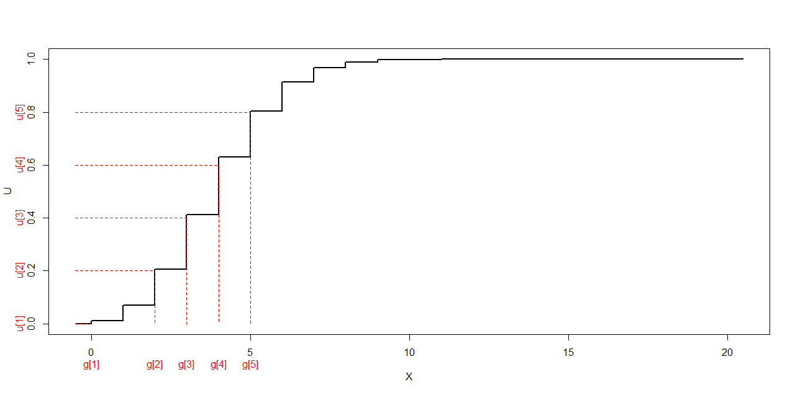
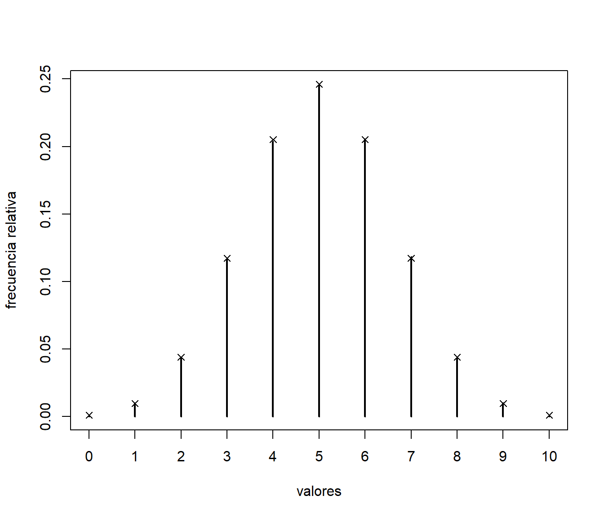

# Simulación de variables discretas {#cap6}


Se trata de simular una variable aleatoria discreta $X$ con función de masa de
probabilidad (f.m.p.):
$$\begin{array}{l|ccccc}
 x_{i}  &  x_{1}  &  x_{2}  &  \cdots   &  x_{n}  &  \cdots   \\ \hline
 P\left( X=x_{i}\right)   &  p_{1}  &  p_{2}  &  \cdots   &  p_{n}  &  
\cdots  
\end{array}$$

Considerando como partida una $\mathcal{U}\left( 0,1\right)$, la
idea general consiste en asociar a cada posible valor $x_{i}$ de $X$
un subintervalo de $\left( 0,1\right)$ de logitud igual a la correspondiente
probabilidad.
Por ejemplo, como ya se mostró en capítulos anteriores, es habitual emplear
código de la forma:

```r
x <- runif(nsim) < p
```
para simular una distribución $Bernoulli(p)$.

Para generar variables discretas con dominio finito en `R`,
si no se dispone de un algoritmo específico más eficiente, 
es recomendable emplear:

```r
sample(valores, nsim, replace = TRUE, prob)
```
Esta función del paquete base implementa eficientemente el método "alias" 
que describiremos más adelante en la Sección \@ref(alias).

Método de la transformación cuantil
-----------------------------------
Este método es una adaptación del método de inversión (válido para el
caso continuo) a distribuciones discretas. En este caso, 
la función de distribución es:
$$F\left( x\right)  =\sum_{x_{j}\leq x}p_{j},$$
y la distribución de la variable aleatoria $F\left( X\right)$ no es uniforme 
(es una variable aleatoria discreta que toma los valores
$F\left( x_{i} \right)$ con probabilidad $p_{i}$, $i=1,2,\ldots$).
Sin embargo, se puede generalizar el método de inversión a situaciones 
en las que $F$ no es invertible considerando la función cuantil.

Se define la función cuantil o inversa generalizada de una función de distribución $F$ como:
$$Q\left( u\right) =\inf \left\{ x\in \mathbb{R}:F\left( x\right) \geq
u\right\} ,\ \forall u\in \left( 0,1\right).$$
Si $F$ es invertible $Q=F^{-1}$.

 
\BeginKnitrBlock{theorem}\iffalse{-91-100-101-32-105-110-118-101-114-115-105-243-110-32-103-101-110-101-114-97-108-105-122-97-100-97-93-}\fi{}<div class="theorem"><span class="theorem" id="thm:invgen"><strong>(\#thm:invgen)  \iffalse (de inversión generalizada) \fi{} </strong></span>
<br>

Si $U\sim \mathcal{U}\left( 0,1\right)$, la variable aleatoria $Q\left( U\right)$
tiene función de distribución $F$.</div>\EndKnitrBlock{theorem}
\BeginKnitrBlock{proof}<div class="proof">\iffalse{} <span class="proof"><em>Demostración. </em></span>  \fi{}Bastaría ver que: 
$$Q\left( u\right) \leq x \Longleftrightarrow u\leq F(x).$$

Como $F$ es monótona y por la definición de $Q$: 
$$Q\left( u\right) \leq x \Rightarrow u \leq F(Q\left( u\right)) \leq F(x).$$
Por otro lado como $Q$ también es monótona: 
$$u \leq F(x) \Rightarrow Q\left( u\right) \leq Q(F(x)) \leq x$$</div>\EndKnitrBlock{proof}


A partir de este resultado se deduce el siguiente algoritmo general 
para simular una distribución de probabilidad discreta.

\BeginKnitrBlock{conjecture}\iffalse{-91-100-101-32-116-114-97-110-115-102-111-114-109-97-99-105-243-110-32-99-117-97-110-116-105-108-93-}\fi{}<div class="conjecture"><span class="conjecture" id="cnj:unnamed-chunk-5"><strong>(\#cnj:unnamed-chunk-5)  \iffalse (de transformación cuantil) \fi{} </strong></span>
<br>
  
1.  Generar $U\sim \mathcal{U}\left( 0,1\right)$.

2.  Devolver $X=Q\left( U\right)$.
</div>\EndKnitrBlock{conjecture}

El principal problema es el cáculo de $Q\left( U\right)$. 
En este caso, suponiendo por comodidad que los valores que toma la variable 
están ordenados ($x_{1}<x_{2}<\cdots$), la función cuantil será:
$$\begin{array}{ll}
Q\left( U\right) &=\inf \left\{ x_{j}:\sum_{i=1}^{j}p_{i}\geq U\right\} \\
&=x_{k}\text{, tal que }\sum_{i=1}^{k-1}p_{i}<U\leq \sum_{i=1}^{k}p_{i}
\end{array}$$

Para encontrar este valor se puede emplear el siguiente algoritmo:

\BeginKnitrBlock{conjecture}\iffalse{-91-100-101-32-116-114-97-110-115-102-111-114-109-97-99-105-243-110-32-99-117-97-110-116-105-108-32-99-111-110-32-98-250-115-113-117-101-100-97-32-115-101-99-117-101-110-99-105-97-108-93-}\fi{}<div class="conjecture"><span class="conjecture" id="cnj:unnamed-chunk-6"><strong>(\#cnj:unnamed-chunk-6)  \iffalse (de transformación cuantil con búsqueda secuencial) \fi{} </strong></span>
<br>
  
1.  Generar $U\sim \mathcal{U}\left( 0,1\right)$.

2.  Hacer $I=1$ y $S=p_{1}$.

3.  Mientras $U>S$ hacer $I=I+1$ y $S=S+p_{I}$

4.  Devolver $X=x_{I}$.
</div>\EndKnitrBlock{conjecture}

Este algoritmo no es muy eficiente, especialmente si el número de
posibles valores de la variable es grande.

\BeginKnitrBlock{remark}<div class="remark">\iffalse{} <span class="remark"><em>Nota: </em></span>  \fi{}El algoritmo anterior es válido independientemente de que los 
valores que tome la variable estén ordenados.
</div>\EndKnitrBlock{remark}

Si la variable toma un número finito de valores, se podría implementar en `R` 
de la siguiente forma:


```r
rfmp0 <- function(x, prob = 1/length(x), nsim = 1000) {
  # Simulación nsim v.a. discreta a partir de fmp
  # por inversión generalizada (transformación cuantil)
  X <- numeric(nsim)
  U <- runif(nsim)
  for(j in 1:nsim) {
    i <- 1
    Fx <- prob[1]
    while (Fx < U[j]) {
      i <- i + 1
      Fx <- Fx + prob[i]
    }
    X[j] <- x[i]
  }
  return(X)
}
```

Adicionalmente, para disminuir el tiempo de computación, se puede almacenar 
las probabilidades acumuladas en una tabla. 
Si también se quiere obtener el número de comparaciones
se puede considerar una variable global `ncomp`:


```r
ncomp <- 0

rfmp <- function(x, prob = 1/length(x), nsim = 1000) {
  # Simulación nsim v.a. discreta a partir de fmp
  # por inversión generalizada (transformación cuantil)
  # Inicializar FD
  Fx <- cumsum(prob)
  # Simular
  X <- numeric(nsim)
  U <- runif(nsim)
  for(j in 1:nsim) {
    i <- 1
    while (Fx[i] < U[j]) i <- i + 1
    X[j] <- x[i]
    ncomp <<- ncomp + i
  }
  return(X)
}
```

\BeginKnitrBlock{exercise}<div class="exercise"><span class="exercise" id="exr:unnamed-chunk-10"><strong>(\#exr:unnamed-chunk-10) </strong></span></div>\EndKnitrBlock{exercise}

Generar, por el método de la transformación cuantil usando
búsqueda secuencial, una muestra de $nsim=10^{5}$ observaciones
de una variable $\mathcal{B}(10,0.5)$. 
Obtener el tiempo de CPU empleado. Aproximar
por simulación la función de masa de probabilidad, representarla
gráficamente y compararla con la teórica. Calcular también la
media muestral (compararla con la teórica $np$) y el número
medio de comparaciones para generar cada observación.


Empleamos la rutina anterior para generar las simulaciones:

```r
set.seed(54321)
n <- 10
p <- 0.5
nsim <- 10^5

x <- 0:n
fmp <- dbinom(x, n, p)

ncomp <- 0
system.time( rx <- rfmp(x, fmp, nsim) )
```

```
##    user  system elapsed 
##    0.07    0.00    0.08
```

Aproximación de la media:

```r
mean(rx)
```

```
## [1] 5.00322
```
El valor teórico es `n*p` = 5.

Número medio de comparaciones:

```r
ncomp/nsim
```

```
## [1] 6.00322
```

```r
# Se verá más adelante que el valor teórico es sum((1:length(x))*fmp)
```

Análisis de los resultados:

```r
res <- table(rx)/nsim
plot(res, ylab = "frecuencia relativa", xlab = "valores")
points(x, fmp, pch = 4)  # Comparación teórica
```

<div class="figure" style="text-align: center">

<p class="caption">(\#fig:comprfmp)Comparación de las frecuencias relativas de los valores generados con las probabilidades teóricas.</p>
</div>

```r
res <- as.data.frame(res)
names(res) <- c("x", "psim")
res$pteor <- fmp
res
```

```
##     x    psim        pteor
## 1   0 0.00107 0.0009765625
## 2   1 0.00990 0.0097656250
## 3   2 0.04432 0.0439453125
## 4   3 0.11778 0.1171875000
## 5   4 0.20425 0.2050781250
## 6   5 0.24375 0.2460937500
## 7   6 0.20454 0.2050781250
## 8   7 0.11898 0.1171875000
## 9   8 0.04419 0.0439453125
## 10  9 0.01023 0.0097656250
## 11 10 0.00099 0.0009765625
```

```r
# Errores
max(abs(res$psim - res$pteor))
```

```
## [1] 0.00234375
```

```r
max(abs(res$psim - res$pteor) / res$pteor)
```

```
## [1] 0.09568
```

\BeginKnitrBlock{remark}<div class="remark">\iffalse{} <span class="remark"><em>Nota: </em></span>  \fi{}Puede ocurrir que no todos los valores sean generados en la simulación.
En el código anterior si `length(x) > length(psim)`, la sentencia
`res$pteor <- fmp` gererará un error. Alternativamente se podría emplear por ejemplo:</div>\EndKnitrBlock{remark}

```r
res <- data.frame(x = x, pteor = fmp, psim = 0)
res.sim <- table(rx)/nsim
index <- match(names(res.sim), x)
res$psim[index] <- res.sim
```


### Eficiencia del algoritmo

Si consideramos la variable aleatoria $\mathcal{I}$ correspondiente a las etiquetas, su función de masa de probabilidad sería:
$$\begin{array}{l|ccccc}
i & 1 & 2 & \cdots & n & \cdots \\ \hline
P\left( \mathcal{I}=i\right) & p_{1} & p_{2} & \cdots & p_{n} & \cdots 
\end{array}$$
y el número de comparaciones en el paso 3 sería un valor aleatorio de esta variable.
Una medida de la eficiencia del algoritmo de la transformación cuantil es
el número medio de comparaciones:
$$E\left( \mathcal{I}\right) =\sum_i ip_{i}.$$
Realmente, cuando la variable toma un número finito de valores:
$x_{1}$, $x_{2}$, $\ldots$, $x_{n}$, no sería necesario hacer
la última comprobación $U>\sum_{i=1}^{n}p_{i}=1$ y se
generaría directamente $x_{n}$, por lo que el
número medio de comparaciones sería:
$$\sum_{i=1}^{n-1}ip_{i}+\left( n-1\right)  p_{n}.$$


Para disminuir el número esperado de comparaciones podemos
reordenar los valores $x_{i}$ de forma que las probabilidades
correspondientes sean decrecientes. Esto equivale a considerar
un etiquetado $l$ de forma que:
$$p_{l\left( 1\right) }\geq p_{l\left( 2\right) }\geq \cdots \geq p_{l\left(
n\right) }\geq \cdots$$


\BeginKnitrBlock{exercise}<div class="exercise"><span class="exercise" id="exr:unnamed-chunk-16"><strong>(\#exr:unnamed-chunk-16) </strong></span></div>\EndKnitrBlock{exercise}

Repetir el ejercicio anterior ordenando previamente las
probabilidades en orden decreciente y también empleando la
función `sample` de R.


```r
tini <- proc.time()

ncomp <- 0
ind <- order(fmp, decreasing=TRUE)
rx <- rfmp(x[ind], fmp[ind], nsim)

tiempo <- proc.time() - tini
tiempo
```

```
##    user  system elapsed 
##    0.06    0.00    0.08
```

```r
# Número de comparaciones
ncomp/nsim
```

```
## [1] 3.08969
```

```r
sum((1:length(x))*fmp[ind]) # Valor teórico
```

```
## [1] 3.083984
```

Como ya se comentó, en `R` se recomienda emplear la función `sample` 
(implementa eficientemente el método de Alias):


```r
system.time( rx <- sample(x, nsim, replace = TRUE, prob = fmp) )
```

```
##    user  system elapsed 
##       0       0       0
```


Método de la tabla guía
-----------------------

La idea consiste en construir $m$ subintervalos equiespaciados
contenidos en $[0,1]$ de la forma
$$I_{j}=\left[ u_{j},u_{j+1}\right) =\left[ \frac{j-1}{m},\frac{j}{m}\right) 
\text{ para }j=1,2,\ldots ,m$$
y utilizarlos como punto de partida para la búsqueda.
En una tabla guía se almancenan los indices de los cuantiles
correspondientes a los extremos inferiores de los intervalos:
$$g_{j}=Q_{\mathcal{I}}(u_{j})=\inf \left\{ i:F_{i}\geq u_{j}=\frac{j-1}{m}\right\}$$

El punto de partida para un valor $U$ será $g_{j_{0}}$ siendo:
$$j_{0}=\left\lfloor mU\right\rfloor +1$$



En este caso, puede verse que una cota del número medio de comparaciones es:
$$E\left( N\right) \leq 1+\frac{n}{m}$$

\BeginKnitrBlock{conjecture}\iffalse{-91-100-101-32-115-105-109-117-108-97-99-105-243-110-32-109-101-100-105-97-110-116-101-32-117-110-97-32-116-97-98-108-97-32-103-117-237-97-93-}\fi{}<div class="conjecture"><span class="conjecture" id="cnj:unnamed-chunk-20"><strong>(\#cnj:unnamed-chunk-20)  \iffalse (de simulación mediante una tabla guía) \fi{} </strong></span>
<br>

Inicialización:

1.  Hacer $F_{1}=p_{1}$.

2.  Desde $i=2$ hasta $n$ hacer $F_{i}=F_{i-1}+p_{i}$.

Cálculo de la tabla guía:

1.  Hacer $g_{1}=1$ e $i=1$.

2.  Desde $j=2$ hasta $m$ hacer

    2.a  Mientras $(j-1)/m>F_{i}$ hacer $i=i+1$.

    2.b  $g_{j}=i$

Simulación mediante tabla guía:

1.  Generar $U\sim \mathcal{U}\left( 0,1\right)$.

2.  Hacer $j=\left\lfloor mU\right\rfloor +1$.

3.  Hacer $i=g_{j}$.

4.  Mientras $U>F_{i}$ hacer $i=i+1$.

5.  Devolver $X=x_{i}$.
</div>\EndKnitrBlock{conjecture}

\BeginKnitrBlock{exercise}<div class="exercise"><span class="exercise" id="exr:unnamed-chunk-21"><strong>(\#exr:unnamed-chunk-21) </strong></span></div>\EndKnitrBlock{exercise}

Diseñar una rutina que permita generar $nsim$ valores de una
distribución discreta usando una tabla guía. 
Repetir el ejercicio anterior empleando esta rutina con $m=n-1$.


```r
rfmp.tabla <- function(x, prob = 1/length(x), m, nsim = 1000) {
  # Simulación v.a. discreta a partir de función de masa de probabilidad
  # por tabla guia de tamaño m
  # Inicializar tabla y FD
  Fx <- cumsum(prob)
  g <- rep(1,m)
  i <- 1
  for(j in 2:m) {
    while (Fx[i] < (j-1)/m) i <- i+1
    g[j] <- i
  }
  # Generar valores
  X <- numeric(nsim)
  U <- runif(nsim)
  for(j in 1:nsim) {
    i <- g[floor(U[j]*m)+1]
    while (Fx[i] < U[j]) i <- i + 1
    X[j] <- x[i]
  }
  return(X)
}

system.time( rx <- rfmp.tabla(x, fmp, n-1, nsim) )
```

```
##    user  system elapsed 
##    0.05    0.00    0.05
```

Análisis de los resultados:

```r
res <- table(rx)/nsim
plot(res, ylab = "frecuencia relativa", xlab = "valores")
points(x, fmp, pch = 4)  # Comparación teórica
```

<div class="figure" style="text-align: center">

<p class="caption">(\#fig:comptabla)Comparación de las frecuencias relativas de los valores generados con las probabilidades teóricas.</p>
</div>


Método de Alias {#alias}
---------------

Se basa en representar la distribución de $X$ como una mixtura
(uniforme) de variables dicotómicas (Walker, 1977):
$$Q^{(i)}=\left\{ 
\begin{array}{ll}
x_{i} & \text{con prob. } q_{i} \\ 
x_{a_{i}} & \text{con prob. } 1-q_{i}
\end{array}
\ \right.$$

La idea para construir estas variables es "tomar prestada" parte de la probabilidad de los valores más probables (ricos) para asignársela a los valores menos probables (pobres), almacenando en $a_i$ el índice del valor de donde procede. 
El algoritmo “Robin Hood” de inicialización (Kronmal y Peterson, 1979) es el siguiente:

1.  Desde $i=1$ hasta $n$ hacer $q_{i}=np_{i}$.

2.  Establecer $L=\left\{ l:q_{l}<1\right\}$ y 
    $H=\left\{ h:q_{h}\geq 1\right\}$.

3.  Si $L$ ó $H$ vacios terminar.

4.  Seleccionar $l\in L$ y $h\in H$.

5.  Hacer $a_{l}=h$.

6.  Eliminar $l$ de $L$.

7.  Hacer $q_{h}=q_{h}-\left( 1-q_{l}\right)$.

8.  Si $q_{h}<1$ mover $h$ de $H$ a $L$.

9.  Ir al paso 3.


<div class="figure" style="text-align: center">

<p class="caption">(\#fig:unnamed-chunk-23)Pasos del algoritmo de inicialización del método Alias.</p>
</div>

El algoritmo para generar las simulaciones es el estándar del método de composición:

1.  Generar $U,V\sim \mathcal{U}\left( 0,1\right)$.

2.  Hacer $i=\left\lfloor nU\right\rfloor +1$.

3.  Si $V<q_{i}$ devolver $X=x_{i}$.

4.  En caso contrario devolver $X=x_{a_{i}}$.

Este algoritmo es muy eficiente y es el implementado en la función `sample` de R.

\BeginKnitrBlock{exercise}<div class="exercise"><span class="exercise" id="exr:unnamed-chunk-24"><strong>(\#exr:unnamed-chunk-24) </strong></span></div>\EndKnitrBlock{exercise}

Diseñar una rutina que permita generar $nsim$ valores de una
distribución discreta usando el método de Alias. 
Repetir el ejercicio anterior empleando esta rutina.


```r
rfmp.alias <- function(x, prob = 1/length(x), nsim = 1000) {
  # Inicializar tablas
  a <- numeric(length(x))
  q <- prob*length(x)
  low <- q < 1
  high <- which(!low)
  low <- which(low)
  while (length(high) && length(low)) {
    l <- low[1]
    h <- high[1]
    a[l] <- h
    q[h] <- q[h] - (1 - q[l])
    if (q[h] < 1) {
      high <- high[-1]
      low[1] <- h
    } else low <- low[-1]
  } # while
  # Generar valores
  V <- runif(nsim)
  i <- floor(runif(nsim)*length(x)) + 1
  return( x[ ifelse( V < q[i], i, a[i]) ] )
}


system.time( rx <- rfmp.alias(x,fmp,nsim) )
```

```
##    user  system elapsed 
##    0.01    0.00    0.02
```

Análisis de los resultados:

```r
res <- table(rx)/nsim
plot(res, ylab = "frecuencia relativa", xlab = "valores")
points(x, fmp, pch = 4)  # Comparación teórica
```

<div class="figure" style="text-align: center">

<p class="caption">(\#fig:compalias)Comparación de las frecuencias relativas de los valores generados con las probabilidades teóricas.</p>
</div>

Simulación de una variable discreta con dominio infinito
--------------------------------------------------------

Los métodos anteriores están pensados para variables que toman
un número finito de valores.
Si la variable discreta tiene dominio infinito no se podrían
almacenar las probabilidades acumuladas, aunque en algunos casos podrían
calcularse de forma recursiva.

\BeginKnitrBlock{example}\iffalse{-91-100-105-115-116-114-105-98-117-99-105-243-110-32-100-101-32-80-111-105-115-115-111-110-93-}\fi{}<div class="example"><span class="example" id="exm:unnamed-chunk-26"><strong>(\#exm:unnamed-chunk-26)  \iffalse (distribución de Poisson) \fi{} </strong></span></div>\EndKnitrBlock{example}
Una variable $X$ con distribución de Poisson de parámetro $\lambda$, 
toma los valores $x_{1}=0$, $x_{2}=1$, $\ldots$ con probabilidades:
$$p_{j}=P\left( X=x_{j}\right)  =P\left( X=j-1\right)  =\frac{e^{-\lambda
}\lambda^{j-1}}{\left( j-1\right)  !}\text{, }j=1,2,\ldots$$
En este caso, como:
$$P\left( X=j\right)  =\frac{e^{-\lambda}\lambda^{j}}{j!}
=\frac{\lambda}{j}\frac{e^{-\lambda}\lambda^{j-1}}{\left( j-1\right)  !}
=\frac{\lambda}{j}P\left( X=j-1\right),$$
el algoritmo de inversión con búsqueda secuencial sería:

1. Generar $U\sim \mathcal{U}\left( 0,1\right)$.

2. Hacer $I=0$, $p=e^{-\lambda}$ y $S=p$.

3. Mientras $U>S$ hacer $I=I+1$, $p=\frac{\lambda}{I}p$ y $S=S+p$.

4. Devolver $X=I$.

Hay modificaciones de los algoritmos anteriores, e.g. incluyendo
una búsqueda secuencial en la cola de la distribución, para
estos casos.

Como alternativa, siempre se puede pensar en truncar la distribución,
eliminando los valores muy poco probables (teniendo en
cuenta el número de generaciones que se pretenden realizar), 
de esta forma la distribución de las simulaciones sería aproximada.


Cálculo directo de la función cuantil
-------------------------------------

En ocasiones el método de la transformación cuantil puede acelerarse
computacionalmente porque, mediante cálculos directos, es posible
encontrar el valor de la función cuantil en cualquier $U$,
evitando el bucle de búsqueda. 
Normalmente se realiza mediante truncamiento de una distribución continua.

\BeginKnitrBlock{example}\iffalse{-91-100-105-115-116-114-105-98-117-99-105-243-110-32-117-110-105-102-111-114-109-101-32-100-105-115-99-114-101-116-97-93-}\fi{}<div class="example"><span class="example" id="exm:unnamed-chunk-27"><strong>(\#exm:unnamed-chunk-27)  \iffalse (distribución uniforme discreta) \fi{} </strong></span></div>\EndKnitrBlock{example}

La función de masa de probabilidad de una distribución uniforme discreta 
en $\{1,2,\ldots,n\}$ viene dada por
$$p_{j}=\frac{1}{n}\text{, para }j=1,2,\ldots n.$$ 

Pueden generarse valores de esta distribución de forma muy eficiente
truncando la distribución uniforme:

1. Generar $U\sim \mathcal{U}\left( 0,1\right)$.

2. Devolver $X=\left\lfloor nU\right\rfloor + 1$.


\BeginKnitrBlock{example}\iffalse{-91-100-105-115-116-114-105-98-117-99-105-243-110-32-103-101-111-109-233-116-114-105-99-97-93-}\fi{}<div class="example"><span class="example" id="exm:unnamed-chunk-28"><strong>(\#exm:unnamed-chunk-28)  \iffalse (distribución geométrica) \fi{} </strong></span></div>\EndKnitrBlock{example}

La función de masa de probabilidad de una distribución geométrica es:
$$P\left( X=j\right)  =P\left( I=j+1\right)  =p\left( 1-p\right)^{j}\text{,
}j=0,1,\ldots$$

Si se considera como variable aleatoria continua auxiliar una
exponencial, con función de distribución 
$G\left( x\right) = 1-e^{-\lambda x}$ si $x\geq0$,
se tiene que:
$$\begin{aligned}
G\left( i\right) - G\left( i-1\right)   
& = 1-e^{-\lambda i}-\left(1-e^{-\lambda\left( i-1\right) }\right)  
= e^{-\lambda\left( i-1\right)}-e^{-\lambda i}\\
& = e^{-\lambda\left( i-1\right)  }\left( 1-e^{-\lambda}\right)  
= \left( 1-e^{-\lambda}\right)  \left( e^{-\lambda}\right)^{i-1} \\
& = p\left(1-p\right)^{i-1},
\end{aligned}$$ 
tomando $p=1-e^{-\lambda}$.
De donde se obtendría el algoritmo:

0. Hacer $\lambda=-\ln\left( 1-p\right)$.

1. Generar $U\sim \mathcal{U}\left( 0,1\right)$.

2. Hacer $T=-\frac{\ln U}{\lambda}$.

3. Devolver $X=\left\lfloor T\right\rfloor$.


Otros métodos
-------------

* Aceptación-Rechazo: Este método también sería directamente aplicable al
  caso discreto. En principio habría que considerar una variable
  auxiliar discreta con el mismo soporte, pero también hay modificaciones
  para variables auxiliares continuas.

* Método de composición: este es otro método directamente aplicable y 
  que se emplea en el método de Alias

* Hay otros métodos que tratan de reducir el número medio de comparaciones
  de la búsqueda secuencial, por ejemplo los árboles (binarios) de Huffman
  (e.g. Cao, 2002, Sección 4.2).


\BeginKnitrBlock{exercise}<div class="exercise"><span class="exercise" id="exr:unnamed-chunk-29"><strong>(\#exr:unnamed-chunk-29) </strong></span></div>\EndKnitrBlock{exercise}

Considera la variable aleatoria con función
de distribución dada por: 
$$F(x)=\left\{
\begin{array}
[c]{cl}0 & \mbox{si $x<0$}\\
\frac{x}{2}+\frac{1}{10} & \mbox{si $x\in[0,\frac{1}{5})$}\\
x+\frac{1}{10} & \mbox{si $x\in[\frac{1}{5},\frac{9}{10}]$}\\
1 & \mbox{en otro caso}
\end{array}
\right.$$


Función de distribución:


```r
fdistr <- function(x) {
ifelse(x < 0, 0,
    ifelse(x < 1/5, x/2 + 1/10,
        ifelse(x <= 9/10, x + 1/10, 1) ) )
}
# Empleando ifelse se complica un poco más pero el resultado es una función vectorial.
curve(fdistr(x), from = -0.1, to = 1.1, type = 's', 
      main = 'Función de distribución')
# Discontinuidades en 0 y 1/5
abline(h = c(1/10, 2/10, 3/10), lty = 2) 
```


**Nota**: Esta variable toma los valores 0 y 1/5 con probabilidad 1/10.

     
a)  Diseña un algoritmo basándote en el método de inversión generalizado 
    para generar observaciones de esta variable.

    El algoritmo general es siempre el mismo. Empleando la función cuantil:
    $$Q\left( u\right) = \inf \left\{ x\in \mathbb{R}:F\left( x\right) 
    \geq u\right\},$$
    el algoritmo sería:
    
    1. Generar $U\sim \mathcal{U}\left( 0,1\right)$
    
    2. Devolver $X=Q\left( U\right)$
    
    En este caso concreto:
    
    1. Generar $U\sim \mathcal{U}\left( 0,1\right)$
    
    2. Si $U < \frac{1}{10}$ devolver $X = 0$
    
    3. Si $U < \frac{2}{10}$ devolver $X = 2(U - \frac{1}{10})$
    
    4. Si $U < \frac{3}{10}$ devolver $X = \frac{2}{10}$
    
    5. En caso contrario devolver $X = U - \frac{1}{10}$

       
b)  Implementa el algoritmo en una función que permita generar $nsim$ 
    valores de la variable.   

    
    ```r
    # Función cuantil:
    fquant <- function(u) {
    ifelse(u < 1/10, 0,
         ifelse(u < 2/10, 2*(u - 1/10),
                ifelse(u < 3/10, 1/5, u - 1/10) ) )
    }
    # Función para generar nsim valores:
    rx <- function(nsim) fquant(runif(nsim))
    ```

    Ejemplo:
    
    
    ```r
    set.seed(1)
    nsim <- 10^4
    system.time(simx <- rx(nsim))
    ```
    
    ```
    ##    user  system elapsed 
    ##    0.02    0.00    0.02
    ```
    
    ```r
    hist(simx, breaks = "FD", freq = FALSE)
    ```
    
    
    
    En este caso como no es una variable absolutamente continua mejor emplear 
    la función de distribución para compararla con la teórica:
    
    
    ```r
    curve(ecdf(simx)(x), from= -0.1, to = 1.1, type = "s")
    curve(fdistr(x), type = "s", lty = 2, add = TRUE)
    ```
    
    


\BeginKnitrBlock{exercise}<div class="exercise"><span class="exercise" id="exr:unnamed-chunk-34"><strong>(\#exr:unnamed-chunk-34) </strong></span>(propuesto)</div>\EndKnitrBlock{exercise}

Se pretende simular $nsim=10^{4}$ observaciones de una variable
hipergeométrica (`dhyper(x, m, n, k)`) de parámetros $m=$ el nº 
de grupo multiplicado por 10, $n=100-m$ y $k=20$.

a)  Comprobar que el rango de posibles valores de esta variable es
    `max(0, k-n):min(m, k)`. Generar los valores empleando el método
    de la transformación cuantil usando búsqueda secuencial. Obtener
    el tiempo de CPU empleado. Aproximar por simulación la función
    de masa de probabilidad, representarla gráficamente y compararla
    con la teórica. Calcular también la media muestral (compararla
    con la teórica $km/(m+n)$) y el número medio de comparaciones
    para generar cada observación.

b)  Repetir el apartado anterior ordenando previamente las
    probabilidades en orden decreciente y también: empleando la
    función `sample` de R, mediante una tabla guía (con
    $k-1$ subintervalos) y usando el método de Alias.


## Métodos específicos para generación de distribuciones notables

Ver ejemplos del libro de Ricardo 
y de las funciones implementadas en R. 
