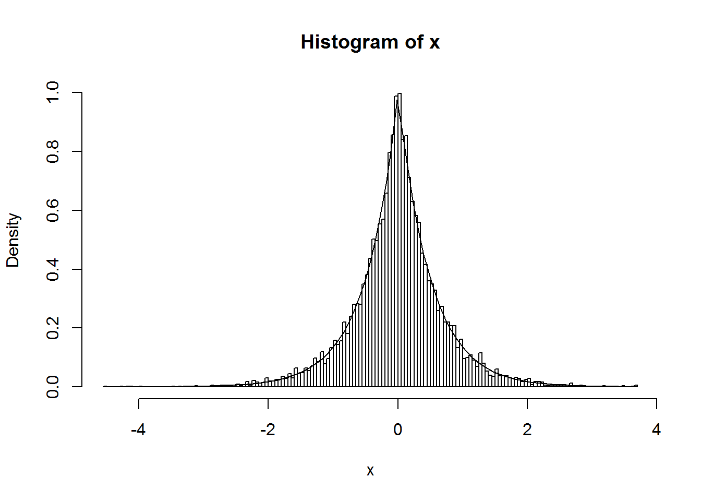
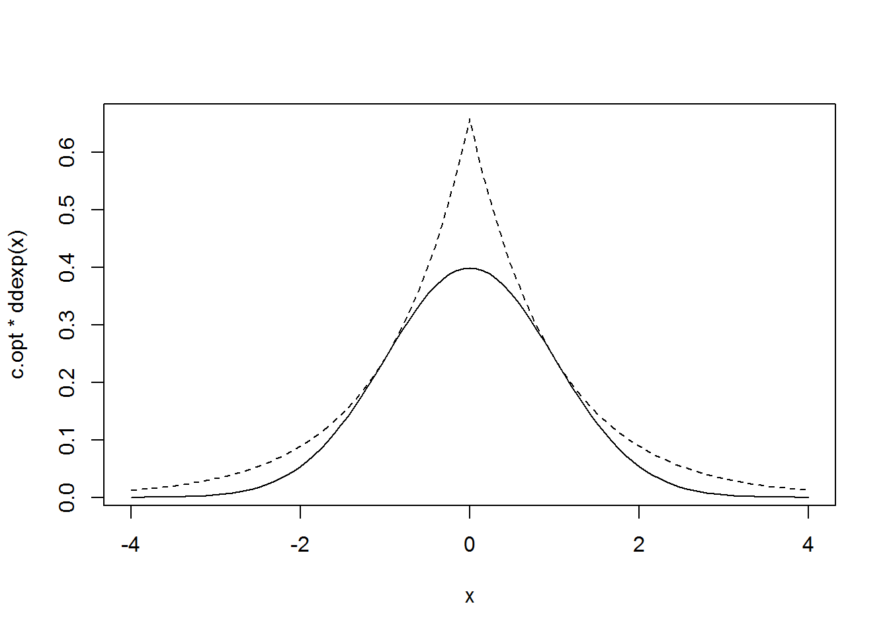
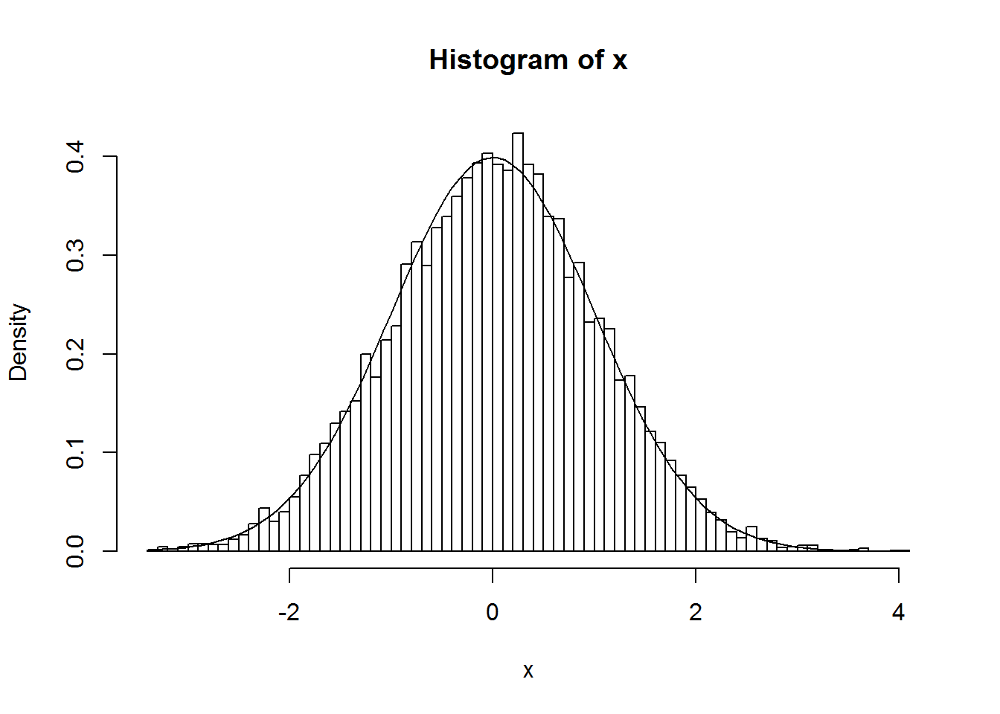
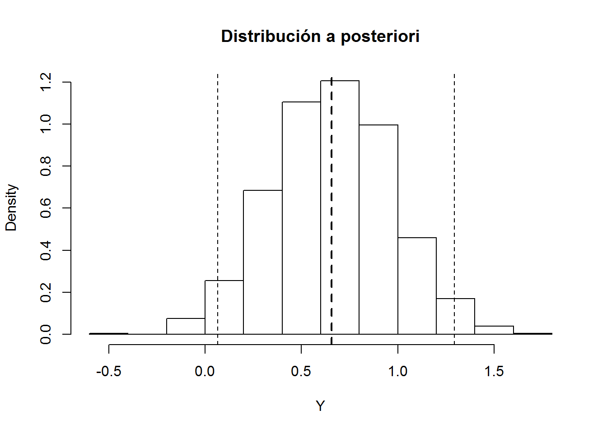

Simulación de variables continuas
=================================


***Pendiente: ejemplos y teoría***


Método de inversión
--------------------

\BeginKnitrBlock{exercise}<div class="exercise"><span class="exercise" id="exr:unnamed-chunk-1"><strong>(\#exr:unnamed-chunk-1) </strong></span></div>\EndKnitrBlock{exercise}
La distribución doble exponencial (o distribución de Laplace) de
parámetro $\lambda$ tiene función de densidad:
$$f\left(  x\right)  =\frac{\lambda}{2}e^{-\lambda\left\vert x\right\vert
}\text{, }x\in\mathbb{R}$$ 
y función de distribución:
$$F\left(  x\right)  =\int_{-\infty}^{x}f\left(  t\right)  dt=\left\{
\begin{array}{ll}
\frac{1}{2}e^{\lambda x} & x<0\\
1-\frac{1}{2}e^{-\lambda x} & x\geq0
\end{array}
\ \right.$$

a)  Escribir una función que permita generar, por el método de
    inversión, una muestra de $n$ observaciones de esta distribución
    (NOTA: esta distribución puede generarse fácilmente simulando
    una distribución exponencial y otorgarle un signo positivo o
    negativo con equiprobabilidad; ver método de composición).


```r
ddexp <- function(x, lambda = 1){
# Densidad doble exponencial
  lambda*exp(-lambda*abs(x))/2
}

rdexp <- function(lambda = 1){
# Simulación por inversión
# Doble exponencial
  U <- runif(1)
  if (U<0.5) {
    return(log(2*U)/lambda)
  } else {
    return(-log(2*(1-U))/lambda)
  }
}

rdexpn <- function(n = 1000, lambda = 1) {
# Simulación n valores de doble exponencial
    x <- numeric(n)
    for(i in 1:n) x[i]<-rdexp(lambda)
    return(x)
}
```


b)  Generar $10^{4}$ valores de la distribución doble exponencial de
    parámetro $\lambda=2$ y obtener el tiempo de CPU que tarda en
    generar la secuencia.


```r
set.seed(54321)
system.time(x <- rdexpn(10^4, 2))
```

```
##    user  system elapsed 
##    0.14    0.05    0.14
```


c)  Representar el histograma y compararlo con la densidad teórica.


```r
hist(x, breaks = "FD", freq = FALSE)
# lines(density(x), col = 'blue')
curve(ddexp(x, 2), add = TRUE)
```




Método de aceptación-rechazo
-----------------------------

\BeginKnitrBlock{exercise}<div class="exercise"><span class="exercise" id="exr:unnamed-chunk-5"><strong>(\#exr:unnamed-chunk-5) </strong></span></div>\EndKnitrBlock{exercise}
Desarrollar el código necesario para generar, por el método de
aceptación-rechazo, una muestra de $n$ observaciones de una
distribución normal estándar:
$$f\left(  x\right)  =\frac{1}{\sqrt{2\pi}}e^{-\frac{x^{2}}{2}}\text{, }x\in\mathbb{R}\text{, }$$
empleando como distribución auxiliar una doble exponencial. Puede
verse que la elección de la densidad auxiliar óptima se corresponde
con $\lambda=1$ y que la cota optima
es:$$c_{\text{opt}}=\sqrt{\frac{2e}{\pi}}\simeq1.\,3155.$$ Para
esteblecer la condición de aceptación o rechazo se puede tener en
cuenta que:
$$c\cdot U\cdot\frac{g\left(  T\right)  }{f\left(  T\right)  }=\sqrt{\frac
{2e}{\pi}}U\sqrt{\frac{\pi}{2}}\exp\left(  \frac{T^{2}}{2}-\left\vert
T\right\vert \right)  =U\cdot\exp\left(  \frac{T^{2}}{2}-\left\vert
T\right\vert +\frac{1}{2}\right)  ,$$
aunque en general puede ser recomendable emplear $c\cdot U\cdot g\left(  T\right) \leq f\left(  T\right)$.


```r
# densidad objetivo: dnorm
# densidad auxiliar: ddexp

# EJECUTAR CÓDIGO DEL APARTADO A DEL EJERCICIO 1
c.opt <- sqrt(2*exp(1)/pi)
lambda.opt <- 1
ngen <- 0

rnormAR <- function() {
# Simulación por aceptación-rechazo
# Normal estandar a partir de doble exponencial
  while (TRUE) {
    U <- runif(1)
    X <- rdexp(1)
    ngen <<- ngen+1 # Comentar esta línea para uso normal
    # if (U*exp((X^2+1)*0.5-abs(X)) <= 1) return(X)
    if (c.opt * U * ddexp(X, lambda.opt) <= dnorm(X)) return(X)
  }
}

rnormARn <- function(n=1000) {
# Simulación n valores N(0,1)
    x <- numeric(n)
    for(i in 1:n) x[i]<-rnormAR()
    return(x)
}

# Grafico
curve(c.opt * ddexp(x), xlim = c(-4, 4), lty = 2)
curve(dnorm(x), add = TRUE)
```




a)  Generar una muestra de $10^{4}$ observaciones empleando este
    algoritmo. Obtener el tiempo de CPU y calcular el número medio
    de generaciones de la distribución auxiliar.


```r
set.seed(54321)
nsim <- 10^4

ngen <- 0
system.time(x <- rnormARn(nsim))
```

```
##    user  system elapsed 
##    0.08    0.02    0.08
```

```r
# Nº generaciones
{
cat("\nNº de generaciones = ", ngen)
cat("\nNº medio de generaciones = ", ngen/nsim)
cat("\nProporción de rechazos = ", 1-nsim/ngen, "\n")
}
```

```
## 
## Nº de generaciones =  13163
## Nº medio de generaciones =  1.3163
## Proporción de rechazos =  0.2402948
```


b)  Representar el histograma y compararlo con la densidad teórica.


```r
hist(x, breaks="FD", freq=FALSE)
curve(dnorm(x), add=TRUE)
```




c)  Aproximar la cota óptima numéricamente.


```r
# Obtención de un valor c óptimo aproximado
optimize(f=function(x){dnorm(x)/ddexp(x)}, maximum=TRUE, interval=c(-1,1))
```

```
## $maximum
## [1] -0.999959
## 
## $objective
## [1] 1.315489
```

```r
# NOTA: Cuidado con los límites
# optimize(f=function(x){dnorm(x)/ddexp(x)}, maximum=TRUE, interval=c(0,2))

# Valor óptimo real
# sqrt(2*exp(1)/pi)
c.opt
```

```
## [1] 1.315489
```


d)  Aproximar el parámetro óptimo de la densidad auxiliar
    numéricamente (normalmente comenzaríamos por este paso).


```r
# Obtención de valores c y lambda óptimos aproximados
fopt <- function(lambda) {
  # Obtiene c fijado lambda
  optimize(f = function(x){dnorm(x)/ddexp(x,lambda)},
           maximum=TRUE, interval=c(0,2))$objective
}

# Encontar lambda que minimiza
res <- optimize(f=function(x){fopt(x)}, interval=c(0.5,2))
lambda.opt2 <- res$minimum
c.opt2 <- res$objective
```


\BeginKnitrBlock{exercise}<div class="exercise"><span class="exercise" id="exr:unnamed-chunk-11"><strong>(\#exr:unnamed-chunk-11) </strong></span></div>\EndKnitrBlock{exercise}
Para la estimación Bayes de la media de una normal se suele utilizar
como distribución a priori una Cauchy.

a)  Generar una muestra i.i.d. $X_{i}\sim N(\theta_{0},1)$ de tamaño
    $n=10$ con $\theta_{0}=1$. Utilizar una $Cauchy(0,1)$
    (`rcauchy`) como distribución a priori y como densidad auxiliar
    para simular por aceptación-rechazo una muestra de la densidad a
    posteriori (emplear `dnorm` para construir la verosimilitud).
    Obtener el intervalo de probabilidad al 95%.


```r
mu0 <- 1
n <- 10
nsim <- 10^3
set.seed(54321)
x <- rnorm(n, mean = mu0)

# Función de verosimilitud
lik <- function(mu){prod(dnorm(x, mean = mu))}

# Cota óptima
# Estimación por máxima verosimilitud
emv <- optimize(f = lik, int = range(x), maximum = TRUE)
emv
```

```
## $maximum
## [1] 0.7353805
## 
## $objective
## [1] 3.303574e-08
```

```r
c <- emv$objective

mean(x)
```

```
## [1] 0.7353958
```

```r
c <- lik(mean(x))
c
```

```
## [1] 3.303574e-08
```

```r
# Simulación distribución a posteriori
# Simulación por aceptación-rechazo a partir de Cauchy(0,1)
ngen <- nsim
Y <- rcauchy(nsim)
ind <- (c*runif(nsim) > sapply(Y, lik)) # TRUE si no verifica condición
# Volver a generar si no verifica condición
while (sum(ind)>0){
  le <- sum(ind)
  ngen <- ngen + le
  Y[ind] <- rcauchy(le)
  ind[ind] <- (c*runif(le) > sapply(Y[ind], lik)) # TRUE si no verifica condición
}


{ # Nº generaciones
  cat("\nNº de generaciones = ", ngen)
  cat("\nNº medio de generaciones = ", ngen/nsim)
  cat("\nProporción de rechazos = ", 1-nsim/ngen,"\n")
}
```

```
## 
## Nº de generaciones =  5898
## Nº medio de generaciones =  5.898
## Proporción de rechazos =  0.830451
```

```r
# Intervalo de probabilidad al 95% (IC Bayes)
q <- quantile(Y, c(0.025, 0.975))

# Representar estimador e IC Bayes
hist(Y, freq=FALSE, main="Distribución a posteriori")
# abline(v = mean(x), lty = 3) # Estimación frecuentista
abline(v = mean(Y), lty = 2, lwd = 2)  # Estimación Bayesiana
abline(v = q, lty = 2)
```




b)  Repetir el apartado anterior con $n=100$.


Ejercicios
----------

\BeginKnitrBlock{exercise}<div class="exercise"><span class="exercise" id="exr:unnamed-chunk-13"><strong>(\#exr:unnamed-chunk-13) </strong></span>para entregar</div>\EndKnitrBlock{exercise}
Escribir el código necesario para generar, por el método de
inversión, una muestra de $n$ observaciones de una distribución
de Cauchy.

a)  Generar una muestra de $10^{4}$ observaciones y obtener el
    tiempo de CPU.

b)  Representar el histograma (limitar el rango, e.g.
    `xlim = c(-10, 10)`) y compararlo con la densidad teórica
    (`dcauchy`).

c)  Obtener conclusiones sobre la existencia de una media teórica a
    partir de la media muestral aproximada por simulación (estudiar
    la convergencia de la media muestral). Suponiendo que el vector
    `x` contiene las simulaciones, estudiar la convergencia de la
    media muestral mediante el
    gráfico:`plot(1:nsim, cumsum(x)/(1:nsim), type="l", ylab="Media muestral",
    xlab="Nº de simulaciones")`


\BeginKnitrBlock{exercise}<div class="exercise"><span class="exercise" id="exr:unnamed-chunk-14"><strong>(\#exr:unnamed-chunk-14) </strong></span>para entregar</div>\EndKnitrBlock{exercise}
El tiempo de respuesta (en centésimas de segundo) de un servidor de
bases de datos es una variable con función de
densidad:$$f(x)=xe^{-x}\text{ si }x\geq0.$$ Escribir el código
necesario para generar, por el método de aceptación-rechazo, una
muestra de $n$ observaciones de esta distribución empleando como
densidad auxiliar una
exponencial:$$g(x)=\lambda e^{-\lambda x}\text{ si }x\geq0.$$

a)  Aproximar numéricamente el parámetro óptimo ($\lambda_{opt}<1$)
    y la cota óptima ($c_{opt}$) de la densidad auxiliar y
    compararlos con los valores teóricos: $\lambda_{opt}=1/2$ y
    $c_{opt}=4/e$.

b)  Generar una muestra de 1000 observaciones de la distribución de
    interés (tomando como semilla inicial el nº de grupo multiplicado
    por 100). Obtener el tiempo de CPU que tarda en generar la
    secuencia y calcular el número medio de generaciones de la
    distribución auxiliar.

c)  Representar el histograma y compararlo con la densidad teórica.


## Métodos específicos para generación de distribuciones notables

***Pendiente: algunos ejemplos del libro de Ricardo 
y de las funciones implementadas en R*** 
