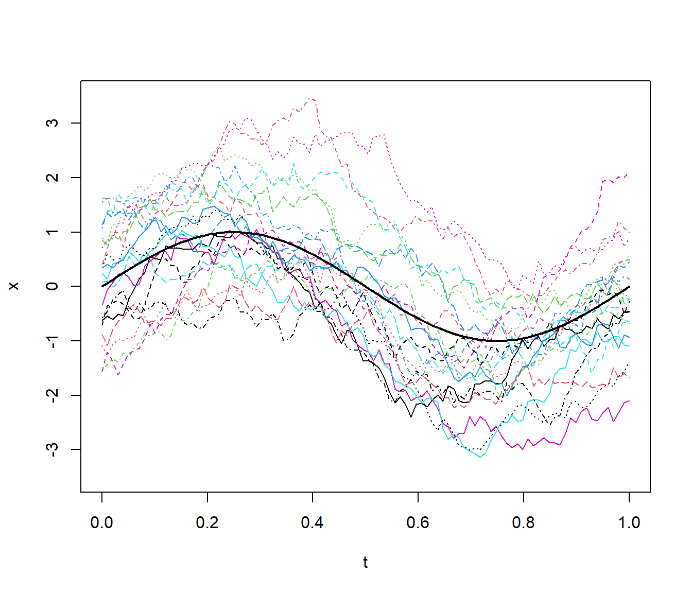
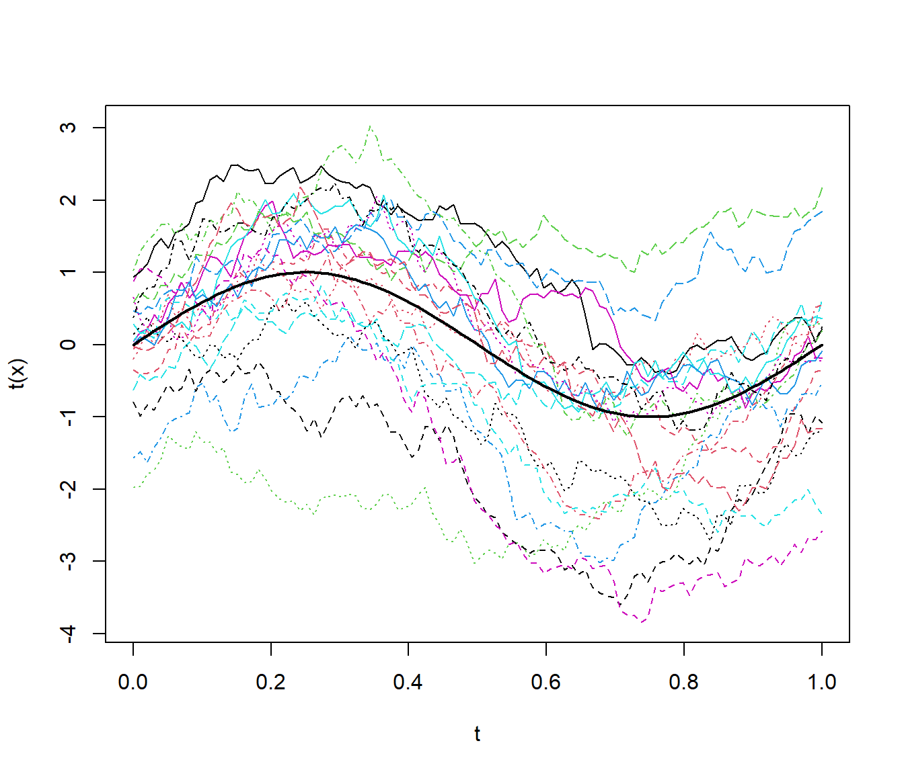

Simulación de distribuciones multivariantes
===========================================

<!-- 
bookdown::preview_chapter("07-Simulacion_multidimensional.Rmd") 
-->


La simulación de vectores aleatorios $\mathbf{X} =\left( X_1,X_2,\ldots,X_d\right)$ que sigan cierta distribución dada no es tarea siempre sencilla. 
En general, no resulta una extensión inmediata del caso unidimensional, 
aúnque muchos de los algoritmos descritos en los temas anteriores (como el de aceptación-rechazo o el de composición) son válidos para distribuciones multivariantes.
En este caso sin embargo, puede ser mucho más dificil cumplir los requerimientos (e.g. encontrar una densidad auxiliar adecuada) y los algoritmos obtenidos pueden ser computacionalmente poco eficientes (especialmente si el número de dimensiones es grande).

En las primeras secciones de este capítulo supondremos que se pretende simular una variable aleatoria multidimensional continua $\mathbf{X}$ con función de densidad conjunta $f\left( x_1, x_2, \ldots , x_d\right)$ (aunque muchos resultados serán válidos para variables discretas multidimensionales, simplemente cambiando funciones de densidad por las correspondientes de masa de probabilidad).
En la Sección \@ref(mult-discr) se tratará brevemente la simulación de vectores aleatorios discretos y de tablas de contingencia, centrándose en el caso bidimensional.

Simulación de componentes independientes
----------------------------------------

Si las componentes son independientes y $f_i$ son las correspondientes densidades marginales, bastará con generar $X_i \sim f_i$.
Las dificultades aparecerán cuando se quiera simular componentes con una determinada estructura de dependencia.

\BeginKnitrBlock{example}\iffalse{-91-115-105-109-117-108-97-99-105-243-110-32-100-101-32-110-111-114-109-97-108-101-115-32-105-110-100-101-112-101-110-100-105-101-110-116-101-115-93-}\fi{}<div class="example"><span class="example" id="exm:normind"><strong>(\#exm:normind)  \iffalse (simulación de normales independientes) \fi{} </strong></span></div>\EndKnitrBlock{example}

Si $\boldsymbol\mu =\left( \mu_1,\mu_2,\ldots,\mu_d\right)^t$ es un vector (de medias) y
$\Sigma$ es una matriz $d \times d$ definida positiva (de varianzas-covarianzas), el vector aleatorio $\mathbf{X}$ sigue una distribución normal multivariante con esos parámetros, 
$\mathbf{X} \sim \mathcal{N}_d\left( \boldsymbol\mu,\Sigma \right)$, 
si su función de densidad es de la forma:
$$f(\mathbf x) = \frac{1}{(2\pi)^{n/2}|\Sigma|^{1/2}}
\exp \left( -\frac{1}{2} ( \mathbf x - \boldsymbol \mu)^t \Sigma^{-1} (\mathbf x - \boldsymbol \mu)
\right),$$
donde $| \Sigma |$ es el determinante de $\Sigma$.

Si la matriz de covarianzas es diagonal $\Sigma=diag\left( \sigma_1^2,\sigma_2^2,\ldots,\sigma_d^2\right)$,
entonces las componentes $X_i \sim \mathcal{N}\left( \mu_i,\sigma_i^2\right)$
son independientes y podemos simular el vector aleatorio de forma trivial, por ejemplo mediante el siguiente algoritmo:

\BeginKnitrBlock{conjecture}\iffalse{-91-100-101-32-115-105-109-117-108-97-99-105-243-110-32-100-101-32-110-111-114-109-97-108-101-115-32-105-110-100-101-112-101-110-100-105-101-110-116-101-115-93-}\fi{}<div class="conjecture"><span class="conjecture" id="cnj:unnamed-chunk-2"><strong>(\#cnj:unnamed-chunk-2)  \iffalse (de simulación de normales independientes) \fi{} </strong></span>
<br> 

1.  Simular $Z_1, Z_2, \ldots, Z_d \sim \mathcal{N} \left( 0, 1 \right)$ independientes.

2.  Para $i = 1, 2, \ldots, d$ hacer $X_i = \mu_i + \sigma_i Z_i$.
</div>\EndKnitrBlock{conjecture}

<br>

Las funciones implementadas en el paquete base de `R` permiten simular fácilmente en el caso independiente ya que admiten vectores como parámetros. 
Por ejemplo en el caso bidimensional con $X_1 \sim \mathcal{N}\left( 0, 1\right)$ y $X_2 \sim \mathcal{N}\left( -1, 0.5^2 \right)$:

(ref:normind-plot) Densidades marginales de las componentes del Ejemplo \@ref(exm:normind). 


```r
f1 <- function(x) dnorm(x)
f2 <- function(x) dnorm(x, -1, 0.5)
curve(f1, -3, 3, ylim = c(0, f2(-1)), ylab = "fdp")
curve(f2, add = TRUE, lty = 2)
```

<div class="figure" style="text-align: center">

<p class="caption">(\#fig:normind-plot)(ref:normind-plot)</p>
</div>
Para simular una generación bastaría con:

```r
set.seed(1)
rnorm(2, c(0, -1), c(1, 0.5))
```

```
## [1] -0.6264538 -0.9081783
```
y para simular `nsim`:

```r
set.seed(1)
nsim <- 5
rx <- matrix(rnorm(2*nsim, c(0, -1), c(1, 0.5)), nrow = nsim, byrow = TRUE)
colnames(rx) <- paste0("X", 1:ncol(rx))
rx
```

```
##              X1         X2
## [1,] -0.6264538 -0.9081783
## [2,] -0.8356286 -0.2023596
## [3,]  0.3295078 -1.4102342
## [4,]  0.4874291 -0.6308376
## [5,]  0.5757814 -1.1526942
```


El método de aceptación/rechazo
-------------------------------

El algoritmo de aceptación-rechazo es el mismo que el del caso univariante descrito en la Sección \@ref(AR), la única diferencia es que las densidades son multidimensionales.
Supongamos que la densidad objetivo $f$ y la densidad
auxiliar $g$ verifican:
$$f\left( x_1,x_2,\ldots,x_d\right) \leq c\cdot g\left( x_1,x_2,\ldots,x_d\right) 
\text{, }\forall \mathbf{x} = \left( x_1,x_2,\ldots,x_d\right)\in \mathbb{R}^d\text{.}$$
para una constante $c>0$. 
El algoritmo sería:

1. Generar $U\sim \mathcal{U}\left( 0,1\right)$.

2. Generar $\mathbf{T} = \left( T_1,T_2,\ldots,T_d\right) \sim g$.

3.  Si $c\cdot U\cdot g\left( T_1,T_2,\ldots,T_d\right) \leq f\left( T_1,T_2,\ldots,T_d\right)$
    devolver $\mathbf{X}=\mathbf{T}$.

    En caso contrario volver al paso 1.


Por ejemplo, de forma análoga al caso unidimensional, en el caso de una densidad
acotada en un hipercubo (intervalo cerrado multidimensional) siempre podríamos considerar
una uniforme como densidad auxiliar. 

\BeginKnitrBlock{example}\iffalse{-91-100-105-115-116-114-105-98-117-99-105-243-110-32-98-105-100-105-109-101-110-115-105-111-110-97-108-32-97-99-111-116-97-100-97-93-}\fi{}<div class="example"><span class="example" id="exm:unnamed-chunk-5"><strong>(\#exm:unnamed-chunk-5)  \iffalse (distribución bidimensional acotada) \fi{} </strong></span></div>\EndKnitrBlock{example}

Supongamos que estamos interesados en generar valores de una variable aleatoria bidimensional
$\left( X,Y\right)$ con función de densidad: 
$$f(x,y)=\left\{ 
\begin{array}{cl}
\frac{3}{16}\left( 2-\left( x^2+y^2\right) \right)  & \text{si }x\in
\lbrack -1,1]\text{ e }y\in \lbrack -1,1] \\ 
0 & \text{en otro caso}
\end{array}
\right.$$

Podríamos considerar como densidad auxilar la uniforme en $\left[  -1,1\right]  \times\left[
-1,1\right]$:

$$g\left( x, y \right)  =\left\{
\begin{array}{ll}
\frac{1}{4} & \text{si } x, y\in\left[  -1,1\right]\\
0 &  \text{en otro caso}
\end{array}\right.$$ 

Como $f(x, y) \leq M = f(0,0) = \frac38$, tomando $c=\frac{M}{g(x,y)} = \frac32$ 
tendríamos que $f(x,y) \leq cg(x,y) = M$ y el algoritmo sería:

1.  Generar $U \sim \mathcal{U}\left( 0, 1\right)$.

2.  Generar $T_1, T_2  \sim \mathcal{U}\left( -1, 1 \right)$.

3.  Si $M \cdot U\leq f\left( T_1, T_2 \right)$
    devolver $\mathbf{X} = \left( T_1, T_2 \right)$.

4.  En caso contrario volver al paso 1.

En este caso, la condición de aceptación del paso 3 simplificada sería:
$U \leq 1 - \left( T_1^2 + T_2^2 \right) / 2$.


\BeginKnitrBlock{example}\iffalse{-91-100-105-115-116-114-105-98-117-99-105-243-110-32-117-110-105-102-111-114-109-101-32-101-110-32-108-97-32-101-115-102-101-114-97-93-}\fi{}<div class="example"><span class="example" id="exm:unnamed-chunk-6"><strong>(\#exm:unnamed-chunk-6)  \iffalse (distribución uniforme en la esfera) \fi{} </strong></span></div>\EndKnitrBlock{example}

Supongamos que el objetivo es simular puntos uniformemente distribuídos sobre la “esfera”
unitaria $d$-dimensional:
$$C_d=\left\{  \left( x_1, x_2, \ldots, x_d \right) 
: x_1^2 + x_2^2 + \cdots + x_d^2 \leq1 \right\}.$$

Denotando por $V_d\left( 1\right)$, el “volumen” (la medida) de la
esfera $d$-dimensional de radio $1$ (en general, la de radio $r$
verifica $V_d\left( r\right)  =r^{d}V_d\left( 1\right)$), se tiene: 
$$f\left( x_1,x_2,\ldots,x_d\right)  =\left\{
\begin{array}{ll}
\frac{1}{V_d\left( 1\right)  } & \text{si } \left( x_1, x_2, \ldots
,x_d\right)  \in C_d\\
0 & \text{si } \left( x_1,x_2,\ldots,x_d\right)  \notin C_d
\end{array} \right.$$ 

Para simular valores en $\mathbb{R}^{d}$, con densidad $f$,
podemos utilizar como distribución auxiliar una
$\mathcal{U}\left( \left[  -1,1\right]  \times\left[
-1,1\right]  \times\overset{\text{d}}{\cdots}\times\left[  -1,1\right]
\right)  = \mathcal{U}\left( \left[  -1,1\right]^{d}\right)$, dada por:
$$g\left( x_1,x_2,\ldots,x_d\right)  =\left\{
\begin{array}{ll}
\frac{1}{2^{d}} & \text{si } x_i\in\left[  -1,1\right], \text{ para todo }
i=1,2,\ldots,d\\
0 &  \text{en otro caso}
\end{array}\right.$$ 

La constante $c$ óptima para la utilización del método de
aceptación/rechazo es:
$$c=\max_{\{\mathbf{x}:g\left( \mathbf{x}\right) > 0\}}
\frac{f\left( \mathbf{x}\right)  }{g\left( \mathbf{x}\right)  }
=\frac{\frac{1}{V_d\left( 1\right)  }}{\frac{1}{2^{d}}}
=\frac{2^{d}}{V_d\left( 1\right)}$$
y la condición de aceptación $cUg\left( \mathbf{T}\right)
\leq f\left( \mathbf{T}\right)$  se convierte en:
$$\frac{2^{d}}{V_d\left( 1\right)  }U\frac{1}{2^{d}}1_{\left[  -1,1\right]
^{d}}\left( \mathbf{T}\right)  \leq\frac{1}{V_d\left( 1\right)
}1_{C_d}\left( \mathbf{T}\right),$$ 
o, lo que es lo mismo, $U1_{\left[  -1,1\right]^{d}}\left( \mathbf
{T}\right)  \leq1_{C_d}\left( \mathbf{T}\right)$. 
Dado que el número aleatorio $U$ está en el intervalo $(0,1)$ y que las funciones
indicadoras valen $0$ ó $1$, esta condición equivale a que $1_{\left[
-1,1\right]  ^{d}}\left( \mathbf{T}\right)  =1_{C_d}\left(
\mathbf{T}\right)$, es decir, a que
$\mathbf{T}\in C_d$, es decir, que se verifique:
$$T_1^2+T_2^2+\cdots+T_d^2\leq1.$$

Por otra parte, la simulación de $T \sim \mathcal{U}\left( \left[  -1,1\right]
^{d}\right)$  puede hacerse trivialmente mediante
$T_i \sim \mathcal{U}\left( -1, 1 \right)$ 
para cada $i=1,2,\ldots,d$, ya que las
componentes son independientes. Como el valor de $U$ es superfluo en
este caso, el algoritmo queda:

1. Simular $V_1,V_2,\ldots,V_d \sim  \mathcal{U}\left(
0,1\right)$  independientes.

2. Para $i = 1, 2, \ldots, d$ hacer $T_i = 2V_i - 1$.

3. Si $T_1^2 + T_2^2 + \cdots + T_d^2 > 1$ entonces volver al paso 1.

4. Devolver $\mathbf{X} = \left( T_1, T_2, \ldots, T_d \right)^t$.

Ver el Ejercicio \@ref(exr:simpi) para el caso de $d=2$.

Usando las fórmulas del “volumen” de una “esfera” $d$-dimensional:
$$V_d\left( r\right)  =\left\{
\begin{array}{ll}
\dfrac{\pi^{d/2}r^{d}}{\left( d/2\right)  !} & \text{si } d \text{ es par}\\
\dfrac{2^{\left\lfloor \frac{d}{2}\right\rfloor +1}\pi^{\left\lfloor \frac{d}{2}\right\rfloor }r^{d}}{1\cdot3\cdot5\cdots d} & \text{si } d \text{ es impar}
\end{array}\right.$$ 
puede verse que el número medio de iteraciones del algoritmo, dado por la constante
$c=\frac{2^{d}}{V_d\left(1 \right)}$, puede llegar a ser enórmemente grande. 
Así, si $d=2$ se tiene $c=1.27$, si $d=3$ se tiene $c=1.91$, si $d=4$ entonces $c=3.24$ y para
$d=10$ resulta $c=401.5$ que es un valor que hace que el algoritmo sea
tremendamente lento en dimensión $10$.
Esto está relacionado con la *maldición de la dimensionalidad* (curse of dimensionality), a medida que aumenta el número de dimensiones el volumen de la "frontera" crece exponencialmente.


Factorización de la matriz de covarianzas {#fact-cov}
-----------------------------------------

Teniendo en cuenta que si $Cov(\mathbf{X})= I$, entonces:
$$Cov(A\mathbf{X}) = AA^t.$$ 
La idea de este tipo de métodos es simular datos independientes y transformarlos linealmente de modo que el resultado tenga la covarianza deseada $\Sigma = AA^t$.

Este método se emplea principalmente para la simulación de una
normal multivariante, aunque también es válido para muchas otras
distribuciónes como la $t$-multivariante.

En el caso de normalidad, el resultado general es el siguiente.

\BeginKnitrBlock{proposition}<div class="proposition"><span class="proposition" id="prp:unnamed-chunk-7"><strong>(\#prp:unnamed-chunk-7) </strong></span><br>
Si $\mathbf{X} \sim \mathcal{N}_d\left( \boldsymbol\mu,\Sigma \right)$ y $A$ es una matriz $p\times d$, de
rango máximo, con $p\leq d$, entonces:
$$A\mathbf{X} \sim \mathcal{N}_{p}\left(A\boldsymbol\mu,A\Sigma A^t\right).$$</div>\EndKnitrBlock{proposition}

Partiendo de $\mathbf{Z} \sim \mathcal{N}_d\left( \mathbf{0},I_d\right)$,
se podrían considerar distrintas factorizaciones de la 
matriz de covarianzas:

* Factorización espectral: 
  $\Sigma=H\Lambda H^t =H\Lambda^{1/2}(H\Lambda^{1/2})^t$,
  donde $H$ es una matriz ortogonal (i.e. $H^{-1}=H^{t}$), cuyas columnas son los autovectores de la matriz $\Sigma$, y $\Lambda$ es una matriz diagonal, cuya diagonal esta formada por los correspondientes autovalores (positivos). De donde se deduce que:
  $$\mathbf{Y} =\boldsymbol\mu + H\Lambda^{1/2}\mathbf{Z} 
  \sim \mathcal{N}_d\left( \boldsymbol\mu,\Sigma \right).$$

* Factorización de Cholesky: $\Sigma=LL^t$, donde $L$ es una matriz triangular inferior (fácilmente invertible), por lo que: 
  $$\mathbf{Y} =\boldsymbol\mu + L\mathbf{Z} 
  \sim \mathcal{N}_d\left( \boldsymbol\mu,\Sigma \right).$$

Desde el punto de vista de la eficiencia computacional la factorización de Cholesky
sería la preferible. Pero en ocasiones, para evitar problemas numéricos
(por ejemplo, en el caso de matrices no definidas positivas) 
puede ser más adecuado emplear la factorización espectral.
En el primer caso el algoritmo sería el siguiente:

\BeginKnitrBlock{conjecture}\iffalse{-91-100-101-32-115-105-109-117-108-97-99-105-243-110-32-100-101-32-117-110-97-32-110-111-114-109-97-108-32-109-117-108-116-105-118-97-114-105-97-110-116-101-93-}\fi{}<div class="conjecture"><span class="conjecture" id="cnj:unnamed-chunk-8"><strong>(\#cnj:unnamed-chunk-8)  \iffalse (de simulación de una normal multivariante) \fi{} </strong></span>
<br> 

1.  Obtener la factorización de Cholesky $\Sigma=LL^t$.

2.  Simular $\mathbf{Z} =\left( Z_1,Z_2,\ldots,Z_d\right)$
    i.i.d. $\mathcal{N}\left( 0,1\right)$.

3.  Hacer $\mathbf{X} = \boldsymbol\mu + L\mathbf{Z}$.

4.  Repetir los pasos 2 y 3 las veces necesarias.
</div>\EndKnitrBlock{conjecture}
<br>
**Nota**: Hay que tener en cuenta el resultado del algoritmo empleado
para la factorización de Cholesky. Por ejemplo si se obtiene $\Sigma=U^tU$,
hará que emplear $L=U^t.$

\BeginKnitrBlock{example}\iffalse{-91-115-105-109-117-108-97-99-105-243-110-32-100-101-32-100-97-116-111-115-32-102-117-110-99-105-111-110-97-108-101-115-32-111-32-116-101-109-112-111-114-97-108-101-115-93-}\fi{}<div class="example"><span class="example" id="exm:funcional"><strong>(\#exm:funcional)  \iffalse (simulación de datos funcionales o temporales) \fi{} </strong></span></div>\EndKnitrBlock{example}

Supongamos que el objetivo es generar una muestra de tamaño `nsim` de la variable funcional:
$$Y(x)=\sin\left(  2\pi x\right)  +\varepsilon\left(  x\right)$$
con $0\leq x\leq1$ y $Cov(\varepsilon\left( x \right) ,
\varepsilon\left( y \right) ) = e^{-\left\Vert x-y \right\Vert }$, 
considerando 100 puntos de discretización (se puede pensar también que es un proceso temporal).


```r
nsim <- 20
n <- 100
x <- seq(0, 1, length = n)
# Media
mu <- sin(2*pi*x)
# Covarianzas
x.dist <- as.matrix(dist(x))
x.cov <- exp(-x.dist)
```
Para la factorización de la matriz de covarianzas emplearemos la función `chol`
del paquete base de R (si las dimensiones fueran muy grandes podría ser preferible emplear
otros paquetes, e.g. `spam::chol.spam`), pero al devolver la matriz triangular superior
habrá que transponer el resultado:

```r
U <- chol(x.cov)
L <- t(U)
```
Si queremos simular una realización:

```r
set.seed(1)
head(mu + L %*% rnorm(n))
```

```
##         [,1]
## 1 -0.6264538
## 2 -0.5307633
## 3 -0.5797968
## 4 -0.2844357
## 5 -0.1711797
## 6 -0.2220796
```
y para simular `nsim`:

(ref:funcional) Realizaciones del proceso funcional del Ejemplo \@ref(exm:funcional), obtenidas a partir de la factorización de Cholesky.


```r
z <- matrix(rnorm(nsim * n), nrow = n)
y <- mu + L %*% z

matplot(x, y, type = "l", ylim = c(-3.5, 3.5))
lines(x, mu, lwd = 2)
```

<div class="figure" style="text-align: center">

<p class="caption">(\#fig:funcional-plot)(ref:funcional)</p>
</div>

Alternativamente se podría emplear, por ejemplo, la funcion `mvrnorm`
del paquete `MASS` que emplea la factorización espectral (`eigen`):

(ref:funcional2) Realizaciones del proceso funcional del Ejemplo \@ref(exm:funcional), obtenidas empleando la función `MASS::mvrnorm`.


```r
library(MASS)
mvrnorm
```

```
## function (n = 1, mu, Sigma, tol = 1e-06, empirical = FALSE, EISPACK = FALSE) 
## {
##     p <- length(mu)
##     if (!all(dim(Sigma) == c(p, p))) 
##         stop("incompatible arguments")
##     if (EISPACK) 
##         stop("'EISPACK' is no longer supported by R", domain = NA)
##     eS <- eigen(Sigma, symmetric = TRUE)
##     ev <- eS$values
##     if (!all(ev >= -tol * abs(ev[1L]))) 
##         stop("'Sigma' is not positive definite")
##     X <- matrix(rnorm(p * n), n)
##     if (empirical) {
##         X <- scale(X, TRUE, FALSE)
##         X <- X %*% svd(X, nu = 0)$v
##         X <- scale(X, FALSE, TRUE)
##     }
##     X <- drop(mu) + eS$vectors %*% diag(sqrt(pmax(ev, 0)), p) %*% 
##         t(X)
##     nm <- names(mu)
##     if (is.null(nm) && !is.null(dn <- dimnames(Sigma))) 
##         nm <- dn[[1L]]
##     dimnames(X) <- list(nm, NULL)
##     if (n == 1) 
##         drop(X)
##     else t(X)
## }
## <bytecode: 0x0000000018228340>
## <environment: namespace:MASS>
```

```r
y <- mvrnorm(nsim, mu, x.cov)

matplot(x, t(y), type = "l")
lines(x, mu, lwd = 2)
```

<div class="figure" style="text-align: center">

<p class="caption">(\#fig:funcional-plot2)(ref:funcional2)</p>
</div>

Otros métodos para variables continuas relacionados con la factorización de la matriz de covarianzas son el método FFT (transformada rápida de Fourier; e.g. Davies y Harte, 1987) o el *Circular embedding* (Dietrich and Newsam, 1997), que realmente son el mismo.


Método de las distribuciones condicionadas {#distrcond}
------------------------------------------

Teniendo en cuenta que:
$$f\left( x_1,x_2,\ldots,x_d\right)  =f_1\left( x_1\right)  \cdot
f_2\left( x_2|x_1\right)  \cdots f_d\left( x_d|x_1,x_2,\ldots,x_{d-1}\right),$$
donde las densidades condicionales pueden obtenerse a partir de las
correspondientes marginales:
$$f_i\left( x_i|x_1,x_2,\ldots,x_{i-1}\right)  =\frac{f_{1,\ldots
,i}\left( x_1,x_2,\ldots,x_i\right)  }{f_{1,\ldots,i-1}\left(
x_1,x_2,\ldots,x_{i-1}\right)},$$

se obtiene el siguiente algoritmo general:

\BeginKnitrBlock{conjecture}\iffalse{-91-100-101-32-115-105-109-117-108-97-99-105-243-110-32-109-101-100-105-97-110-116-101-32-100-105-115-116-114-105-98-117-99-105-111-110-101-115-32-99-111-110-100-105-99-105-111-110-97-100-97-115-93-}\fi{}<div class="conjecture"><span class="conjecture" id="cnj:unnamed-chunk-12"><strong>(\#cnj:unnamed-chunk-12)  \iffalse (de simulación mediante distribuciones condicionadas) \fi{} </strong></span>
<br> 

1.  Generar $X_1 \sim f_1$.

2.  Desde $i=2$ hasta $d$ generar 
    $X_i \sim f_i\left( \cdot|X_1,X_2,\ldots,X_{i-1}\right)$.

3.  Devolver $\mathbf{X} =\left( X_1,X_2,\ldots,X_d\right)$.
</div>\EndKnitrBlock{conjecture}

<br>
**Nota**: En las simulaciones unidimensionales se puede tener en cuenta que
$f_i\left( x_i|x_1,x_2,\ldots,x_{i-1}\right) 
\propto f_{1,\ldots,i}\left( x_1,x_2,\ldots,x_i\right)$.

\BeginKnitrBlock{example}\iffalse{-91-100-105-115-116-114-105-98-117-99-105-243-110-32-117-110-105-102-111-114-109-101-32-101-110-32-101-108-32-99-237-114-99-117-108-111-32-117-110-105-116-97-114-105-111-93-}\fi{}<div class="example"><span class="example" id="exm:unnamed-chunk-13"><strong>(\#exm:unnamed-chunk-13)  \iffalse (distribución uniforme en el círculo unitario) \fi{} </strong></span></div>\EndKnitrBlock{example}

Se trata de la distribución bidimensional continua con densidad 
constante en el círculo:
$$C = \left\{ \left( x_1, x_2 \right)  \in \mathbb{R} : x_1^2 + x_2^2 \leq 1 \right\}.$$

Su función de densidad viene dada por:
$$f\left( x_1,x_2\right)  =\left\{
\begin{array}{ll}
\frac{1}{\pi} & \text{si } \left( x_1,x_2\right)  \in C\\
0 & \text{si } \left( x_1,x_2\right)  \notin C
\end{array}\right.$$ 

La densidad marginal de la primera variable resulta:
$$f_1\left( x_1\right)  =\int_{-\sqrt{1-x_1^2}}^{+\sqrt{1-x_1^2}}\frac{1}{\pi}dx_2
=\frac{2\sqrt{1-x_1^2}}{\pi}
\text{ si }x_1\in\left[-1,1\right],$$ 
es decir: 
$$f_1\left( x_1\right)  =\left\{
\begin{array}{ll}
\frac{2}{\pi}\sqrt{1-x_1^2} & \text{si } x_1\in\left[  -1,1\right]  \\
0 & \text{si } x_1\notin\left[ -1,1\right]  
\end{array}\right.$$ 

Además:
$$f_2\left( x_2|x_1\right) = \frac{f\left( x_1,x_2\right)  }{f_1\left( x_1\right)} = \frac{\frac{1}{\pi}}{\frac{2\sqrt{1-x_1^2}}{\pi}}=\frac{1}{2\sqrt{1-x_1^2}}\text{, si }x_2\in\left[
-\sqrt{1-x_1^2},\sqrt{1-x_1^2}\right]$$ 
valiendo cero en otro caso. 
Se tiene entonces que:
$$X_2|X_1 \sim \mathcal{U}\left(  -\sqrt{1-X_1^2},\sqrt{1-X_1^2}\right),$$
siempre que $X_1\in\left[  -1,1\right]$.

Finalmente, el algoritmo resulta:

1. Simular $X_1$ con densidad $f_1\left(
x_1\right)  =\frac{2}{\pi}\sqrt{1-x_1^2}1_{\{|x_1|\leq1\}}$.

2. Simular $X_2$ con densidad $\mathcal{U}\left(
-\sqrt{1-X_1^2},\sqrt{1-X_1^2}\right)$.

3. Devolver $\mathbf{X}=\left( X_1,X_2\right)
^t$.

Para el paso 1 puede utilizarse, por ejemplo, el método de
aceptación/rechazo, pues se trata de una densidad acotada definida en un
intervalo acotado.

\BeginKnitrBlock{example}\iffalse{-91-100-105-115-116-114-105-98-117-99-105-243-110-32-110-111-114-109-97-108-32-98-105-100-105-109-101-110-115-105-111-110-97-108-93-}\fi{}<div class="example"><span class="example" id="exm:unnamed-chunk-14"><strong>(\#exm:unnamed-chunk-14)  \iffalse (distribución normal bidimensional) \fi{} </strong></span></div>\EndKnitrBlock{example}

En el caso de una distribución normal bidimensional:
$$\mathbf{X} = \begin{pmatrix}
 X_1 \\
 X_2
\end{pmatrix}  
\sim \mathcal{N} \left( \begin{pmatrix}
 \mu_1 \\
 \mu_2
\end{pmatrix} , 
\begin{pmatrix}
 \sigma^2_1 &  \sigma_1 \sigma_2 \rho \\
 \sigma_1 \sigma_2 \rho &  \sigma^2_2
\end{pmatrix} \right)$$

tendríamos que:

$$\begin{aligned}
f(x_1,x_2) &= \frac{1}{2 \pi \sigma_1 \sigma_2 \sqrt{1-\rho^2}} \\
&\exp \left( -\frac{1}{2 (1-\rho^2)} \left( \frac{(x_1 - \mu_1)^2}{\sigma_1^2} + \frac{(x_2 - \mu_2)^2}{\sigma_2^2} - \frac{2 \rho (x_1 - \mu_1) (x_2 - \mu_2)}{ \sigma_1 \sigma_2} \right)
\right)
\end{aligned}$$

de donde se deduce (ver e.g. Cao, 2002, p.88; o ecuaciones \@ref(eq:mediacond) y \@ref(eq:varcond) en la Sección \@ref(condnormal)) que:

$$f_1( x_1 ) = \frac{1}{\sigma_1\sqrt{2\pi}}
\exp\left( -\frac{(x_1 - \mu_1)^{2}}{2\sigma_1^{2}}\right)$$

$$\begin{aligned}
f_2\left( x_2|x_1\right)  &= \frac{f\left( x_1,x_2\right)  }{f_1\left( x_1\right)} \\ &= \frac{1}{\sigma_2\sqrt{2\pi (1-\rho^2)}}
\exp\left( -\frac{\left(x_2 - \mu_2 - \frac{\sigma_2}{\sigma_1}\rho( x_1 - \mu_1)\right)^{2}}{2\sigma_2^2 (1-\rho^2)}\right)
\end{aligned}$$

Por tanto $X_1 \sim \mathcal{N}\left( \mu_1, \sigma_1^2 \right)$ y $X_2 | X_1 \sim \mathcal{N} \left( \mu_2 + \frac{\sigma_2}{\sigma_1}\rho( X_1 - \mu_1), \sigma_2^2 (1-\rho^2) \right)$, y el algoritmo sería el siguiente:

\BeginKnitrBlock{conjecture}\iffalse{-91-100-101-32-115-105-109-117-108-97-99-105-243-110-32-100-101-32-117-110-97-32-110-111-114-109-97-108-32-98-105-100-105-109-101-110-115-105-111-110-97-108-93-}\fi{}<div class="conjecture"><span class="conjecture" id="cnj:unnamed-chunk-15"><strong>(\#cnj:unnamed-chunk-15)  \iffalse (de simulación de una normal bidimensional) \fi{} </strong></span>
<br> 

1.  Simular $Z_1, Z_2 \sim \mathcal{N}\left( 0, 1 \right)$ independientes.

2.  Hacer $X_1 = \mu_1 + \sigma_1 Z_1$.

3.  Hacer $X_2 =\mu_2 + \sigma_2 \rho Z_1
    + \sigma_2  \sqrt{1-\rho^2} Z_2$.
</div>\EndKnitrBlock{conjecture}

Este algoritmo es el mismo que obtendríamos con la factorización de la matrix de covarianzas
ya que $\Sigma = L L^t$ con:
$$L = \begin{pmatrix}
 \sigma^2_1 &  0 \\
 \sigma_2 \rho &  \sigma_2  \sqrt{1-\rho^2}
\end{pmatrix}$$

Además, esta aproximación puede generalizarse al caso multidimensional, ver Sección \@ref(condnormal).


Simulación condicional e incondicional
--------------------------------------

En ocasiones en inferencia estadística interesa la simulación condicional de nuevos valores de forma que se preserven los datos observados, para lo que se suele emplear el algoritmo anterior partiendo de la muestra observada:

\BeginKnitrBlock{conjecture}\iffalse{-91-100-101-32-115-105-109-117-108-97-99-105-243-110-32-99-111-110-100-105-99-105-111-110-97-108-93-}\fi{}<div class="conjecture"><span class="conjecture" id="cnj:unnamed-chunk-16"><strong>(\#cnj:unnamed-chunk-16)  \iffalse (de simulación condicional) \fi{} </strong></span>
<br> 

1.  Obtener la distribución condicional (correspondiente al punto
    que se quiere simular) dada la muestra y los valores simulados
    anteriormente.

2.  Simular un valor de la distribución condicional.

3.  Agregar este valor al conjunto de datos y volver al paso 1.
</div>\EndKnitrBlock{conjecture}

En el caso de normalidad, en lugar de simular punto a punto, 
podemos obtener fácilmente la distribución condicionada
para simular los valores de forma conjunta.

### Simulación condicional de una normal multivariante {#condnormal}

Si $\mathbf{X} \sim \mathcal{N}_d\left( \boldsymbol\mu,\Sigma \right)$ es tal que $\mathbf{X}$, $\boldsymbol\mu$ y $\boldsymbol\Sigma$ se particionan de la forma:
$$\mathbf{X} =
\begin{pmatrix}
 \mathbf{X}_1 \\
 \mathbf{X}_2
\end{pmatrix},  
\boldsymbol\mu =
\begin{pmatrix}
 \boldsymbol\mu_1 \\
 \boldsymbol\mu_2
\end{pmatrix}, 
\boldsymbol\Sigma =
\begin{pmatrix}
 \boldsymbol\Sigma_{11} & \boldsymbol\Sigma_{12} \\
 \boldsymbol\Sigma_{21} & \boldsymbol\Sigma_{22}
\end{pmatrix},$$
suponiendo que $\mathbf{X}_1$ se corresponde con los valores observados y $\mathbf{X}_2$ con los que se pretende simular,
entonces puede verse (e.g. Ripley, 1987) que la distribución de $\mathbf{X}_2 | \mathbf{X}_1$ es normal con:

\begin{equation}
E \left( \mathbf{X}_2 | \mathbf{X}_1 \right) = \boldsymbol\mu_2 + \boldsymbol\Sigma_{21} \boldsymbol\Sigma_{11}^{-1}
\left(  \mathbf{X}_1 - \boldsymbol\mu_1 \right), 
(\#eq:mediacond)
\end{equation}

\begin{equation}
Cov \left( \mathbf{X}_2 | \mathbf{X}_1 \right) =
\boldsymbol\Sigma_{22} - \boldsymbol\Sigma_{21} \boldsymbol\Sigma_{11}^{-1} \boldsymbol\Sigma_{12}.
(\#eq:varcond)
\end{equation}

**Nota**: La ecuación \@ref(eq:mediacond) coincide con la expresión de la predicción lineal óptima de $\mathbf{X}_2$ 
a partir de $\mathbf{X}_1$ con media y varianzas conocidas (denominado predictor del kriging simple en estadística espacial, y la diagonal de \@ref(eq:varcond) son las correspondientes varianzas kriging).

\BeginKnitrBlock{example}\iffalse{-91-115-105-109-117-108-97-99-105-243-110-32-99-111-110-100-105-99-105-111-110-97-108-32-100-101-32-100-97-116-111-115-32-102-117-110-99-105-111-110-97-108-101-115-32-111-32-116-101-109-112-111-114-97-108-101-115-93-}\fi{}<div class="example"><span class="example" id="exm:funcionalcond"><strong>(\#exm:funcionalcond)  \iffalse (simulación condicional de datos funcionales o temporales) \fi{} </strong></span></div>\EndKnitrBlock{example}

Continuando con el Ejemplo \@ref(exm:funcional) anterior, consideramos los primeros
valores de una simulación incondicional como los datos:

```r
idata <- x < 0.5
# idata <- x < 0.2 | x > 0.8
mu1 <- mu[idata]
n1 <- length(mu1)
cov.data <- x.cov[idata, idata]
U <- chol(cov.data)
# Simulación (incondicional):
set.seed(1)
data <- drop(mu1 + t(U) %*% rnorm(n1))
```
Para obtener la simulación condicional en los puntos de predicción, calculamos la correspondiente media y matriz de covarianzas condicionadas:

```r
mu2 <- mu[!idata]
n2 <- length(mu2)
cov.pred <- x.cov[!idata, !idata]
cov.preddat <- x.cov[!idata, idata]
# Cálculo de los pesos kriging:
cov.data.inv <- chol2inv(U)
lambda <- cov.preddat %*% cov.data.inv
# La media serán las predicciones del kriging simple:
kpred <- mu2 + drop(lambda %*% (data - mu1))
# Varianza de la distribución condicional
kcov <- cov.pred -  lambda %*% t(cov.preddat)
# (La diagonal serán las varianzas kriging). 
```

Las simulaciones condicionales se obtendrán de forma análoga (Figura \@ref(fig:funcional-cond)):

(ref:funcional-cond) Realizaciones condicionales del proceso funcional del Ejemplo \@ref(exm:funcionalcond).


```r
z <- matrix(rnorm(nsim * n2), nrow = n2)
y <- kpred + t(chol(kcov)) %*% z
# Representación gráfica:
plot(x, mu, type = "l", lwd = 2, ylab = "y", ylim = c(-3.5, 3.5)) # media teórica
lines(x[idata], data) # datos
# y <- rep(NA, n)
# y[idata] <- data
# lines(x, y)
matplot(x[!idata], y, type = "l", add = TRUE) # simulaciones condicionales
lines(x[!idata], kpred, lwd = 2, lty = 2) # media condicional (predicción kriging)
```

<div class="figure" style="text-align: center">

<p class="caption">(\#fig:funcional-cond)(ref:funcional-cond)</p>
</div>


\BeginKnitrBlock{example}\iffalse{-91-115-105-109-117-108-97-99-105-243-110-32-99-111-110-100-105-99-105-111-110-97-108-32-100-101-32-100-97-116-111-115-32-101-115-112-97-99-105-97-108-101-115-93-}\fi{}<div class="example"><span class="example" id="exm:unnamed-chunk-19"><strong>(\#exm:unnamed-chunk-19)  \iffalse (simulación condicional de datos espaciales) \fi{} </strong></span></div>\EndKnitrBlock{example}

Consideramos un proceso espacial bidimensional normal
$Z(\mathbf{s})\equiv Z(x,y)$ de media 0 y covariograma
exponencial:
$$Cov(Z(\mathbf{s}_1),Z(\mathbf{s}_2)) 
= C(\left\Vert \mathbf{s}_1-\mathbf{s}_2\right\Vert )
= e^{-\left\Vert \mathbf{s}_1-\mathbf{s}_2\right\Vert }.$$

En primer lugar, obtendremos una simulación del proceso en las posiciones 
$\left\{(0,0),(0,1),(1,0),(1,1)\right\}$ que será considerada posteriormente
como los datos observados.

Empleando las herramientas del paquete `geoR`, resulta muy fácil obtener
una simulación incondicional en una rejilla en el cuadrado unidad
mediante la función `grf`:


```r
library(geoR)
n <- 4
set.seed(1)
z <- grf(n, grid="reg", cov.pars=c(1,1))
```

```
## grf: generating grid  2  *  2  with  4  points
## grf: process with  1  covariance structure(s)
## grf: nugget effect is: tausq= 0 
## grf: covariance model 1 is: exponential(sigmasq=1, phi=1)
## grf: decomposition algorithm used is:  cholesky 
## grf: End of simulation procedure. Number of realizations: 1
```

```r
# names(z)
z$coords
```

```
##      x y
## [1,] 0 0
## [2,] 1 0
## [3,] 0 1
## [4,] 1 1
```

```r
z$data
```

```
## [1] -0.62645381 -0.05969442 -0.98014198  1.09215113
```

La `grf` función emplea por defecto el método de la factorización de la matriz de covarianzas,
sin embargo, si se desean obtener múltiples realizaciones, en lugar de llamar repetidamente a esta función,
puede ser preferible emplear la siguiente aproximación:


```r
# Posiciones datos
nx <- c(2, 2)
data.s <- expand.grid(x = seq(0, 1, len = nx[1]), y = seq(0, 1, len = nx[2]))
plot(data.s, type = "p", pch = 20, asp = 1) # Representar posiciones
```


```r
# Matriz de varianzas covarianzas
cov.matrix <- varcov.spatial(coords=data.s, cov.pars=c(1,1))$varcov
cov.matrix
```

```
##           [,1]      [,2]      [,3]      [,4]
## [1,] 1.0000000 0.3678794 0.3678794 0.2431167
## [2,] 0.3678794 1.0000000 0.2431167 0.3678794
## [3,] 0.3678794 0.2431167 1.0000000 0.3678794
## [4,] 0.2431167 0.3678794 0.3678794 1.0000000
```

```r
# Simular valores
set.seed(1)
L <- t(chol(cov.matrix))

# Bucle simulación
nsim <- 1 # 1000
for (i in 1:nsim) {
  y <- L %*% rnorm(n)
  # calcular estadísticos, errores,...
}
y
```

```
##             [,1]
## [1,] -0.62645381
## [2,] -0.05969442
## [3,] -0.98014198
## [4,]  1.09215113
```

Para generar simulaciones condicionales podemos emplear la función `krige.conv`.
Por ejemplo, para generar 4 simulaciones en la rejilla regular $10\times10$ en el
cuadrado unidad $[0,1] \times [0,1]$ condicionadas a los
valores generados en el apartado anterior podríamos emplear el siguiente código:


```r
# Posiciones simulación condicional
nnx <- c(20, 20)
nn <- prod(nnx)
ndata.s <- expand.grid(x = seq(0, 1, len = nnx[1]), y = seq(0, 1, len = nnx[2]))
plot(data.s, type = "p", pch = 20, asp = 1)
points(ndata.s)
```


```r
# Simulación condicional
set.seed(1)
s.out <- output.control(n.predictive = 4)
kc <- krige.conv(z, loc = ndata.s, output = s.out,
                 krige = krige.control(type.krige="SK", beta = 0, cov.pars = c(1, 1)))
```

```
## krige.conv: results will be returned only for prediction locations inside the borders
## krige.conv: model with constant mean
## krige.conv: sampling from the predictive distribution (conditional simulations)
## krige.conv: Kriging performed using global neighbourhood
```

```r
# Generar gráficos
par.old <- par(mfrow = c(2, 2), mar = c(3.5, 3.5, 1, 0), mgp = c(1.5, .5, 0))
zlim <- range(kc$simul)     # Escala común
image(kc, val=kc$simul[,1], main="simul. cond. 1", zlim=zlim)
```


```r
image(kc, val=kc$simul[,2], main="simul. cond. 2", zlim=zlim)
```


```r
image(kc, val=kc$simul[,3], main="simul. cond. 3", zlim=zlim)
```


```r
image(kc, val=kc$simul[,4], main="simul. cond. 3", zlim=zlim)
```


```r
par(par.old)
```

Los valores en las posiciones $\left\{(0,0),(0,1),(1,0),(1,1)\right\}$
coinciden con los generados anteriormente.


### Simulación condicional a partir de un modelo ajustado

En la práctica normalmente se ajusta un modelo a los datos observados y
posteriormente se obtienen las simulaciones condicionadas empleando 
el modelo ajustado.

Por ejemplo, en el caso de series de tiempo, se puede emplear la función `simulate`
del paquete `forecast`:


```r
library(forecast)
data <- window(co2, 1990) # datos de co2 desde 1990
plot(data, ylab = expression("Atmospheric concentration of CO"[2]), 
     xlim=c(1990,2000), ylim=c(350, 375))
fit <- ets(data)
# plot(forecast(fit, h=24))
set.seed(1)
lines(simulate(fit, 24), col="red")
```


Simulación basada en cópulas
----------------------------

Una cópula es una función de distribución multidimensional con
distribuciones marginales uniformes (e.g. Nelsen, 2006).
Se emplean principalmente para la construcción de distribuciones
multivariantes a partir de distribuciones marginales (también en
análisis de dependencia y medidas de asociación).

Nelsen, R.B. (2006). *An introduction to copulas*, 2ª ed., Springer

Hofert, M. (2018). *Elements of Copula Modeling with R*, Springer.

Por simplicidad nos centraremos en el caso bidimensional. 
El teorema central en la teoría de cópulas es el teorema de Sklar (1959), 
que en este caso es:

\BeginKnitrBlock{theorem}\iffalse{-91-100-101-32-83-107-108-97-114-44-32-99-97-115-111-32-98-105-100-105-109-101-110-115-105-111-110-97-108-93-}\fi{}<div class="theorem"><span class="theorem" id="thm:sklar"><strong>(\#thm:sklar)  \iffalse (de Sklar, caso bidimensional) \fi{} </strong></span>
<br> 

Si $(X,Y)$ es una variable aleatoria bidimensional 
con función de distribución conjunta $F(\cdot,\cdot)$ y
distribuciones marginales $F_1(\cdot)$ y $F_2(\cdot)$
respectivamente, entonces existe una cópula $C(\cdot,\cdot)$ tal
que:
$$F(x,y)=C\left( F_1(x),F_2(y)\right) ,\quad \forall x,y\in\mathbb{R}.$$
Además, si $F_1(\cdot)$ y $F_2(\cdot)$ son continuas
$C(\cdot,\cdot)$ es única. 

El recíproco también es cierto.</div>\EndKnitrBlock{theorem}

### Cópulas Arquimedianas

Además de las cópulas Gausianas, es una de las familias de cópulas más utilizadas.
Son de la forma:
$$C(x_1,x_2,\dots,x_d)
=\Psi^{-1}\left( \sum_{i=1}^d\Psi\left( F_i(x_i)\right)\right),$$
siendo $\Psi$ su función generadora.

Una condición suficiente para que sea una cópula multidimensional válida es que $\Psi(1)=0$, $\lim \limits_{x\ \rightarrow0}\Psi(x)=\infty$, $\Psi^{\prime}(x)<0$ y $\Psi^{\prime \prime}(x)>0$.

**Ejemplos**:

*   Cópula producto o independiente:
    $\Psi(x)=-\ln(x)$,
    $$F(x,y)=F_1(x)F_2(y).$$

*   Cópula de Clayton: $\Psi(x)=\frac{1}{\alpha}\left( x^{-\alpha
    }-1\right) ;\alpha>0$,
    $$F(x,y)=(F_1(x)^{-\alpha}+F_2(y)^{-\alpha}-1)^{-1/\alpha}.$$

*   Cópula de Gumbel:
    $\Psi(x)=\left( -\ln(x)\right)^{\alpha};\alpha \geq1$


### Simulación

Las cópulas pueden facilitar notablemente la simulación de la
distribución conjunta.
Si $(U,V)\sim C(\cdot,\cdot)$ (marginales uniformes):
$$\left( F_1^{-1}(U),F_2^{-1}(V)\right)  \sim F(\cdot,\cdot)$$

En la mayoría de los casos se dispone de expresiones explicitas de
$C_{u}(v)\equiv C_2\left( \left.  v\right \vert u\right)$ y de
su inversa $C_{u}^{-1}(w)$, por lo que se puede generar $(U,V)$
fácilmente mediante el método secuencial de distribuciones
condicionadas descrito en la Sección \@ref(distrcond).

\BeginKnitrBlock{conjecture}\iffalse{-91-100-101-32-115-105-109-117-108-97-99-105-243-110-32-98-105-100-105-109-101-110-115-105-111-110-97-108-32-109-101-100-105-97-110-116-101-32-99-243-112-117-108-97-115-93-}\fi{}<div class="conjecture"><span class="conjecture" id="cnj:unnamed-chunk-24"><strong>(\#cnj:unnamed-chunk-24)  \iffalse (de simulación bidimensional mediante cópulas) \fi{} </strong></span>
<br> 

1.  Generar $U,W\sim \mathcal{U}(0,1)$

2.  Obtener $V=C_{U}^{-1}(W)$

3.  Devolver $\left( F_1^{-1}(U),F_2^{-1}(V)\right)$
</div>\EndKnitrBlock{conjecture}

\BeginKnitrBlock{exercise}<div class="exercise"><span class="exercise" id="exr:unnamed-chunk-25"><strong>(\#exr:unnamed-chunk-25) </strong></span></div>\EndKnitrBlock{exercise}

Consideramos una v.a. bidimensional con distribuciónes marginales
uniformes y distribución bidimensional determinada por la cópula
de Clayton.

a)  Teniendo en cuenta que en este caso:
    $$C_{u}^{-1}(w)\equiv\left(  u^{-\alpha}\left(  
    w^{-\frac{\alpha}{\alpha+1}}-1\right) + 1 \right)^{-\frac{1}{\alpha}},$$
    diseñar una rutina que permita generar una muestra de tamaño $n$
    de esta distribución.

    
    ```r
    rcclayton <- function(alpha, n) {
      val <- cbind(runif(n), runif(n))
      val[, 2] <- (val[, 1]^(-alpha) * 
                  (val[, 2]^(-alpha/(alpha + 1)) - 1) + 1)^(-1/alpha)
      return(val)
    }
    ```


b)  Utilizando la rutina anterior generar una muestra de tamaño
    10000 y representar gráficamente los valores obtenidos y sus
    distribuciones marginales.
    
    
    ```r
    set.seed(54321)
    rcunif <- rcclayton(2,10000)
    plot(rcunif, xlab = "u", ylab = "v")
    ```
    
    
    
    Representar la densidad conjunta (con `sm::sm.density()`) y las marginales:
    
    ```r
    # Densidad conjunta
    # if(!require(sm)) stop('Required pakage `sm` not installed.')
    sm::sm.density(rcunif)
    ```
    
    ```
    ## Warning: weights overwritten by binning
    ```
    
    
    
    ```r
    # Distribuciones marginales
    par.old <- par(mfrow = c(1, 2))
    hist(rcunif[,1], freq = FALSE)
    abline(h = 1)
    hist(rcunif[,2], freq = FALSE)
    abline(h = 1)
    ```
    
    
    
    ```r
    par(par.old)
    ```

    Empleando el paquete `copula`:
    
    ```r
    if(!require(copula)) stop('Required pakage `copula` not installed.')
    clayton.cop <- claytonCopula(2, dim = 2) # caso bidimensional
    y <- rCopula(10000, clayton.cop)
    plot(y)
    ```
    
    
    
    ```r
    clayton.cop <- claytonCopula(2, dim = 3) # caso tridimensional
    y <- rCopula(10000, clayton.cop)
    scatterplot3d::scatterplot3d(y)
    ```
    
    
    
    ```r
    # plot3D:::points3D(y[,1], y[,2], y[, 3], colvar = NULL) 
    ```


c)  A partir de la muestra anterior generar una muestra de una v.a.
    bidimensional con distribuciones marginales exponenciales de
    parámetros 1 y 2 respectivamente (y distribución bidimensional
    determinada por la cópula de Clayton).

    
    ```r
    rcexp <- cbind(qexp(rcunif[,1], 1), qexp(rcunif[,2], 2))
    plot(rcexp, xlab = "exp1", ylab = "exp2")
    ```
    
    
    
    ```r
    # Distribuciones marginales
    par.old <- par(mfrow = c(1, 2))
    hist(rcexp[,1], freq = FALSE)
    curve(dexp(x,1), add = TRUE)
    hist(rcexp[,2], freq = FALSE)
    curve(dexp(x,2), add = TRUE)
    ```
    
    
    
    ```r
    par(par.old)
    ```


Simulación de distribuciones multivariantes discretas {#mult-discr}
-----------------------------------------------------

### Métodos de codificación o etiquetado para variables discretas

En el caso de una distribución $d$-dimensional discreta 
el procedimiento habitual es simular una variable aleatoria discreta
unidimensional equivalente. 
Este tipo de procedimientos son conocidos como métodos de etiquetado o
codificación y la idea básica consistiría en construir un
indice unidimensional equivalente al indice multidimensional.

Si la variable discreta multidimensional tiene soporte finito, este tipo de recodificación
se puede hacer de forma automática en `R` cambiando simplemente el indexado
(internamente un objeto `matrix` o `array` ya está almacenado como un vector y
`R` permite un indexado multidimensional a partir del atributo `dim`).


```r
z <- 1:10
xy <- matrix(z, ncol = 2)
xy
```

```
##      [,1] [,2]
## [1,]    1    6
## [2,]    2    7
## [3,]    3    8
## [4,]    4    9
## [5,]    5   10
```

```r
as.vector(xy)
```

```
##  [1]  1  2  3  4  5  6  7  8  9 10
```

Si la variable discreta multidimensional no tiene soporte finito
(no se podría guardar la f.m.p. en una tabla), se podrían emplear
métodos de codificación más avanzados (ver sección 6.3 del libro de R. Cao).


### Simulación de una variable discreta bidimensional

Consideramos datos recogidos en un estudio de mejora de calidad en una fábrica de semiconductores. 
Se obtuvo una muestra de obleas que se clasificaron dependiendo de si se encontraron partículas 
en la matriz que producía la oblea y de si la calidad de oblea era buena
(para más detalles Hall, 1994. Analysis of defectivity of semiconductor wafers by contigency table. 
Proceedings of the Institute of Environmental Sciences 1, 177-183).


```r
n <- c(320, 14, 80, 36)
particulas <- gl(2, 1, 4, labels = c("no","si"))
calidad <- gl(2, 2, labels = c("buena", "mala"))
df <- data.frame(n, particulas, calidad)
df
```

```
##     n particulas calidad
## 1 320         no   buena
## 2  14         si   buena
## 3  80         no    mala
## 4  36         si    mala
```

En lugar de estar en el formato de un conjunto de datos (`data.frame`)
puede que los datos estén en formato de tabla (`table`, `matrix`):


```r
tabla <- xtabs(n ~ calidad + particulas)
tabla
```

```
##        particulas
## calidad  no  si
##   buena 320  14
##   mala   80  36
```

Lo podemos convertir directamente a `data.frame`:


```r
as.data.frame(tabla)
```

```
##   calidad particulas Freq
## 1   buena         no  320
## 2    mala         no   80
## 3   buena         si   14
## 4    mala         si   36
```

En este caso definimos las probabilidades a partir de las frecuencias:


```r
df$p <- df$n/sum(df$n)
df
```

```
##     n particulas calidad          p
## 1 320         no   buena 0.71111111
## 2  14         si   buena 0.03111111
## 3  80         no    mala 0.17777778
## 4  36         si    mala 0.08000000
```

En formato tabla:


```r
pij <- tabla/sum(tabla)
pij
```

```
##        particulas
## calidad         no         si
##   buena 0.71111111 0.03111111
##   mala  0.17777778 0.08000000
```

Para simular la variable bidimensional consideramos una variable 
unidimensional de índices:


```r
z <- 1:nrow(df)
z
```

```
## [1] 1 2 3 4
```

Con probabilidades:


```r
pz <- df$p
pz
```

```
## [1] 0.71111111 0.03111111 0.17777778 0.08000000
```

Si las probabilidades estuviesen en una matriz, las convertiríamos a un 
vector con:


```r
as.vector(pij)
```

```
## [1] 0.71111111 0.17777778 0.03111111 0.08000000
```


Si simulamos la variable unidimensional:


```r
set.seed(1)
nsim <- 20
rz <- sample(z, nsim, replace = TRUE, prob = pz)
```

Podríamos obtener simulaciones bidimensionales, por ejemplo:


```r
etiquetas <- as.matrix(df[c('particulas', 'calidad')])
rxy <- etiquetas[rz, ]
head(rxy)
```

```
##      particulas calidad
## [1,] "no"       "buena"
## [2,] "no"       "buena"
## [3,] "no"       "buena"
## [4,] "si"       "mala" 
## [5,] "no"       "buena"
## [6,] "si"       "mala"
```
Alternativamente, si queremos trabajar con data.frames:

```r
etiquetas <- df[c('particulas', 'calidad')]
rxy <- etiquetas[rz, ]
head(rxy)
```

```
##     particulas calidad
## 1           no   buena
## 1.1         no   buena
## 1.2         no   buena
## 4           si    mala
## 1.3         no   buena
## 4.1         si    mala
```

```r
# Si se quieren eliminar las etiquetas de las filas:
row.names(rxy) <- NULL
head(rxy)
```

```
##   particulas calidad
## 1         no   buena
## 2         no   buena
## 3         no   buena
## 4         si    mala
## 5         no   buena
## 6         si    mala
```


### Simulación de tablas de contingencia {#simconting}

El código anterior puede ser empleado para simular tablas de contingencia. 
Aunque en estos casos se suele fijar el total de la tabla (o incluso las frecuencias marginales). 
En este caso, sólo habría que fijar el nº de simulaciones al total de la tabla:


```r
nsim <- sum(n)
set.seed(1)
rz <- sample(z, nsim, replace = TRUE, prob = pz)
rtable <- table(rz) # Tabla de frecuencias unidimensional
matrix(rtable, ncol = 2) # Tabla de frecuencias bidimensional
```

```
##      [,1] [,2]
## [1,]  321   78
## [2,]   15   36
```

Aunque puede ser preferible emplear directamente `rmultinom`
si se van a generar muchas:


```r
ntsim <- 1000
rtablas <- rmultinom(ntsim, sum(n), pz)
rtablas[ , 1:5] # Las cinco primeras simulaciones
```

```
##      [,1] [,2] [,3] [,4] [,5]
## [1,]  298  329  323  323  307
## [2,]   15   21    5   15   15
## [3,]   92   68   91   77   92
## [4,]   45   32   31   35   36
```

Por ejemplo, si se quiere simular bajo independencia, 
estimando las probabilidades a partir de la tabla:


```r
tabla
```

```
##        particulas
## calidad  no  si
##   buena 320  14
##   mala   80  36
```

Consideraríamos como probabilidades:


```r
pind <- (rowSums(tabla) %o% colSums(tabla))/(sum(tabla)^2)
matrix(pind, nrow = nrow(tabla))
```

```
##           [,1]       [,2]
## [1,] 0.6597531 0.08246914
## [2,] 0.2291358 0.02864198
```

```r
rtablas <- rmultinom(ntsim, sum(n), pind)
rtablas[ , 1:5] # Las cinco primeras simulaciones
```

```
##      [,1] [,2] [,3] [,4] [,5]
## [1,]  292  285  309  303  290
## [2,]   96  105   97   84  113
## [3,]   48   48   36   49   39
## [4,]   14   12    8   14    8
```

Para realizar el contraste de independencia:


```r
res <- chisq.test(tabla)
res
```

```
## 
## 	Pearson's Chi-squared test with Yates' continuity correction
## 
## data:  tabla
## X-squared = 60.124, df = 1, p-value = 8.907e-15
```


\BeginKnitrBlock{exercise}\iffalse{-91-68-105-115-116-114-105-98-117-99-105-243-110-32-100-101-108-32-101-115-116-97-100-237-115-116-105-99-111-32-99-104-105-45-99-117-97-100-114-97-100-111-32-100-101-32-105-110-100-101-112-101-110-100-101-110-99-105-97-93-}\fi{}<div class="exercise"><span class="exercise" id="exr:chicuadind"><strong>(\#exr:chicuadind)  \iffalse (Distribución del estadístico chi-cuadrado de independencia) \fi{} </strong></span></div>\EndKnitrBlock{exercise}

Aproximar por simulación la distribución (exacta) 
del estadístico chi-cuadrado bajo independencia.


```r
simstat <- apply(rtablas, 2, function(x){chisq.test(matrix(x,nrow=nrow(tabla)))$statistic})
hist(simstat, freq = FALSE, breaks = 'FD')
# Distribución asintótica (aproximación chi-cuadrado)
curve(dchisq(x, res$parameter), add = TRUE) 
```


## Ejercicios propuestos


\BeginKnitrBlock{exercise}<div class="exercise"><span class="exercise" id="exr:unnamed-chunk-49"><strong>(\#exr:unnamed-chunk-49) </strong></span></div>\EndKnitrBlock{exercise}

Dar un algoritmo basado en el método de aceptación-rechazo
(considerando como densidad auxiliar una uniforme) que permita
generar observaciones de una variable aleatoria bidimensional
$\left( X,Y\right)$ con función de densidad: 
$$f(x,y)=\left\{ 
\begin{array}{cl}
\frac{3}{16}\left( 2-\left( x^2+y^2\right) \right)  & \text{si }x\in
\lbrack -1,1]\text{ e }y\in \lbrack -1,1] \\ 
0 & \text{en otro caso}
\end{array}
\right.$$


\BeginKnitrBlock{exercise}<div class="exercise"><span class="exercise" id="exr:unnamed-chunk-50"><strong>(\#exr:unnamed-chunk-50) </strong></span></div>\EndKnitrBlock{exercise}

Considerando la variable aleatoria bidimensional del ejercicio
anterior y teniendo en cuenta que la densidad marginal de la
variable $X$ es:
$$f_{X}(x)=\left\{ 
\begin{array}{cl}
\frac{1}{8}\left( 5-3x^2\right)  & \text{si }x\in \lbrack -1,1] \\ 
0 & \text{en otro caso}
\end{array}
\right.$$
Describir brevemente un algoritmo para la simulación del
vector aleatorio basado en el método de las distribuciones
condicionadas (asumir que se dispone de un algoritmo para generar
observaciones de las distribuciones unidimensionales de interés).

