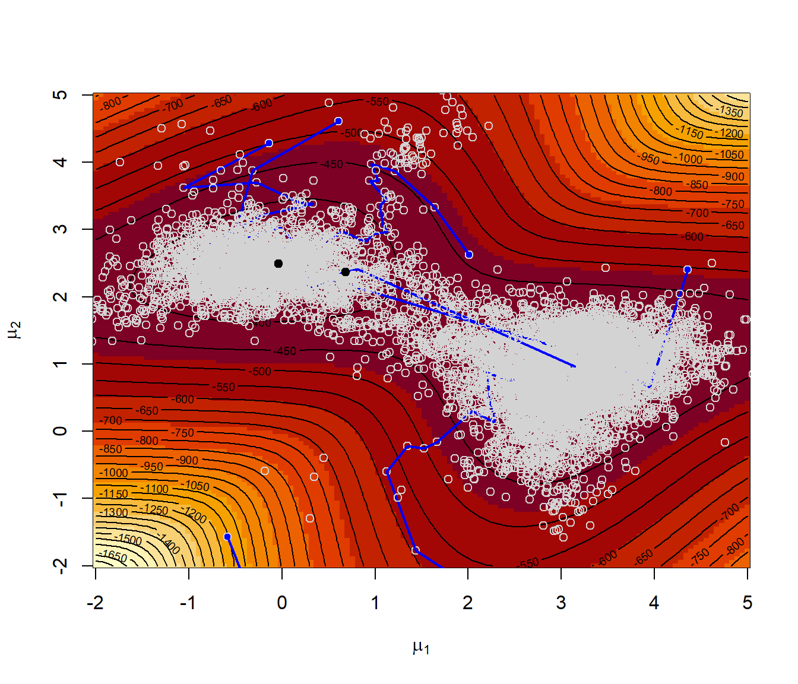

# Integración y Optimización Montecarlo {#cap9}


Uno de los objetivos habituales de los estudios de simulación es la aproximación de una esperanza, es decir, se trataría de evaluar una integral, que en ocasiones puede ser compleja y de alta dimensión. Esto puede ser de interés en otros campos, aunque la integral no esté relacionada con procesos estocásticos. 
Adicionalmente, en muchos campos, incluido la Estadística, hay que resolver problemas de optimización. Para evitar problemas de mínimos locales se puede recurrir a herramientas que emplean búsquedas aleatorias.  

Integración Monte Carlo (clásica)
-----------------------

La integración Monte Carlo se emplea principalmente para aproximar integrales multidimensionales:
$$I = \int \cdots \int h\left( x_1,\ldots ,x_d\right) dx_1 \cdots dx_d$$ 
donde puede presentar ventajas respecto a los métodos tradicionales de integración numérica (ver Apéndice \@ref(int-num)),
ya que la velocidad de convergencia no depende del número de dimensiones.

Supongamos que nos interesa:
$$I = \int_0^1h\left( x\right) dx$$
Si $x_1,x_2,\ldots ,x_n$ *i.i.d.* $\mathcal{U}\left( 0,1\right)$
entonces:
$$I = E\left( h\left( \mathcal{U}\left( 0,1\right) \right) \right)
\approx \frac{1}{n}\sum\limits_{i=1}^nh\left( x_{i}\right)$$

Si el intervalo de integración es
genérico:
$$I = \int_a^bh\left( x\right) dx = 
(b-a)\int_a^bh\left( x\right) \frac1{(b-a)}dx = 
(b-a)E\left( h\left( \mathcal{U}\left( a, b \right) \right) \right).$$
Si $x_1,x_2,\ldots ,x_n$ *i.i.d.*
$\mathcal{U}\left( a, b\right)$:
$$I\approx \frac{1}{n}\sum\limits_{i=1}^nh\left( x_{i}\right) (b-a)$$


\BeginKnitrBlock{exercise}<div class="exercise"><span class="exercise" id="exr:unnamed-chunk-2"><strong>(\#exr:unnamed-chunk-2) </strong></span></div>\EndKnitrBlock{exercise}

Crear una función que implemente la integración Monte Carlo clásica
para aproximar integrales del tipo:
$$I = \int_a^b h(x)  dx.$$ 


```r
mc.integral0 <- function(fun, a, b, n) {
  # Integración Monte Carlo de fun entre a y b utilizando una muestra de tamaño n
  # fun es una función de una sola variable (y que no es vectorial)
  # Se asume a < b y n entero positivo
  # -------------------------------
  x <- runif(n, a, b)
  fx <- sapply(x, fun) # Si fun fuese vectorial bastaría con: fx <- fun(x)
  return(mean(fx) * (b - a))
}
```

Emplearla para aproximar: 
$$\int_0^1 4x^4 dx = \frac{4}{5},$$ 
y representar gráficamente la aproximación en función de $n$.

Función a integrar:


```r
fun <- function(x) ifelse((x > 0) & (x < 1), 4 * x^4, 0)
# return(4 * x^4)

curve(fun, 0, 1)
abline(h = 0, lty = 2)
abline(v = c(0, 1), lty = 2)
```

<div class="figure" style="text-align: center">

<p class="caption">(\#fig:int-mc-clas)Ejemplo de integral en dominio acotado.</p>
</div>

```r
set.seed(1)
mc.integral0(fun, 0, 1, 20)
```

```
## [1] 0.977663
```

```r
mc.integral0(fun, 0, 1, 100)
```

```
## [1] 0.7311169
```

```r
mc.integral0(fun, 0, 1, 100)
```

```
## [1] 0.8304299
```

La función `mc.integral0` no es adecuada para analizar la convergencia 
de la aproximación por simulación.
Una alternativa más eficiente para representar gráficamente la convergencia:


```r
  mc.integral <- function(fun, a, b, n, plot = TRUE) {
    fx <- sapply(runif(n, a, b), fun) * (b - a)
    if (plot) {
      estint <- cumsum(fx)/(1:n)
      esterr <- sqrt(cumsum((fx - estint)^2))/(1:n)
      plot(estint, ylab = "Media y rango de error", type = "l", lwd = 2, ylim = mean(fx) + 
             2 * c(-esterr[1], esterr[1]), xlab = "Iteraciones")
      lines(estint + 2 * esterr, col = "darkgray", lwd = 2)
      lines(estint - 2 * esterr, col = "darkgray", lwd = 2)
      valor <- estint[n]
      abline(h = valor)
      return(list(valor = valor, error = 2 * esterr[n]))
    } else return(list(valor = mean(fx), error = 2 * sd(fx)/sqrt(n)))
  }

set.seed(1)
mc.integral(fun, 0, 1, 5000)
```

```
## $valor
## [1] 0.8142206
## 
## $error
## [1] 0.03087305
```

```r
abline(h = 4/5, lty = 2)
```


Si sólo interesa la aproximación:


```r
set.seed(1)
mc.integral(fun, 0, 1, 5000, plot = FALSE)
```

```
## $valor
## [1] 0.8142206
## 
## $error
## [1] 0.0309005
```

**Nota**: Es importante tener en cuenta que la función `mc.integral` solo es válida para dominio finito.

### Caso general

A partir a ahora consideraremos que interesa aproximar una integral de la forma:
$$\theta = E\left( h\left( X\right) \right) = \int h\left( x\right) f(x)dx$$siendo
$X\sim f$, entonces, si $x_1,x_2,\ldots ,x_n$ *i.i.d.*
$X$:
$$\theta \approx \frac{1}{n}\sum\limits_{i=1}^nh\left( x_{i}\right)$$

Por ejemplo, como en el ejercicio anterior se considera de una función de densidad, 
se correspondería con el caso general de $h(x) = x$ y $f(x) = 4x^3$ para $0<x<1$.
La idea es que, en lugar de consderar una distribución uniforme, 
es preferible generar más valores donde hay mayor "área" (ver Figura \@ref(fig:int-mc-clas)).

Los pasos serían simular `x` con densidad $f$ y aproximar la integral por `mean(h(x))`.
En este caso podemos generar valores de la densidad objetivo fácilmente mediante el método de inversión,
ya que $F(x) = x^4$ si $0<x<1$.
:


```r
rfun <- function(nsim) runif(nsim)^(1/4) # Método de inversión
nsim <- 5000
set.seed(1)
x <- rfun(nsim)
# h <- function(x) x
# res <- mean(h(x)) # Aproximación por simulación 
res <- mean(x)
res
```

```
## [1] 0.7967756
```

```r
# error <- 2*sd(h(x))/sqrt(nsim)
error <- 2*sd(x)/sqrt(nsim)
error
```

```
## [1] 0.004728174
```


\BeginKnitrBlock{exercise}<div class="exercise"><span class="exercise" id="exr:unnamed-chunk-7"><strong>(\#exr:unnamed-chunk-7) </strong></span></div>\EndKnitrBlock{exercise}

Aproximar:
$$\phi(t)=\int_{t}^{\infty}\frac1{\sqrt{2\pi}}e^{-\frac{x^2}2}dx,$$
para $t=4.5$, empleando integración Monte Carlo (aproximación tradicional con dominio infinito).


```r
# h <- function(x) x > 4.5
# f <- function(x) dnorm(x)
set.seed(1)
nsim <- 10^3
x <- rnorm(nsim)
mean(x > 4.5) # mean(h(x))
```

```
## [1] 0
```

```r
pnorm(-4.5)  # valor teórico P(X > 4.5) 
```

```
## [1] 3.397673e-06
```

De esta forma es dificil que se generen valores (en este caso ninguno) 
en la región que interesaría para la aproximación de la integral:


```r
any(x > 4.5)
```

```
## [1] FALSE
```

Como ya se comentó anteriormente, sería preferible generar más valores donde hay mayor "área", 
pero en este caso $f$ concentra la densidad en una región que no resulta de utilidad.
Por ese motivo puede ser preferible recurrir a una densidad auxiliar que solvente este problema.


Muestreo por importancia
------------------------

Para aproximar la integral:
$$\theta = E\left( h\left( X\right) \right) = \int h\left( x\right) f(x)dx,$$
puede ser preferible generar observaciones de una densidad $g$ 
que tenga una forma similar al producto $hf$.

Si $Y\sim g$:
$$\theta  = \int h\left( x\right) f(x)dx 
 = \int \frac{h\left( x\right) f(x)}{g(x)}g(x)dx
 = E\left( q\left( Y\right) \right).$$
siendo
$q\left( x\right)  = \frac{h\left( x\right) f(x)}{g(x)}$.

Si $y_1,y_2,\ldots ,y_n$ *i.i.d.* $Y\sim g$:
$$\theta \approx \frac{1}{n}\sum\limits_{i=1}^nq\left( y_{i}\right) 
= \frac{1}{n}\sum\limits_{i=1}^nw(y_{i})h\left( y_{i}\right)  
= \hat{\theta}_{g}$$
con $w\left( x\right)  = \frac{f(x)}{g(x)}$.

En este caso $Var(\hat{\theta}_{g}) = Var\left( q\left( Y\right) \right) /n$, 
pudiendo reducirse significativamente respecto al método clásico si:
$$g(x)\underset{aprox.}{\propto } \left\vert h(x) \right\vert f(x),$$
ya que en ese caso $\left\vert q(x) \right\vert$ sería aproximadamente constante
(puede demostrarse fácilmente que la varianza es mínima si esa relación en exacta).


Para aplicar el TCL, la varianza del estimador $\hat{\theta}_{g}$ 
es finita si:
$$E\left( q^2\left( Y\right) \right)  
= \int \frac{h^2\left( x\right)f^2(x)}{g(x)}dx 
= E\left( h^2\left( X\right) \frac{f(X)}{g(X)}\right)
< \infty.$$

La idea básica es que si la densidad $g$ tiene colas más pesadas que
la densidad $f$ con mayor facilidad puede dar lugar a 
"simulaciones" con varianza finita 
(podría emplearse en casos en los que no existe
$E \left( h^2 \left( X \right) \right)$;
ver Sección \@ref(convergencia) en el Tema \@ref(cap4) de Análisis de resultados).

La distribución de los pesos $w(y_{i})$ debería ser homogénea para
evitar datos influyentes (inestabilidad).


\BeginKnitrBlock{exercise}<div class="exercise"><span class="exercise" id="exr:unnamed-chunk-10"><strong>(\#exr:unnamed-chunk-10) </strong></span></div>\EndKnitrBlock{exercise}

Aproximar la integral del ejercicio anterior empleando muestreo por importancia considerando como
densidad auxiliar una exponencial de parámetro $\lambda=1$ truncada en $t$:
$$g\left(  x\right)  =\lambda e^{-\lambda\left(  x-t\right)  }\text{, }x>t,$$
(emplear `rexp(n)+t` y `dexp(y-t)`). 
Comparar $h(x)f(x)$ con $g(x)f(4.5)$ y representar gráficamente la
aproximación en función de $n$.
    


```r
curve(dnorm(x), 4.5, 6, ylab = "dnorm(x) y dexp(x-4.5)*k")
abline(v = 4.5)
abline(h = 0)
escala <- dnorm(4.5)  # Reescalado para comparación...
curve(dexp(x - 4.5) * escala, add = TRUE, lty = 2)  
```


Se generan los valores de la densidad auxiliar y se calculan los pesos:


```r
set.seed(1)
nsim <- 10^3
y <- rexp(nsim) + 4.5    #  Y ~ g
w <- dnorm(y)/dexp(y - 4.5)
```

La aproximación por simulación sería `mean(w * h(y))`:


```r
# h(x) <- function(x) x > 4.5  # (1 si x > 4.5 => h(y) = 1)
mean(w) # w*h(y)
```

```
## [1] 3.144811e-06
```

```r
pnorm(-4.5)  # valor teórico
```

```
## [1] 3.397673e-06
```

```r
plot(cumsum(w)/1:nsim, type = "l", ylab = "Aproximación", xlab = "Iteraciones")
abline(h = pnorm(-4.5), lty = 2)
```


El error estandar de la aproximación sería `sqrt(var(w * h(y))/nsim)`:


```r
sqrt(var(w)/nsim) # sd(w*h(y))/sqrt(nsim)   
```

```
## [1] 1.371154e-07
```

Empleando la aproximación tradicional:


```r
est <- mean(rnorm(nsim) > 4.5)
est
```

```
## [1] 0
```

```r
sqrt(est * (1 - est)/nsim)
```

```
## [1] 0
```


\BeginKnitrBlock{exercise}<div class="exercise"><span class="exercise" id="exr:unnamed-chunk-16"><strong>(\#exr:unnamed-chunk-16) </strong></span></div>\EndKnitrBlock{exercise}

Aproximar $P\left(2<X<6\right)$ siendo $X\sim Cauchy(0,1)$
empleando muestreo por importancia y considerando como densidad
auxiliar la normal estandar $Y\sim N(0,1)$. Representar gráficamente
la aproximación y estudiar los pesos $w(y_i)$.
    
**Nota**: En este caso van a aparecer problemas 
(la densidad auxiliar debería tener colas más pesadas que la densidad objetivo;
sería adecuado si intercambiaramos las distribuciones objetivo y auxiliar,
como en el ejercicio siguiente).

Se trata de aproximar `pcauchy(6) - pcauchy(2)`,
i.e. `f(y) = dcauchy(y)` y `h(y) = (y > 2) * (y < 6)`,
empleando muestreo por importancia con `g(y) = dnorm(y)`.


```r
nsim <- 10^5
set.seed(4321)
y <- rnorm(nsim)
w <- dcauchy(y)/dnorm(y) # w <- w/sum(w) si alguna es una cuasidensidad
```

La aproximación por simulación es `mean(w(y) * h(y))`:


```r
mean(w * (y > 2) * (y < 6)) 
```

```
## [1] 0.09929348
```

```r
pcauchy(6) - pcauchy(2)  # Valor teórico
```

```
## [1] 0.09501516
```

Si se estudia la convergencia:


```r
plot(cumsum(w * (y > 2) * (y < 6))/1:nsim, type = "l", ylab = "Aproximación", xlab = "Iteraciones")
abline(h = pcauchy(6) - pcauchy(2), lty = 2)
```


Lo que indica es una mala elección de la densidad auxiliar... 

La distribución de los pesos debería ser homogénea.
Por ejemplo, si los reescalamos para que su suma sea el número de valores generados, deberían tomar valores en torno a uno:


```r
boxplot(nsim * w/sum(w))  
```




### Remuestreo (del muestreo) por importancia

Cuando $f$ y/o $g$ son cuasi-densidades, para evitar calcular constantes
normalizadoras, se emplea como
aproximación:
$$\theta \approx \frac{\sum\limits_{i=1}^nw(y_{i})h\left( y_{i}\right) }{ \sum\limits_{i=1}^nw(y_{i})}.$$

Adicionalmente, puede verse que con un muestreo de 
$\left\{y_1,y_2,\ldots ,y_n\right\}$ 
ponderado por $w(y_{i})$ 
(prob. $=w(y_{i})\left/ \sum\nolimits_{i=1}^nw(y_{i}) \right.$ ) 
se obtiene una simulación aproximada de $f$ 
(*Sample importance resampling*, Rubin, 1987).


\BeginKnitrBlock{exercise}<div class="exercise"><span class="exercise" id="exr:unnamed-chunk-21"><strong>(\#exr:unnamed-chunk-21) </strong></span></div>\EndKnitrBlock{exercise}

Generar 1000 simulaciones de una distribución (aprox.) $N(0,1)$
mediante remuestreo del muestreo por importancia de $10^{5}$ valores
de una $Cauchy(0,1)$.
    
Se trata de simular una normal a partir de una Cauchy (Sampling Importance Resampling).
En este caso `f(y) = dnorm(y)` y `g(y) = dcauchy(y)`, al revés del ejercicio anterior...


```r
# Densidad objetivo
# f <- dnorm # f <- function(x) ....

nsim <- 10^3
# El nº de simulaciones de la densidad auxiliar debe ser mucho mayor:
nsim2 <- 10^5
set.seed(4321)
y <- rcauchy(nsim2)
w <- dnorm(y)/dcauchy(y) # w <- w/sum(w) si alguna es una cuasidensidad

# Si se pidiera aproximar una integral
# h(y) = y si es la media # h <- function(y) y
# mean(w * h(y))
```

Sampling Importance Resampling: 


```r
rx <- sample(y, nsim, replace = TRUE, prob = w/sum(w))
hist(rx, freq = FALSE)
curve(dnorm, add = TRUE)
lines(density(rx), col ="red")
```


**Nota**: Si f o g fuesen cuasidensidades y se pidiese aproximar la integral,
habría que reescalar los pesos:  `w <- f(y)/g(y)`; `w <- w/sum(w)`,
y la aproximación por simulación sería `sum(w * h(y))` y en el análisis 
de convergencia se emplearía `cumsum(w * h(y))` 
(sin dividir por el número de simulaciones).


Optimización Monte Carlo
------------------------

Supongamos que estamos interesados en la minimización de una
función:
$$\underset{\mathbf{x}\in D}{\min }f(\mathbf{x}).$$

Hay una gran cantidad de algoritmos numéricos para resolver
problemas de optimización no lineal multidimensional, por ejemplo
los basados en el método de Newton-Raphson.

La idea original consiste en buscar los ceros de su primera derivada
(o del gradiente) empleando una aproximación
iterativa:
$$\mathbf{x}_{i+1} = \mathbf{x}_{i}-[Hf(\mathbf{x}_{i})]^{-1}\nabla f(\mathbf{x} = 
_{i}),$$donde $Hf(\mathbf{x}_{i})$ es el hessiano de la función
(matriz de segundas derivadas) y $\nabla f(\mathbf{x}_{i})$ el
gradiente (vector de primeras derivadas).
Estos métodos normalmente funcionan muy bien cuando la función
objetivo no tiene mínimos locales (ideal $f$ cuadrática).
Los resultados obtenidos pueden ser muy malos en caso contrario
(especialmente en el caso multidimensional) y dependen en gran
medida del punto inicial.
Un ejemplo donde es habitual que aparezcan este tipo de problemas es
en la estimación por máxima verosimilitud (la función objetivo puede
ser multimodal).


\BeginKnitrBlock{exercise}<div class="exercise"><span class="exercise" id="exr:unnamed-chunk-24"><strong>(\#exr:unnamed-chunk-24) </strong></span></div>\EndKnitrBlock{exercise}

La mixtura de distribuciones normales:
$$\frac1{4}N(\mu_1,1)+\frac{3}{4}N(\mu_2,1),$$ 
tiene una función de verosimilitud asociada bimodal.
Generar una muestra de 200 valores de esta distribución con
$\mu_1=0$ y $\mu_2=2.5$, construir la correspondiente
función de verosimilitud y representarla graficamente. Obtener
la estimación por máxima verosimilitud de los parámetros
empleando la rutina `nlm`.
Muestra (simulación mixtura dos normales)


```r
nsim <- 200
mu1 <- 0 
mu2 <- 2.5
sd1 <- sd2 <- 1

set.seed(12345)
p.sim <- rbinom(nsim, 1, 0.25)
data <- rnorm(nsim, mu1*p.sim + mu2*(1-p.sim), sd1*p.sim + sd2*(1-p.sim))

hist(data, freq = FALSE, breaks = "FD", ylim = c(0, 0.3))
curve(0.25 * dnorm(x, mu1, sd1) + 0.75 * dnorm(x, mu2, sd2), add = TRUE)
```


Logaritmo (negativo) de la función de verosimilitud
(para la estimación de las medias)


```r
like <- function(mu)
  -sum(log((0.25 * dnorm(data, mu[1], sd1) + 0.75 * dnorm(data, mu[2], sd2))))
  # NOTA: Pueden aparecer NA/Inf por log(0)
```

Si queremos capturar los valores en los que se evalúa esta función,
podemos proceder de forma similar a como se describe en el capítulo 
[Function operators](http://adv-r.had.co.nz/Function-operators.html#behavioural-fos) 
del libro "Advanced R" de Hadley Wickham:
Behavioural FOs leave the inputs and outputs of a function unchanged, 
but add some extra behaviour. 


```r
tee <- function(f) {
  function(...) {
    input <- if(nargs() == 1) c(...) else list(...)
    output <- f(...)
    # Hacer algo ...
    # ... con output e input
    return(output)
  }
}
```


En este caso queremos representar los puntos en los que el algoritmo de optimización
evalúa la función objetivo (especialmente como evoluciona el valor óptimo) 


```r
tee.optim2d <- function(f) {
  best.f <- Inf   # Suponemos que se va a minimizar (opción por defecto)
  best.par <- c(NA, NA)   
  function(...) {
    input <- c(...)
    output <- f(...)
    ## Hacer algo ...
    points(input[1], input[2], col = "lightgray")
    if(best.f > output) {
      lines(rbind(best.par, input), lwd = 2, col = "blue")
      best.f <<- output
      best.par <<- input
      # points(best.par[1], best.par[2], col = "blue", pch = 20)
      # cat("par = ", best.par, "value = ", best.f, "\n")
    } 
    ## ... con output e input
    return(output)
  }
}
```

Representar la superficie del logaritmo de la verosimilitud, 
los puntos iniciales y las iteraciones en la optimización numérica con `nlm`:


```r
mmu1 <- mmu2 <- seq(-2, 5, length = 128)
lli <- outer(mmu1, mmu2, function(x,y) apply(cbind(x,y), 1, like))

par(mar = c(4, 4, 1, 1))
image(mmu1, mmu2, -lli, xlab = expression(mu[1]), ylab = expression(mu[2]))
contour(mmu1, mmu2, -lli, nlevels = 50, add = TRUE)

# Valores iniciales aleatorios
nstarts <- 5
set.seed(1)
starts <- matrix(runif(2*nstarts, -2, 5), nrow = nstarts)
points(starts, col = "blue", pch = 19)

# Minimización numérica con nlm
for (j in 1:nstarts){
  # Normalmente llamaríamos a nlm(like, start)
  res <- nlm(tee.optim2d(like), starts[j, ]) # nlm(like, starts[j, ])
  points(res$estimate[1],res$estimate[2], pch = 19)
  cat("par = ", res$estimate, "value =", res$minimum, "\n")
}
```


```
## par =  -0.03892511 2.494589 value = 361.5712 
## par =  -0.03892501 2.494589 value = 361.5712 
## par =  -0.03892507 2.494589 value = 361.5712 
## par =  3.132201 0.9628536 value = 379.3739 
## par =  20.51013 1.71201 value = 474.1414
```


### Algoritmos de optimización Monte Carlo

Una alternativa sería tratar de generar valores aleatoriamente de
forma que las regiones donde la función objetivo es menor tuviesen
mayor probabilidad y menor probabilidad las regiones donde la
función objetivo es mayor.
Por ejemplo, se podría pensar en generar valores de acuerdo a una
densidad (tranformación
Boltzman-Gibbs):
$$g(x)\propto \exp \left( -f(x)/T\right) ,$$donde
$T>0$ es un parámetro (denominado temperatura) seleccionado de forma
que se garantize la integrabilidad.

Entre los métodos de optimización Monte Carlo podríamos destacar:

-   Métodos con gradiente aleatorio.

-   Temple simulado.

-   Algoritmos genéticos.

-   Montecarlo EM.

-   ...

Temple simulado
---------------

Método inspirado en el templado de un metal (se calienta el metal a
alta temperatura y se va enfriando lentamente).
En cada paso se reemplaza la aproximación actual por un valor
aleatorio “cercano”, elegido con una probabilidad que depende de la
mejora en la función objetivo y de un parámetro $T$
(denominado temperatura) que disminuye gradualmente durante
el proceso.

-   Cuando la temperatura es grande los cambios son bastante
    probables en cualquier dirección.

-   Al ir disminuyendo la temperatura los cambios tienden a ser
    siempre “cuesta abajo”.

Al tener una probabilidad no nula de aceptar una modificación
“cuesta arriba” se trata de evitar quedar atrapado en un
óptimo local.


### Algoritmo:


```r
temp <- TEMP.INIT
place <- INIT.PLACEMENT()
cost.place <- COST(place)
while(temp < TEMP.FINAL) {
  while(LOOP.CRITERION()) {
    place.new <- PERTURB(place, temp)
    cost.new <- COST(place.new)
    cost.inc <- cost.new - cost.place
    temp <- SCHEDULE(temp)
    if ((cost.inc < 0) || (runif(1) > exp(-(cost.inc/temp)))) break
  }
  place <- place.new
  cost.place <- cost.new
  # temp <- SCHEDULE(temp)
}
COST <- function(place, ...) {...}
SCHEDULE <- function(temp, ...) {...}
INIT.PLACEMENT <- function(...) {...}
LOOP.CRITERION <- function(...) {...}
```


Adaptado de [Premchand Akella (ppt)](http://www.ecs.umass.edu/ece/labs/vlsicad/ece665/slides/SimulatedAnnealing.ppt).

Este algoritmo se puede ver como una adaptación del método de
Metropolis-Hastings que veremos más adelante 
(Tema 11 Introducción a los métodos de cadenas de Markov Monte Carlo).


\BeginKnitrBlock{exercise}<div class="exercise"><span class="exercise" id="exr:unnamed-chunk-32"><strong>(\#exr:unnamed-chunk-32) </strong></span></div>\EndKnitrBlock{exercise}
Repetir el ejercicio anterior empleando el algoritmo del temple simulado. 

Minimización "SANN" con optim:


```r
# Representar la superficie del logaritmo de la verosimilitud
image(mmu1, mmu2, -lli, xlab = expression(mu[1]), ylab = expression(mu[2]))
contour(mmu1, mmu2, -lli, nlevels = 50, add = TRUE)
points(starts, col = "blue", pch = 19)

set.seed(1)
for (j in 1:nstarts){
  # Normalmente llamaríamos a optim(start, like, method = "SANN")
  # Note that the "SANN" method depends critically on the settings of the control parameters.
  # For "SANN" maxit gives the total number of function evaluations: there is no other stopping criterion. 
  # Defaults to 10000.
  res <- optim(starts[j, ], tee.optim2d(like), method = "SANN", control = list(temp = 100, maxit = 2000))
  points(res$par[1],res$par[2], pch = 19)
  cat("par = ", res$par, "value =", res$value, "\n")
}
```


```
## par =  0.0002023461 2.473437 value = 361.6372 
## par =  -0.182735 2.45585 value = 362.0255 
## par =  -0.0281341 2.484467 value = 361.5801 
## par =  -0.03642928 2.488626 value = 361.5732 
## par =  0.6814165 2.370026 value = 374.839
```

Alternativa: función basada en el algoritmo empleado en el ejemplo 5.9 del libro:
Robert y Casella, Introducing Monte Carlo Methods with R, Springer, 2010.


```r
SA <- function(fun, pini, lower = -Inf, upper = Inf, tolerance = 10^(-4), factor = 1) {
  temp <- scale <- iter <- dif <- 1
  npar <- length(pini) 
  the <- matrix(pini, ncol = npar)
  curfun <- hval <- fun(pini)
  while (dif > tolerance) {
    prop <- the[iter, ] + rnorm(npar) * scale[iter]
    # Se decide si se acepta la propuesta
    if (any(prop < lower) || any(prop > upper) || 
        (temp[iter] * log(runif(1)) > -fun(prop) + curfun))  prop <- the[iter, ]
    curfun <- fun(prop)
    hval <- c(hval, curfun)
    the <- rbind(the, prop)
    iter <- iter + 1
    temp <- c(temp, 1/log(iter + 1))  # Actualizar la temperatura
    # Se controla el nº de perturbaciones aceptadas
    ace <- length(unique(the[(iter/2):iter, 1]))
    if (ace == 1) 
      # si es muy pequeño se disminuye la escala de la perturbación
      factor <- factor/10
    if (2 * ace > iter) 
      # si es muy grande se aumenta
      factor <- factor * 10
    scale <- c(scale, max(2, factor * sqrt(temp[iter])))  # Actualizar la escala de la perturbación
    dif <- (iter < 100) + (ace < 2) + (max(hval) - max(hval[1:(iter/2)]))
  }
  list(theta = the, val = hval, ite = iter)
}

# Representar la superficie del logaritmo de la verosimilitud
image(mmu1, mmu2, -lli, xlab = expression(mu[1]), ylab = expression(mu[2]))
contour(mmu1, mmu2, -lli, nlevels = 50, add = TRUE)
points(starts, col = "blue", pch = 19)

set.seed(1)
for (j in 1:nstarts) {
  sar <- SA(like, starts[j, ])
  lines(sar$the[, 1], sar$the[, 2], lwd = 2, col = "blue")
  points(sar$the[sar$it, 1], sar$the[sar$it, 2], pch = 19)
}
```


Algoritmos genéticos
--------------------

Los algoritmos genéticos tratan de encontrar la mejor solución
(entre un conjunto de soluciones posibles) imitando los procesos de
evolución biológica:

-   **Población**: formada por $n$ individuos $\mathbf{x}_{i}$
    codificados en **cromosomas**.

-   $f(\mathbf{x}_{i})$ ajuste/capacidad/**adaptación** del
    individuo $\mathbf{x}_{i}$.

-   **Selección**: los individuos mejor adaptados tienen mayor
    probabilidad de ser **padres**.

-   **Cruzamiento**: los cromosomas de dos padres se combinan para
    generar hijos.

-   **Mutación**: modificación al azar del cromosoma de los
    hijos (variabilidad).

-   **Elitismo**: el mejor individuo pasa a la siguiente generación.

Los paquetes de R `DEOptim` y `gafit` implementan algunos de estos
tipos de algoritmos.


\BeginKnitrBlock{exercise}<div class="exercise"><span class="exercise" id="exr:unnamed-chunk-35"><strong>(\#exr:unnamed-chunk-35) </strong></span></div>\EndKnitrBlock{exercise}

Repetir el ejercicio anterior empleando la función `DEOptim`.
    
Optimización con algoritmo genético implementado en `DEoptim`:


```r
require(DEoptim)

# Representar la superficie del logaritmo de la verosimilitud
image(mmu1, mmu2, -lli, xlab = expression(mu[1]), ylab = expression(mu[2]))
contour(mmu1, mmu2, -lli, nlevels = 50, add = TRUE)
# Estos algoritmos no requieren valores iniciales (los generan al azar en el rango)

lower <- c(-2, -2)
upper <- c(5, 5)
set.seed(1)
# DEoptim(like, lower, upper)
der <- DEoptim(tee.optim2d(like), lower, upper, DEoptim.control(itermax = 10))
```

```
## Iteration: 1 bestvalit: 373.132461 bestmemit:   -0.764103    2.196961
## Iteration: 2 bestvalit: 367.580379 bestmemit:   -0.430095    2.196961
## Iteration: 3 bestvalit: 367.580379 bestmemit:   -0.430095    2.196961
## Iteration: 4 bestvalit: 367.580379 bestmemit:   -0.430095    2.196961
## Iteration: 5 bestvalit: 361.906887 bestmemit:    0.058951    2.455186
## Iteration: 6 bestvalit: 361.906887 bestmemit:    0.058951    2.455186
## Iteration: 7 bestvalit: 361.906887 bestmemit:    0.058951    2.455186
## Iteration: 8 bestvalit: 361.657986 bestmemit:   -0.064005    2.452184
## Iteration: 9 bestvalit: 361.657986 bestmemit:   -0.064005    2.452184
## Iteration: 10 bestvalit: 361.657986 bestmemit:   -0.064005    2.452184
```

```r
# Por defecto fija el tamaño de la población a NP = 10*npar = 20
# Puede ser mejor dejar el valor por defecto itermax = 200
points(der$optim$bestmem[1], der$optim$bestmem[2], pch = 19)
```


