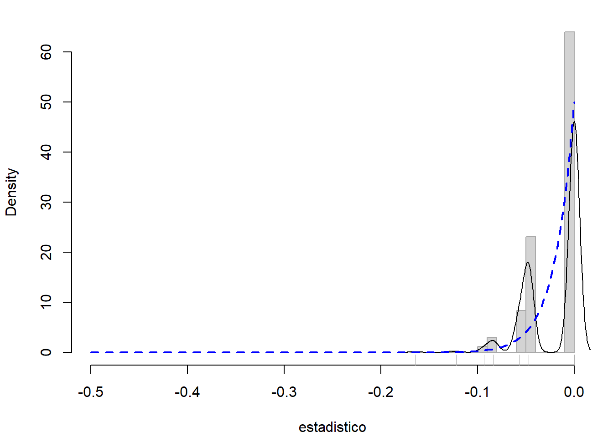
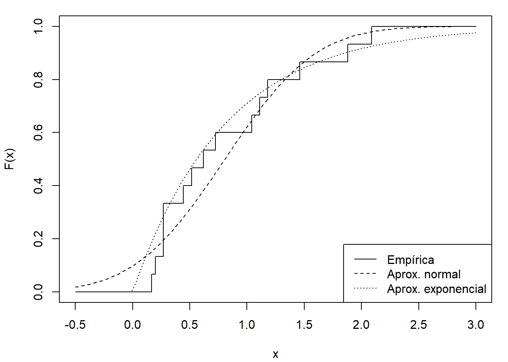

# Extensiones del bootstrap uniforme {#modunif}

<!-- Capítulo \@ref(modunif) -->


<!-- 
---
title: "Extensiones del bootstrap uniforme"
author: "Simulación Estadística (UDC)"
date: "Máster en Técnicas Estadísticas"
output: 
  bookdown::html_document2:
    pandoc_args: ["--number-offset", "9,0"]
    toc: yes 
    # mathjax: local            # copia local de MathJax, hay que establecer:
    # self_contained: false     # las dependencias se guardan en ficheros externos 
  bookdown::pdf_document2:
    keep_tex: yes
    toc: yes 
---

bookdown::preview_chapter("10-Bootstrap_ext.Rmd")
knitr::purl("10-Bootstrap_ext.Rmd", documentation = 2)
knitr::spin("10-Bootstrap_ext.R",knit = FALSE)

Pendiente: 
Ejercicio mediana
https://en.wikipedia.org/wiki/Median#Sampling_distribution
-->

Cuando no se dispone de ninguna información adicional sobre la distribución poblacional es razonable emplear bootstrap uniforme (naïve o no paramétrico), ya que la distribución empírica es el estimador máximo verosímil no paramétrico de la función de distribución poblacional.
En general (ver p.e. Cao y Fernández-Casal, 2021, [Sección 3.6](https://rubenfcasal.github.io/book_remuestreo/validez-de-la-aproximaci%C3%B3n-bootstrap.html)), el bootstrap uniforme funcionará bien cuando el estadístico sea una función suave de la muestra^[Por ejemplo si es una función diferenciable de los momentos muestrales.] (suponiendo además que la aproximación Monte Carlo converge, es decir, que las colas de la distribución poblacional no son muy pesadas; ver Sección \@ref(convergencia)).
Si el estadístico depende de la muestra de una manera poco suave o inestable, como es el caso de los cuantiles muestrales, el bootstrap uniforme puede no funcionar muy bien (Sección \@ref(deficien-unif)), y puede ser recomendable emplear otro método de remuestreo. 

Además, cuando en el contexto en el que nos encontremos conozcamos alguna propiedad adicional de la distribución poblacional (por ejemplo que es continua o simétrica), debería tenerse en cuenta en en el método de remuestreo, ya que habría que tratar de imitar todas las características de la distribución poblacional. 
Esto da lugar a modificaciones del bootstrap uniforme, algunas de las cuales se muestran en secciones siguientes.


## Deficiencias del bootstrap uniforme {#deficien-unif}

Como ya se comentó en la introducción, si el estadístico es función de los cuantiles muestrales el bootstrap uniforme puede no funcionar bien (por ejemplo en el caso de la mediana; ver Ejercicio \@ref(exr:boot-simul-mediana)).
Esto es principalmente debido a que el conjunto de posibles valores de las réplicas bootstrap del estadístico puede ser muy pequeño (si el tamaño muestral es pequeño). 

Un ejemplo en el que el bootstrap uniforme falla por completo es el caso del máximo de una distribución uniforme.
Supongamos que la distribución poblacional, $F$, es la $\mathcal{U}\left( 0,\theta \right)$ y que estamos interesados en hacer inferencia sobre del parámetro $\theta$ empleando su estimador máximo verosímil $\hat{\theta}=X_{(n)}$, siendo $\mathbf{X}=\left( X_1,X_2,\ldots ,X_n \right)$ la muestra observada.
Para realizar dicha inferencia nos interesaría aproximar la distribución de
$R\left( \mathbf{X},F \right) =\hat{\theta}-\theta$.

La función de distribución en el muestreo, $G\left( x \right)$, de
$\hat{\theta}$ puede calcularse de forma sencilla:

$$\begin{aligned}
G\left( x \right) &= P\left( X_{\left(
n \right)}\leq x \right) =P\left( X_i\leq x\,;
 1 \leq i \leq n \right) \\
&= \prod_{i=1}^{n}P\left( X_i\leq x \right) =F\left( x \right)^{n}=\left( 
\frac{x}{\theta } \right)^{n},\text{ si }x\in \left[ 0,\theta \right]\end{aligned}$$

con lo cual su función de densidad viene dada por
$$g\left( x \right) =\frac{n}{\theta }\left( \frac{x}{\theta } \right)^{n-1},
\text{ si }x\in \left[ 0,\theta \right] .$$
<!-- 
Tomando, por ejemplo, $\theta =1$ y $n=50$, esta función de densidad resulta
:

```r
theta <- 1
n <- 50
curve(n/theta * (x/theta)^(n - 1), 0, theta, ylab = "Density")
```

<div class="figure" style="text-align: center">

<p class="caption">(\#fig:den-max)Función de densidad del máximo de una muestra procedente de una uniforme.</p>
</div>
-->
Lo que confirma que $\hat{\theta}$ es un estimador sesgado de $\theta$, puesto que se tiene que $\hat{\theta}\leq \theta$ con probabilidad 1.
A partir de esta densidad podemos calcular fácilmente el sesgo del estimador:
$$Sesgo\left( \hat{\theta} \right) =E\left( \hat{\theta} \right) -\theta = -\frac{\theta }{n+1}.$$

Si deseamos aproximar mediante bootstrap la distribución en el muestreo de $\hat{\theta}$ (o la de $R$) y utilizamos un bootstrap uniforme (naïve), la versión bootstrap del estimador resulta ser $\hat{\theta}^{\ast}=X_{(n)}^{\ast}$, 
siendo $\mathbf{X}^{\ast}=\left(X_1^{\ast}\text{, }X_2^{\ast}\text{, }\ldots \text{, }X_n^{\ast} \right)$ una remuestra bootstrap obtenida a partir de la distribución empírica $F_n$. 
La distribución en el remuestreo de $\hat{\theta} ^{\ast}\,$ resulta un poco más complicada pues es discreta y sólo puede
tomar cualquiera de los valores de la muestra.

Suponiendo que no hay empates en las observaciones de la muestra, es fácil darse cuenta de que
$$P^{\ast}\left( \hat{\theta}^{\ast}\leq X_{(j)} \right)
=P^{\ast}\left( X_{(n)}^{\ast}\leq X_{(j)
} \right) =P^{\ast}\left( X_i^{\ast}\leq X_{(j)}\,;
 1 \leq i \leq n \right) =\left( \frac{j}{n} \right)^{n}$$
y, por tanto, su masa de probabilidad viene dada por
$$P^{\ast}\left( \hat{\theta}^{\ast}=X_{(j)} \right) =\left( 
\frac{j}{n} \right)^{n}-\left( \frac{j-1}{n} \right)^{n}\text{, }j=1,\ldots,n.$$

En particular,
$$P^{\ast}\left( \hat{\theta}^{\ast}=X_{(n)} \right) =1-\left( 1-
\frac{1}{n} \right)^{n}\rightarrow 1-\frac{1}{e}\simeq 0.6321,$$
con lo cual la distribución en remuestreo de $R^{\ast}=R\left( 
\mathbf{X}^{\ast},F_n \right) =\hat{\theta}^{\ast}-X_{\left(
n \right)}$ tiene un átomo de probabilidad en el valor $0$ cuya
probabilidad tiende a $1-\frac{1}{e}$ cuando el tamaño muestral tiende a infinito, es decir

$$\lim_{n\rightarrow \infty }P^{\ast}\left( R^{\ast}=0 \right) =1-\frac{1}{e},$$

algo que no ocurre con la distribución en el muestreo de $R$, que es continua con densidad:
$$g_R\left( x \right) =\frac{n}{\theta }\left( \frac{x + \theta}{\theta } \right)^{n-1},
\text{ si }x\in \left[ -\theta, 0\right].$$ 
De esta forma vemos que el bootstrap uniforme (no paramétrico) es inconsistente.

::: {.example #boot-maximo-uniforme name="Inferencia sobre el máximo de una distribución uniforme"}
<br>

El siguiente código implementa el método bootstrap uniforme (también llamado naïve) para aproximar la distribución del estadístico $R=\hat{\theta}-\theta$, para una muestra de tamaño $n=50$, proveniente de una población con distribución
$\mathcal{U}\left( 0,1\right)$ :


```r
theta <- 1
n <- 50
set.seed(1)
muestra <- runif(50) * theta
theta_est <- max(muestra)
# Remuestreo
B <- 2000
maximo <- numeric(B)
estadistico <- numeric(B)
for (k in 1:B) {
    remuestra <- sample(muestra, n, replace = TRUE)
    maximo[k] <- max(remuestra)
    estadistico[k] <- maximo[k] - theta_est
}
# Distribución estadístico
xlim <- c(-theta/2, 0) # c(-theta, 0)
hist(estadistico, freq = FALSE, main = "", breaks = "FD",  
     border = "darkgray", xlim = xlim)
lines(density(estadistico))
rug(estadistico, col = "darkgray")
curve(n/theta * ((x + theta)/theta)^(n - 1), col = "blue", lty = 2, lwd = 2, 
      add = TRUE)
```

<div class="figure" style="text-align: center">

<p class="caption">(\#fig:boot-uniforme-maximo)Distribución de las réplicas bootstrap (uniforme) del estadístico y distribución poblacional.</p>
</div>

Este problema podría evitarse empleando el bootstrap paramétrico descrito a continuación (ver Ejemplo \@ref(exm:boot-maximo-parametrico)).

:::


## Bootstrap paramétrico {#modunif-boot-par}

Supongamos que sabemos que la función de distribución poblacional
pertenece a cierta familia paramétrica. Es decir $F=F_{\theta }$ para
algún vector $d$-dimensional $\theta \in \Theta$. En ese caso parece
lógico estimar $\theta$ a partir de la muestra (denotemos
$\hat{\theta}$ un estimador de $\theta$, por ejemplo el de máxima
verosimilitud) y obtener remuestras de $F_{\hat{\theta}}$ no de $F_n$.
Entonces, el bootstrap uniforme se modifica de la siguiente forma, dando
lugar al llamado bootstrap paramétrico:

1. Dada la muestra
$\mathbf{X}=\left( X_1,\ldots ,X_n \right)$, calcular $\hat{\theta}$

2. Para cada $i=1,\ldots ,n$ generar $X_i^{\ast}$ a partir de $F_{\hat{\theta}}$

3. Obtener $\mathbf{X}^{\ast}=\left( X_1^{\ast},\ldots ,X_n^{\ast} \right)$

4. Calcular $R^{\ast}=R\left( \mathbf{X}^{\ast},F_{\hat{\theta}} \right)$

5. Repetir $B$ veces los pasos 2-4 para obtener las réplicas bootstrap 
   $R^{\ast (1)}$, $\ldots$, $R^{\ast (B)}$

6. Utilizar esas réplicas bootstrap para aproximar la distribución en el muestreo de $R$

En el paso 2, debemos poder simular valores de la distribución $F_{\hat{\theta}}$.
Como ya hemos visto en la Sección \@ref(rrng), en R (y en la mayoría de lenguajes de programación y software estadístico) se dispone de rutinas que permiten simular la mayoría de las distribuciones paramétricas habituales.
En otros casos habrá que emplear métodos generales, preferiblemente el método de inversión descrito en el Capítulo \@ref(continuas).

Una de las principales aplicaciones del bootstrap paramétrico 
es el contraste de hipótesis que se tratará en la Sección \@ref(contrastes-parametricos).


::: {.example #media-par name="Inferencia sobre la media, continuación"}
<br>

Continuando con el Ejemplo \@ref(exm:media-dt-desconocida) del tiempo de vida de microorganismos, podríamos pensar en emplear bootstrap paramétrico para calcular un intervalo de confianza para la media poblacional.

La valided de los resultados dependerá en gran medida de que el modelo paramétrico sea adecuado para describir la variabilidad de los datos. 
En este caso parece razonable asumir una distribución exponencial (no lo es que el modelo admita tiempos de vida negativos, como ocurriría al asumir normalidad):


```r
muestra <- simres::lifetimes
# Distribución bootstrap uniforme
# plot(ecdf(muestra), xlim = c(-.5, 3), ylab = "F(x)")
curve(ecdf(muestra)(x), xlim = c(-.5, 3), ylab = "F(x)", type = "s")
# Distribución bootstrap paramétrico normal
curve(pnorm(x, mean(muestra), sd(muestra)), lty = 2, add = TRUE)
# Distribución bootstrap paramétrico exponencial
curve(pexp(x, 1/mean(muestra)), lty = 3, add = TRUE)
legend("bottomright", legend = c("Empírica", "Aprox. normal", "Aprox. exponencial"), 
       lty = 1:3)
```

<div class="figure" style="text-align: center">

<p class="caption">(\#fig:boot-par-aprox)Distribución empírica de la muestra de tiempos de vida de microorganismos y aproximaciones paramétricas.</p>
</div>

Podemos modificar fácilmente el código mostrado en el Ejemplo \@ref(exm:media-dt-desconocida), de forma que se emplee bootstrap paramétrico (exponencial):


```r
n <- length(muestra)
alfa <- 0.05
# Estimaciones muestrales
x_barra <- mean(muestra)
cuasi_dt <- sd(muestra)
# Remuestreo
set.seed(1)
B <- 1000
estadistico_boot <- numeric(B)
for (k in 1:B) {
  # remuestra <- sample(muestra, n, replace = TRUE)
  remuestra <- rexp(n, 1/x_barra)
  x_barra_boot <- mean(remuestra)
  cuasi_dt_boot <- sd(remuestra)
  estadistico_boot[k] <- sqrt(n) * (x_barra_boot - x_barra)/cuasi_dt_boot
}
# Aproximación Monte Carlo de los ptos críticos:
pto_crit <- quantile(estadistico_boot, c(alfa/2, 1 - alfa/2))
# Construcción del IC
ic_inf_boot <- x_barra - pto_crit[2] * cuasi_dt/sqrt(n)
ic_sup_boot <- x_barra - pto_crit[1] * cuasi_dt/sqrt(n)
IC_boot <- c(ic_inf_boot, ic_sup_boot)
names(IC_boot) <- paste0(100*c(alfa/2, 1-alfa/2), "%")
IC_boot
```

```
##    2.5%   97.5% 
## 0.53198 1.39614
```

Para emplear el paquete `boot`, como se comentó en la Sección 
\@ref(intro-pkgboot), habría que establecer en la llamada a la 
función `boot()` los argumentos: `sim = "parametric"`, 
`mle` igual a los parámetros necesarios para la simulación y 
`ran.gen = function(data, mle)`, una función de los datos originales 
y de los parámetros que devuelve los datos generados. 
En este caso además, la función `statistic` no necesita el vector 
de índices como segundo parámetro. 
Por ejemplo, para calcular el intervalo de confianza para la media del 
tiempo de vida de los microorganismos, podríamos utilizar el siguiente código:


```r
library(boot)
ran.gen.exp <- function(data, mle) {
    # Función para generar muestras aleatorias exponenciales
    # mle contendrá la media de los datos originales
    out <- rexp(length(data), 1/mle)
    out
}

statistic <- function(data){
    c(mean(data), var(data)/length(data))
}

set.seed(1)
res.boot <- boot(muestra, statistic, R = B, sim = "parametric",
                 ran.gen = ran.gen.exp, mle = mean(muestra))

boot.ci(res.boot, type = "stud")
```

```
## BOOTSTRAP CONFIDENCE INTERVAL CALCULATIONS
## Based on 1000 bootstrap replicates
## 
## CALL : 
## boot.ci(boot.out = res.boot, type = "stud")
## 
## Intervals : 
## Level    Studentized     
## 95%   ( 0.5308,  1.4061 )  
## Calculations and Intervals on Original Scale
```

:::


::: {.example #boot-maximo-parametrico name="Inferencia sobre el máximo de una distribución uniforme, continuación"}

En el Ejemplo \@ref(exm:boot-maximo-uniforme) la distribución poblacional era uniforme.
Si se dispusiese de esa información, lo natural sería utilizar un bootstrap paramétrico, 
consistente en obtener las remuestras bootstrap a partir de una distribución uniforme con parámetro estimado:
$$\mathbf{X}^{\ast}=\left( X_1^{\ast}\text{, }X_2^{\ast}\text{, 
}\ldots \text{, }X_n^{\ast} \right), \text{ con } X_i^{\ast} \sim \mathcal{U}\left( 0,\hat{\theta}\right).$$
En estas circunstancias es muy sencillo obtener la distribución en el
remuestreo de $\hat{\theta}^{\ast}$, ya que su deducción es totalmente
paralela a la de la distribución en el muestreo de $\hat{\theta}$. Así,
la función de densidad de $\hat{\theta}^{\ast}$ es
$$\hat{g}\left( x \right) =\frac{n}{\hat{\theta}}\left( \frac{x}{\hat{\theta}}
 \right)^{n-1},\text{ si }x\in \left[ 0,\hat{\theta}\right] .$$

Con lo cual, al utilizar un bootstrap paramétrico, la distribución en el
remuestreo de $R^{\ast}=R\left( \mathbf{X}^{\ast},F_{\hat{
\theta}} \right) =\hat{\theta}^{\ast}-\hat{\theta}$ imita a la
distribución en muestreo de
$R=R\left( \mathbf{X},F \right) =\hat{\theta}-\theta$.

Para implementarlo en la práctica podríamos emplear un código muy similar al 
del ejemplo original :


```r
# Remuestreo
B <- 2000
maximo <- numeric(B)
estadistico <- numeric(B)
for (k in 1:B) {
    remuestra <- runif(n) * theta_est
    maximo[k] <- max(remuestra)
    estadistico[k] <- maximo[k] - theta_est
}
# Distribución estadístico
xlim <- c(-theta/2, 0) # c(-theta, 0)
hist(estadistico, freq = FALSE, main = "", breaks = "FD", 
     border = "darkgray", xlim = xlim)
lines(density(estadistico))
rug(estadistico, col = "darkgray")
curve(n/theta * ((x + theta)/theta)^(n - 1), col = "blue", lty = 2, lwd = 2, 
      add = TRUE)
```

<div class="figure" style="text-align: center">

<p class="caption">(\#fig:boot-parametrico-maximo)Distribución bootstrap paramétrica y distribución poblacional.</p>
</div>

:::


## Bootstrap suavizado {#modunif-boot-suav}

Cuando la distribución poblacional, $F$, es continua es lógico incorporar dicha información al bootstrap. 
Eso significa que la función de distribución tiene una función de densidad asociada, relacionadas mediante la expresión: $f(x) =F^{\prime}(x)$. 
Una forma de remuestrear de un universo bootstrap continuo es emplear un estimador de la función de densidad, como por ejemplo el estimador no paramétrico tipo núcleo, y remuestrear de él.

Si $\left( X_1, X_2, \ldots, X_n \right)$ es una muestra aleatoria simple (m.a.s.), de una población con función de distribución $F$, absolutamente continua, y función de densidad $f$, el estimador tipo núcleo propuesto por Parzen (1962) y Rosenblatt (1956) viene dado por
$$\hat{f}_{h}\left( x \right) =\frac{1}{nh}\sum_{i=1}^{n}K\left( \frac{x-X_i}{h} \right) =\frac{1}{n}\sum_{i=1}^{n}K_{h}\left( x-X_i \right),$$
donde $K_{h}\left( u \right) =\frac{1}{h}K\left( \frac{u}{h} \right)$, $K$ es una función núcleo (normalmente una densidad simétrica en torno al cero) y $h>0$ es una parámetro de suavizado, llamado ventana, que regula el tamaño del entorno que se usa para llevar a cabo la estimación. 

Es habitual seleccionar una función núcleo $K$ no negativa y con integral uno:
$$K\left( u \right) \geq 0,~\forall u,~\int_{-\infty }^{\infty }
K\left( u \right) du=1$$
(i.e. una función de densidad).
Además, frecuentemente $K$ es una función simétrica ($K\left( -u \right) =K\left( u \right)$).
Aunque la elección de esta función no tiene gran impacto en las propiedades del estimador (salvo sus condiciones de regularidad: continuidad, diferenciabilidad, etc.) la elección del parámetro de suavizado sí es muy importante para una correcta estimación. 
En otras palabras, el tamaño del entorno usado para la estimación no paramétrica debe ser adecuado (ni demasiado grande ni demasiado pequeño). 

En `R` podemos emplear la función `density()` del paquete base para obtener
una estimación tipo núcleo de la densidad. 
Los principales parámetros (con los valores por defecto) son los siguientes:

```
density(x, bw = "nrd0", adjust = 1, kernel = "gaussian", n = 512, from, to)
```

- `bw`: ventana, puede ser un valor numérico o una cadena de texto que la determine
  (en ese caso llamará internamente a la función `bw.xxx()` donde `xxx` se corresponde
  con la cadena de texto). Las opciones son:

    - `"nrd0"`, `"nrd"`: Reglas del pulgar de Silverman (1986, page 48, eqn (3.31)) y 
      Scott (1992), respectivamente. Como es de esperar que la densidad objetivo 
      no sea tan suave como la normal, estos criterios tenderán a seleccionar 
      ventanas que producen un sobresuavizado de las observaciones.

    - `"ucv"`, `"bcv"`: Métodos de validación cruzada insesgada y sesgada, respectivamente.
    
    - `"sj"`, `"sj-ste"`, `"sj-dpi"`: Métodos de Sheather y Jones (1991), 
        "solve-the-equation" y "direct plug-in", respectivamente.
 
-   `adjust`: parameto para reescalado de la ventana, las estimaciones se calculan 
    con la ventana `adjust*bw`.

-   `kernel`: cadena de texto que determina la función núcleo, las opciones son: `"gaussian"`,
    `"epanechnikov"`, `"rectangular"`, `"triangular"`, `"biweight"`, `"cosine"` y `"optcosine"`.
    
-   `n`, `from`, `to`: permiten establecer la rejilla en la que se obtendrán las estimaciones
    (si $n>512$ se emplea `fft()` por lo que se recomienda establecer `n` a un múltiplo de 2;
    por defecto `from` y `to` se establecen como `cut = 3` veces la ventana desde los extremos 
    de las observaciones).

Como ejemplo consideraremos el conjunto de datos `precip`, que contiene el promedio de precipitación, 
en pulgadas de lluvia, de 70 ciudades de Estados Unidos.


```r
x <- precip
h <- bw.SJ(x)
npden <- density(x, bw = h)
# npden <- density(x, bw = "SJ")
# h <- npden$bw

# plot(npden)
hist(x, freq = FALSE, breaks = "FD", main = "Kernel density estimation",
     xlab = paste("Bandwidth =", formatC(h)), border = "darkgray", 
     xlim = c(0, 80), ylim = c(0, 0.04))
lines(npden, lwd = 2)
rug(x, col = "darkgray")
```

<div class="figure" style="text-align: center">

<p class="caption">(\#fig:density)Estimación tipo núcleo de la densidad de `precip`.</p>
</div>

Alternativamente podríamos emplear implementaciones en otros paquetes de `R`.
Uno de los más empleados es [`ks`](https://www.mvstat.net/mvksa/) (Duong, 2019), que admite estimación incondicional y condicional multidimensional.
También se podrían emplear los paquetes [`KernSmooth`](https://CRAN.R-project.org/package=KernSmooth) (Wand y Ripley, 2019), [`sm`](https://CRAN.R-project.org/package=sm) (Bowman y Azzalini, 2019), [`np`](https://CRAN.R-project.org/package=np) (Tristen y Jeffrey, 2019), [`kedd`](https://gitlab.com/iagogv/kedd) (Guidoum, 2019), [`features`](https://CRAN.R-project.org/package=features) (Duong y Matt, 2019) y [`npsp`](https://rubenfcasal.github.io/npsp/) (Fernández-Casal, 2019), entre otros.

La función de distribución asociada al estimador tipo núcleo de la función de densidad viene dada por
$$\begin{aligned}
\hat{F}_{h}\left( x \right) &= \int_{-\infty }^{x}\hat{f}_{h}\left( y \right) dy
=\int_{-\infty }^{x}\frac{1}{n}\sum_{i=1}^{n}\frac{1}{h}
K\left( \frac{y-X_i}{h} \right) dy \\
&= \frac{1}{nh}\sum_{i=1}^{n}\int_{-\infty }^{x}
K\left( \frac{y-X_i}{h} \right) dy \\
&= \frac{1}{n}\sum_{i=1}^{n}\int_{-\infty }^{\frac{x-X_i}{h}}K\left( u \right) du
=\frac{1}{n}\sum_{i=1}^{n}\mathbb{K}\left( \frac{x-X_i}{h} \right)
\end{aligned}$$
donde $\mathbb{K}$ es la función de distribución asociada al núcleo $K$, es decir
$$\mathbb{K}\left( t \right) =\int_{-\infty }^{t}K\left(u \right) du.$$

Por ejemplo, en el caso de del conjunto de datos de precipitaciones, el siguiente código compara la estimación tipo núcleo de la distribución con la empírica:


```r
Fn <- ecdf(precip)
curve(Fn, xlim = c(0, 75), ylab = "F(x)", type = "s")
Fnp <- function(x) sapply(x, function(y) mean(pnorm(y, precip, h)))
curve(Fnp, lty = 2, add = TRUE) 
legend("bottomright", legend = c("Empírica", "Tipo núcleo"), lty = 1:2)
```

<div class="figure" style="text-align: center">

<p class="caption">(\#fig:pnp)Estimación empírica y tipo núcleo de la función de distribución de `precip`. </p>
</div>

Tendiendo en cuenta que el estimador $\hat{f}_{h}\left( x \right)$ es una combinación lineal convexa de funciones de densidad, $K_{h}\left(x-X_i \right)$, con pesos $\frac{1}{n}$, podemos simular valores $X^{\ast}$, procedentes de esta distribución empleando el método de composición descrito en la Sección \@ref(composicion).
El primer paso consistiría en elegir (aleatoriamente y con equiprobabilidad) un índice $i\in \left\{ 1,\ldots ,n\right\}$, y posteriormente simular $X^{\ast}$ a partir de la densidad $K_{h}\left(\cdot -X_i \right)$. 
Este último paso puede realizarse simulando un valor $V$ con densidad $K$ y haciendo $X_i+hV$.
Por tanto, podemos pensar que el bootstrap suavizado parte del bootstrap uniforme ($X_i^{\ast}=X_{\left\lfloor nU_i\right\rfloor +1}$) y añade una perturbación ($hV_i$), cuya magnitud viene dada por el parámetro de suavizado ($h$) y cuya forma imita a la de una variable aleatoria ($V_i$) con densidad $K$.

Por ejemplo, la función `density()` emplea por defecto un núcleo gaussiano, y como se muestra en la ayuda de esta función, podemos emplear un código como el siguiente para obtener `nsim` simulaciones(ver Figura \@ref(fig:density-sim)):

```r
## simulation from a density() fit:
# a kernel density fit is an equally-weighted mixture.
nsim <- 1e6
set.seed(1)
# x_boot <- sample(x, nsim, replace = TRUE)
# x_boot <- x_boot + bandwidth * rnorm(nsim)
x_boot <- rnorm(nsim, sample(x, nsim, replace = TRUE), h)
# Representar
plot(npden, main = "")
lines(density(x_boot), col = "blue", lwd = 2, lty = 2)
```

<div class="figure" style="text-align: center">

<p class="caption">(\#fig:density-sim)Estimaciónes tipo núcleo de las densidades de `precip` y de una simulación.</p>
</div>

En el boostrap suavizado, la distribución de una observación $X_i^{\ast}$ de la remuestra bootstrap es continua (puede tomar infinitos valores), mientras que en el bootstrap uniforme es discreta.
De esta forma se pueden evitar algunos de los problemas del bootstrap uniforme, como los descritos en la Sección \@ref(deficien-unif).
Un problema importante es la elección del parámetro de suavizado, $h$, en este procedimiento de remuestreo. 
En la práctica es razonable elegir $h$ como un valor bastante pequeño, en relación con la desviación típica de la muestra. 
Es fácil observar que en el caso extremo $h=0$ este método de remuestreo se reduce al bootstrap uniforme.

::: {.example #media-suav name="Inferencia sobre la media, continuación"}
<br>

Continuando con el Ejemplo \@ref(exm:media-dt-desconocida) del tiempo de vida de microorganismos, podríamos pensar en emplear bootstrap suavizado para calcular un intervalo de confianza para la media poblacional.


```r
muestra <- simres::lifetimes
n <- length(muestra)
alfa <- 0.05
# Estimaciones muestrales
x_barra <- mean(muestra)
cuasi_dt <- sd(muestra)
# Remuestreo
set.seed(1)
B <- 1000
# h <- 1e-08
# h <- 0.05*cuasi_dt
h <- bw.SJ(muestra)/2
estadistico_boot <- numeric(B)
for (k in 1:B) {
  # remuestra <- sample(muestra, n, replace = TRUE)
  # remuestra <- rexp(n, 1/x_barra)
  remuestra <- rnorm(n, sample(muestra, n, replace = TRUE), h)
  x_barra_boot <- mean(remuestra)
  cuasi_dt_boot <- sd(remuestra)
  estadistico_boot[k] <- sqrt(n) * (x_barra_boot - x_barra)/cuasi_dt_boot
}
# Aproximación Monte Carlo de los ptos críticos:
pto_crit <- quantile(estadistico_boot, c(alfa/2, 1 - alfa/2))
# Construcción del IC
ic_inf_boot <- x_barra - pto_crit[2] * cuasi_dt/sqrt(n)
ic_sup_boot <- x_barra - pto_crit[1] * cuasi_dt/sqrt(n)
IC_boot <- c(ic_inf_boot, ic_sup_boot)
names(IC_boot) <- paste0(100*c(alfa/2, 1-alfa/2), "%")
IC_boot
```

```
##   2.5%  97.5% 
## 0.4961 1.1880
```

Con el paquete `boot`, la recomendación es implementarlo como
un bootstrap paramétrico:

```r
library(boot)
ran.gen.smooth <- function(data, mle) {
    # Función para generar muestras aleatorias mediante 
    # bootstrap suavizado con función núcleo gaussiana,
    # mle contendrá la ventana.
    n <- length(data)
    h <- mle
    out <- rnorm(n, sample(data, n, replace = TRUE), h)
    out
}

statistic <- function(data){
    c(mean(data), var(data)/length(data))
}

set.seed(1)
res.boot <- boot(muestra, statistic, R = B, sim = "parametric",
                 ran.gen = ran.gen.smooth, mle = h)

boot.ci(res.boot, type = "stud")
```

```
## BOOTSTRAP CONFIDENCE INTERVAL CALCULATIONS
## Based on 1000 bootstrap replicates
## 
## CALL : 
## boot.ci(boot.out = res.boot, type = "stud")
## 
## Intervals : 
## Level    Studentized     
## 95%   ( 0.4960,  1.1927 )  
## Calculations and Intervals on Original Scale
```

:::

En el [Capítulo 6](https://rubenfcasal.github.io/book_remuestreo/npden.html) de Cao y Fernández-Casal (2022) se describen métodos bootstrap diseñados específicamente para hacer inferencia sobre la densidad empleando el estimador no paramétrico tipo núcleo (i.e. empleando bootstrap suavizado), como la construcción de intervalos de confianza o la selección del parámetro de suavizado.


## Bootstrap basado en modelos {#boot-reg}

En ocasiones nos pueden interesar modelos semiparamétricos, en los que se asume una componente paramétrica pero no se especifica por completo la distribución de los datos. 
Una de las situaciones más habituales es en regresión, donde se puede considerar un modelo para la tendencia pero sin asumir una forma concreta para la distribución del error.

Nos centraremos en el caso de regresión y consideraremos como base el siguiente modelo general: 
\begin{equation} 
  Y = m(\mathbf{X}) + \varepsilon,
  (\#eq:modelogeneral)
\end{equation}
donde $Y$ es la respuesta, $\mathbf{X}=(X_1, X_2, \ldots, X_p)$ es el vector de variables explicativas, $m(\mathbf{x}) = E\left( \left. Y\right\vert_{\mathbf{X}=\mathbf{x}} \right)$ es la media condicional, denominada función de regresión (o tendencia), y $\varepsilon$ es un error aleatorio de media cero y varianza $\sigma^2$, independiente de $\mathbf{X}$ (errores homocedásticos independientes).

Supondremos que el objetivo es, a partir de una muestra:
$$\left\{ \left( {X_1}_i, \ldots, {X_p}_i, Y_{i} \right)  : i = 1, \ldots, n \right\},$$
realizar inferencias sobre la distribución condicional 
$\left.Y \right\vert_{\mathbf{X}=\mathbf{x}}$.

El modelo \@ref(eq:modelogeneral) se corresponde con el denominado *diseño aleatorio*, mas general.
Alternativamente se podría asumir que los valores de las variables explicativas no son aleatorios (por ejemplo han sido fijados por el experimentador), hablaríamos entonces de *diseño fijo*.
Para realizar inferencias sobre modelos de regresión con errores homocedásticos se podrían emplear dos algoritmos bootstrap (e.g. [Canty, 2002](http://cran.fhcrc.org/doc/Rnews/Rnews_2002-3.pdf), y subsecciones siguientes).
El primero consistiría en utilizar directamente bootstrap uniforme, remuestreando las observaciones, y sería adecuado para el caso de diseño aleatorio.
La otra alternativa, que podría ser más adecuada para el caso de diseño fijo, sería lo que se conoce como *remuestreo residual*, *remuestreo basado en modelos* o *bootstrap semiparamétrico*.
En esta aproximación se mantienen fijos los valores de las variables explicativas y se remuestrean los residuos.
Una de las aplicaciones del bootstrap semiparamétrico es el contraste de hipótesis en regresión, que se tratará en la Sección \@ref(contrastes-semiparametricos). 

Se puede generalizar el modelo \@ref(eq:modelogeneral) de diversas formas, por ejemplo asumiendo que la distribución del error depende de $X$ únicamente a través de la varianza (error heterocedástico independiente).
En este caso se suele reescribir como:
$$Y = m(\mathbf{X}) + \sigma(\mathbf{X}) \varepsilon,$$
siendo $\sigma^2(\mathbf{x}) = Var\left( \left. Y\right\vert_{\mathbf{X}=\mathbf{x}} \right)$ la varianza condicional y suponiendo adicionalmente que $\varepsilon$ tiene varianza uno.
Se podría modificar el bootstrap residual para este caso pero habría que modelizar y estimar la varianza condicional^[Alternativamente se podría emplear el denominado  *Wild Bootstrap*, ver p.e. Cao y Fernández-Casal, 2022, [Capítulo 7](https://rubenfcasal.github.io/book_remuestreo/m%C3%A9todos-de-remuestreo-en-regresi%C3%B3n-no-param%C3%A9trica.html#wild-bootstrap) para el caso de modelos de regresión no paramétricos].

En esta sección nos centraremos en el caso de regresión lineal:
$$m_{\boldsymbol{\beta}}(\mathbf{x}) =  \beta_{0} + \beta_{1}X_{1} + \beta_{2}X_{2} + \cdots + \beta_{p}X_{p},$$ 
siendo $\boldsymbol{\beta} = \left(  \beta_{0}, \beta_{1}, \ldots, \beta_{p} \right)^{\top}$ el vector de parámetros (desconocidos).
Su estimador mínimo cuadrático es:
$$\boldsymbol{\hat{\beta}} = \left( X^{\top}X\right)^{-1}X^{\top}\mathbf{Y},$$
siendo $\mathbf{Y} = \left( Y_{1}, \ldots, Y_{n} \right)^{\top}$ el vector de observaciones de la variable $Y$ y $X$ la denominada *matriz del diseño* de las variables regresoras, cuyas filas son los valores observados de las variables explicativas.


En regresión lineal múltiple, bajo las hipótesis estructurales del modelo de normalidad y homocedásticidad, se dispone de resultados teóricos que permiten realizar inferencias sobre características de la distribución condicional. Si alguna de estas hipótesis no es cierta se podrían emplear aproximaciones basadas en resultados asintóticos, pero podrían ser poco adecuadas para tamaños muestrales no muy grandes. Alternativamente se podría emplear bootstrap.
Con otros métodos de regresión, como los modelos no paramétricos (ver p.e. Cao y Fernández-Casal, 2022, [Capítulo 7](https://rubenfcasal.github.io/book_remuestreo/m%C3%A9todos-de-remuestreo-en-regresi%C3%B3n-no-param%C3%A9trica.html)), es habitual emplear bootstrap para realizar inferencias sobre la distribución condicional.

En esta sección se empleará el conjunto de datos `Prestige` del paquete `carData`, considerando como variable respuesta `prestige` (puntuación de ocupaciones obtenidas a partir de una encuesta) y como variables explicativas: `income` (media de ingresos en la ocupación) y `education` (media de los años de educación).
Para ajustar el correspondiente modelo de regresión lineal podemos emplear el siguiente código:


```r
data(Prestige, package = "carData")
# ?Prestige
modelo <- lm(prestige ~ income + education, data = Prestige)
summary(modelo)
```

```
## 
## Call:
## lm(formula = prestige ~ income + education, data = Prestige)
## 
## Residuals:
##     Min      1Q  Median      3Q     Max 
## -19.404  -5.331   0.015   4.980  17.689 
## 
## Coefficients:
##              Estimate Std. Error t value Pr(>|t|)    
## (Intercept) -6.847779   3.218977   -2.13    0.036 *  
## income       0.001361   0.000224    6.07  2.4e-08 ***
## education    4.137444   0.348912   11.86  < 2e-16 ***
## ---
## Signif. codes:  0 '***' 0.001 '**' 0.01 '*' 0.05 '.' 0.1 ' ' 1
## 
## Residual standard error: 7.81 on 99 degrees of freedom
## Multiple R-squared:  0.798,	Adjusted R-squared:  0.794 
## F-statistic:  196 on 2 and 99 DF,  p-value: <2e-16
```

Como ejemplo, consideraremos que el objetivo es realizar inferencias sobre el coeficiente de determinación ajustado:


```r
res <- summary(modelo)
names(res)
```

```
##  [1] "call"          "terms"         "residuals"     "coefficients" 
##  [5] "aliased"       "sigma"         "df"            "r.squared"    
##  [9] "adj.r.squared" "fstatistic"    "cov.unscaled"
```

```r
res$adj.r.squared
```

```
## [1] 0.79392
```

### Remuestreo de las observaciones {#boot-unif-reg}

Como ya se comentó, en regresión podríamos emplear bootstrap uniforme multidimensional para el caso de diseño aleatorio, aunque hay que tener en cuenta que con este método la distribución en el remuestreo de $\left. Y^{\ast}\right\vert _{X^{\ast}=X_i}$ es degenerada.

En este caso, podríamos realizar inferencias sobre el coeficiente de determinación ajustado empleando el siguiente código:


```r
library(boot)

case.stat <- function(data, i) {
  fit <- lm(prestige ~ income + education, data = data[i, ])
  summary(fit)$adj.r.squared
}

set.seed(1)
boot.case <- boot(Prestige, case.stat, R = 1000)
boot.case
```

```
## 
## ORDINARY NONPARAMETRIC BOOTSTRAP
## 
## 
## Call:
## boot(data = Prestige, statistic = case.stat, R = 1000)
## 
## 
## Bootstrap Statistics :
##     original    bias    std. error
## t1*  0.79392 0.0024956    0.031527
```

```r
# plot(boot.case)
boot.ci(boot.case, type = c("basic", "perc", "bca"))
```

```
## BOOTSTRAP CONFIDENCE INTERVAL CALCULATIONS
## Based on 1000 bootstrap replicates
## 
## CALL : 
## boot.ci(boot.out = boot.case, type = c("basic", "perc", "bca"))
## 
## Intervals : 
## Level      Basic              Percentile            BCa          
## 95%   ( 0.7331,  0.8570 )   ( 0.7308,  0.8547 )   ( 0.7203,  0.8497 )  
## Calculations and Intervals on Original Scale
```


### Bootstrap residual {#boot-residual}

Como ya se comentó, en el caso de diseño fijo podemos realizar un remuestreo de los residuos:
$$\mathbf{r} = \mathbf{Y} - X\hat{\mathbf{\beta}} = \mathbf{Y} - \hat{\mathbf{Y}}$$
obteniéndose las réplicas bootstrap:
$$\mathbf{Y}^{\ast} = \hat{\mathbf{Y}} + \mathbf{r}^{\ast}.$$
Por ejemplo, adaptando el código en Canty (2002) para este conjunto de datos, podríamos emplear:


```r
pres.dat <- Prestige
pres.dat$fit <- fitted(modelo)
pres.dat$res <- residuals(modelo)

mod.stat <- function(data, i) {
    data$prestige <- data$fit + data$res[i]
    fit <- lm(prestige ~ income + education, data = data)
    summary(fit)$adj.r.squared
}

set.seed(1)
boot.mod <- boot(pres.dat, mod.stat, R = 1000)
boot.mod
```

```
## 
## ORDINARY NONPARAMETRIC BOOTSTRAP
## 
## 
## Call:
## boot(data = pres.dat, statistic = mod.stat, R = 1000)
## 
## 
## Bootstrap Statistics :
##     original   bias    std. error
## t1*  0.79392 0.004402     0.02672
```

```r
# plot(boot.mod)
boot.ci(boot.mod, type = c("basic", "perc", "bca"))
```

```
## BOOTSTRAP CONFIDENCE INTERVAL CALCULATIONS
## Based on 1000 bootstrap replicates
## 
## CALL : 
## boot.ci(boot.out = boot.mod, type = c("basic", "perc", "bca"))
## 
## Intervals : 
## Level      Basic              Percentile            BCa          
## 95%   ( 0.7407,  0.8464 )   ( 0.7415,  0.8471 )   ( 0.7244,  0.8331 )  
## Calculations and Intervals on Original Scale
## Some BCa intervals may be unstable
```

Sin embargo, la variabilidad de los residuos no reproduce la de los verdaderos errores, por lo que podría ser preferible (especialmente si el tamaño muestral es pequeño) emplear la modificación descrita en Davison y Hinkley (1997, Alg. 6.3, p. 271).
Teniendo en cuenta que:
$$\mathbf{r} = \left( I - H \right)\mathbf{Y},$$
siendo $H = X\left( X^{\top}X\right)^{-1}X^{\top}$ la matriz de proyección.
La idea es remuestrear los residuos reescalados (de forma que su varianza sea constante) y centrados $e_i - \bar{e}$, siendo:
$$e_i = \frac{r_i}{\sqrt{1 - h_{ii}}},$$
donde $h_{ii}$ es el valor de influencia o leverage, el elemento $i$-ésimo de la diagonal de $H$.

En `R` podríamos obtener estos residuos mediante los comandos^[Para reescalar los 
residuos de un modelo `gam` del paquete `mgcv`, como no implementa un método `hatvalues()`, 
habrá que emplear `influence.gam()` (o directamente `modelo.gam$hat`).]:


```r
pres.dat$sres <- residuals(modelo)/sqrt(1 - hatvalues(modelo))
pres.dat$sres <- pres.dat$sres - mean(pres.dat$sres)
```

Sin embargo puede ser más cómodo emplear la función `Boot()` del paquete `car` (que internamente llama a la función `boot()`), 
como se describe en el apéndice "Bootstrapping Regression Models in R" del libro "An R Companion to Applied Regression" de Fox y Weisberg (2018), disponible [aquí](https://socialsciences.mcmaster.ca/jfox/Books/Companion/appendices/Appendix-Bootstrapping.pdf).

Esta función es de la forma:

```r
Boot(object, f = coef, labels = names(f(object)), R = 999, 
     method = c("case", "residual"))
```
donde:

- `object`: es un objeto que contiene el ajuste de un modelo de regresión.

- `f`: es la función de estadísticos (utilizando el ajuste como argumento).

- `method`: especifica el tipo de remuestreo: remuestreo de observaciones (`"case"`)
  o de residuos (`"residual"`), empleando la modificación descrita anteriormente.


::: {.exercise #boot-car}
<br>

Emplear la función `Boot()` del paquete `car` para hacer inferencia sobre 
el coeficiente de determinación ajustado del modelo de regresión lineal 
que explica `prestige` a partir de `income` y `education` 
(obtener una estimación del sesgo y de la predicción,
y una estimación por intervalo de confianza de este estadístico).

:::
