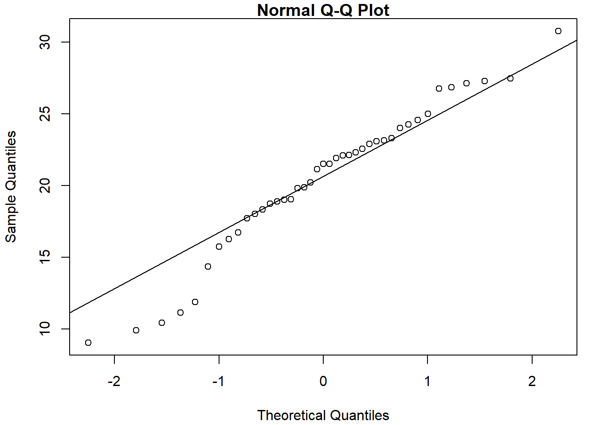
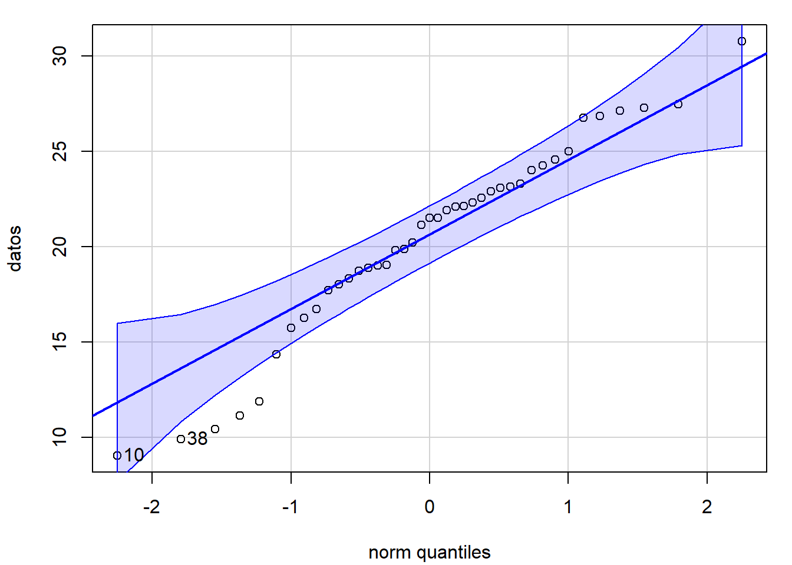
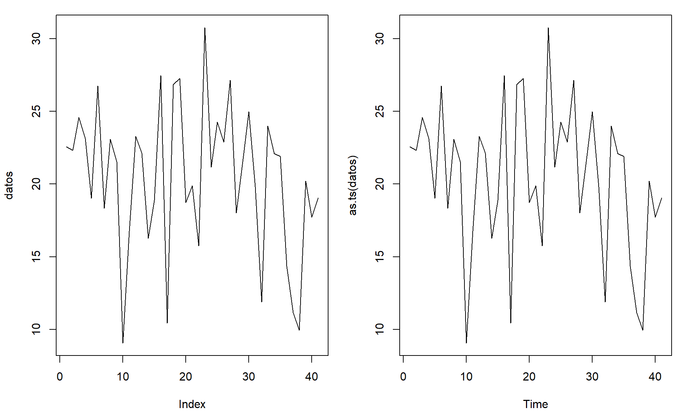
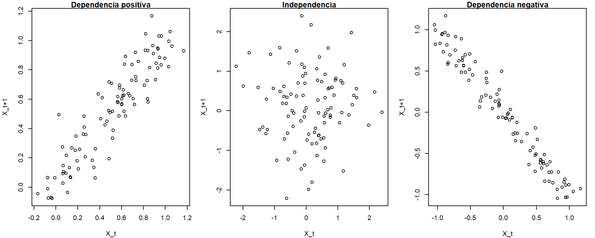
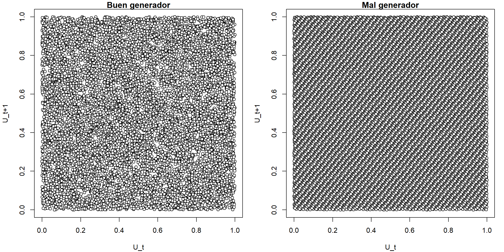

# (APPENDIX) Apéndices {-} 

# Bondad de Ajuste y Aleatoriedad {#gof-aleat}

<!-- Apéndice \@ref(gof-aleat) -->


<!-- 
---
title: "Bondad de Ajuste y Aleatoriedad"
author: "Simulación Estadística (UDC)"
date: "Máster en Técnicas Estadísticas"
output: 
  bookdown::html_document2:
    pandoc_args: ["--number-offset", "21,0"]
    toc: yes 
    # mathjax: local            # copia local de MathJax, hay que establecer:
    # self_contained: false     # las dependencias se guardan en ficheros externos 
  bookdown::pdf_document2:
    keep_tex: yes
    toc: yes 
---
bookdown::preview_chapter("22-Bondad_ajuste_Aleatoriedad.Rmd") 
knitr::purl("22-Bondad_ajuste_Aleatoriedad.Rmd", documentation = 2)
knitr::spin("22-Bondad_ajuste_Aleatoriedad.R",knit = FALSE)
-->

En los métodos clásicos de inferencia estadística es habitual asumir que los valores observados $X_1,\ldots, X_n$ (o los errores de un modelo) constituyen una muestra aleatoria simple de una variable aleatoria $X$.
Se están asumiendo por tanto dos hipótesis estructurales: la independencia (aleatoriedad) y la homogeneidad (misma distribución) de las observaciones (o de los errores).
Adicionalmente, en inferencia paramétrica se supone que la distribución se ajusta a un modelo
paramétrico específico $F_{\theta}(x)$, siendo $\theta$ un parámetro que normalmente es desconocido.

Uno de los objetivos de la inferencia no paramétrica es desarrollar herramientas que permitan verificar el grado de cumplimiento de las hipótesis anteriores^[
El otro objetivo de la inferencia estadística no paramétrica es desarrollar procedimientos alternativos (métodos de distribución libre) que sean válidos cuando no se verifica alguna de las hipótesis estructurales.]. 
Los procedimientos habituales incluyen métodos descriptivos (principalmente gráficos), contrastes de bondad de ajuste (también de homogeneidad o de datos atípicos) y contrastes de aleatoriedad.

En este apéndice se describen brevemente algunos de los métodos clásicos, principalmente con la idea de que pueden ser de utilidad para evaluar resultados de simulación y para la construcción de modelos del sistema real (e.g. para modelar variables que se tratarán como entradas del modelo general). Se empleará principalmente el enfoque de la estadística no paramétrica, aunque también se mostrarán algunas pequeñas diferencias entre su uso en inferencia y en simulación.

Los métodos genéricos no son muy adecuados para evaluar generadores aleatorios [e.g. @lecuyer07].
La recomendación sería emplear baterías de contrastes recientes, como las descritas en la Sección \@ref(baterias).
No obstante, en la última sección se describirán, únicamente con fines  ilustrativos, algunos de los primeros métodos diseñados específicamente para generadores aleatorios. 

## Métodos de bondad de ajuste {#gof}

A partir de $X_1,\ldots,X_n$ m.a.s. de $X$ con función de
distribución $F$, interesa realizar un contraste de la forma:
$$\left \{
\begin{array}{l}
H_0:F=F_0\\
H_1:F\neq F_0
\end{array}
\right.$$

En este caso interesará distinguir principalmente entre hipótesis nulas simples (especifican un único modelo) y compuestas (especifican un conjunto o familia de modelos). 
Por ejemplo:

* $H_0$ simple:
  $$\left \{
  \begin{array}{l}  
  H_0:F= \mathcal{N}(0,1)\\
  H_1:F\neq \mathcal{N}(0,1)
  \end{array}
  \right.$$
  
* $H_0$ compuesta:
  $$\left \{
  \begin{array}{l}  
  H_0:F= \mathcal{N}(\mu,\sigma^2)\\
  H_1:F\neq \mathcal{N}(\mu,\sigma^2)
  \end{array}
  \right.$$

<!-- 
+------------------------------+-------------------------------------+ 
|       $H_0$ simple           |          $H_0$ compuesta            | 
+==============================+=====================================+
| $\left \{                    | $\left \{                           |  
| \begin{array}{l}             | \begin{array}{l}                    |
| H_0:F= \mathcal{N}(0,1)\\    | H_0:F= \mathcal{N}(\mu,\sigma^2)\\  |
| H_1:F\neq \mathcal{N}(0,1)   | H_1:F\neq \mathcal{N}(\mu,\sigma^2) |
| \end{array}                  | \end{array}                         |
| \right.$                     | \right.$                            |
+------------------------------+-------------------------------------+
-->

Entre los métodos gráficos habituales estarían: histograma, gráfico de la densidad suavizada,   gráfico de tallo y hojas, gráfico de la distribución empírica (o versión suavizada) y gráficos P-P o Q-Q.

Entre los métodos de contrastes de hipótesis generales ($H_0:F=F_0$) destacarían las pruebas: Chi-cuadrado de Pearson, Kolmogorov-Smirnov, Cramer-von Mises o Anderson-Darling. 
Además de los específicos de normalidad ($H_0:F= \mathcal{N}(\mu,\sigma^2)$): Kolmogorov-Smirnov-Lilliefors, Shapiro-Wilks y los de asimetría y apuntamiento.


### Histograma

Se agrupan los datos en intervalos $I_{k}=\left[  L_{k-1},L_{k}\right)$ con $k=1, \ldots, K$ y a cada intervalo se le asocia un valor (altura de la barra) igual a la frecuencia absoluta de ese intervalo $n_k = \sum_{i=1}^{n}\mathbf{1}\left( X_i \in [L_{k-1},L_{k}) \right)$, si la longitud de los intervalos es constante, o proporcional a dicha frecuencia (de forma que el área coincida con la frecuencia relativa y pueda ser comparado con una función de densidad):
$$\hat{f}_n(x)=\frac{n_{i}}{n\left(  L_{k}-L_{k-1}\right)}$$

Como ya se ha visto anteriormente, en R podemos generar este gráfico con la función [`hist()`](https://rdrr.io/r/graphics/hist.html) del paquete base. 
Algunos de los principales parámetros (con los valores por defecto) son los siguientes:

```r
hist(x, breaks = "Sturges", freq = NULL, plot = TRUE, ...)
```

- `breaks`: puede ser un valor numérico con el número de puntos de discretización, un vector con los puntos de discretización, una cadena de texto que los determine (otras opciones son `"Scott"` y `"FD"`; en este caso llamará internamente a la función `nclass.xxx()` donde `xxx` se corresponde con la cadena de texto), o incluso una función personalizada que devuelva el número o el vector de puntos de discretización.

- `freq`: lógico (`TRUE` por defecto si los puntos de discretización son equidistantes), determina si en el gráfico se representan frecuencias o "densidades". 

- `plot`: lógico, se puede establecer a `FALSE` si no queremos generar el gráfico y solo nos interesan el objeto con los resultados (que devuelve de forma "invisible", por ejemplo para discretizar los valores en intervalos).  


Ejemplo:

```r
datos <- c(22.56,22.33,24.58,23.14,19.03,26.76,18.33,23.10,
  21.53,9.06,16.75,23.29,22.14,16.28,18.89,27.48,10.44,
  26.86,27.27,18.74,19.88,15.76,30.77,21.16,24.26,22.90,
  27.14,18.02,21.53,24.99,19.81,11.88,24.01,22.11,21.91,
  14.35,11.14,9.93,20.22,17.73,19.05)
hist(datos, freq = FALSE)
curve(dnorm(x, mean(datos), sd(datos)), add = TRUE)
```


Si el número de valores es muy grande (por ejemplo en el caso de secuencias aleatorias), nos puede interesar establecer la opción `breaks = "FD"` para aumentar el número de intervalos de discretización.
En cualquier caso, como se muestra en la Figura \@ref(fig:hist-movie), la convergencia del histograma a la densidad teórica se podría considerar bastante lenta.
Alternativamente se podría considerar una estimación suave de la densidad, por ejemplo empleando la estimación tipo núcleo implementada en la función `density()`.


<div class="figure" style="text-align: center">

<p class="caption">(\#fig:hist-movie)Convergencia del histograma a la densidad teórica.</p>
</div>


### Función de distribución empírica {#empdistr}

La función de distribución empírica $F_n\left( x \right)=\frac{1}{n}\sum_{i=1}^{n}\mathbf{1}\left( X_i\leq x\right)$ asigna a cada número real $x$ la frecuencia relativa de observaciones menores o iguales que $x$.
Para obtener las frecuencias relativas acumuladas, se ordena la muestra $X_{(1)}\leq X_{(2)}\leq \cdots \leq X_{(n)}$ y:
$$F_n(x)=\left \{
\begin{array}{cll}
0 & \text{si } &x<X_{\left(  1\right)  }\\
\tfrac{i}n & \text{si } & X_{\left(  i\right)  }\leq x<X_{\left(  i+1\right)  }\\
1 & \text{si } & X_{\left(  n\right)  }\leq x
\end{array}
\right.$$

En R podemos obtener la función de distribución empírica con [`ecdf()`](https://rdrr.io/r/stats/ecdf.html) (el objeto que devuelve es una función).

Ejemplo:

```r
fn <- ecdf(datos)
curve(ecdf(datos)(x), xlim = extendrange(datos), type = 's', 
      ylab = 'distribution function', lwd = 2)
curve(pnorm(x, mean(datos), sd(datos)), add = TRUE)
```

<div class="figure" style="text-align: center">

<p class="caption">(\#fig:ecdfplot)Comparación de la distribución empírica de los datos de ejemplo con la función de distribución de la aproximación normal.</p>
</div>

La función de distribución empírica se corresponde con una variable aleatoria discreta que toma los valores
$X_1,\ldots ,X_n$ todos ellos con probabilidad $\frac{1}{n}$.
Suponiendo que $\mathbf{X}=\left( X_1,\ldots ,X_n \right)$ es una muestra aleatoria de una población con distribución $F$:
$$\begin{aligned}
nF_n\left( x \right) &= \sum_{i=1}^{n}\mathbf{1}\left\{ X_i\leq x\right\}
\sim \mathcal{B}\left( n,F\left( x \right) \right), \\
E\left( nF_n\left( x \right) \right) &= nF\left( x \right) \implies E\left(
F_n\left( x \right) \right) =F\left( x \right), \\
Var\left( nF_n\left( x \right) \right) &=  nF\left( x \right) \left(
1-F\left( x \right) \right) \\
&\implies  Var\left( F_n\left( x \right) \right) =\frac{F\left( x \right) \left( 1-F\left( x \right) \right)}{n}
\end{aligned}$$


### Gráficos P-P y Q-Q

El gráfico de probabilidad (o de probabilidad-probabilidad) es el gráfico de dispersión de:
$$\left \{  \left( F_0(x_{i}), F_n(x_{i}) \right)  :i=1,\cdots,n\right \}$$
siendo $F_n$ la función de distribución empírica y $F_0$ la función de distribución bajo $H_0$ (con la que desea comparar, si la hipótesis nula es simple) o una estimación bajo $H_0$ (si la hipótesis nula es compuesta; e.g. si $H_0:F= \mathcal{N}(\mu,\sigma^2)$,
$\hat{F}_0$ función de distribución de $\mathcal{N}(\hat{\mu},\hat{\sigma}^2)$).
Si $H_0$ es cierta, la nube de puntos estará en torno a la recta $y=x$ (probabilidades observadas próximas a las esperadas bajo $H_0$).

El gráfico Q-Q (cuantil-cuantil) es equivalente al anterior pero en la escala de la variable:
$$\left\{ \left( q_{i}, x_{(i)}\right) : i=1, \cdots, n \right\}$$
siendo $x_{(i)}$ los cuantiles observados y $q_{i}=F_0^{-1}(p_{i})$ los esperados^[Típicamente $\left \{  p_{i}=\frac{\left(i-0.5 \right)}n : i=1, \cdots, n \right\}$.] bajo $H_0$.

Ejemplo:

```r
qqnorm(datos)
qqline(datos)
```



```r
require(car)
qqPlot(datos, "norm")
```



```
## [1] 10 38
```


### Contraste chi-cuadrado de Pearson {#chi2test}


Se trata de un contraste de bondad de ajuste:
$$\left \{
\begin{array}{l}
H_0:F=F_0\\
H_1:F\neq F_0\end{array}
\right.$$
desarrollado inicialmente para variables categóricas. En el caso general, podemos pensar que los datos están agrupados en $k$ clases: $C_1,\cdots,C_{k}$. Por ejemplo, si la variable es categórica o discreta, cada clase se puede corresponder con una modalidad. Si la variable es continua habrá que categorizarla en intervalos.

Si la hipótesis nula es simple, cada clase tendrá asociada una probabilidad $p_{i}=P\left(  X\in C_{i} \right)$ bajo $H_0$ . Si por el contrario es compuesta, se trabajará con una estimación de dicha probabilidad (y habrá que correguir la distribución aproximada del estadístico del contraste).


|   Clases  |   Discreta  |     Continua      |    $H_0$ simple   |     $H_0$ compuesta     |
| --------- | ----------- | ----------------- | ----------------- | ----------------------- |  
|   $C_1$   |    $x_1$    |   $[L_0,L_1)$     |       $p_1$       |       $\hat{p}_1$       |
|  $\vdots$ |   $\vdots$  |     $\vdots$      |      $\vdots$     |        $\vdots$         |
|  $C_{k}$  |   $x_{k}$   | $[L_{k-1},L_{k})$ |       $p_{k}$     |      $\hat{p}_{k}$      |
|           |             |                   | $\sum_{i}p_{i}=1$ | $\sum_{i}\hat{p}_{i}=1$ |

Se realizará un contraste equivalente:
$$\left\{ \begin{array}[c]{l}
H_0:\text{Las probabilidades son correctas}\\
H_1:\text{Las probabilidades no son correctas}
\end{array} \right.$$

Si $H_0$ es cierta, la frecuencia relativa $f_{i}$ de la clase $C_{i}$ es una aproximación de la probabilidad teórica, $f_{i}\approx p_{i}$. 
Equivalentemente, las frecuencias observadas $n_{i}=n\cdot f_{i}$ deberían ser próximas a las esperadas $e_{i}=n\cdot p_{i}$ bajo $H_0$, sugiriendo el estadístico del contraste (Pearson, 1900):
$$\chi^2=\sum_{i=1}^{k}\frac{(n_{i}-e_{i})^2}{e_{i}}\underset{aprox.}{\sim
}\chi_{k-r-1}^2,\text{ si }H_0\text{ cierta}$$ 
siendo $k$ el número de clases y $r$ el número de parámetros estimados (para aproximar las probabilidades bajo $H_0$).

| Clases | $n_{i}$ observadas | $p_{i}$ bajo $H_0$ | $e_{i}$ bajo $H_0$ | $\frac{(n_{i}-e_{i})^2}{e_{i}}$ |
| ------ | ------------------ | ------------------ | ------------------ | ------------------------------- |
| $C_1$ | $n_1$ | $p_1$ | $e_1$ | $\frac{(n_1-e_1)^2}{e_1}$ |
| $\vdots$ | $\vdots$ | $\vdots$ | $\vdots$ | $\vdots$ |
| $C_{k}$ | $n_{k}$ | $p_{k}$ | $e_{k}$ | $\frac{(n_{k}-e_{k})^2}{e_{k}}$ |
| Total | $\sum_{i}n_{i}=n$ | $\sum_{i}p_{i}=1$ | $\sum_{i}e_{i}=n$ | $\chi^2=\sum_{i=1}^{k}\frac{(n_{i}-e_{i})^2}{e_{i}}$ |

Cuando $H_0$ es cierta el estadístico tiende a tomar valores pequeños y grandes cuando es falsa.
Por tanto se rechaza $H_0$, para un nivel de significación $\alpha$, si: 
$$\sum_{i=1}^{k}\frac{(n_{i}-e_{i})^2}{e_{i}}\geq \chi_{k-r-1,1-\alpha}^2$$

<!-- Gráfico chi-cuadrado -->

Si realizamos el contraste a partir del p-valor o nivel crítico:
$$p=P\left(  {\chi_{k-r-1}^2\geq \sum \limits_{i=1}^{k}{\frac{(n_{i}-e_{i})^2}{e_{i}}}}\right)$$
rechazaremos $H_0$ si $p\leq \alpha$ (y cuanto menor sea se rechazará con mayor seguridad) y aceptaremos $H_0$ si $p>$ $\alpha$ (con mayor seguridad cuanto mayor sea).

Este método está implementado en la función [`chisq.test()`](https://rdrr.io/r/stats/chisq.test.html) para el caso discreto (no corrige los grados de libertad).
Ejemplo:


```r
x <- trunc(5 * runif(100))
chisq.test(table(x))            # NOT 'chisq.test(x)'!
```

```
## 
## 	Chi-squared test for given probabilities
## 
## data:  table(x)
## X-squared = 3.1, df = 4, p-value = 0.54
```

La distribución exacta del estadístico del contraste es discreta (se podría aproximar por simulación, por ejemplo empleando los parámetros `simulate.p.value = TRUE` y `B = 2000` de la función `chisq.test()`; ver también el Ejemplo \@ref(exm:chicuadind) de la Sección \@ref(simconting) para el caso del contraste chi-cuadrado de independencia).
Para que la aproximación continua $\chi^2$ sea válida:

-   El tamaño muestral debe ser suficientemente grande (p.e. $n>30$).

-   La muestra debe ser una muestra aleatoria simple.

-   Los parámetros deben estimarse (si es necesario) por máxima
    verosimilitud.

-   Las frecuencias esperadas $e_{i}=n\cdot p_{i}$ deberían ser todas
    $\geq5$ (realmente esta es una restricción conservadora, la aproximación 
    puede ser adecuada si no hay frecuencias esperadas inferiores a 1 y 
    menos de un 20\% inferiores a 5).

Si la frecuencia esperada de alguna clase es $<5$, se suele agrupar con otra
clase (o con varias si no fuese suficiente con una) para obtener una
frecuencia esperada $\geq5$:

-   Cuando la variable es nominal (no hay una ordenación lógica) se
    suele agrupar con la(s) que tiene(n) menor valor de $e_{i}$.

-   Si la variable es ordinal (o numérica) debe juntarse la que causó el
    problema con una de las adyacentes.

Si la variable de interés es continua, una forma de garantizar que $e_{i}\geq5$ consiste en tomar un número de intervalos $k\leq \lfloor n/5 \rfloor$ y de forma que sean equiprobables $p_{i}=1/k$,
considerando los puntos críticos $x_{i/k}$ de la distribución bajo $H_0$.

Por ejemplo, se podría emplear la función [`simres::chisq.cont.test()`](https://rubenfcasal.github.io/simres/reference/chisq.cont.test.html) (fichero [*test.R*](R/test.R)), que imita a las incluidas en R:


```r
simres::chisq.cont.test
```

```
## function(x, distribution = "norm", nclass = floor(length(x)/5),
##                             output = TRUE, nestpar = 0, ...) {
##   # Función distribución
##   q.distrib <- eval(parse(text = paste("q", distribution, sep = "")))
##   # Puntos de corte
##   q <- q.distrib((1:(nclass - 1))/nclass, ...)
##   tol <- sqrt(.Machine$double.eps)
##   xbreaks <- c(min(x) - tol, q, max(x) + tol)
##   # Gráficos y frecuencias
##   if (output) {
##     xhist <- hist(x, breaks = xbreaks, freq = FALSE,
##                   lty = 2, border = "grey50")
##     # Función densidad
##     d.distrib <- eval(parse(text = paste("d", distribution, sep = "")))
##     curve(d.distrib(x, ...), add = TRUE)
##   } else {
##     xhist <- hist(x, breaks = xbreaks, plot = FALSE)
##   }
##   # Cálculo estadístico y p-valor
##   O <- xhist$counts  # Equivalente a table(cut(x, xbreaks)) pero más eficiente
##   E <- length(x)/nclass
##   DNAME <- deparse(substitute(x))
##   METHOD <- "Pearson's Chi-squared test"
##   STATISTIC <- sum((O - E)^2/E)
##   names(STATISTIC) <- "X-squared"
##   PARAMETER <- nclass - nestpar - 1
##   names(PARAMETER) <- "df"
##   PVAL <- pchisq(STATISTIC, PARAMETER, lower.tail = FALSE)
##   # Preparar resultados
##   classes <- format(xbreaks)
##   classes <- paste("(", classes[-(nclass + 1)], ",", classes[-1], "]",
##                    sep = "")
##   RESULTS <- list(classes = classes, observed = O, expected = E,
##                   residuals = (O - E)/sqrt(E))
##   if (output) {
##     cat("\nPearson's Chi-squared test table\n")
##     print(as.data.frame(RESULTS))
##   }
##   if (any(E < 5))
##     warning("Chi-squared approximation may be incorrect")
##   structure(c(list(statistic = STATISTIC, parameter = PARAMETER, p.value = PVAL,
##                    method = METHOD, data.name = DNAME), RESULTS), class = "htest")
## }
## <bytecode: 0x0000019b309f5db8>
## <environment: namespace:simres>
```

Continuando con el ejemplo anterior, podríamos contrastar normalidad mediante:


```r
library(simres)
chisq.cont.test(datos, distribution = "norm", nestpar = 2, mean=mean(datos), sd=sd(datos))
```


```
## 
## Pearson's Chi-squared test table
##           classes observed expected residuals
## 1 ( 9.060,14.499]        6    5.125   0.38651
## 2 (14.499,16.947]        3    5.125  -0.93867
## 3 (16.947,18.778]        4    5.125  -0.49694
## 4 (18.778,20.417]        6    5.125   0.38651
## 5 (20.417,22.057]        4    5.125  -0.49694
## 6 (22.057,23.887]        8    5.125   1.26996
## 7 (23.887,26.336]        4    5.125  -0.49694
## 8 (26.336,30.770]        6    5.125   0.38651
```

```
## 
## 	Pearson's Chi-squared test
## 
## data:  datos
## X-squared = 3.68, df = 5, p-value = 0.6
```

### Contraste de Kolmogorov-Smirnov {#ks-test}

Se trata de un contraste de bondad de ajuste diseñado para distribuciones continuas
(similar a la prueba de Cramer-von Mises o a la de Anderson-Darling, implementadas en el paquete `goftest` de R, que son en principio mejores).
Se basa en comparar la función de distribución $F_0$ bajo $H_0$ con la función de distribución empírica $F_n$:
$$\begin{aligned}
& D_n=\sup_{x}|F_n(x)-F_0(x)|,\\
& = \max_{1 \leq i \leq n} \left\{ |F_n(X_{(i)})-F_0(X_{(i)})|,|F_n(X_{(i-1)})-F_0(X_{(i)})| \right\}
\end{aligned}$$

Teniendo en cuenta que $F_n\left(  X_{(i)}\right) = \frac{i}n$:
$$\begin{aligned}
D_n  & =\max_{1\leq i\leq n}\left \{  \frac{i}n-F_0(X_{(i)}),F_0(X_{(i)})-\frac{i-1}n\right \} \\
& =\max_{1\leq i\leq n}\left \{  D_{n,i}^{+},D_{n,i}^{-}\right \}
\end{aligned}$$

Si $H_0$ es simple y $F_0$ es continua, la distribución del estadístico $D_n$ bajo $H_0$ no depende $F_0$ (es de distribución libre). 
Esta distribución está tabulada (para tamaños muestrales grandes se utiliza la aproximación asintótica). 
Se rechaza $H_0$ si el valor observado $d$ del estadístico es significativamente grande:
$$p = P \left( D_n \geq d \right) \leq \alpha.$$
Este método está implementado en la función [`ks.test()`](https://rdrr.io/r/stats/ks.test.html) del paquete base de R:

```r
ks.test(x, y, ...)
```
donde `x` es un vector que contiene los datos, `y` es una función de distribución 
(o una cadena de texto que la especifica; también puede ser otro vector de datos 
para el contraste de dos muestras) y `...` representa los parámetros de la distribución.

Continuando con el ejemplo anterior, para contrastar $H_0:F= \mathcal{N}(20,5^2)$ podríamos emplear:

```r
ks.test(datos, pnorm, mean = 20, sd = 5) # One-sample 
```

```
## 
## 	Asymptotic one-sample Kolmogorov-Smirnov test
## 
## data:  datos
## D = 0.132, p-value = 0.47
## alternative hypothesis: two-sided
```

Si $H_0$ es compuesta, el procedimiento habitual es estimar los parámetros desconocidos 
por máxima verosimilitud y emplear $\hat{F}_0$ en lugar de $F_0$. 
Sin embargo, al proceder de esta forma es de esperar que $\hat{F}_0$ se aproxime más 
que $F_0$ a la distribución empírica, por lo que los cuantiles de la distribución de 
$D_n$ pueden ser demasiado conservativos (los $p$-valores tenderán a ser mayores de 
lo que deberían) y se tenderá a aceptar la hipótesis nula (puede ser preferible aproximar el $p$-valor mediante simulación; como se muestra en el Ejercicio \@ref(exr:ks-test-sim) de la Sección \@ref(contrastes)). 

Para evitar este problema, en el caso de contrastar normalidad se desarrolló el test 
de Lilliefors, implementado en la función [`lillie.test()`](https://rdrr.io/pkg/nortest/man/lillie.test.html) del paquete [`nortest`](https://CRAN.R-project.org/package=nortest) 
(también hay versiones en este paquete para los métodos de Cramer-von Mises y
Anderson-Darling).

Por ejemplo:

```r
ks.test(datos, pnorm, mean(datos), sd(datos)) # One-sample Kolmogorov-Smirnov test
```

```
## 
## 	Asymptotic one-sample Kolmogorov-Smirnov test
## 
## data:  datos
## D = 0.0978, p-value = 0.83
## alternative hypothesis: two-sided
```

```r
library(nortest)
lillie.test(datos)
```

```
## 
## 	Lilliefors (Kolmogorov-Smirnov) normality test
## 
## data:  datos
## D = 0.0978, p-value = 0.42
```

## Diagnosis de la independencia {#diag-aleat}


Los métodos "clásicos" de inferencia estadística se basan en suponer que las observaciones $X_{1},\ldots,X_{n}$ son una muestra aleatoria simple (m.a.s.) de $X$.
Por tanto suponen que las observaciones son independientes (o los errores, en el caso de un modelo de regresión).
La ausencia de aleatoriedad es difícil de corregir y puede influir notablemente en el análisis estadístico.

Si existe dependencia entre las observaciones muestrales (e.g. el conocimiento de $X_{i}$ proporciona información sobre los valores de $X_{i+1}$, $X_{i+2}$, $\ldots$), los métodos "clásicos" no serán en principio adecuados (pueden conducir a conclusiones erróneas).

-   Esto es debido principalmente a que introduce un sesgo en los
    estimadores de las varianzas (diseñados asumiendo independencia).

-   Los correspondientes intervalos de confianza y
    contrastes de hipótesis tendrán una confianza o una potencia
    distinta de la que deberían (aunque las estimaciones de los parámetros
    pueden no verse muy afectadas).
    

Si $X_{1}$ e $X_{2}$ son independientes ($Cov(X_{1},X_{2})=0$):
$$Var(X_{1}+X_{2})=Var(X_{1})+Var(X_{2})$$

En el caso general (dependencia):
$$Var(X_{1}+X_{2})=Var(X_{1})+Var(X_{2})+2Cov(X_{1},X_{2})$$

Típicamente $Cov(X_{1},X_{2})>0$ por lo que con los métodos "clásicos" (basados en independencia) se suelen producir subestimaciones de las varianzas (IC más estrechos y tendencia a rechazar $H_0$ en contrastes).

::: {.example #sim-dep name="Datos simulados dependientes"}
<br>

Consideramos un proceso temporal estacionario con dependencia exponencial 
(la dependencia entre las observaciones depende del "salto" entre ellas;
ver Ejemplo \@ref(exm:funcional) en la Sección \@ref(fact-cov)).


```r
n <- 100          # Nº de observaciones
t <- seq(0, 1, length = n)
mu <- rep(0, n)   # Media
# mu <- 0.25 + 0.5*t
# mu <- sin(2*pi*t)

# Matriz de covarianzas
t.dist <- as.matrix(dist(t))
t.cov <- exp(-t.dist)
# str(t.cov)
# num [1:100, 1:100] 1 0.99 0.98 0.97 0.96 ...

# Simulación de las observaciones
set.seed(1)
library(MASS)

z <- rnorm(n)
x1 <- mu + z # Datos independientes
x2 <- mvrnorm(1, mu, t.cov) # Datos dependientes

plot(t, mu, type="l", lwd = 2, ylim = c(-3,3), ylab = 'x')
lines(t, x1, col = 'blue')
lines(t, x2, col = 'red')
legend("bottomright", legend = c("Datos independientes", "Datos dependientes"), 
       col = c('blue', 'red'), lty = 1)
```


En el caso anterior la varianza es uno con ambos procesos. 
Las estimaciones suponiendo independencia serían:


```r
var(x1)
```

```
## [1] 0.80676
```

```r
var(x2)
```

```
## [1] 0.10992
```

En el caso de datos dependientes se produce una clara subestimación de la varianza al emplear el estimador clásico.

:::

### Métodos para detectar dependencia

Es de esperar que datos cercanos en el tiempo (o en el espacio)
sean más parecidos (dependientes) que datos más alejados, hablaríamos entonces de dependencia temporal (espacial o espacio-temporal).

En esta sección nos centraremos en el caso de dependencia temporal (unidimensional).
Entre los métodos para detectar este tipo de dependencia destacaríamos:

-   Gráficos:

    -   Secuencial / Dispersión frente al tiempo

    -   Dispersión retardado

    -   Correlograma

-   Contrastes:

    -   Tests basados en rachas

    -   Test de Ljung-Box


### Gráfico secuencial

El gráfico de dispersión $\{(i, X_{i}) : i = 1, \ldots, n \}$ permite detectar la presencia de un efecto temporal (en la tendencia o en la variabilidad).
En R podemos generar este gráfico con el comando `plot(as.ts(x))`, aunque sería necesario haber conservado el orden de recogida de los datos (alternativamente se puede guardar el orden o la fecha en una variable adicional). 

Si se observa algún tipo de tendencia, los datos no serían aparentemente homogéneos (debería tenerse en cuenta la variable índice, o tiempo, como variable explicativa).
También podría indicar la presencia de un "efecto aprendizaje".

Ejemplo:


```r
old.par <- par(mfrow = c(1, 2))
plot(datos, type = 'l')
plot(as.ts(datos))
```

<div class="figure" style="text-align: center">

<p class="caption">(\#fig:grafsec)Ejemplos de gráficos secuenciales.</p>
</div>

```r
par(old.par)
```

Es habitual que este tipo de análisis se realice sobre los residuos
de un modelo de regresión (e.g. `datos <- residuals(modelo)`) 

Este gráfico también podría servir para detectar dependencia temporal:

-   Valores próximos muy parecidos (valores grandes seguidos de grandes
    y viceversa) indicarían una posible dependencia positiva.

-   Valores próximos dispares (valores grandes seguidos de pequeños
    y viceversa) indicarían una posible dependencia negativa.


```r
old.par <- par(mfrow = c(1, 3))
plot(x2, type = 'l', ylab = '', main = 'Dependencia positiva')
plot(x1, type = 'l', ylab = '', main = 'Independencia')
x3 <- x2 * c(1, -1)
plot(x3, type = 'l', ylab = '', main = 'Dependencia negativa')
```


```r
par(old.par)
```

pero suele ser preferible emplear un gráfico de dispersión retardado. 


### Gráfico de dispersion retardado

El gráfico de dispersión $\{(X_{i},X_{i+1}) :  i = 1, \ldots, n-1 \}$ permite
detectar dependencias a un retardo (relaciones entre valores separados
por un instante).
En R podemos generar este gráfico con el comando:

```r
plot(x[-length(x)], x[-1], xlab = "X_t", ylab = "X_t+1")
```


```r
old.par <- par(mfrow = c(1, 3))
plot(x2[-length(x2)], x2[-1], xlab = "X_t", ylab = "X_t+1", 
     main = 'Dependencia positiva')
plot(x1[-length(x1)], x1[-1], xlab = "X_t", ylab = "X_t+1", 
     main = 'Independencia')
plot(x3[-length(x3)], x3[-1], xlab = "X_t", ylab = "X_t+1", 
     main = 'Dependencia negativa')
```



```r
par(old.par)
```

Se puede generalizar al gráfico $\{(X_{i},X_{i+k}) : i = 1, \ldots, n-k \}$ que permite detectar dependencias a $k$ retardos (separadas $k$ instantes).

Ejemplo:


```r
# Gráfico de dispersion retardado
plot(datos[-length(datos)], datos[-1], xlab = "X_t", ylab = "X_t+1")
```


El correspondiente coeficiente de correlación es una medida numérica del grado de relación lineal (denominada autocorrelación de orden 1).


```r
cor(datos[-length(datos)], datos[-1])
```

```
## [1] 0.013441
```


::: {.example #ret-gen name="Calidad de un generador aleatorio"}
<br>

En el caso de una secuencia muy grande de número pseudoaleatorios (supuestamente independientes), sería muy difícil distinguir un patrón a partir del gráfico anterior. 
La recomendación en R sería utilizar puntos con color de relleno:

```r
plot(u[-length(u)], u[-1], xlab="U_t", ylab="U_t+1", pch=21, bg="white")
```

<div class="figure" style="text-align: center">

<p class="caption">(\#fig:dispret)Ejemplos de gráficos de dispensión retardados de dos secuencias de longitud 10000.</p>
</div>

Si se observa algún tipo de patrón indicaría dependencia (se podría considerar como una versión descriptiva del denominado “Parking lot test”).
Se puede generalizar también a $d$-uplas $(X_{t+1},X_{t+2},\ldots,X_{t+d})$ 
(ver ejemplo del generador RANDU en Figura \@ref(fig:randu) de la Sección \@ref(gen-cong)).

:::


### El correlograma {#correlograma}

Para estudiar si el grado de relación (lineal) entre $X_{i}$ e
$X_{i+k}$ podemos utilizar el coeficiente de correlación:

$$\rho\left(  X_{i},X_{i+k}\right) = \frac{Cov\left(  X_{i},X_{i+k}\right)    }
{\sigma\left(  X_{i}\right)  \sigma\left(  X_{i+k}\right)  }$$

En el caso de datos homogéneos (estacionarios) la correlación sería función únicamente del salto:
$$\rho\left(  X_{i},X_{i+k}\right)  \equiv\rho\left(  k\right)$$
denominada función de autocorrelación simple (fas) o correlograma.

Su estimador es el correlograma muestral:
$$r(k)=\frac{\sum_{i=1}^{n-k}(X_{i}-\overline{X})(X_{i+k}-\overline{X})}
{\sum_{i=1}^{n}(X_{i}-\overline{X})^{2}}$$

En R podemos calcular las autocorrelaciones, y generar el gráfico correspondiente, con la función [`acf()`](https://rdrr.io/r/stats/acf.html).    


```r
old.par <- par(mfrow = c(1, 3))
acf(x1, main = 'Independencia')
acf(x2, main = 'Dependencia positiva')
acf(x3, main = 'Dependencia negativa')
```


```r
par(old.par)
```

En caso de independencia es de esperar que las autocorrelaciones muestrales sean próximas a cero (valores "grandes" indicarían correlación positiva o negativa según el signo).

Suponiendo normalidad e independencia, asintóticamente:
$$r(k)\underset{aprox.}{\sim}N\left(  \rho(k),\frac{1}{n}\right)$$
Por tanto, si el tamaño muestral es grande, podríamos aceptar $H_0:\rho\left(  k\right) = 0$ si:
$$|r(k)|<\dfrac{2}{\sqrt{n}}$$

En el *gráfico de autocorrelaciones muestrales* (también denominado correlograma) se representan las estimaciones $r(k)$ de las autocorrelaciones correspondientes a los primeros retardos (típicamente $k<n/4$) y los correspondientes intervalos de confianza bajo $H_0$ (para detectar correlaciones significativas).
No obstante, hay que tener en cuenta que estos intervalos de confianza son puntuales.
Aunque las verdaderas correlaciones sean nulas, al aumentar el número de saltos aumenta la probabilidad de que alguna correlación muestral no esté contenida en el intervalo (no sería de extrañar que alguna esté un poco por fuera de los límites).

Ejemplo:


```r
acf(datos)  # correlaciones
```


La función `acf()` también permite estimar el covariograma^[En algunos campos, como en estadística espacial, en lugar del covariograma se suele emplear el semivariograma $\gamma(k) = C(0) - C(k)$.]. 


```r
covar <- acf(x2, type = "covariance")
```


### Test de rachas

Permite contrastar si el orden de aparición de dos valores de una variable dicotómica es aleatorio.
Supongamos que $X$ toma los valores $+$ y $-$ y que observamos una muestra del tipo:
$$++++---+++--++++++----$$ 
y nos interesa contrastar:

$$\left\{ \begin{array}[c]{l}
    H_0:\mathit{La\ muestra\ es\ aleatoria}\\
    H_1:\mathit{La\ muestra\ no\ es\ aleatoria}
\end{array}\right.$$

Una *racha* es una secuencia de observaciones iguales (o similares):
$$\underbrace{++++}_{1}\underbrace{---}_{2}\underbrace{+++}_{3}
\underbrace{--}_{4}\underbrace{++++++}_{5}\underbrace{----}_{6}$$

Una muestra con "muchas" o "pocas" rachas sugeriría que la muestra no es aleatoria (con dependencia negativa o positiva, respectivamente).
Por tanto se puede emplear como estadístico del contraste:
$$R=\text{"Número total de rachas en la muestra"}$$

Bajo la hipótesis nula de aleatoriedad:
$$R\underset{aprox.}{\sim}N\left(  1+\frac{2n_{1}n_{2}}{n},
\frac{2n_{1}n_{2}(2n_{1}n_{2}-n)}{n^{2}(n-1)}\right)$$
siendo $n_{1}$ y  $n_{2}$ el número de signos $+$ y $-$ en la muestra, respectivamente ($n_{1}+n_{2}=n$).
Para tamaños muéstrales pequeños ($n<40$), esta aproximación no es buena y conviene utilizar la distribución exacta (o utilizar corrección por continuidad). 
Los valores críticos de esta distribución están tabulados.

Este contraste se emplea también para variables continuas, se fija un punto de corte para dicotomizarlas. 
Normalmente se toma como punto de corte la mediana.
En ese caso, si $k=n_{1}$ ($\simeq n_{2}$):
$$R\underset{aprox.}{\sim}N\left(  k+1,\frac{k(k-1)}{2k-1}\right)$$

Se rechaza la hipótesis nula de aleatoriedad si el número de rachas es significativamente pequeño o grande.
Si el tamaño muestral es grande, el $p$-valor será:
$$p \simeq 2 P\left( Z \geq \left\vert 
\frac{R-E(R)}{\sqrt{Var(R)}} \right\vert \right)$$

En R podemos realizar este contraste con el comando:

```r
tseries::runs.test(as.factor(x > median(x)))
```

Ejemplo:


```r
library(tseries)
runs.test(as.factor(datos > median(datos)))
```

```
## 
## 	Runs Test
## 
## data:  as.factor(datos > median(datos))
## Standard Normal = -0.442, p-value = 0.66
## alternative hypothesis: two.sided
```

Alternativamente, para evitar el cálculo del punto de corte (la mediana), requerido para dicotomizar la variable continua, se podría emplear una modificación de este contraste, el denominado test de rachas ascendentes y descendentes, en el que se generan los valores $+$ y $-$ dependiendo de si el valor de la secuencia es mayor o menor que el anterior [ver e.g. @downham1970]. 
Este contraste es más adecuado para generadores aleatorios.


### El contraste de Ljung-Box {#ljungbox}

Es un test muy utilizado (en series de tiempo) para contrastar la hipótesis de independencia.
Se contrasta la hipótesis nula de que las primeras $m$ autocorrelaciones son cero:
$$\left\{\begin{array}[c]{l}
    H_0:\rho_{1}=\rho_{2}=\ldots=\rho_{m}=0\\
    H_1:\rho_{i}\neq0\text{ para algún } i
\end{array}\right.$$ 

Normalmente se elige $m$ de forma que la estimación $r(m)$ de $\rho_{m}=\rho(m)$ sea "fiable" (e.g. $m = 10\log_{10}n$ o $m = n/4$).

El estadístico del contraste es:
$$Q=n(n+2)\sum_{k=1}^{m}\frac{r(k)^{2}}{n-k}\underset{aprox.}{\sim}\chi
_{m}^{2}\text{, si }H_0\text{ es cierta.}$$
Se rechaza $H_0$ si el valor observado de este estadístico es grande ($Q\geq \chi_{m,1-\alpha}^{2}$) o, equivalentemente, si el p-valor es pequeño:
$$p=P\left( {\chi_{m}^{2}}\geq Q\right)$$

Este contraste está implementado en la función [`Box.test()`](https://rdrr.io/r/stats/box.test.html), estableciendo el argumento `lag` igual al número de saltos $m$ y `type = "Ljung"`.

Ejemplo:


```r
# Contrastar si la primera autocorrelación es nula:
Box.test(datos, type = "Ljung") 
```

```
## 
## 	Box-Ljung test
## 
## data:  datos
## X-squared = 0.00783, df = 1, p-value = 0.93
```

```r
# Contrastar si las 5 primeras autocorrelaciones son nulas:
Box.test(datos, lag = 5, type = "Ljung") 
```

```
## 
## 	Box-Ljung test
## 
## data:  datos
## X-squared = 1.26, df = 5, p-value = 0.94
```

NOTA: Cuando se trabaja con residuos de un modelo lineal, para contrastar que la primera autocorrelación es cero, es preferible emplear el test de
Durbin-Watson implementado en la función `dwtest()` del paquete `lmtest`.


## Contrastes específicos para generadores aleatorios

Los contrastes generales anteriores pueden ser muy poco adecuados para testear generadores de números pseudoaleatorios (ver e.g. L'Ecuyer y Simard, 2007). Por ese motivo se han desarrollado contrastes específicos, principalmente con el objetivo de encontrar un generador con buenas propiedades criptográficas. 

Muchos de estos contrastes están basados en la prueba chi-cuadrado y trabajan con enteros en lugar de los valores uniformes. El procedimiento habitual consiste en fijar un entero positivo $K$, y discretizar los valores uniformes $U_{1},U_{2},\ldots,U_{n}$, de la forma:
$$X_i = \left\lfloor K\cdot U_{i}\right\rfloor + 1 ,$$
donde $\left\lfloor u\right\rfloor$ denota la parte entera de $u$.
De esta forma se consigue una sucesión de enteros aleatorios supuestamente independientes con distribución uniforme en $\{1, \ldots, K\}$.

En esta sección se describirán algunos de los métodos tradicionales en este campo con fines ilustrativos. Si realmente el objetivo es diagnosticar la calidad de un generador, la recomendación sería emplear las baterías de contrastes más recientes descritas en la Sección \@ref(baterias).

### Contraste de frecuencias {#freq-test}

Empleando la discretización anterior se simplifica notablemente el contraste chi-cuadrado de bondad de ajuste a una uniforme, descrito en la Sección \@ref(chi2test) e implementado en la función `chisq.cont.test()`. 
En este caso bastaría con contrastar la equiprobabilidad de la secuencia de enteros (empleando directamente la función `chisq.test()`) y este método de denomina *contraste de frecuencias* (frequency test).
Por ejemplo:


```r
# Generar
set.seed(1)
u <- runif(1000)
# Discretizar
k <- 10
x <- floor(k*u) + 1
# Test chi-cuadrado
f <- table(factor(x, levels = seq_len(k)))
chisq.test(f)
```

```
## 
## 	Chi-squared test for given probabilities
## 
## data:  f
## X-squared = 10.3, df = 9, p-value = 0.33
```

Este código está implementado en la función `simres::freq.test()` (fichero [*test.R*](R/test.R)) y podríamos emplear:


```r
library(simres)
freq.test(u, nclass = k)
# Alternativamente
# chisq.cont.test(u, "unif", nclass = k, output = FALSE, min = 0, max = 1)
```


### Contraste de series

El contraste anterior se puede generalizar a contrastar la uniformidad de las $d$-uplas $(X_{t+1},X_{t+2},\ldots,X_{t+d})$ con $t=(i-1)d$, $i=1,\ldots,m$ siendo $m=\lfloor n/d \rfloor$. 
La idea es que troceamos el hipercubo $[0, 1]^d$ en $K^d$ celdas equiprobables.
Considerando como categorías todos los posibles valores de las $d$-uplas, podemos emplear el estadístico chi-cuadrado para medir la discrepancia entre las frecuencias observadas y las esperadas, iguales todas a $\frac{m}{K^d}$. 
Las elecciones más frecuentes son $d=2$ (contraste de pares seriados) y $K=8$, $10$ ó $20$. 
Por ejemplo, la función `serial.test()` del paquete `randtoolbox` implementa este contraste para $d=2$.

Para que la prueba chi-cuadrado sea fiable el valor de $n$ debería ser grande en comparación con el número de categorías $K^d$ (e.g. $n \geq 5dK^d$). 
Si se considera un valor $d \geq 3$ puede ser necesario reducir considerablemente el valor de $K$ para evitar considerar demasiadas categorías. 
Alternativamente se podrían considerar distintas técnicas para agrupar estas categorías, por ejemplo como se hace en el contraste del poker o del coleccionista descritos a continuación.


### El contraste del poker

En el contrate del poker "clásico" se consideran conjuntos sucesivos de cinco enteros ($d=5$) y, para cada uno, se determina cuál de las siguientes posibilidades se da:

1.  Un mismo entero se repite cinco veces (abreviadamente, $AAAAA$).

2.  Un mismo entero se repite cuatro veces y otro distinto aparece una
    vez ($AAAAB$).

3.  Un entero se repite tres veces y otro distinto se repite dos
    ($AAABB$).

4.  Un entero se repite tres veces y otros dos distintos aparecen una
    vez cada uno ($AAABC$).

5.  Un entero se repite dos veces, otro distinto se repite también dos
    veces y un tercer entero diferente aparece una sóla vez ($AABBC$).

6.  Un entero se repite dos veces y otros tres distintos aparecen una
    vez cada uno ($AABCD$).

7.  Los cinco enteros que aparecen son todos distintos ($ABCDE$).

Bajo las hipótesis de aleatoriedad y uniformidad, se pueden calcular las probabilidades de estas modalidades. Por ejemplo para $K=10$ obtendríamos: 

$$\begin{aligned}
P(AAAAA) & =0.0001, P(AAAAB)=0.0045, P(AAABB)=0.0090,\\
P(AAABC) & =0.0720, P(AABBC)=0.1080, P(AABCD)=0.5040,\\
P(ABCDE) & =0.3024.
\end{aligned}$$

Es frecuente que las clases $AAAAA$ y $AAAAB$ se agrupen a la hora de
aplicar el test chi-cuadrado, ya que, en caso contrario, la restricción
habitual $e_{i}\geq5$ llevaría a que $0.0001\cdot\frac{n}{5}\geq5$, es
decir, $n\geq250\,000$.

Es habitual simplificar el contraste anterior para facilitar su implementación definiendo las categorías según el número de enteros distintos de entre los cinco observados. 
Así obtendríamos:
$$\begin{aligned}
P(\text{1 entero diferente}) & = 0.0001,
P(\text{2 enteros diferentes}) = 0.0135,\\
P(\text{3 enteros diferentes}) & = 0.1800, 
P(\text{4 enteros diferentes}) = 0.5040,\\
P(\text{5 enteros diferentes}) & = 0.3024,
\end{aligned}$$
procediendo también a agrupar las dos primeras modalidades.

En el caso general de considerar $d$-uplas (manos de $d$ cartas con $K$ posibilidades cada una), la probabilidad de obtener $c$ valores (cartas) diferentes es [e.g. @knuth2002, Sección 3.3.2, p. 64]:
$$P(C=c) = \frac{K!}{(K-c)!K^d}S(d,c),$$
donde $S(d,c)$ es el número de Stirling de segunda clase, definido como el número de formas que existen de hacer una partición de un conjunto de $d$ elementos en $c$ subconjuntos: 
$$S(d,c) = \frac{1}{c!}\sum_{i=0}^{c} (-1)^{i} \binom{c}{i} (c-i)^d.$$
Por ejemplo, la función `poker.test()` del paquete `randtoolbox` implementa este contraste para el caso de $d=K$.


### El contraste del coleccionista

Por simplicidad describiremos el caso de $d=1$ (con $K$ categorías).
Considerando la sucesión de enteros aleatorios se procede (como un
coleccionista) a contabilizar cuál es el número, $Q$, (aleatorio) de
valores consecutivos hasta que se completa la colección de todos los
enteros entre $1$ y $K$. Obviamente, bajo las hipótesis de aleatoriedad
y uniformidad, cada posible entero entre $1$ y
$K$ tiene la misma probabilidad de aparecer en cada generación y, por
tanto, resulta posible calcular la distribución de probabilidad de $Q$.
De esta forma podemos utilizar los valores calculados de las probabilidades
$$P( Q = K ), P( Q = K+1 ),\ldots, P( Q = M -1 ), P( Q \geq M ),$$ 
para obtener las frecuencias esperadas de cada clase y confrontarlas con las
observadas vía el estadístico chi-cuadrado [e.g. @knuth2002, Sección 3.3.2, p. 65].

Existen varias elecciones comunes de $K$ y $M$.
Tomando $K=5$ con clases $Q=5$, $Q=6$, $\ldots$, $Q=19$, $Q\geq20$, las probabilidades vendrían dadas por:
$$\begin{array}{rr}
P( Q = 5 ) = 0.03840000, \ & P( Q = 6 ) = 0.07680000,\\
P( Q = 7 ) = 0.09984000, \ & P( Q = 8 ) = 0.10752000,\\
P( Q = 9 ) = 0.10450944, \ & P( Q = 10 ) = 0.09547776,\\
P( Q = 11 ) = 0.08381645, \ & P( Q = 12 ) = 0.07163904,\\
P( Q = 13 ) = 0.06011299, \ & P( Q = 14 ) = 0.04979157,\\
P( Q = 15 ) = 0.04086200, \ & P( Q = 16 ) = 0.03331007,\\
P( Q = 17 ) = 0.02702163, \ & P( Q = 18 ) = 0.02184196,\\
P( Q = 19 ) = 0.01760857, \ & P( Q\geq20 ) = 0.07144851.
\end{array}$$

Para $K=10$ se podrían considerar las siguientes categorías (con sus correspondientes probabilidades): 
$$\begin{array}{rr}
P( 10 \leq Q \leq 19 ) = 0.17321155, \ & P( 20 \leq Q \leq 23 ) = 0.17492380,\\
P( 24 \leq Q \leq 27 ) = 0.17150818, \ & P( 28 \leq Q \leq 32 ) = 0.17134210,\\
P( 33 \leq Q \leq 39 ) = 0.15216056, \ & P( Q \geq 40 ) =0.15685380.
\end{array}$$ 


<!-- 
Pendiente: Con uniformes:

Test de rachas
### Contrastes de salto
#### El test de rachas bajo y sobre la mediana
#### El test del tercio medio


El contraste de permutaciones

Aplicando el test a partir de la tercera cifra decimal
Esto equivale a considerar $100\cdot U_{i}-\left\lfloor 100\cdot U_{i}\right\rfloor $ en lugar de $U_{i}$ en los contrastes anteriores.
-->
