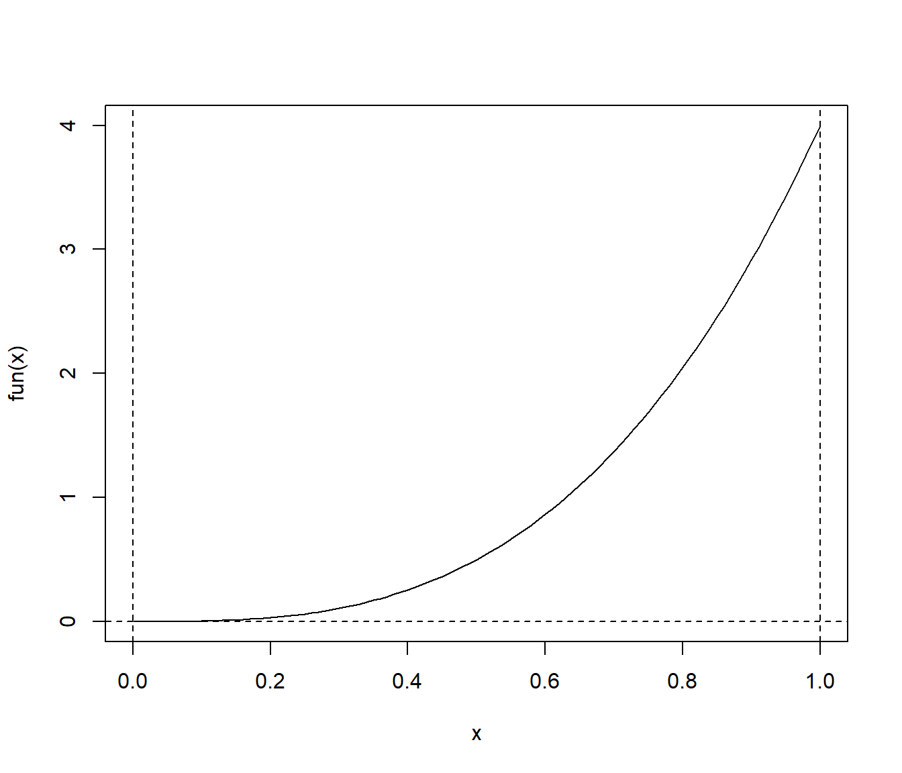
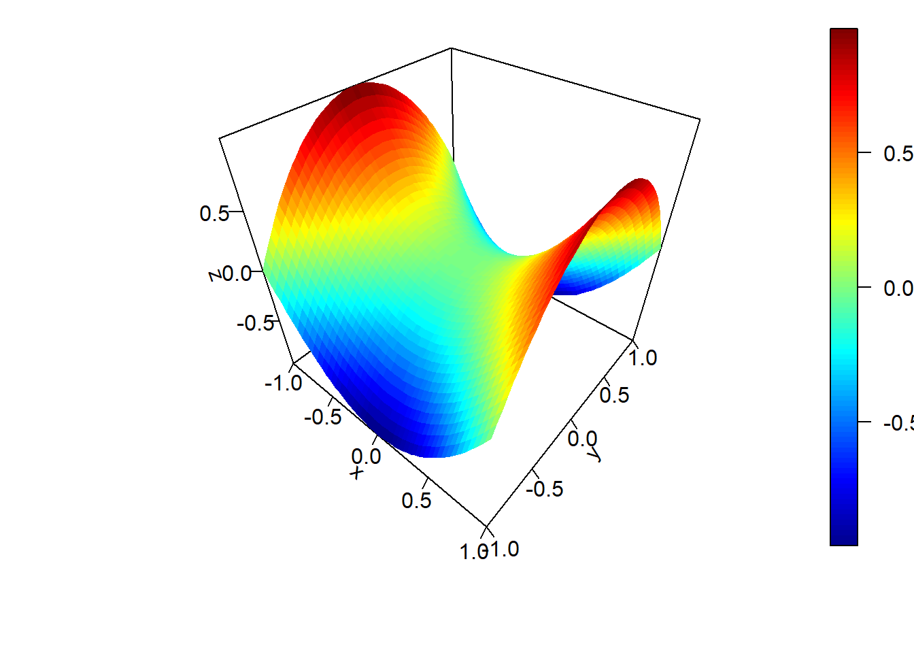

# Integración numérica {#int-num}


En muchos casos nos puede interesar la aproximación de una integral definida. 
En estadística, además del caso de Inferencia Bayesiana (que se trató en el Capítulo 11
empleando Integración Montecarlo y MCMC), nos puede interesar por ejemplo aproximar mediante
simulación el error cuadrático integrado medio (MISE) de un estimador. 
En el caso de una densidad univariante sería de la forma:
$$MISE \left\{ \hat{f} \right\} = \operatorname{E}\int (\hat{f}(x)-f(x))^2 \, dx$$ 

Cuando el numero de dimensiones es pequeño, nos puede ineteresar emplear un método numérico
para aproximar este tipo de integrales. 


Integración numérica unidimensional
-----------------------------------

Supongamos que nos interesa aproximar una integral de la forma:
$$I = \int_a^b h(x)  dx.$$. 

Consideraremos como ejemplo:
$$\int_0^1 4x^4 dx = \frac{4}{5}$$.


```r
fun <- function(x) return(4 * x^4)
curve(fun, 0, 1)
abline(h = 0, lty = 2)
abline(v = c(0, 1), lty = 2)
```




### Método del trapezoide 

La regla de los trapecios es una forma de aproximar la integral utilizando $n$ trapecios.
Si se consideran $n$ subintervalos en $[a,b]$ de longitud $h= \frac{b-a}{n}$ 
(i.e. $n + 1$ puntos regularmente espaciados cubriendo el dominio), y
se aproxima linealmente la función en cada subintervalo, se obtiene que:
$$\int_a^b f(x)\, dx \approx \frac{h}{2} [f(a)+2f(a+h)+2f(a+2h)+...+f(b)]$$


```r
trapezoid.vec <- function(f.vec, h = 0.01) {
# Integración numérica unidimensional entre a y b
# utilizando el método del trapezoide 
# (se aproxima f linealmente en cada intervalo)
  n <- length(f.vec) 
  return(h*(f.vec[1]/2 + sum(f.vec[2:(n-1)]) + f.vec[n]/2))
}

trapezoid <- function(fun, a = 0, b = 1, n = 100) {
# Integración numérica de fun (función unidimensional) entre a y b
# utilizando el método del trapezoide con n subdivisiones
# (se aproxima f linealmente en cada intervalo)
# Se asume a < b y n entero positivo 
  h <- (b-a)/n
  x.vec <- seq(a, b, by = h)
  f.vec <- sapply(x.vec, fun)
  return(trapezoid.vec(f.vec, h))
}

trapezoid(fun, 0, 1, 20)
```

```
## [1] 0.8033325
```


El error en esta aproximación se corresponde con:
$$ \frac{(b-a)^3}{12n^2}\,f''(\xi), $$
para algún $a\leq \xi \leq b$ (dependiendo del signo de la segunda derivada, 
i.e. de si la función es cóncava o convexa, el error será negativo ó positivo). El error
máximo absoluto es $\frac{(b-a)^3}{12n^2}\max_{a\leq \xi \leq b}\left|f''(\xi)\right|$.
En el caso general multidimensional sería $O(n^{-\frac{2}{d}})$.


### Regla de Simpson

Se divide el intervalo $n$ subintervalos de longitud $h= \frac{b-a}{n}$  (con $n$ par), 
considerando $n + 1$ puntos regularmente espaciados $x_i = a + ih$, para $i = 0, 1, ..., n$.
Aproximando de forma cuadrática la función en cada subintervalo $[x_{j-1},x_{j+1}]$ 
(considerando 3 puntos), se obtiene que:
$$ \int_a^b f(x) \, dx \approx \frac{h}{3} \bigg[ 
f(x_0)+2\sum_{j=1}^{(n/2)-1}f(x_{2j})+ 4\sum_{j=1}^{n/2}f(x_{2j-1})+f(x_n) \bigg],$$


```r
simpson <- function(fun, a, b, n = 100) { 
# Integración numérica de fnt entre a y b
# utilizando la regla de Simpson con n subdivisiones
# (se aproxima fun de forma cuadrática en cada par de intervalos)  
# fnt es una función de una sola variable
# Se asume a < b y n entero positivo par 
  n <- max(c(2*(n %/% 2), 4))
  h <- (b-a)/n
  x.vec1 <- seq(a+h, b-h, by = 2*h)
  x.vec2 <- seq(a+2*h, b-2*h, by = 2*h)
  f.vec1 <- sapply(x.vec1, fun)
  f.vec2 <- sapply(x.vec2, fun)
  return(h/3*(fun(a) + fun(b) + 4*sum(f.vec1) + 2*sum(f.vec2)))
  # Una cota del error en valor absoluto es:
  # h^4*(b-a)*max(c(f.vec1, fvec.2))^4/180.
}

simpson(fun, 0, 1, 20)
```

```
## [1] 0.8000033
```


El máximo error (en el caso unidimensional) viene dado por la expresión:
$$\frac{(b-a)^5}{180n^4}\,\max_{a\leq \xi \leq b}\left| f^{(4)}(\xi) \right|.$$
En el caso general multidimensional sería $O(n^{-\frac{4}{d}})$.   


### Cuadratura adaptativa

En lugar de evaluar la función en una rejilla regular (muestrear por igual el dominio), 
puede interesar ir añadiendo puntos sólo en los lugares donde se mejore la aproximación
(en principio donde hay mayor área).


```r
quadrature <- function(fun, a, b, tol=1e-8) {
	# numerical integration using adaptive quadrature

  simpson2 <- function(fun, a, b) {
  	# numerical integral using Simpson's rule
  	# assume a < b and n = 2
  	return((b-a)/6 * (fun(a) + 4*fun((a+b)/2) + fun(b)))
  }
 
	quadrature_internal <- function(S.old, fun, a, m, b, tol, level) {
		level.max <- 100
		if (level > level.max) {
			cat ("recursion limit reached: singularity likely\n")
			return (NULL)
		}
		S.left <- simpson2(fun, a, m) 
		S.right <- simpson2(fun, m, b)
		S.new <- S.left + S.right
		if (abs(S.new-S.old) > tol) {
			S.left <- quadrature_internal(S.left, fun, 
			                              a, (a+m)/2, m, tol/2, level+1)
			S.right <- quadrature_internal(S.right, fun, 
			                               m, (m+b)/2, b, tol/2, level+1)
			S.new <- S.left + S.right
		}
		return(S.new)
	}
 
	level = 1
	S.old <- (b-a) * (fun(a) + fun(b))/2
	S.new <- quadrature_internal(S.old, fun, 
	                             a, (a+b)/2, b, tol, level+1)
	return(S.new)
}

quadrature(fun, 0, 1)
```

```
## [1] 0.8
```

Fuente: [r-blogger Guangchuang Yu](https://www.r-bloggers.com/one-dimensional-integrals)


### Comandos de `R`


```r
integrate(fun, 0, 1)   # Permite límites infinitos  
```

```
## 0.8 with absolute error < 8.9e-15
```

```r
## Cuidado: fun debe ser vectorial...

require(MASS)
area(fun, 0, 1)
```

```
## [1] 0.8000001
```


Integración numérica bidimensional
-----------------------------------

Supongamos que nos interesa aproximar una integral de la forma:
$$I=\int_{a_x}^{b_x}\int_{a_y}^{b_y}f(x, y)dy dx$$. 

Consideraremos como ejemplo:
$$\int_{-1}^{1} \int_{-1}^{1} \left( x^2 - y^2 \right) dx dy = 0$$.


```r
f2d <- function(x,y) x^2 - y^2
```

Es habitual (especialmente en simulación) que la función se evalúe en una rejilla:


```r
ax = -1
ay = -1
bx = 1
by = 1
nx = 21
ny = 21
x <- seq(ax, bx, length = nx)
y <- seq(ay, by, length = ny)
z <- outer(x, y, f2d)

hx <- x[2]-x[1]
hy <- y[2]-y[1]
```


### Representación gráfica

Puede ser de utilidad las herramientas de los paquetes `plot3D` y `plot3Drgl`
(también se pueden utilizar las funciones  `spersp`, `simage`, `spoints` y `splot`
del paquete `npsp`).


```r
if(!require(plot3D)) stop('Required pakage `plot3D` not installed.')

# persp3D(z = z, x = x, y = y)

persp3D.f2d <- function(f2d, ax=-1, bx=1, ay=-1, by=1, nx=21, ny=21, ...) { 
  x <- seq(ax, bx, length = nx)
  y <- seq(ay, by, length = ny)
  hx <- x[2]-x[1]
  hy <- y[2]-y[1]
  z <- outer(x, y, f2d)
  persp3D(x, y, z, ...)
}

persp3D.f2d(f2d, -1, 1, -1, 1, 50, 50, 1, ticktype = "detailed") 
```




### Método del trapezoide 

Error $O(n^{-\frac{2}{d}})$.


```r
trapezoid.mat <- function(z, hx, hy) { 
# Integración numérica bidimensional
# utilizando el método del trapezoide (se aproxima f linealmente)
  f.vec <- apply(z, 1, function(x) trapezoid.vec(x, hx))
  return(trapezoid.vec(f.vec, hy)) 
}

# trapezoid.mat(z, hx, hy) 

trapezoid.f2d <- function(f2d, ax=-1, bx=1, ay=-1, by=1, nx=21, ny=21) { 
  x <- seq(ax, bx, length = nx)
  y <- seq(ay, by, length = ny)
  hx <- x[2]-x[1]
  hy <- y[2]-y[1]
  z <- outer(x, y, f2d)
  trapezoid.mat(z, hx, hy)
}

trapezoid.f2d(f2d, -1, 1, -1, 1, 101, 101) 
```

```
## [1] -8.881784e-18
```


### Comandos de `R`

Suponiendo que la función es vectorial, podemos emplear:


```r
integrate( function(y) {
    sapply(y, function(y) {
      integrate(function(x) f2d(x,y), ax, bx)$value }) }, 
    ay, by)
```

```
## -2.775558e-17 with absolute error < 1.1e-14
```


Si la función no es vectorial y solo admite parámetros escalares:


```r
integrate(function(y) {
    sapply(y, function(y) {
      integrate(function(x) {
        sapply(x, function(x) f2d(x,y)) }, ax, bx)$value }) },
    ay, by)
```

Fuente: [tolstoy.newcastle.edu.au](http://tolstoy.newcastle.edu.au/R/help/04/10/5951.html).

Alternativamente se podría emplear la función `adaptIntegrate` del paquete `cubature`.
